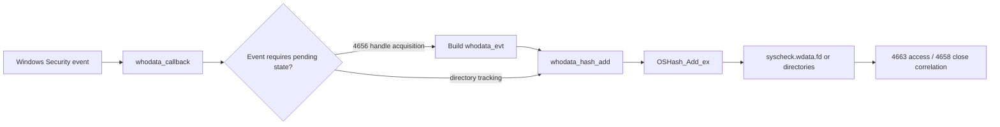
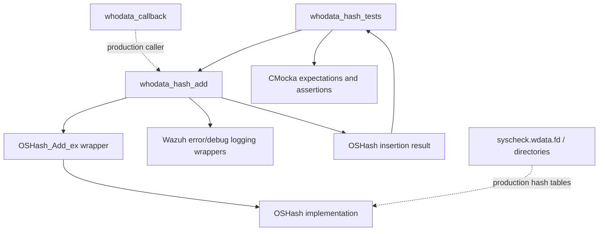
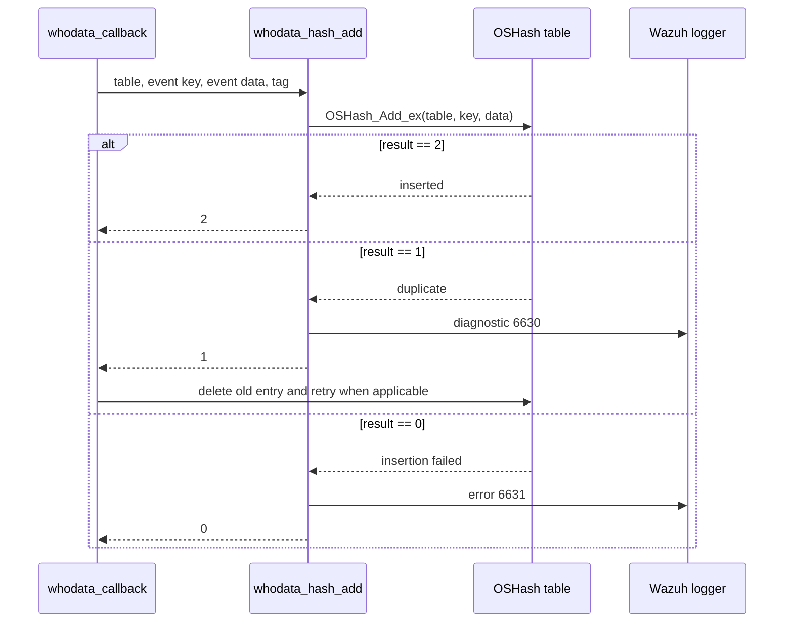

# `whodata_hash_tests`

## Introduction

`whodata_hash_tests` documents the focused CMocka tests for `whodata_hash_add`, the helper used by Windows Whodata to insert pending event data into an `OSHash` table. The tests verify the helper's return-value contract and its diagnostic behavior for insertion failure, duplicate keys, and successful insertion.

The tests are declared in `src/unit_tests/syscheckd/whodata/test_win_whodata.c` and run as part of the broader Windows Whodata test executable. The surrounding Windows implementation, event callback, and parser are documented in [test_win_whodata.md](test_win_whodata.md), [whodata_callback_tests.md](whodata_callback_tests.md), and [whodata_event_parsing_tests.md](whodata_event_parsing_tests.md).

## Purpose and position in the system

Windows Security Event Log records are correlated across multiple events. A handle-acquisition event is stored first; later access and close events use the same handle ID to recover and update that state. `whodata_hash_add` is the small insertion boundary that exposes `OSHash_Add_ex` to this workflow and adds a table-specific error message when insertion cannot be completed.



The helper is used with at least two logical tables in the production callback:

| Table | Key | Stored value | Use |
|---|---|---|---|
| `syscheck.wdata.fd` | Decimal handle ID | `whodata_evt` | Correlate 4656, 4663, and 4658 events |
| `syscheck.wdata.directories` | Normalized directory path | `whodata_directory` | Track directory scans and stale state |

The callback's event-specific decisions are covered in [whodata_callback_tests.md](whodata_callback_tests.md). This module does not test the complete callback or the contents of either stored structure.

## Architecture



The test boundary is intentionally narrow:

1. CMocka injects a hash-table pointer, key, data pointer, and return value from `OSHash_Add_ex`.
2. `whodata_hash_add` forwards the table, key, and data to `OSHash_Add_ex`.
3. The helper emits an error only for a non-successful insertion result (`0`), emits a duplicate diagnostic for result `1`, and otherwise returns the underlying result.
4. The test asserts both the propagated return value and the expected log message.

## Component and dependency relationships

```mermaid
flowchart TD
    A[whodata_hash_add(OSHash*, id, data, tag)]
    A --> B[OSHash_Add_ex(self, key, data)]
    B --> C{Insertion result}
    C -->|0| D[Error log 6631]
    C -->|1| E[Debug log 6630]
    C -->|2| F[No log]
    D --> G[Return 0]
    E --> H[Return 1]
    F --> I[Return 2]

    A --> J[tag]
    J -. message context only .-> D
    J -. message context only .-> E
```

### Dependencies

| Dependency | Role |
|---|---|
| `OSHash` / `OSHash_Add_ex` | Performs keyed insertion and reports the insertion outcome. |
| `id` | Becomes the hash key; the tests use `"key"`. In callback usage it is a handle ID or directory path. |
| `data` | Value passed through to the hash table; the tests use a wide-character buffer. |
| `tag` | Identifies the logical hash table in diagnostic messages; the tests use `"tag"`. |
| Wazuh logging wrapper | Verifies error `6631` and duplicate diagnostic `6630`. |
| CMocka | Controls wrapper results and validates arguments, calls, and returns. |

The module depends conceptually on the shared hash implementation and the Windows Whodata callback, but it does not exercise Windows APIs, Event Log rendering, ACLs, or synchronization. Those concerns are documented in [syscheckd_whodata.md](syscheckd_whodata.md), [syscheckd_whodata_audit.md](syscheckd_whodata_audit.md), and [whodata_callback_tests.md](whodata_callback_tests.md).

## Test cases

### `test_whodata_hash_add_unable_to_add`

This case configures `OSHash_Add_ex` to return `0`. It verifies:

- the supplied hash table pointer is forwarded unchanged;
- the key is forwarded as `"key"`;
- the data buffer is forwarded unchanged;
- error `6631` is logged with the supplied tag and target;
- the helper returns `0`.

Expected diagnostic:

```text
(6631): The event could not be added to the 'tag' hash table. Target: 'key'.
```

### `test_whodata_hash_add_duplicate_entry`

This case configures `OSHash_Add_ex` to return `1`, representing a duplicate key. It verifies that the helper:

- forwards the same table, key, and data arguments;
- logs duplicate diagnostic `6630`;
- returns `1` without deleting or replacing the existing entry.

Expected diagnostic:

```text
(6630): The event could not be added to the 'tag' hash table because it is duplicated. Target: 'key'.
```

Replacement behavior belongs to `whodata_callback`, where the caller removes the old handle entry and retries insertion. See the duplicate-handle cases in [whodata_callback_tests.md](whodata_callback_tests.md).

### `test_whodata_hash_add_success`

This case configures `OSHash_Add_ex` to return `2`, representing a successful new insertion. It verifies argument forwarding and that the helper returns `2` without producing an error or duplicate log.

## Return-value contract

```mermaid
stateDiagram-v2
    [*] --> Add
    Add --> Failed: OSHash_Add_ex == 0
    Add --> Duplicate: OSHash_Add_ex == 1
    Add --> Inserted: OSHash_Add_ex == 2
    Failed --> [*]: log 6631; return 0
    Duplicate --> [*]: log 6630; return 1
    Inserted --> [*]: return 2
```



The tests document that `whodata_hash_add` preserves the `OSHash_Add_ex` result rather than converting it to a generic Boolean. This allows the callback to distinguish a new insertion from a duplicate and handle replacement logic at the appropriate layer.

## Process flow in callback usage



For a 4656 event, a successful result leaves a pending `whodata_evt` available for later 4663 and 4658 events. A duplicate result is not itself a replacement operation; the callback owns the delete-and-reinsert policy. A failure result is reported and the callback terminates processing for that insertion path.

## Test infrastructure and limitations

The tests use the `OSHash_Add_ex` wrapper declared through the shared hash wrapper headers and CMocka's `expect_*` / `will_return` facilities. The table pointer is a sentinel `(OSHash*)123456`; the data pointer is a wide-character test buffer. No real hash table is created, and no memory ownership is transferred in these three unit tests.

The source contains a TODO noting that null input parameters are not covered. Consequently, this module does not establish behavior for:

- a null hash table;
- a null key or tag;
- a null data pointer;
- allocation or lifetime behavior of the stored value;
- hash-table locking or concurrent insertion;
- deletion/replacement after duplicate detection.

Those behaviors should be tested at the shared hash layer or in the callback integration tests, depending on the intended contract.

## Source and related documentation

- Test source: `src/unit_tests/syscheckd/whodata/test_win_whodata.c`, `test_whodata_hash_add_*` functions.
- Parent suite: [test_win_whodata.md](test_win_whodata.md).
- Callback integration: [whodata_callback_tests.md](whodata_callback_tests.md).
- Event field parsing: [whodata_event_parsing_tests.md](whodata_event_parsing_tests.md).
- Startup and subscription: [whodata_scan_startup_tests.md](whodata_scan_startup_tests.md).
- Windows Whodata implementation: [syscheckd_whodata.md](syscheckd_whodata.md).
- Windows audit support: [syscheckd_whodata_audit.md](syscheckd_whodata_audit.md).
