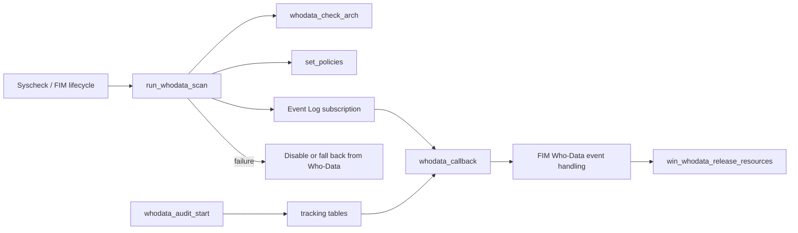
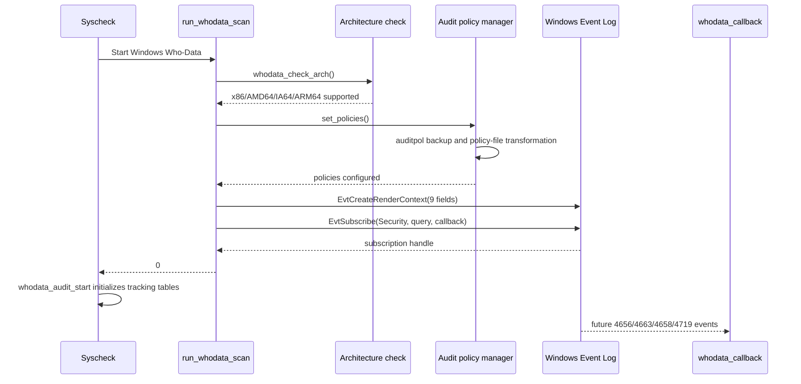
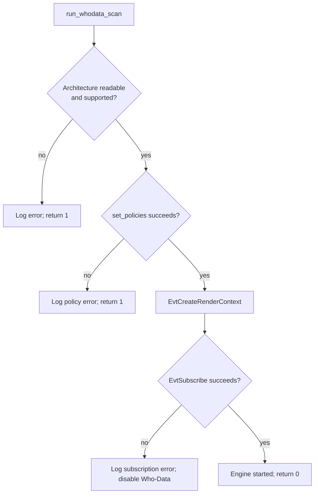
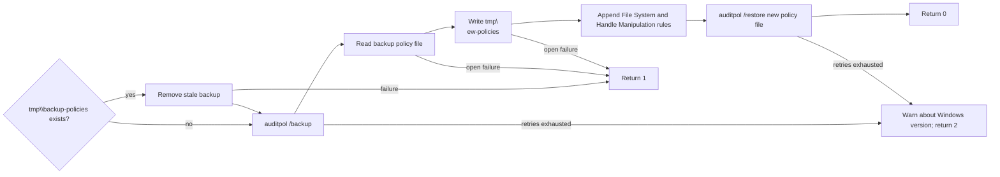
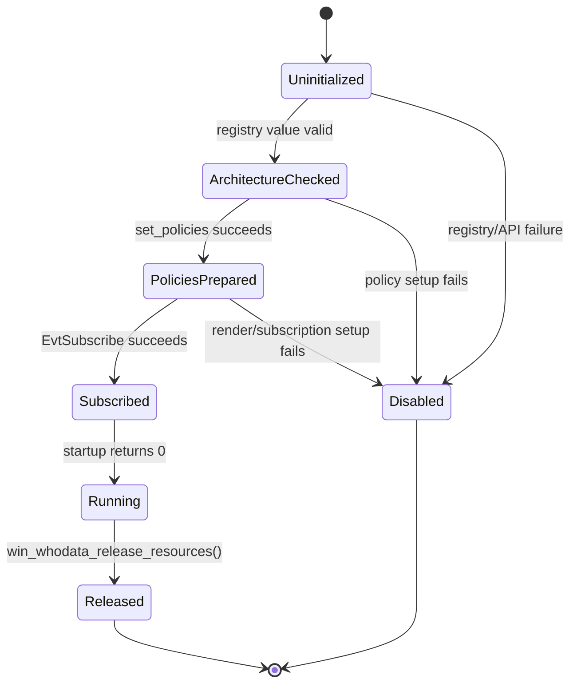

# `whodata_scan_startup_tests`

## Introduction

`whodata_scan_startup_tests` documents the CMocka tests embedded in `src/unit_tests/syscheckd/whodata/test_win_whodata.c` that validate startup and shutdown of Windows real-time Who-Data monitoring. The tests verify that Syscheck can detect the Windows architecture, prepare or validate audit policies, create the tracking tables used by the callback, subscribe to the Security Event Log, and release resources safely.

This is a test-focused module. The production behavior belongs to the Windows Who-Data implementation and the broader Syscheck/FIM subsystem; see [`test_win_whodata`](test_win_whodata.md), [`syscheckd_whodata`](syscheckd_whodata.md), [`Syscheck_Config`](Syscheck_Config.md), and [`test_fim_scan`](test_fim_scan.md) for adjacent responsibilities.

## Scope and role in the system

Windows Who-Data extends File Integrity Monitoring with the user/process context associated with file access. Startup is the gate that makes this possible: it prepares the operating system audit configuration and installs an Event Log subscription before any events can be correlated with FIM paths.



The current module concentrates on the startup branch and its direct helpers. Callback parsing, event correlation, and periodic state validation are covered by sibling test groups in [`test_win_whodata`](test_win_whodata.md).

## Test architecture

The test file uses CMocka fixtures and wrapper functions to replace Windows APIs, filesystem operations, process execution, Syscheck configuration, hash tables, logging, and synchronization primitives. This makes startup outcomes deterministic without requiring a live Windows Event Log or modifying host audit policy.

```mermaid
flowchart TD
    MAIN[main()] --> GROUP[General tests[]]
    GROUP --> FIX[test_group_setup / test_group_teardown]
    FIX --> CONFIG[Read_Syscheck_Config]
    FIX --> STATE[global syscheck and whodata state]

    GROUP --> STARTUP[run_whodata_scan tests]
    GROUP --> POLICY[set_policies tests]
    GROUP --> AUDIT[whodata_audit_start tests]
    GROUP --> QUERY[set_subscription_query test]
    GROUP --> RELEASE[win_whodata_release_resources test]

    STARTUP --> WRAP[Windows and Wazuh wrappers]
    POLICY --> WRAP
    AUDIT --> WRAP
    RELEASE --> WRAP
    WRAP --> ASSERT[return values, calls, logs, and state assertions]
```

The file runs four CMocka groups. The startup-specific tests are in the general `tests[]` group, while callback and state-checker groups provide the downstream context that consumes the startup state.

## Startup process

The expected successful path is architecture detection, policy preparation, render-context creation, Event Log subscription, and a success result.



The test expectations show that the subscription is made to the `Security` channel with `EvtSubscribeToFutureEvents` and `whodata_callback` as the callback. The query selects file object access and handle events, plus policy-change events, using the access-mask filter required by Who-Data.

## Startup components under test

### `run_whodata_scan`

`run_whodata_scan` is the startup coordinator. The tests cover:

- Unsupported or unreadable architecture information: returns `1` after a registry failure or unsupported architecture.
- Audit-policy preparation failure: returns `1` when local policies cannot be configured.
- Automatic policy configuration unavailable for the Windows version: records the policy warning and returns `1`.
- Event-channel subscription failure: returns `1` and logs that Who-Data is disabled.
- Complete startup: creates the Event Log render context, subscribes successfully, logs that the FIM real-time Who-Data engine started, and returns `0`.



### `whodata_check_arch`

The architecture helper reads `PROCESSOR_ARCHITECTURE` from:

`System\\CurrentControlSet\\Control\\Session Manager\\Environment`

The tests verify that `sys_64` is set to `0` for `x86` and `1` for `AMD64`, `IA64`, and `ARM64`. Registry-open failures, value-query failures, and unknown architecture strings return `OS_INVALID`. The result affects path handling for 32-bit versus 64-bit Windows system locations.

### `set_policies`

`set_policies` protects the host's existing audit configuration while adding the two subcategories needed by Who-Data: File System and Handle Manipulation. The tests establish this workflow:



The suite covers stale-backup removal, backup command retries, backup-file and temporary-file failures, restore retries, and the successful file transformation. Command execution is mocked through `wm_exec`; the retry sequence makes six attempts (`0` through `5`) before reporting failure.

### `set_subscription_query`

The query helper is tested as an exact wide-string contract. It selects Windows Security events with the audit keyword and includes:

- Event ID `4656` (handle requested)
- Event ID `4663` (object access)
- Event ID `4658` (handle closed)
- Event ID `4660` (object deleted)
- Event ID `4719` (audit-policy change)

File-object filtering and the access-mask bit filter prevent unrelated Security-channel traffic from entering the Who-Data callback.

### `whodata_audit_start`

This helper creates the two hash tables stored in `syscheck.wdata`:

| Table | Purpose |
|---|---|
| `syscheck.wdata.directories` | Tracks directories awaiting or undergoing a Whodata scan and their scan timestamps/state. |
| `syscheck.wdata.fd` | Correlates Windows handle identifiers with parsed `whodata_evt` records. |

The tests cover failure to create either table and verify partial initialization: if the first allocation succeeds but the second fails, the directory table remains visible while the file-descriptor table is `NULL`. The success test also verifies volume enumeration and drive/device mapping during initialization.

### `win_whodata_release_resources`

The release test verifies cleanup of the runtime tracking state and Event Log subscription. It exercises hash-table teardown, synchronization around shared Syscheck state, and `EvtClose`. This complements the broader teardown fixtures that free `syscheck.wdata`, directory lists, and configuration state.

## Failure and fallback semantics

Startup failures are intentionally observable through return values and log assertions. The tests distinguish hard startup failure (`1`) from policy-specific inability to auto-configure (`2` from `set_policies`), while `run_whodata_scan` reports the latter as a disabled-startup result.



The production system may continue FIM through other monitoring modes when Who-Data cannot start. Mode transitions and event-level fallback behavior are documented by [`test_win_whodata`](test_win_whodata.md) and the Syscheck runtime documentation.

## Test fixtures and observability

`test_group_setup` loads `../test_syscheck.conf`, initializes the global Syscheck configuration, and establishes expected lock activity. Tests then reset state through `syscheck_teardown`. Startup tests rely on wrapper expectations for:

- Registry APIs: `RegOpenKeyEx`, `RegQueryValueEx`
- Audit policy execution: `wm_exec`, `IsFile`, `remove`
- Policy-file I/O: `wfopen`, `fgets`, `fprintf`, `fclose`
- Event Log APIs: `EvtCreateRenderContext`, `EvtSubscribe`, `EvtClose`
- Hash-table APIs: `OSHash_Create`, `OSHash_SetFreeDataPointer`
- Logging and synchronization wrappers

Assertions validate return codes, global pointers (`syscheck.wdata.directories`, `syscheck.wdata.fd`, and `sys_64`), exact subscription parameters, generated policy lines, and diagnostic messages.

## Related documentation

- [`test_win_whodata`](test_win_whodata.md) — complete Windows Who-Data test suite, including callback, parsing, SACL, state-checker, and utility tests.
- [`syscheckd_whodata`](syscheckd_whodata.md) — broader Syscheck Who-Data architecture and runtime responsibilities.
- [`test_fim_scan`](test_fim_scan.md) — generic FIM scan behavior and its relationship to realtime and Who-Data processing.
- [`Syscheck_Config`](Syscheck_Config.md) — configuration structures and flags consumed by Syscheck/Who-Data.
- [`test_audit_healthcheck`](test_audit_healthcheck.md) — related audit-health validation tests in the Syscheck test tree.

## Source reference

- Test implementation: `src/unit_tests/syscheckd/whodata/test_win_whodata.c`
- Documented core functions: `run_whodata_scan`, `whodata_check_arch`, `set_policies`, `set_subscription_query`, `whodata_audit_start`, and `win_whodata_release_resources`
