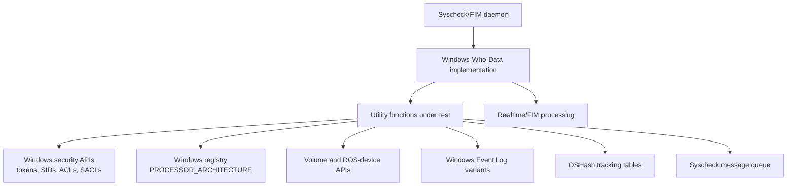
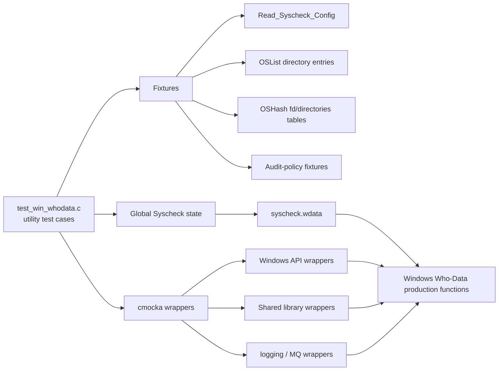
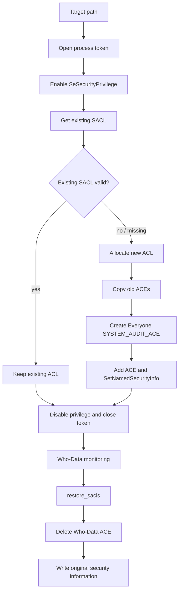
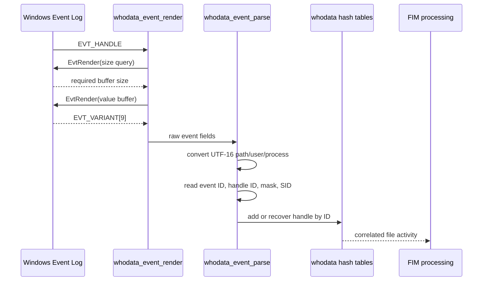
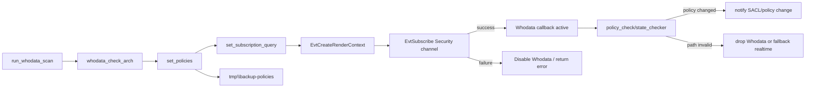
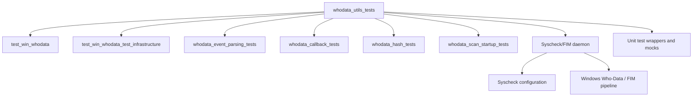

# `whodata_utils_tests`

## Introduction

`whodata_utils_tests` documents the CMocka coverage for the Windows utility layer of Wazuh Syscheck/FIM Who-Data. The tests are implemented in `src/unit_tests/syscheckd/whodata/test_win_whodata.c` and isolate Windows security, registry, volume, path, audit-policy, and event-helper APIs through wrappers.

The module validates the small functions that make the Windows Who-Data engine reliable: privilege elevation, SACL construction and validation, architecture detection, Unicode/path conversion, device-to-drive mapping, audit-policy backup and restoration, event-field extraction, hash insertion, notification, and cleanup. End-to-end callback behavior is referenced from [whodata_callback_tests](whodata_callback_tests.md), while the parent suite is described in [test_win_whodata](test_win_whodata.md).

## Position in the system

Windows Who-Data is the SACL/Event Log backend of Syscheck. It observes Security-channel events, correlates access handles with paths and identities, and passes resulting activity into the FIM pipeline. These utility tests cover the adapters and state primitives used before and after that correlation.

## Architecture of the test module

The tests use three major fixture contexts:

- `test_group_setup` loads a Syscheck configuration and establishes the global directory list.
- `setup_replace_device_path`, `setup_win_whodata_evt`, and related fixtures create isolated path, event, and hash-table state.
- `setup_policy_check`, `setup_state_checker`, and `setup_wdata_dirs_cleanup` build policy records and monitored-directory state, then teardown restores global state and frees hash tables.

Most external behavior is simulated with CMocka `expect_*` and `will_return` calls. This makes failures deterministic and verifies both return values and observable diagnostics.

## Utility component map

| Area | Functions exercised | Responsibility |
|---|---|---|
| Privileges and SACLs | `set_privilege`, `set_winsacl`, `w_update_sacl`, `is_valid_sacl`, `check_object_sacl` | Temporarily enable `SeSecurityPrivilege`, inspect existing ACLs, preserve old ACEs, add the Everyone audit ACE, and validate required inheritance/mask flags. |
| Restoration | `restore_sacls`, `restore_audit_policies`, `audit_restore` | Remove the Who-Data ACE, restore Windows audit policy from `tmp\\backup-policies`, and cleanly return the system to its prior state. |
| Platform discovery | `whodata_check_arch`, `get_volume_names`, `get_drive_names`, `replace_device_path`, `whodata_path_filter` | Detect 32/64-bit architecture, enumerate volumes and mount points, translate `\\Device\\...` paths, and apply path exclusions. |
| Event helpers | `get_whodata_path`, `whodata_event_render`, `whodata_get_event_id`, `whodata_get_handle_id`, `whodata_get_access_mask`, `whodata_event_parse` | Render Windows Event Log values, validate variant types, convert UTF-16 strings, and populate `whodata_evt`. |
| Tracking and notifications | `whodata_hash_add`, `notify_SACL_change`, `whodata_audit_start`, `win_whodata_release_resources` | Maintain handle/directory hash tables, report invalid SACLs to Syscheck, initialize volume state, and release subscriptions/tables. |
| Startup/policy helpers | `set_subscription_query`, `set_policies`, `policy_check`, `run_whodata_scan`, `state_checker` | Build the Security-channel query, configure policy files, verify required audit subcategories, start the event subscription, and reconcile monitored paths. |

## Core processing flows

### SACL update and restoration

The tests cover every failure boundary: token opening, privilege lookup/adjustment, security descriptor retrieval, ACL sizing/allocation/initialization, ACE retrieval/copy/addition, SID copying, and final security-info writes. A successful SACL contains an inheritable `SYSTEM_AUDIT_ACE` for Everyone with successful auditing and the tested write/delete-related access mask.

### Event extraction and correlation helpers

The event helper tests establish the expected field contract: event ID is a `UInt16`, handle ID accepts 64-bit and 32-bit hexadecimal/size variants, access masks use a 32-bit hexadecimal value, and paths are UTF-16 strings. Null pointers and invalid variant types return `-1`; malformed optional identity fields are reported without incorrectly fabricating identity data.

### Startup and policy flow

`set_policies` backs up existing policies, appends File System and Handle Manipulation auditing entries, and restores the generated policy file. The tests verify retry behavior—six attempts total after the initial failure—and distinguish missing backups, command failures, file I/O failures, and successful restoration. `policy_check` verifies the Object Access category and both required subcategories through LSA APIs.

## Test behavior and expected outcomes

### SACL and privilege result conventions

The suite records the implementation’s result conventions:

- `set_privilege` returns `0` on success and `1` on lookup or token-adjustment failure.
- `set_winsacl` returns `0` when the target is already valid or is successfully updated; allocation, ACL, ACE, and security-info failures return `1`.
- `w_update_sacl` returns `0` on successful update, including the tested privilege-removal retry case, and `OS_INVALID` for construction or Windows API failures.
- `is_valid_sacl` distinguishes a valid SACL (`0`), missing/invalid SACL (`1`), and inability to obtain the Everyone SID (`2`).
- `check_object_sacl` returns `0` for a valid SACL, `1` for an invalid SACL, and `2` when inspection itself cannot be completed.

### Event and path edge cases

Coverage includes:

- registry access/query errors and unsupported architectures;
- x86 versus AMD64, IA64, and ARM64 setting the shared `sys_64` flag;
- failed and successful UTF-16-to-UTF-8 conversion;
- recycle-bin filtering and 32-bit System32 handling;
- missing, empty, and matching device mappings;
- volume enumeration failures, `ERROR_MORE_DATA`, `ERROR_NO_MORE_FILES`, and DOS-device lookup failures;
- invalid event property counts and invalid field types;
- 32-bit and 64-bit process/handle representations;
- null or stale hash entries and duplicate handle replacement.

### State and cleanup

`state_checker` tests verify that files and directories are reclassified when deleted, re-added, or found with invalid SACLs. They also validate stale `whodata_directory` removal based on stored `FILETIME` values. Cleanup tests cover zero, one, and multiple directory entries, including all-stale and mixed-stale tables.

All tests are expected to leave global Syscheck state reusable. Teardowns free `OSHash` tables, directory lists, allocated event strings, policy fixtures, device/drive arrays, and event subscriptions as appropriate.

## Dependencies and references

- [Windows Who-Data test module](test_win_whodata.md) — complete suite organization and production integration.
- [Windows Who-Data test infrastructure](test_win_whodata_test_infrastructure.md) — shared fixtures and wrapper setup.
- [Whodata event parsing tests](whodata_event_parsing_tests.md) — detailed event field and parser behavior.
- [Whodata callback tests](whodata_callback_tests.md) — event-ID dispatch, handle correlation, and FIM state transitions.
- [Whodata hash tests](whodata_hash_tests.md) — handle and directory hash semantics.
- [Whodata scan startup tests](whodata_scan_startup_tests.md) — architecture, policy, subscription, and initialization flows.
- [Syscheck/FIM unit tests](Unit_Tests_-_Syscheck_FIM.md) — parent test inventory.
- [Syscheck/FIM daemon](Syscheck___FIM_Daemon_(C_C++).md) — production subsystem context.
- [Unit-test wrappers and mocks](Unit_Test_Wrappers_&_Mocks.md) — mocked platform and shared-library boundaries.

## Maintenance notes

When changing Windows Who-Data utilities, update the tests alongside the production contract. In particular, preserve coverage for Windows variant-type differences between 32-bit and 64-bit builds, privilege cleanup on every error path, SACL ACE inheritance/mask requirements, retry limits for `auditpol`, and teardown of global hash/list state. The existing test file contains a TODO for null-input coverage in `whodata_hash_add`; this is a useful extension point.
