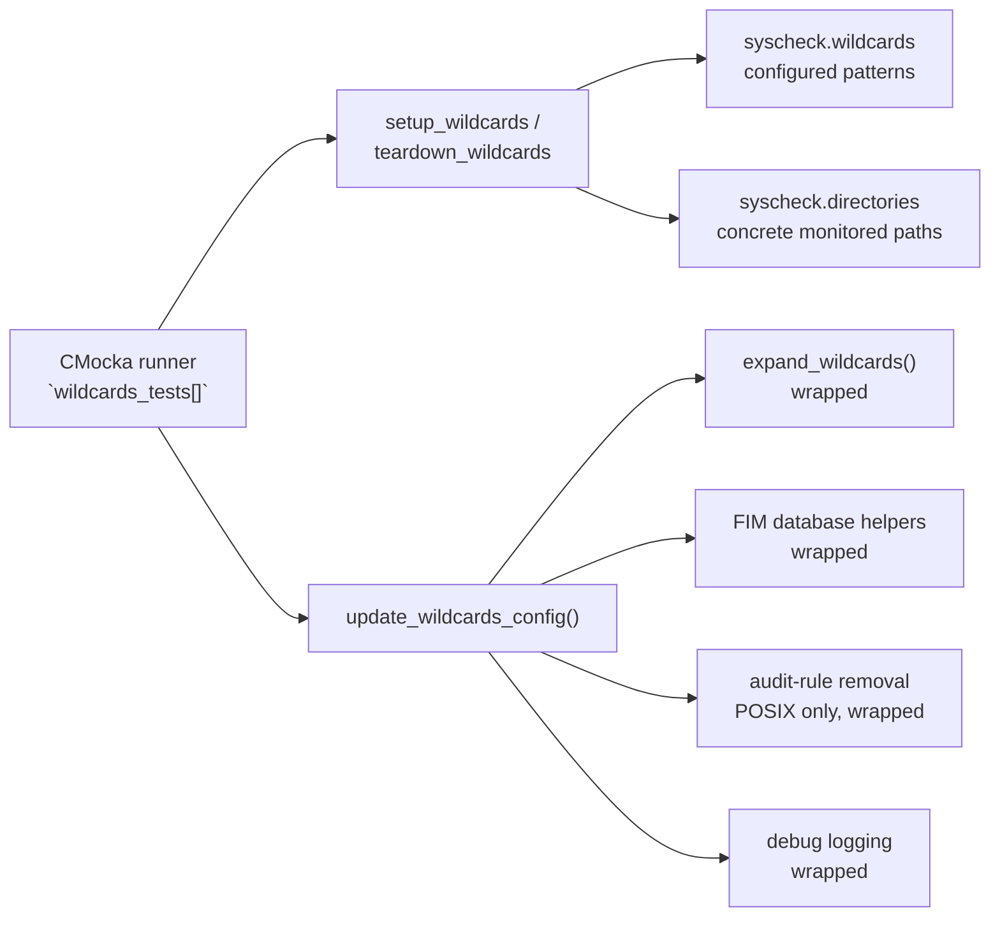
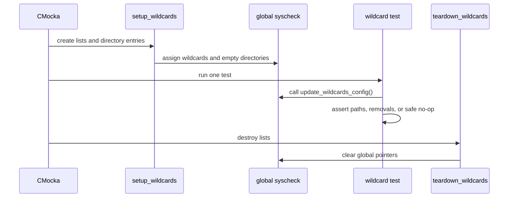
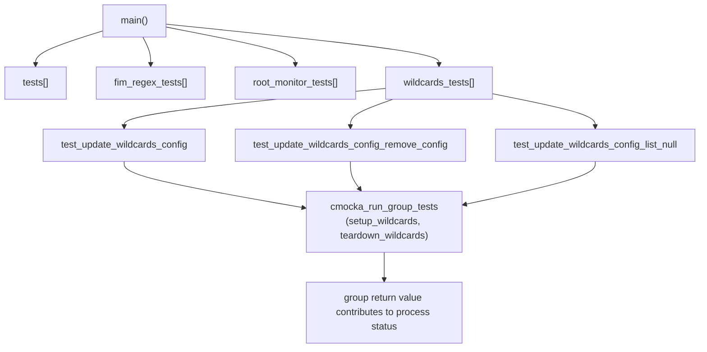
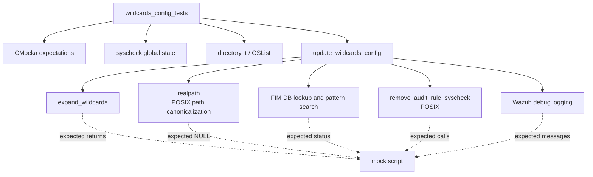
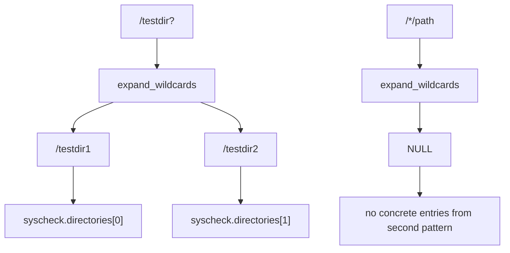
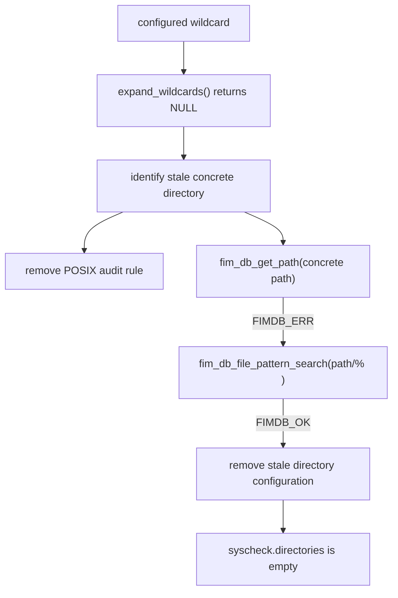
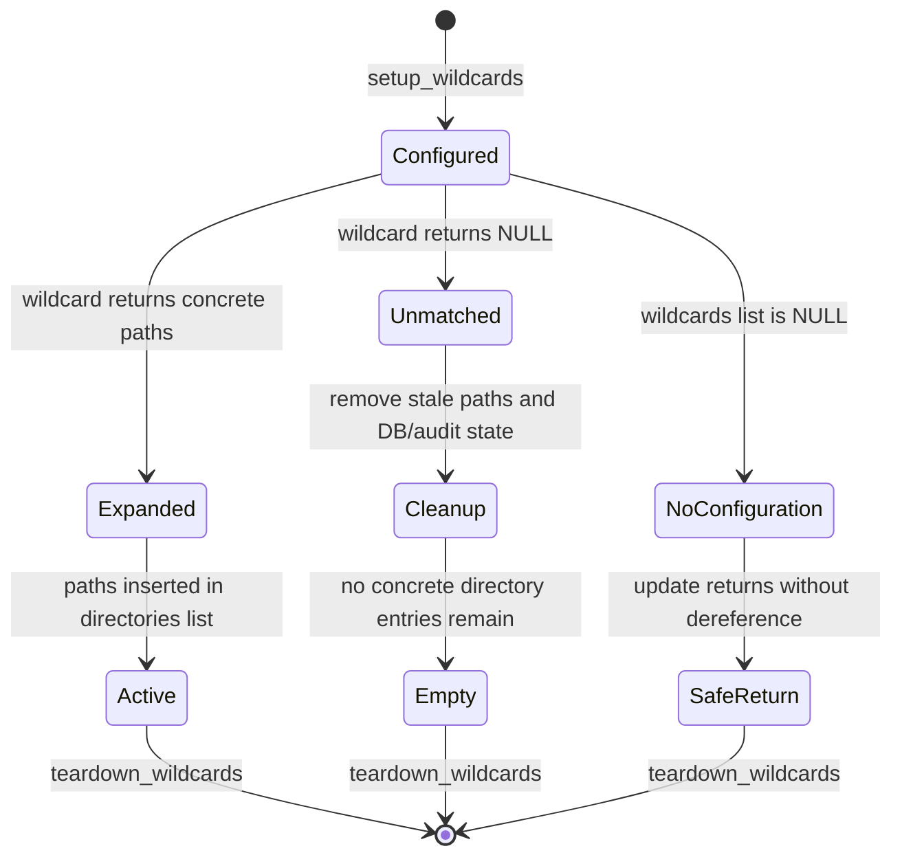

# `wildcards_config_tests` module

`wildcards_config_tests` is the focused CMocka test group for the Syscheck/FIM wildcard-configuration refresh path. It verifies that wildcard specifications are expanded into concrete monitored directories, that stale directories are removed when expansion no longer produces paths, and that an absent wildcard list is handled safely.

The tests live in `src/unit_tests/syscheckd/test_fim_scan.c` and exercise `update_wildcards_config()` through controlled wrappers. They do not perform real filesystem globbing or a live FIM scan. For broader FIM scan behavior, see the related [`test_syscheck_op`](test_syscheck_op.md) coverage and the database-oriented [`wazuh_db_fim_syscollector`](wazuh_db_fim_syscollector.md) documentation.

## Position in the system

The group sits at the boundary between Syscheck configuration state and the FIM runtime directory list. `syscheck.wildcards` contains configured wildcard entries; `syscheck.directories` contains the concrete paths used by later scanning and event-processing code.

The production Syscheck/FIM daemon consumes the resulting directory configuration. This test group intentionally constructs the relevant lists directly, so it isolates refresh semantics from configuration parsing, real wildcard matching, operating-system audit APIs, and database storage.

## Components

| Component | Location or symbol | Responsibility |
|---|---|---|
| Test source | `src/unit_tests/syscheckd/test_fim_scan.c` | Defines fixtures, wrappers, wildcard tests, and the CMocka runner. |
| Suite fixture | `setup_wildcards` | Creates wildcard and concrete-directory lists and inserts two configured patterns. |
| Suite cleanup | `teardown_wildcards` | Destroys both lists using `free_directory` and clears the global pointers. |
| Success test | `test_update_wildcards_config` | Verifies returned expansion paths populate `syscheck.directories` in order. |
| Removal test | `test_update_wildcards_config_remove_config` | Verifies failed expansion removes stale concrete configuration and searches associated FIM entries. |
| Null-list test | `test_update_wildcards_config_list_null` | Verifies no-op safety when `syscheck.wildcards` is `NULL`. |
| System state | `syscheck` | Owns the wildcard list and the active concrete-directory list. |
| Test doubles | `__wrap_expand_wildcards`, `__wrap_realpath`, DB/audit/log wrappers | Make expansion, cleanup, synchronization, and failure paths deterministic. |

## Test fixture and isolation

`setup_wildcards` initializes the global state required by all three cases:

- `syscheck.wildcards` is an `OSList` whose data destructor is `free_directory`.
- Two `directory_t` entries are inserted with wildcard paths `/testdir?` and `/*/path` on POSIX, or their Windows equivalents.
- The entries use FIM-relevant options (`WHODATA_ACTIVE`, and `CHECK_FOLLOW` on POSIX), recursion level `512`, and an unlimited file-entry limit (`-1`).
- `syscheck.directories` starts as an empty list.
- Lock and mutex wrappers are expected so list mutation is tested as synchronized global-state work.

`teardown_wildcards` destroys both lists and resets their pointers. This prevents one test’s concrete paths or wildcard entries from affecting the next test. The fixture does not depend on actual directories existing on the host.

## Execution architecture

The focused group is registered separately from the larger `tests`, `fim_regex_tests`, and `root_monitor_tests` arrays. In `main`, its result is added to the aggregate return value, so a failure in this group fails the test executable even when other groups pass.

## Dependency and mocking model

The wrappers are interaction contracts, not implementations of the dependencies:

- `__wrap_expand_wildcards` returns a caller-scripted array of concrete paths or `NULL`.
- POSIX `__wrap_realpath` is expected for the wildcard path and returns `NULL` in these tests, allowing the suite to focus on expansion results rather than host path canonicalization.
- `__wrap_fim_db_get_path` and `__wrap_fim_db_file_pattern_search` model whether old FIM records are associated with a removed path.
- `__wrap_remove_audit_rule_syscheck` verifies removal of POSIX audit monitoring for stale directories.
- Lock, mutex, and logging wrappers verify synchronization and observable diagnostics.

## Functional behavior under test

### Successful expansion

`test_update_wildcards_config` scripts the first wildcard to expand to `/testdir1` and `/testdir2`, while the second wildcard returns no paths. After the refresh, the first two entries of `syscheck.directories` must contain the two resolved paths in the same order as the expansion result.

The test also expects the wildcard-update start and finalization messages. These messages make the refresh boundary visible in daemon logs and ensure the operation reaches its normal completion path.

### Removal of stale configuration

`test_update_wildcards_config_remove_config` scripts both wildcard expansions to return `NULL`. The previously concrete paths are therefore stale. The test expects each path to be logged for removal; on POSIX it also expects audit rules to be removed. FIM database lookups are then performed using directory patterns such as `/testdir2/%` and `/testdir1/%`.

The final assertion checks that the first directory entry is `NULL`, which represents an empty list after removal. This protects against leaving an obsolete path active when a wildcard no longer matches anything.

### Null wildcard list

`test_update_wildcards_config_list_null` destroys and nulls `syscheck.wildcards` before calling the refresh function. Its purpose is defensive: the update path must not dereference an absent configuration list or crash during startup, teardown, or a configuration transition.

## Platform behavior

The source uses conditional compilation to account for path and monitoring differences:

| Concern | POSIX test branch | Windows test branch |
|---|---|---|
| Wildcard examples | `/testdir?`, `/*/path` | `c:\\testdir?`, `c:\\*\\path` |
| Canonicalization seam | Expects wrapped `realpath` calls returning `NULL` | No POSIX `realpath` expectation |
| Audit cleanup | Expects `remove_audit_rule_syscheck` for stale paths | No POSIX audit-rule call |
| Database patterns | `/testdir1/%`, `/testdir2/%` | `c:\\testdir1\\%`, `c:\\testdir2\\%` |
| Directory options | `WHODATA_ACTIVE | CHECK_FOLLOW` | `WHODATA_ACTIVE` |

The behavioral contract is shared: expansion results populate active configuration, missing results remove stale configuration, and a null wildcard list is safe. Only path syntax and platform-specific cleanup differ.

## State and invariants

The tests establish these invariants:

1. Expansion output is reflected in `syscheck.directories`.
2. Stale paths are not retained when their wildcard expansion disappears.
3. Removal considers FIM database path/pattern state and, on POSIX, audit monitoring.
4. List access and mutation are performed through the expected synchronization seams.
5. A missing wildcard list is a safe input condition.
6. Every test starts and ends with isolated list ownership.

## Maintainer guidance

Changes to wildcard expansion, concrete-directory insertion/removal, or FIM database cleanup should update this focused group first. When modifying platform-specific behavior, preserve both conditional branches and their path separator expectations. Changes to the broader scan lifecycle, event generation, or database transaction callbacks belong in the surrounding FIM scan suite rather than being duplicated here.

For the shared test harness and wrapper conventions, see [`test_infrastructure`](test_infrastructure.md). For the production file-integrity data path, see [`syscheckd_file`](syscheckd_file.md); for related FIM database behavior, see [`wazuh_db_fim_syscollector`](wazuh_db_fim_syscollector.md).

## Source map

| Concern | Source or symbol |
|---|---|
| Wildcard test registration | `wildcards_tests[]` in `src/unit_tests/syscheckd/test_fim_scan.c` |
| Fixture construction | `setup_wildcards` |
| Fixture cleanup | `teardown_wildcards` |
| Expansion success | `test_update_wildcards_config` |
| Stale configuration removal | `test_update_wildcards_config_remove_config` |
| Null-list safety | `test_update_wildcards_config_list_null` |
| System under test | `update_wildcards_config()` |
| Concrete configuration storage | `syscheck.directories` |
| Wildcard configuration storage | `syscheck.wildcards` |
