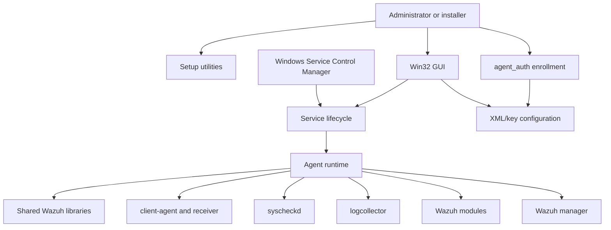
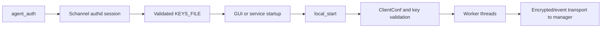

# Win32 agent

The `win32_agent` module is the Windows-native packaging and execution layer for a Wazuh agent. It provides enrollment, service lifecycle management, runtime startup, event transport, post-install configuration, IIS log discovery, and a desktop administration UI. The module is mostly C and bridges Windows APIs—Schannel, Winsock, Service Control Manager, processes, ACLs, and dialogs—to the shared Wazuh agent subsystems.

## Architecture overview

## Submodules

- [Win32 agent lifecycle and service control](win32_agent_lifecycle.md) — executable dispatch, service installation, SCM control, and graceful shutdown.
- [Win32 agent enrollment](win32_agent_enrollment.md) — Schannel handshake, encrypted authd protocol, response validation, and key persistence.
- [Win32 installation and setup](win32_agent_setup.md) — shared filesystem helpers, syscheck toggling, ACL setup, and IIS log auto-discovery.
- [Win32 agent GUI](win32_agent_gui.md) — dialog state, configuration editing, authentication-key import, and service menu actions.
- [Win32 runtime and transport](win32_agent_runtime.md) — startup orchestration, worker threads, event serialization, buffering, and legacy IP discovery.

## End-to-end flows

### Enrollment to running agent

### Configuration and operation boundaries

The module owns Windows-facing orchestration and persistence boundaries. Shared modules own the domain work: agent communication, log collection, file-integrity monitoring, command execution, inventory/compliance modules, cryptography, and common validation. This separation keeps Windows API details in `src/win32` while allowing the core agent components to remain reusable.

## Important operational notes

- The service is named `WazuhSvc`, displayed as `Wazuh`, and configured for automatic startup.
- Runtime startup requires a valid configuration and manager address; key checks may be relaxed when auto-enrollment is enabled.
- Event sends are mutex-protected and can use the agent buffer when configured.
- Configuration changes are generally staged through temporary files and backups before promotion.
- DLL verification is performed at early process entry points because the agent loads optional modules and must verify them before normal logging/runtime startup.
