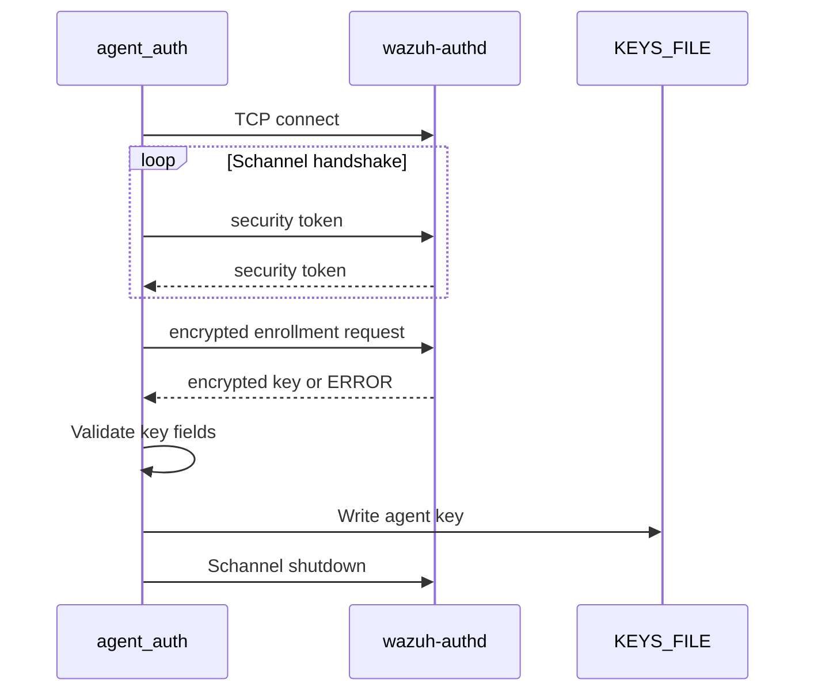

# Win32 agent enrollment and secure key import

`src/win32/agent_auth.c` implements the standalone enrollment client. Its `main` parses manager, port, interface, agent-name, and password options; establishes a Schannel-protected TCP session; submits an enrollment request; validates the manager response; and writes the resulting key to `KEYS_FILE`.

## Secure connection

`CreateSecureConnection` resolves the manager with `OS_GetHost`, connects through `OS_ConnectTCP`, acquires outbound Schannel credentials, and repeatedly calls `InitializeSecurityContext`. Tokens are exchanged until the context is established. Certificate validation is manual and server-name checking is disabled because the protocol expects the manager's auth daemon configuration.

`SendSecureMessage` queries Schannel stream sizes, lays out header/data/trailer buffers, encrypts with `EncryptMessage`, and sends the record. `ReceiveSecureMessage` accumulates socket data, decrypts with `DecryptMessage`, and preserves `SECBUFFER_EXTRA` bytes for subsequent records.

## Enrollment protocol

The request is one of:

```text
OSSEC PASS: <password> OSSEC A:'<agent-name>'
OSSEC A:'<agent-name>'
```

If an existing key is available, its enrollment hash is appended to the request. `InstallAuthKeys` accepts only manager responses beginning with `OSSEC K:'`; it validates the four key fields with `OS_IsValidID` and `OS_IsValidName`, then writes the key. `ERROR` responses and unknown formats terminate with a diagnostic.

`DisconnectFromServer` sends the Schannel shutdown control token, deletes the security context, and closes the socket.

The manager-side enrollment endpoint is documented with the [OS authentication server](os_auth_server_daemon.md); this file covers only the Windows client side.



## Operational constraints

The default manager port is 1515. IPv6 link-local connections may require `-n <network-interface>`. When no password option is supplied, `AUTHD_PASS` is read if present; otherwise the client explicitly starts insecure enrollment mode.
