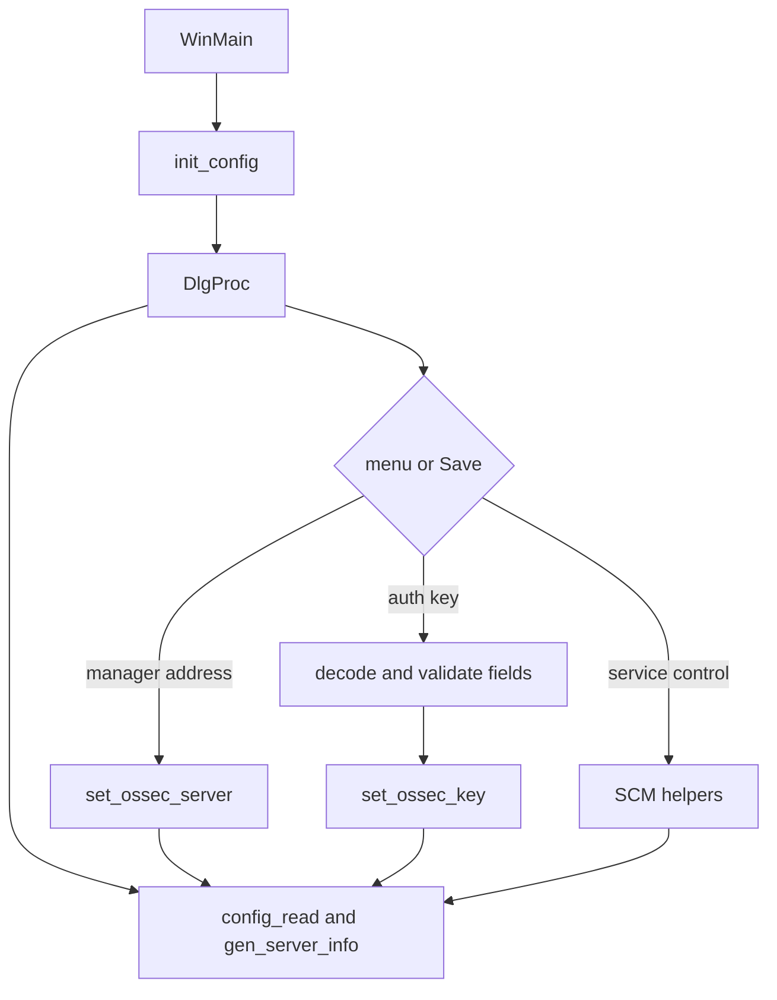

# Win32 agent graphical interface

The GUI is implemented by `src/win32/ui/os_win32ui.c`, with shared state declared in `os_win32ui.h` and file/process/configuration operations in `common.c`.

## State model

`ossec_config` stores manager type and address, authentication key, agent identity, version/revision, sent-message count, administrative access, and a user-facing status. `init_config` establishes defaults and checks whether the executable can access `ossec.conf`. `config_read` refreshes service state, version metadata, sender counters, key-derived identity, and manager configuration. `get_ossec_server` reads the supported XML locations and classifies the address as IP or hostname.

`set_ossec_server` validates an IP or hostname, writes XML to a temporary file, backs up the active configuration, and promotes the new file. `set_ossec_key` writes an imported key through a temporary file and atomic rename. `is_file` is the basic existence check; `run_cmd` starts a hidden `cmd.exe` process and returns its exit code.

## Dialog behavior

`WinMain` enables DLL verification, initializes Winsock and common controls, and opens the main dialog. `DlgProc` builds Manage, View, and Help menus, renders status, and handles:

- Start, Stop, Status, and Restart through the service API.
- Manager address edits.
- Base64 authentication-key decoding, field extraction, confirmation, and import.
- Notepad shortcuts for logs, configuration, and help.

`AboutDlgProc` is the small modal About dialog.

The GUI disables editing controls when administrative access is unavailable and reports missing key/server configuration through explicit status strings.
