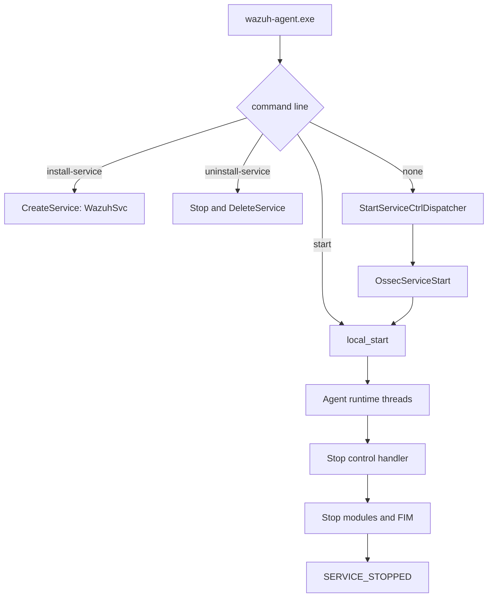

# Win32 agent lifecycle and service control

This submodule owns the native Windows entry points and Service Control Manager integration. It turns `wazuh-agent.exe` into either an installed Windows service, a manually started process, or a service callback that launches the agent runtime.

## Components

### `src/win32/win_agent.c`

`main` normalizes the executable working directory, builds the quoted absolute executable path, and dispatches command-line actions:

- `install-service` calls `InstallService`.
- `uninstall-service` calls `UninstallService`.
- `start` calls `local_start` directly.
- no action enters `os_WinMain`, which registers the service dispatch table.

The early DLL-verification requirement is deliberate: logging uses the `plain_` variants until signature verification has completed.

### `src/win32/win_service.c`

`OssecServiceStart` registers the `WazuhSvc` control handler, reports `SERVICE_RUNNING`, and invokes `local_start` in production builds. The service helpers manage the SCM:

- `os_start_service` starts the service and distinguishes an already-running service.
- `os_stop_service` sends `SERVICE_CONTROL_STOP` and waits briefly to avoid restart races.
- `CheckServiceRunning` queries the current service state.
- `InstallService` creates an auto-start, own-process service named `WazuhSvc`.
- `UninstallService` stops and deletes the service when present.

The stop handler stops module children, requests module shutdown, marks FIM shutdown, tears down the FIM database, and publishes `SERVICE_STOPPED`.

## Integration

`local_start` is implemented in [`win32_agent_runtime.md`](win32_agent_runtime.md). The GUI uses the service helpers described here for Start, Stop, Status, and Restart operations.
