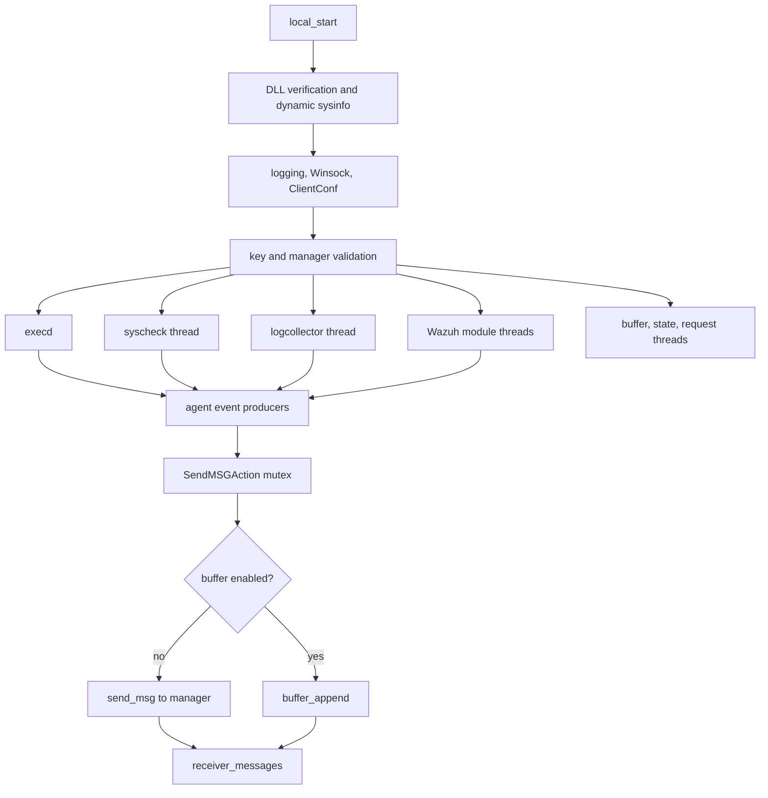

# Win32 agent runtime and message transport

`src/win32/win_utils.c` is the Windows-specific runtime bridge. `local_start` initializes the agent process and launches the worker threads that implement the broader agent subsystems.

## Startup orchestration

The startup sequence enables DLL verification, loads optional `sysinfo` symbols, initializes logging and Winsock, validates `ossec.conf` and manager addressing, checks or permits enrollment keys, and reads the agent keys. It then starts:

- `WinExecdStart` for command execution;
- the Syscheck thread (`Start_win32_Syscheck`);
- the logcollector thread (`LogCollectorStart`);
- configured Wazuh modules;
- optional log rotation;
- optional event buffering and dispatch;
- agent statistics/state;
- request reception.

Finally, `receiver_messages` owns the foreground receive loop. Exit handlers delete state and send the stopped message. `stop_wmodules` walks the module list and invokes each module's stop callback.

## Event transport

`SendMSGAction` serializes writes with a Windows mutex, escapes the location field, constructs the Wazuh event envelope, and either sends immediately with `send_msg` or appends to the agent buffer. `SendMSG` and `SendMSGPredicated` add wait/predicate coordination. The `StartMQ*` and `MQReconnectPredicated` functions are compatibility stubs on Windows because the Unix message-queue abstraction is not used here.

`get_agent_ip_legacy_win32` dynamically calls the sysinfo provider, selects an interface with a usable gateway, prefers an address matching the gateway family, expands IPv6 text, and returns a copied address.

## Dependencies

The runtime delegates platform-independent behavior to the [client-agent lifecycle](client_agent_native_lifecycle.md), [logcollector core](logcollector_core.md), [syscheckd core](syscheckd_core.md), [Wazuh modules core](wazuh_modules_core.md), and [OS execd](os_execd.md) components. Shared networking, cryptography, and sysinfo provide supporting APIs; their detailed documentation should be consulted rather than duplicated here.
