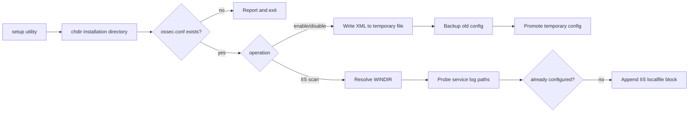

# Win32 installation and configuration setup

This submodule contains post-install utilities and shared filesystem helpers.

## Shared helpers

`src/win32/setup-shared.c` provides `fileexist`, `direxist`, `dogrep`, and `get_win_dir`. They use Wazuh-aware file and directory wrappers, scan bounded lines with `OS_Match`, and resolve `%WINDIR%` with a `C:\WINDOWS` fallback.

## Syscheck configuration

`src/win32/setup-syscheck.c::main` accepts `<directory> [enable|disable]`, verifies `ossec.conf`, and updates the XML path `ossec_config/syscheck/disabled`. `enable` writes `no`; every other second argument writes `yes`. The update is staged in `.tmp.ossec.conf`, while the previous configuration is moved to `OSSECLAST` before the temporary file becomes active.

## Windows installation

`src/win32/setup-win.c::main` changes to the installation directory, configures `WazuhSvc` for automatic startup, and on Vista-era systems temporarily moves selected user-facing files out of the protected directory while applying restrictive ACL changes with `icacls`.

## IIS discovery

`src/win32/setup-iis.c::main` checks today's date and scans `W3SVC`, `MSFTPSVC`, and `SMTPSVC` instance directories 1 through 255. It recognizes NCSA and W3C/FTP/SMTP extended log names. `config_iis` adds a `<localfile>` using `iis` format when today's file exists; `config_dir` falls back to directory-based monitoring when the format-specific file is absent. `dogrep` prevents duplicate entries, and the global `total` counter reports whether anything was added.

