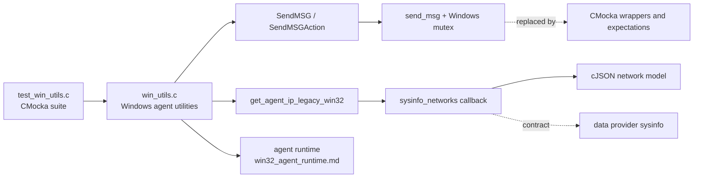
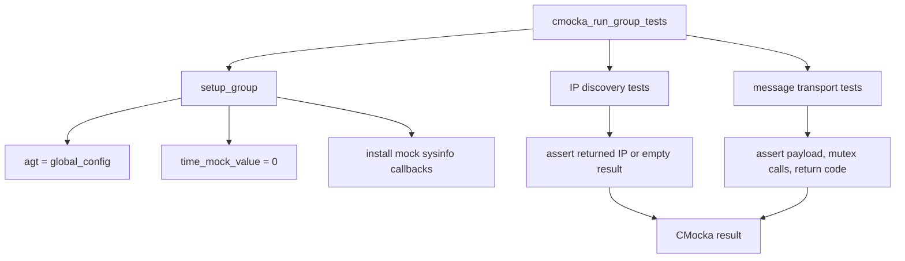
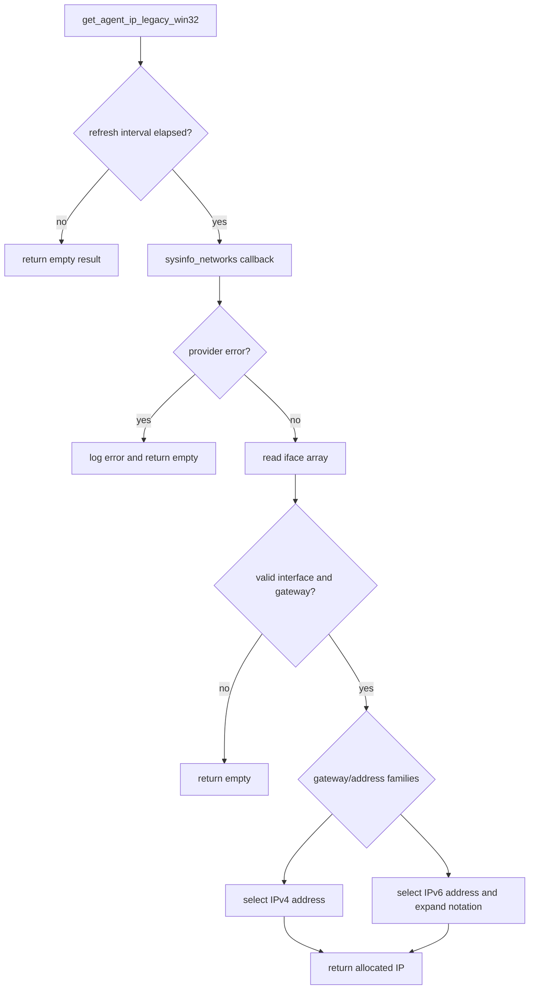
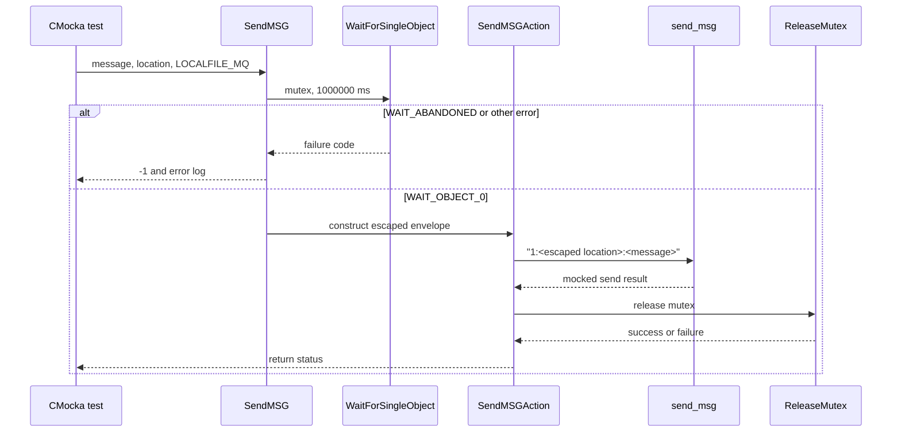
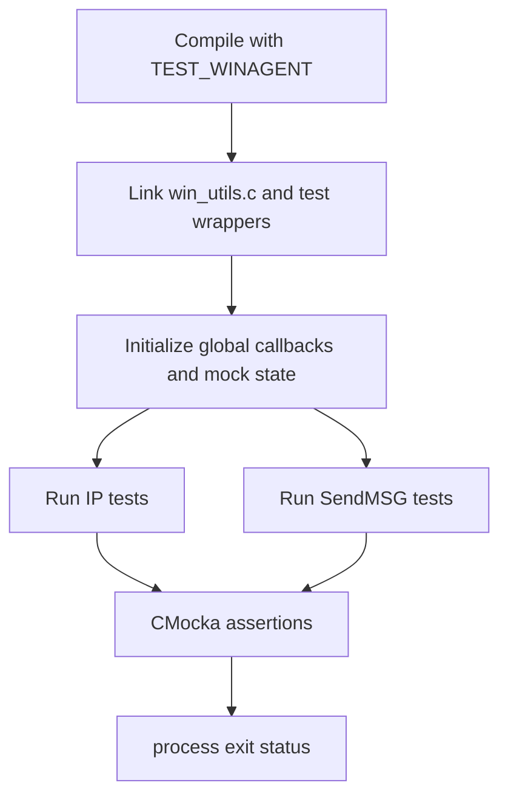

# `win_utils_tests` module

`win_utils_tests` is the CMocka unit-test suite for the Windows agent utility layer in `src/win32/win_utils.c`. It verifies two externally visible responsibilities: sending agent messages through the Windows transport path and discovering the agent IP through the legacy Windows sysinfo provider. The suite isolates both responsibilities with mocks for transport, mutexes, time, cJSON, logging, and sysinfo callbacks.

The production context is described in [Win32 agent runtime](win32_agent_runtime.md). The platform data-provider contract is documented in [data provider sysinfo core](data_provider_sysinfo_core.md) and its Windows implementation in [Windows sysinfo core](data_provider_sysinfo_core_windows.md).

## Position in the system

The test target sits below the Windows agent runtime and beside the shared test-wrapper infrastructure. It does not start an agent, open a real Windows mutex, query a real network adapter, or send data to a manager.

## Test harness architecture

Compilation is conditional on `TEST_WINAGENT`. When enabled, `main` creates one `CMUnitTest` array and runs it with `cmocka_run_group_tests(tests, setup_group, NULL)`.

`setup_group` installs the global test agent configuration, resets mocked time, and replaces the production sysinfo function pointers. The global agent configuration sets `main_ip_update_interval` to 60 seconds. Consequently, IP refresh tests advance mocked time by 61 seconds, while the no-refresh test advances it by exactly 60 seconds.

### Test doubles and seams

- `__wrap_send_msg` checks the expected serialized message and returns a CMocka-controlled result.
- `mock_sysinfo_networks_func` selects one of eight JSON fixtures using `test_case_selector` and returns `error_code_sysinfo_network`.
- `mock_sysinfo_free_result_func` frees the cJSON object created by the network mock.
- `wrap_WaitForSingleObject` and `wrap_ReleaseMutex` model mutex acquisition and release. Expectations verify the mutex handle and the one-million-millisecond wait value.
- `__wrap__merror` verifies error diagnostics for sysinfo failure, abandoned mutexes, generic mutex errors, and release failures.
- The common time mock controls the refresh interval without depending on wall-clock time.

## Component responsibilities

### `get_agent_ip_legacy_win32`

The tests describe the legacy IP-selection contract. On an eligible refresh, the utility obtains a JSON network inventory, selects an interface with a gateway, chooses an address compatible with the gateway family, expands IPv6 text to its normalized uppercase full form, and returns a caller-owned string. If the refresh is not due, the utility returns the empty result without querying the provider.

### `SendMSG` / `SendMSGAction`

The message tests exercise the Windows agent message envelope. With buffering disabled (`agt->buffer = 0`), the expected format is `1:<location>:<message>`. A location containing protocol delimiters is escaped before serialization: `|` becomes `||`, and `:` becomes `|:`. The function still returns success when mutex release reports an error, but it logs the release failure.

## Coverage matrix

| Area | Cases covered | Expected behavior |
|---|---|---|
| IP refresh success | Generic address; IPv6 gateway with IPv4 or IPv6 address; IPv4 gateway with IPv4 or IPv6 address | Return the selected address; expand IPv6 where required |
| IP refresh failure | Sysinfo error, bad interface key, empty interface array, unknown gateway | Log when applicable and return an empty address |
| Refresh throttling | Exactly one configured interval | Do not update the address before the interval has elapsed |
| Mutex handling | Abandoned mutex and generic wait error | Log the corresponding error and return `-1` |
| Message serialization | Plain location | Send `1:locmsg:message` |
| Delimiter escaping | Single and repeated `|`/`:` characters | Escape delimiters while preserving message success |
| Release handling | Release succeeds or fails | Return success for the send path; log release failure |

The source also defines `test_get_agent_ip_legacy_win32_sysinfo_error` and `test_SendMSGAction_mutex_error`; these are active in the provided `main` registration and should be included when counting coverage.

## Data and ownership rules

The sysinfo mock parses fixture JSON into a cJSON tree. The production callback contract returns that tree through `cJSON **`; the paired free callback releases it. IP results are treated as allocated output by the successful IPv6/IPv4-family tests, which call `os_free` after asserting the value. Empty-result tests compare against an empty string and do not exercise ownership of a non-empty allocation.

The test fixtures intentionally separate gateway family from address family. This verifies that the legacy selector can use an IPv4 address behind an IPv6 gateway and an IPv6 address behind an IPv4 gateway, in addition to matching-family cases.

## Process flow and build notes

The suite depends on the Windows-agent build definitions, CMocka, cJSON, and the wrapper implementations under `src/unit_tests/wrappers`. It is therefore a unit target rather than a portable standalone C program: without `TEST_WINAGENT`, the test body is excluded by the preprocessor.

## Maintenance guidance

When changing `SendMSG` or its escaping rules, update the exact payload expectations in the plain, single-escape, and multi-escape tests. When changing IP selection, preserve coverage for all four gateway/address-family combinations and the refresh boundary. Changes to the sysinfo JSON schema should be reflected in the fixtures and checked against the [sysinfo provider documentation](data_provider_sysinfo_core.md).

For broader lifecycle behavior, consult [Win32 agent runtime](win32_agent_runtime.md); for generic wrapper patterns, consult [data provider wrappers](data_provider_wrappers_windows.md) and the repository's related unit-test documentation rather than duplicating those details here.
