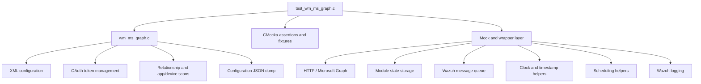
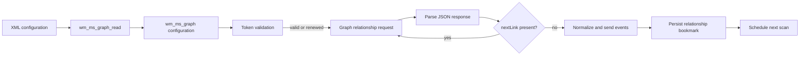

# `wm_ms_graph_tests`

## Purpose

`wm_ms_graph_tests` is a CMocka unit-test module for the Wazuh Microsoft Graph integration. It validates configuration parsing, module setup, JSON configuration dumps, OAuth token acquisition and renewal, relationship scanning, pagination, state persistence, queue delivery, and failure handling.

The tests include `wm_ms_graph.c` directly so internal behavior can be exercised while HTTP, scheduling, time, state, logging, and Wazuh queue dependencies are replaced with deterministic wrappers.

## Repository structure

```text
src/unit_tests/wazuh_modules/ms_graph/
└── test_wm_ms_graph.c
    ├── wm_ms_graph_tests_test_infrastructure
    ├── configuration_parsing_tests
    ├── dump_tests
    ├── token_management_tests
    └── scan_relationships_tests
```

The executable registers two CMocka groups:

- `tests_without_startup`: XML parsing, validation, required fields, and valid API configurations.
- `tests_with_startup`: lifecycle, dumps, tokens, relationship scans, pagination, state, queue behavior, and error paths.

## Architecture





Each test uses one of two fixture lifecycles:

- XML fixtures allocate `test_structure`, `wmodule`, and XML nodes, then clean parser-owned resources.
- Runtime fixtures allocate `wm_ms_graph`, enable test mode, invoke production functions, and call `wm_ms_graph_destroy()` during teardown.

## Core components

| Component | Responsibility |
|---|---|
| `wm_ms_graph_read` | Parses and validates XML configuration. |
| `wm_ms_graph_dump` | Serializes configuration to diagnostic JSON. |
| `wm_ms_graph_get_access_token` | Requests and validates OAuth tokens. |
| `wm_ms_graph_ensure_valid_token` | Reuses or renews cached tokens. |
| `wm_ms_graph_scan_relationships` | Queries configured Graph relationships, handles pagination, emits events, and persists bookmarks. |
| `wm_ms_graph_scan_apps_devices` | Retrieves related managed-device data for application records. |
| `wm_state_io` | Stores per-tenant/resource/relationship scan state. |
| `wurl_http_request` | Abstracts OAuth and Microsoft Graph HTTP requests. |
| `wm_sendmsg` | Represents delivery to the local Wazuh analysis queue. |

## Related documentation

- [Test infrastructure](wm_ms_graph_tests_test_infrastructure.md)
- [Configuration parsing tests](configuration_parsing_tests.md)
- [Dump tests](dump_tests.md)
- [Token management tests](token_management_tests.md)
- [Relationship scanning tests](scan_relationships_tests.md)
- [Microsoft Graph integration](wazuh_modules_core_cloud_integrations_ms_graph.md)
- [Wazuh Modules Daemon](Wazuh_Modules_Daemon_(C).md)