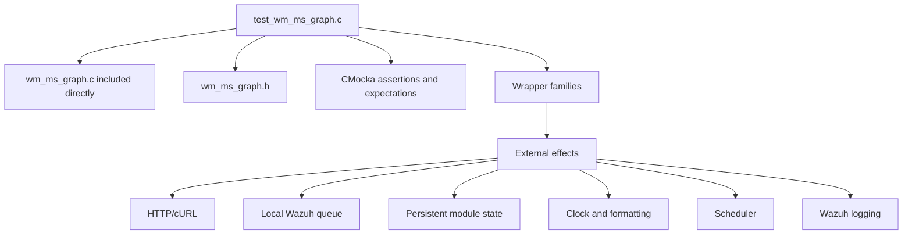
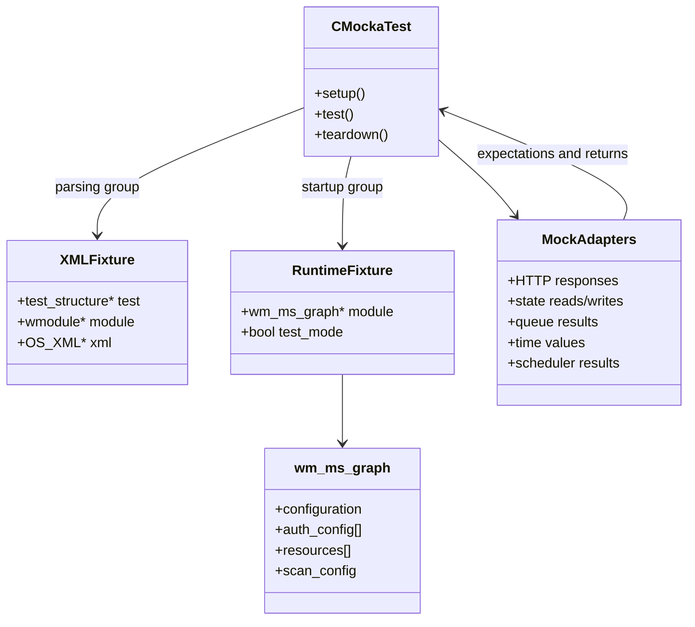
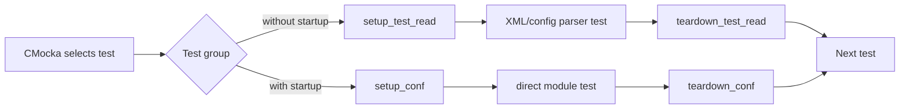
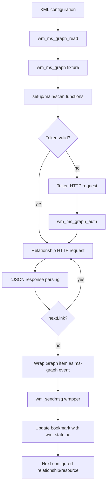
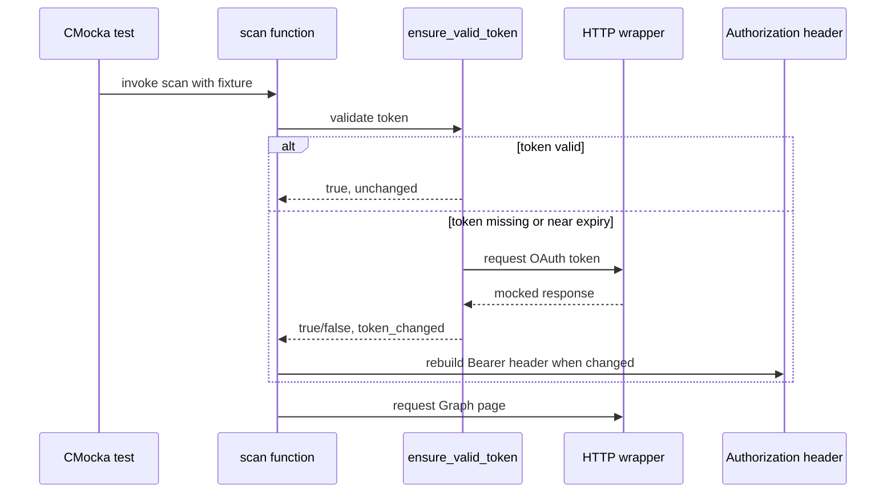
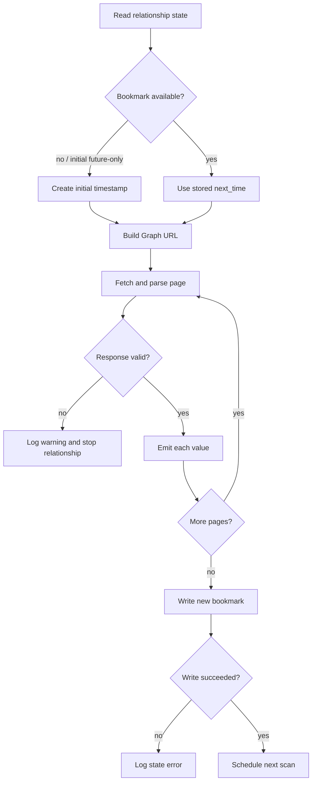

# `wm_ms_graph` Test Infrastructure

## Introduction

`test_wm_ms_graph.c` is the CMocka unit-test harness for the Microsoft Graph Wazuh module. It tests configuration parsing, lifecycle decisions, OAuth token handling, relationship scans, pagination, state persistence, queue delivery, and cleanup without requiring a live Microsoft tenant, network, scheduler, or Wazuh queue.

This document describes the test infrastructure itself. For the production module’s data model, API behavior, and runtime architecture, see [Wazuh Modules Core – Cloud Integrations: Microsoft Graph](wazuh_modules_core_cloud_integrations_ms_graph.md). Shared Wazuh module-daemon concepts are covered by [Wazuh Modules Daemon](Wazuh_Modules_Daemon_(C).md).

## Scope and source layout

The harness is located at `src/unit_tests/wazuh_modules/ms_graph/test_wm_ms_graph.c`. It includes the module implementation directly (`../../wazuh_modules/wm_ms_graph.c`) so that internal functions can be exercised in isolation. The public structures and constants come from `src/wazuh_modules/wm_ms_graph.h`.

The test boundary is deliberately broad: the module’s control flow is real, while operating-system, network, queue, state, time, logging, and scheduling dependencies are replaced with wrappers supplied by the unit-test framework.

## Test-suite architecture

The suite has two fixture classes. Tests that only parse XML use a lightweight XML fixture; tests that invoke initialized module state use a directly allocated `wm_ms_graph` fixture. Both fixtures own all allocations made by the test and release them through dedicated teardown paths.

## Fixture lifecycle

### XML/configuration fixture

`setup_test_read` allocates a `test_structure` and its `wmodule` container, then stores the fixture in CMocka state. Configuration tests populate XML nodes and call `wm_ms_graph_read` through the normal parser path.

`teardown_test_read` clears the XML tree, releases any scheduler scan configuration, calls the local recursive `wmodule_cleanup`, and frees the fixture. The local cleanup function releases module strings, resources and relationship arrays, authentication records, tokens, URLs, and the module tag.

### Runtime fixture

`setup_conf` allocates a zeroed `wm_ms_graph`, enables the global `test_mode`, and exposes the module through CMocka state. This fixture is used for direct calls to setup, main, dump, token, and scan functions.

`teardown_conf` disables `test_mode` and delegates destruction to the production `wm_ms_graph_destroy` function. This keeps the test teardown aligned with production ownership rules and prevents stale token/resource allocations from leaking between cases.

## Test registration and coverage

`main` registers two arrays and runs both with `cmocka_run_group_tests`.

| Group | Setup / teardown | Primary coverage |
|---|---|---|
| `tests_without_startup` | `setup_test_read` / `teardown_test_read` | XML tags, defaults, required fields, value validation, API-type selection, and valid configuration combinations |
| `tests_with_startup` | `setup_conf` / `teardown_conf` | Module setup, main-loop branches, dump output, token acquisition/renewal, relationship scans, pagination, app-device enrichment, state, queue, and failure handling |

The configuration cases intentionally distinguish parser outcomes such as `OS_CFGERR`, `OS_NOTFOUND`, `OS_INVALID`, and `OS_SUCCESS`. This makes malformed, missing, empty, and valid values observable as separate contracts rather than a single “parse failed” result.

The runtime cases verify externally visible behavior through log expectations, return values, state writes, generated URLs, authorization headers, and queue payloads. Exact JSON strings are asserted for dump output and emitted events, including the platform-specific scan identifier behavior on Windows.

## Dependency and mocking strategy

The harness replaces side effects at their narrow integration points:

| Boundary | Representative wrappers | What tests control |
|---|---|---|
| HTTP | `wurl_http_request` | status code, body, headers, response-size truncation, missing response, and pagination links |
| Queue | `StartMQ`, `wm_sendmsg` | queue creation, delivery success/failure, timeout, location, and serialized message |
| State | `wm_state_io` | missing state, restored bookmark, successful write, and write failure |
| Time | `time`, `gmtime_r`, `strftime`, Wazuh timestamp helpers | deterministic bookmark windows and token expiry |
| Scheduling | `sched_scan_*`, sleep helpers, `FOREVER` | setup scheduling and bounded main-loop branches |
| Logging | `mtdebug*`, `mtinfo`, `mtwarn`, `mterror` | diagnostic contract and error-path selection |
| Miscellaneous | `os_random`, `isDebug`, `wm_exec` | scan IDs, debug branches, and command execution without host effects |

The wrapper pattern follows a request/response model: the test queues expected calls with `expect_*`, supplies return values with `will_return`, invokes the real module function, and then asserts the resulting state or serialized output. No test needs credentials that work against Microsoft Graph.

## Core data flow under test

For event-style relationships, tests provide deterministic timestamps and verify the generated `$filter` interval. For inventory-style paths, tests verify full-pull URLs and the additional `managedDevices` request used by app/device enrichment. Pagination tests return `@odata.nextLink` and confirm that every page is fetched and emitted.

## Important process flows

### Token acquisition and renewal

The suite covers successful token parsing, non-success status, oversized responses, invalid JSON, missing `access_token`, missing `expires_in`, valid-token reuse, renewal, and renewal failure. A renewal failure must abort the affected scan without fabricating an event.

### Relationship scan and bookmark persistence

State tags are asserted using the tenant/resource/relationship identity, for example `ms-graph-example_tenant-security-alerts_v2`. This verifies that multiple relationships and multiple resources maintain independent progress.

## Failure semantics and observability

The test expectations document the intended operational diagnosis. Examples include:

- disabled or incomplete configuration exits before network work;
- missing HTTP responses, unsuccessful status codes, cURL-size limits, and malformed JSON produce warnings;
- queue failures are reported but do not alter the HTTP fixture;
- state-write failures are reported after data processing;
- an expired token is renewed before a page request, while renewal failure aborts only the affected scan;
- an empty `value` array advances the bookmark and logs that no new logs were received.

These assertions are valuable when changing control flow: a refactor should preserve both the decision and the diagnostic message unless the operational contract is intentionally changed.

## Extending the infrastructure

When adding a test:

1. Use `setup_test_read` for parser-only behavior and `setup_conf` for initialized runtime behavior.
2. Allocate strings and nested arrays with the same ownership shape as production structures.
3. Mock every external call the new branch can reach; use exact expectations for URLs, headers, queue payloads, and state tags where those values are the contract.
4. Exercise both the success path and the nearest meaningful failure path.
5. Release test-owned allocations, or rely on the matching teardown only when the fixture owns them.
6. Register the test in the appropriate array in `main`.

Tests involving time, pagination, or token expiry should avoid wall-clock assumptions. Use the existing time and HTTP wrappers so failures remain reproducible on Linux, Windows, and other supported builds.

## Related documentation

- [Microsoft Graph module implementation](wazuh_modules_core_cloud_integrations_ms_graph.md)
- [Cloud integrations parent](wazuh_modules_core_cloud_integrations.md)
- [General test infrastructure](test_infrastructure.md)
