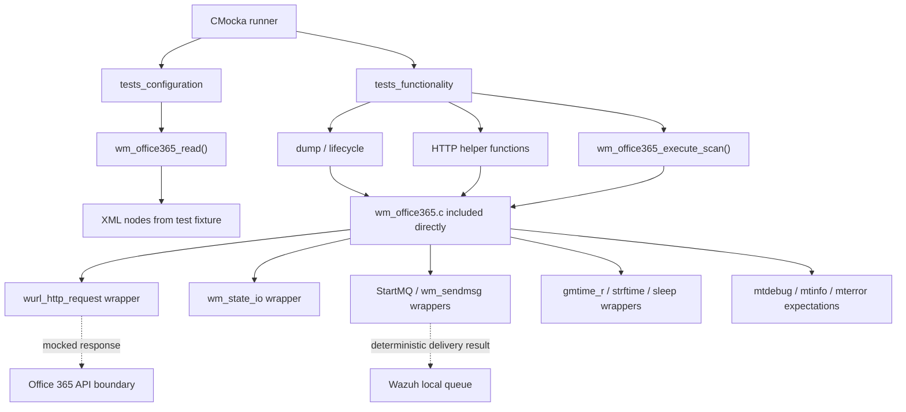
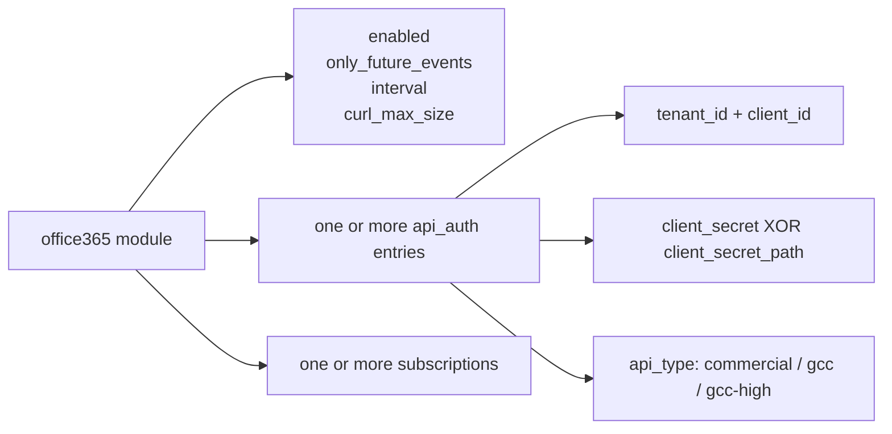
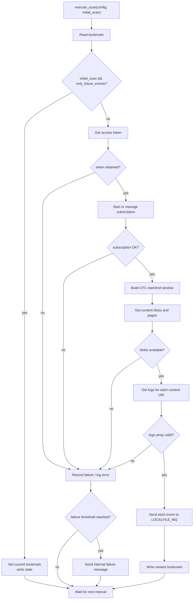

# `wm_office365_tests`

## Introduction

`wm_office365_tests` is the CMocka white-box test suite for Wazuh’s Office 365 cloud-integration module. It validates the module’s XML configuration contract, JSON configuration dump, lifecycle, OAuth authentication, Office 365 activity-feed subscription management, paginated content retrieval, state/bookmark handling, queue delivery, and retry/failure reporting.

The suite includes the production implementation directly. Consequently, it tests internal helper functions and orchestration branches without making live network requests: HTTP, time, state I/O, logging, scheduling, and Wazuh message-queue calls are replaced with wrappers and controlled return values.

For the production module’s responsibilities and deployment context, see [`wazuh_modules_core_cloud_integrations_office365.md`](wazuh_modules_core_cloud_integrations_office365.md). The test organization is closely related to [`wm_ms_graph_tests.md`](wm_ms_graph_tests.md).

## Scope and source map

| Area | Test subject | Main production surface |
|---|---|---|
| Configuration | XML tags, defaults, linked authentication/subscription entries, validation errors | `wm_office365_read()` |
| Serialization | Enabled flags, intervals, size limits, API credentials, subscriptions | `wm_office365_dump()` |
| Lifecycle | Disabled behavior, queue startup, startup/shutdown logging | `wm_office365_main()`, `wm_office365_destroy()` |
| API helpers | Token, subscription, content-blob, and blob-log requests | `wm_office365_get_access_token()`, `wm_office365_manage_subscription()`, `wm_office365_get_content_blobs()`, `wm_office365_get_logs_from_blob()` |
| Scan orchestration | Initial scan rules, time windows, pagination, event forwarding, bookmark updates | `wm_office365_execute_scan()` |
| Failure handling | Per-tenant/subscription failure tracking and threshold notifications | `wm_office365_get_fail_by_tenant_and_subscription()`, `wm_office365_scan_failure_action()` |

The relevant repository layout is:

```text
src/unit_tests/wazuh_modules/office365/
└── test_wm_office365.c
    ├── configuration tests
    ├── dump and lifecycle tests
    ├── HTTP helper tests
    ├── failure-action tests
    └── end-to-end scan tests
```

## Test architecture



### Fixtures and isolation

The functionality fixture allocates a `wm_office365` configuration and records any injected `curl_response`. The configuration fixture builds a generic Wazuh module/XML structure and calls `wm_office365_read()`. Teardown destroys the Office365 configuration and releases linked authentication and subscription nodes.

The test file includes `wm_office365.c` rather than linking only a compiled object. This exposes static/internal functions and makes the suite sensitive to implementation-level contracts such as response parsing, state tags, error text, and list ownership.

The wrappers provide deterministic control over:

- `wurl_http_request()` responses, status codes, response bodies, headers, and maximum-size flags.
- `StartMQ()`, `wm_sendmsg()`, and queue error paths.
- `wm_state_io()` reads and writes for each tenant/subscription bookmark.
- `access()` when validating `client_secret_path`.
- UTC conversion, formatted timestamps, sleeping, and debug-mode behavior.
- Expected log messages, including error classification and generated URLs.

## Configuration contract

The configuration tests establish the accepted XML model:



Important assertions include:

- Boolean fields accept `yes` and `no`; invalid content is rejected.
- `interval` accepts seconds or `s`, `m`, `h`, and `d` suffixes and is normalized to seconds. Values above one day and invalid/negative values fail.
- `curl_max_size` accepts byte values and `k`-style values, but must be at least 1 KB.
- `api_auth` is required. Tenant ID and client ID are mandatory and non-empty.
- Exactly one client-secret source is permitted. A secret path must be non-empty and accessible.
- API type selects the login and management FQDN pair. Unknown API types fail validation.
- Unknown tags, empty subscriptions, missing required fields, and empty `api_auth` blocks produce an error and a `-1` return value.
- Multiple authentication and subscription elements are preserved as linked lists.

These tests are also regression checks for error ordering and diagnostics. A parser change can be behaviorally correct yet still break callers or support tooling if it changes which missing/invalid tag is reported first.

## JSON dump and lifecycle behavior

`wm_office365_dump()` is tested with disabled/default configurations and populated configurations. The dump represents booleans as `yes`/`no`, emits API authentication and subscription arrays, and derives the public `api_type` from the configured endpoint pair. The tests also cover partially initialized list entries so serialization remains safe during diagnostics.

`wm_office365_main()` is tested along two principal paths:

1. Disabled configuration: log that Office 365 is disabled and return.
2. Enabled configuration: open `DEFAULTQUEUE` for writing, log startup, scan configured tenants/subscriptions, and report queue-start failure before returning.

Shutdown teardown expects the module-finished message and exercises destruction of all dynamically allocated configuration state.

## HTTP helper behavior

All HTTP tests use `curl_response` objects supplied by the URL wrapper. They verify both successful JSON parsing and defensive handling of transport, size, status, and syntax failures.

| Helper | Success contract | Notable error/special cases |
|---|---|---|
| `wm_office365_get_access_token()` | HTTP 200 response containing `access_token` returns a heap-allocated token | Null response, HTTP error body, malformed JSON, and maximum response size are logged and return no token; supports inline secret and secret file |
| `wm_office365_manage_subscription()` | Authenticated JSON request returns success for subscription start | Stop operation treats Office 365 `AF20024` (already stopped) as success; other API errors return failure/error text |
| `wm_office365_get_content_blobs()` | Parses content-feed response and exposes the next-page value | `AF20055` plus `NextPageUri` is treated as a pagination condition; malformed, oversized, null, and ordinary HTTP-error responses fail |
| `wm_office365_get_logs_from_blob()` | HTTP 200 JSON array is returned to the scan loop | Non-array JSON, malformed JSON, HTTP errors, null responses, and oversized responses fail |

Every authenticated request is expected to include `Content-Type: application/json` and `Authorization: Bearer <token>`. The tests also assert the common request timeout and ensure response objects are released on handled paths.

## Normal scan data flow

```mermaid
sequenceDiagram
    participant Loop as Module scan loop
    participant State as State I/O
    participant Auth as Office 365 login API
    participant Mgmt as Activity-feed management API
    participant Feed as Content-feed API
    participant Blob as Content blob API
    participant Queue as Wazuh local queue

    Loop->>State: Read tenant/subscription bookmark
    Loop->>Auth: Request OAuth access token
    Auth-->>Loop: access_token
    Loop->>Mgmt: Start subscription with Bearer token
    Mgmt-->>Loop: subscription status
    Loop->>Feed: Request content blobs for time window
    Feed-->>Loop: contentUri list / next page
    loop Each content URI and page
        Loop->>Blob: Download blob logs
        Blob-->>Loop: JSON log array
        Loop->>Queue: Send Office365 integration event
    end
    Loop->>State: Write newest bookmark
    Loop-->>Loop: Wait configured interval
```

The full-flow test asserts the generated token, subscription, and content URLs, UTC timestamp formatting, bearer headers, event payload, queue destination (`LOCALFILE_MQ`), and bookmark tag:

```text
office365-<tenant_id>-<subscription_name>
```

Events are wrapped as Office365 integration messages before being sent to the Wazuh queue. The suite checks that a content URI and subscription name are retained in the forwarded payload.

## Scan process and branches



The initial-scan test is particularly important: with `only_future_events=yes`, the module advances the bookmark and delays the first API retrieval, preventing historical activity from being replayed unexpectedly.

## Failure tracking and notifications

Failures are keyed by tenant and subscription. The tests cover lookup misses, lookup hits, appending to an empty list, and appending after existing entries. Once the configured failure condition is met, the module sends an internal JSON message through `wm_sendmsg()` containing the tenant, subscription, actor, and either the API error body or `Unknown error`.

Queue-send failure is separately asserted and must produce the expected queue diagnostic. This keeps operational failures visible without confusing them with the original Office 365 request error.

## Test organization and platform coverage

The executable registers two CMocka groups:

- `tests_configuration`: XML parsing, defaults, unit conversion, required fields, API type selection, and invalid-tag/content cases.
- `tests_functionality`: dump, lifecycle, HTTP helpers, failure tracking, initial-scan behavior, state failures, content/log retrieval, and the complete scan path.

Several startup and full-scan cases are guarded with `#ifndef WIN32`, primarily because their wrappers exercise POSIX-specific timing or file behavior. Windows coverage still includes configuration, serialization, and platform-independent helper behavior.

## Maintainer guidance

When changing `wm_office365.c` or its configuration structures:

- Update fixture teardown whenever linked-list shape or ownership changes.
- Preserve the secret-source exclusivity rule and endpoint-to-`api_type` mapping.
- Keep response-size handling distinct from malformed JSON and HTTP status errors.
- Preserve `AF20024` as an idempotent stop result and `AF20055` as a pagination condition.
- Update URL, header, state-tag, and log-message assertions when request construction intentionally changes.
- Keep bookmark writes after successful event processing so failed scans can be retried.
- Add both success and injected-wrapper failure cases for new external calls.

The suite is intentionally contract-heavy: its assertions document observable behavior between the module, Microsoft’s API, Wazuh state storage, and the local event queue.

## Related documentation

- [`wazuh_modules_core_cloud_integrations_office365.md`](wazuh_modules_core_cloud_integrations_office365.md) — production Office365 module architecture and runtime behavior.
- [`wm_ms_graph_tests.md`](wm_ms_graph_tests.md) — comparable cloud-integration test suite and fixture patterns.
- [`wazuh_modules_core_cloud_integrations_ms_graph.md`](wazuh_modules_core_cloud_integrations_ms_graph.md) — related Microsoft Graph integration.
- [`wazuh_modules_core_cloud_integrations_azure.md`](wazuh_modules_core_cloud_integrations_azure.md) — sibling Azure integration.
- [`shared_lib_system_utils_config_scheduling.md`](shared_lib_system_utils_config_scheduling.md) — shared scheduling/configuration utilities used by native modules.
- [`shared_lib.md`](shared_lib.md) — shared queue, URL, logging, filesystem, and system utility layer.
