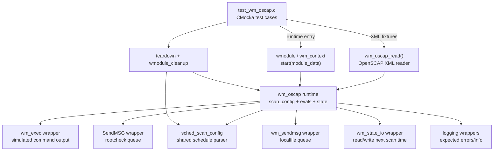
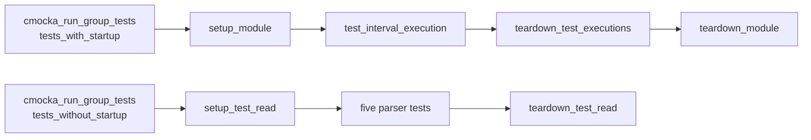
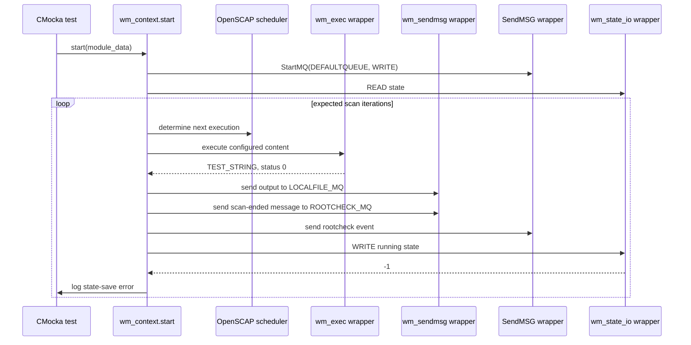
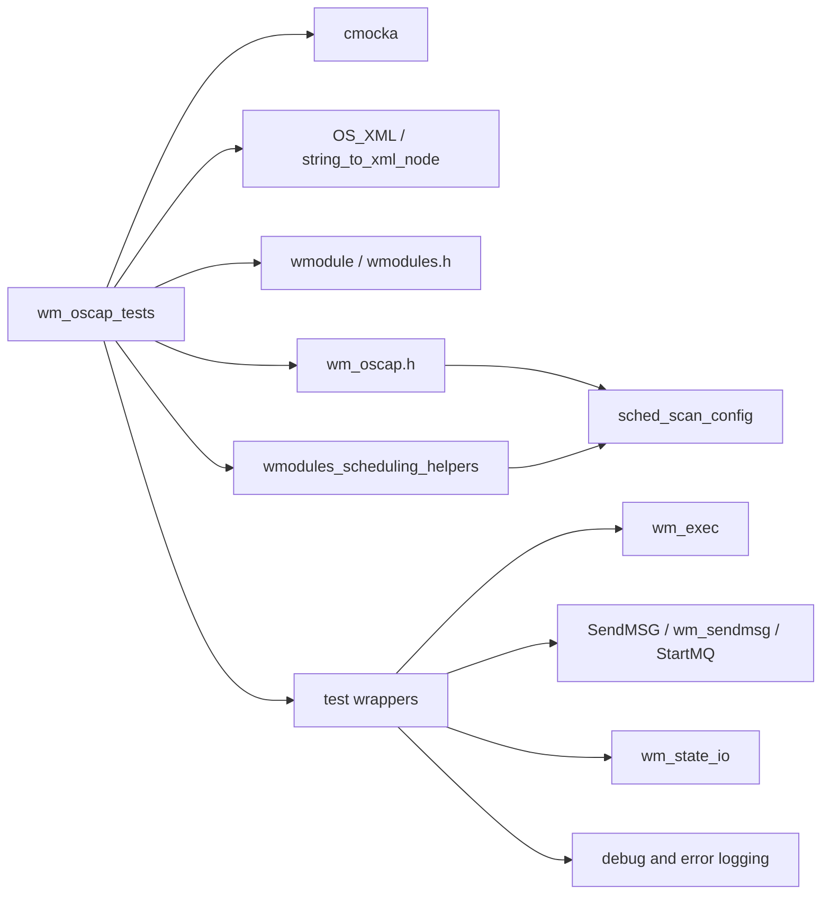
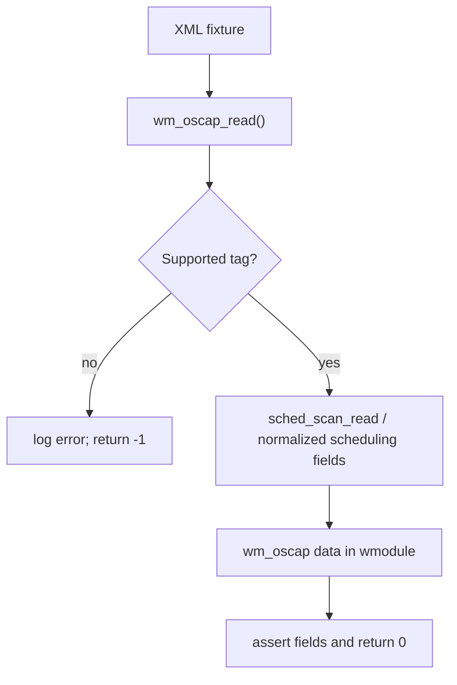
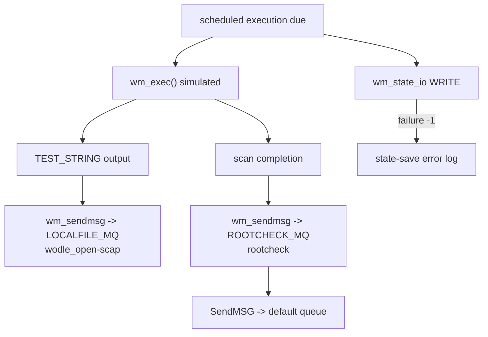

# OpenSCAP module scheduling tests (`wm_oscap_tests`)

## Introduction

`wm_oscap_tests` is the CMocka unit-test suite for the scheduling and lifecycle-facing behavior of Wazuh's OpenSCAP (`open-scap`) wodle. It exercises the module configuration reader and its scheduled execution loop without requiring a real OpenSCAP installation or a live Wazuh message queue. External behavior is isolated with wrappers for process execution, queue I/O, state persistence, logging, and the scheduler's loop condition.

The production module's data model, OpenSCAP command orchestration, queue destinations, and daemon integration are documented in [wazuh_modules_core_compliance_scanners_oscap.md](wazuh_modules_core_compliance_scanners_oscap.md). The generic module daemon contract is covered by [Wazuh_Modules_Daemon_(C).md](Wazuh_Modules_Daemon_(C).md), while the common scheduling implementation is described in [shared_lib_system_utils_config_scheduling.md](shared_lib_system_utils_config_scheduling.md).

## Scope and responsibilities

The suite validates two related surfaces:

1. **Configuration parsing without startup** — `wm_oscap_read()` accepts supported scheduling tags, populates the embedded `sched_scan_config`, and rejects unknown tags.
2. **Runtime execution after startup** — the configured module context executes repeated scans, invokes `wm_exec()`, forwards output and completion messages, persists runtime state, and releases scheduling resources.

It is deliberately not an end-to-end SCAP test. The suite does not evaluate XCCDF/OVAL content, invoke the real `oscap` binary, inspect real filesystem compliance results, or validate downstream decoders. Those responsibilities belong to the production module and the broader analysis pipeline documented in [wazuh_modules_core_compliance_scanners_oscap.md](wazuh_modules_core_compliance_scanners_oscap.md).

## Architecture



The test therefore sits between the generic module framework and the OpenSCAP implementation. It verifies calls and values at the module boundary rather than the internals of the external scanner.

## Test fixture and lifecycle

### Startup fixture

`setup_module()` allocates a `wmodule`, builds an XML document containing:

- `<timeout>1800</timeout>`;
- `<interval>12h</interval>`;
- `<scan-on-start>no</scan-on-start>`; and
- one XCCDF content entry, `ssg-centos-6-ds.xml`.

It then calls `wm_oscap_read()`, enables global `test_mode`, and returns the parser result. This fixture is used only by `test_interval_execution`, because that test starts the module through its runtime context.

`teardown_module()` disables `test_mode`, recursively frees the module data with the test-local `wmodule_cleanup()`, and releases the XML document.

### Per-test parsing fixture

`setup_test_read()` allocates a small `test_structure` containing a fresh `wmodule`. Each parsing test supplies its own XML document. `teardown_test_read()` clears XML nodes, frees `scan_config`, invokes `wmodule_cleanup()`, and releases the fixture.

### Runtime execution fixture

`setup_test_executions()` sets `wm_max_eps` to `1`, making the expected message-rate behavior deterministic. `teardown_test_executions()` frees the module's scheduler configuration. The module itself is owned by the outer startup group and is released by `teardown_module()`.



## Test groups and cases

### `test_interval_execution`

This is the only startup/runtime test. It takes the parsed module data and replaces its schedule with a one-minute interval:

| Field | Test value | Purpose |
|---|---:|---|
| `next_scheduled_scan_time` | `0` | Forces the first scan to be immediately due. |
| `scan_day` | `0` | Selects interval mode. |
| `scan_wday` | `-1` | Disables weekday scheduling. |
| `interval` | `60` seconds | Repeats the simulated scan every minute. |
| `month_interval` | `false` | Confirms non-monthly interval behavior. |

The test configures five iterations of the module loop through `__wrap_FOREVER`. For every iteration it expects:

1. `wm_exec()` to be called with an arbitrary command, timeout, and content path;
2. the simulated command output `TEST_STRING` and successful execution status;
3. `wm_sendmsg()` to forward `TEST_STRING` to `LOCALFILE_MQ` with location `wodle_open-scap`;
4. `wm_sendmsg()` to forward the completion text `Ending OpenSCAP scan. File: ssg-centos-6-ds.xml. ` to `ROOTCHECK_MQ` with location `rootcheck`; and
5. `SendMSG()` to publish the rootcheck event through the default queue.

The test also verifies that the runtime:

- opens `DEFAULTQUEUE` for writing with `StartMQ()`;
- reads persisted state using `wm_state_io(..., WM_IO_READ, ...)`;
- attempts to write state after each iteration using `wm_state_io(..., WM_IO_WRITE, ...)`;
- reports `Couldn't save running state.` when those writes return `-1`; and
- continues through the expected loop count despite the simulated state-write failures.

The test invokes `oscap_module->context->start(module_data)`, so it validates the module's public runtime entry contract rather than calling `wm_oscap_run()` directly.



### `test_fake_tag`

The fixture contains an unsupported `<fake_tag>` element. The test expects the error:

```text
No such tag 'fake_tag' at module 'open-scap'.
```

and asserts that `wm_oscap_read()` returns `-1`. This protects the module's strict XML validation behavior and prevents silent acceptance of misspelled configuration.

### `test_read_scheduling_interval_configuration`

The XML contains `<interval>90m</interval>`. The test asserts successful parsing and verifies that:

- `interval == 90 * 60` seconds;
- `scan_day == 0`;
- `scan_wday == -1`; and
- `month_interval == false`.

This confirms conversion from the human-readable interval syntax to normalized seconds.

### `test_read_scheduling_daytime_configuration`

The XML contains `<time>21:43</time>`. The test verifies that the time is retained as `21:43`, calendar fields remain unset, and the default interval remains `WM_DEF_INTERVAL`.

### `test_read_scheduling_weekday_configuration`

The XML contains `<wday>Saturday</wday>` and `<time>01:15</time>`. The shared parser normalizes Saturday to weekday index `6`, sets `scan_wday == 6`, and changes the interval to one week (`604800` seconds). The test expects the warning:

```text
Interval must be a multiple of one week. New interval value: 1w
```

### `test_read_scheduling_monthday_configuration`

The XML contains `<day>8</day>` and `<time>01:15</time>`. The test verifies `scan_day == 8`, `month_interval == true`, and `interval == 1`. It also expects the shared scheduling warning that the interval was normalized to one month:

```text
Interval must be a multiple of one month. New interval value: 1M
```

The detailed normalization rules are owned by the shared scheduler; this test checks that OpenSCAP correctly delegates to and stores those results. See [shared_lib_system_utils_config_scheduling.md](shared_lib_system_utils_config_scheduling.md).

## Dependency relationships



Important dependencies are:

| Dependency | Role in this suite |
|---|---|
| `cmocka` | Groups tests, supplies fixtures, assertions, call expectations, and return values. |
| `wm_oscap.h` / `wmodules.h` | Exposes the OpenSCAP data structures and generic module context used by the tests. |
| `wmodules_scheduling_helpers.h` | Converts compact XML strings into `OS_XML`/`XML_NODE` fixtures. |
| `sched_scan_config` | Receives normalized interval, time, weekday, and month-day settings. |
| `wm_exec` wrappers | Replace the external OpenSCAP process with deterministic output. |
| MQ wrappers | Verify queue names, locations, messages, and rate-limit-related calls. |
| `wm_state_io` wrapper | Verifies state restoration and persistence behavior. |
| logging wrappers | Assert validation errors, schedule normalization warnings, and state-save errors. |

The production relationship between these dependencies is described in [wazuh_modules_core_compliance_scanners_oscap.md](wazuh_modules_core_compliance_scanners_oscap.md) and [wazuh_modules_core_compliance_scanners.md](wazuh_modules_core_compliance_scanners.md).

## Process and data flows

### Configuration flow



The parser tests focus on the observable state after parsing, not on the implementation of `sched_scan_read()`. For example, `90m` is checked as `5400` seconds, while weekday and month-day cases check both the selected calendar field and the scheduler's normalization warning.

### Runtime output flow



This flow demonstrates that the suite tests message routing and state handling around the scan, while the external scanner itself remains mocked.

## Cleanup and ownership

The test-local `wmodule_cleanup()` mirrors the ownership shape of the OpenSCAP fixture:

1. traverse the `wm_oscap_eval` linked list;
2. free each evaluation path and node;
3. free the module data;
4. free the module tag; and
5. free the `wmodule` itself.

The production implementation should be consulted for authoritative destruction behavior; the helper exists here to isolate tests and ensure that allocated fixture data does not leak between CMocka groups. Scheduler memory is released separately with `sched_scan_free()` before module data is destroyed.

## Limitations and maintenance notes

- The supplied tests cover one XCCDF content entry and do not exercise multiple evaluation nodes or profile lists.
- The runtime test uses mocked successful command execution and does not validate command-line construction in detail.
- Queue calls are validated through wrappers; no real queue daemon or downstream analysis component is required.
- State writes are intentionally mocked to fail, so the test checks error handling rather than persistence to disk.
- `test_mode` is enabled only for the startup group and reset during teardown, preventing the runtime test from affecting parser-only tests.
- Any change to shared scheduling semantics should be reflected here when it changes normalized fields or warning text, and should also be covered in the shared scheduling tests referenced above.

## Source inventory

| Source | Contribution |
|---|---|
| `src/unit_tests/wazuh_modules/oscap/test_wm_oscap.c` | Test cases, fixtures, lifecycle cleanup, and CMocka entry point. |
| `src/wazuh_modules/wm_oscap.c` | Production OpenSCAP configuration and runtime implementation under test. |
| `src/wazuh_modules/wm_oscap.h` | `wm_oscap`, evaluation, flags, state, and context declarations. |
| `src/headers/schedule_scan.h` / `src/shared/schedule_scan.c` | Shared schedule representation and normalization. |
| `src/wazuh_modules/wmodules.c` / `wmodules.h` | Generic wodle registration and execution contract. |
| `src/unit_tests/wazuh_modules/scheduling/wmodules_scheduling_helpers.h` | XML fixture construction helpers. |
| `src/unit_tests/wrappers/...` | Deterministic process, queue, state, logging, and loop-control mocks. |
