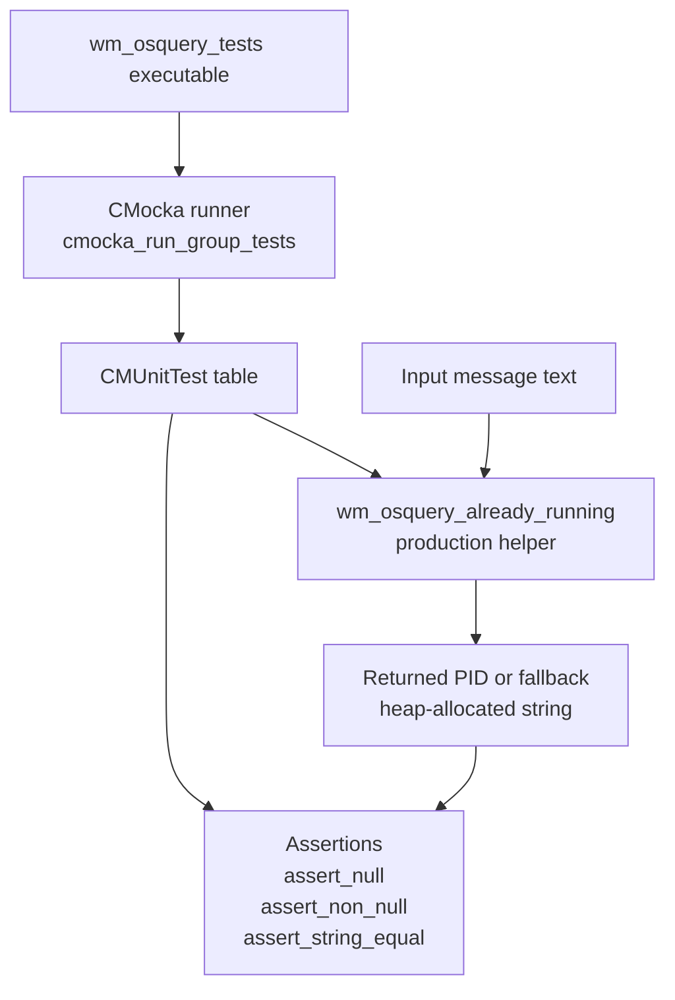
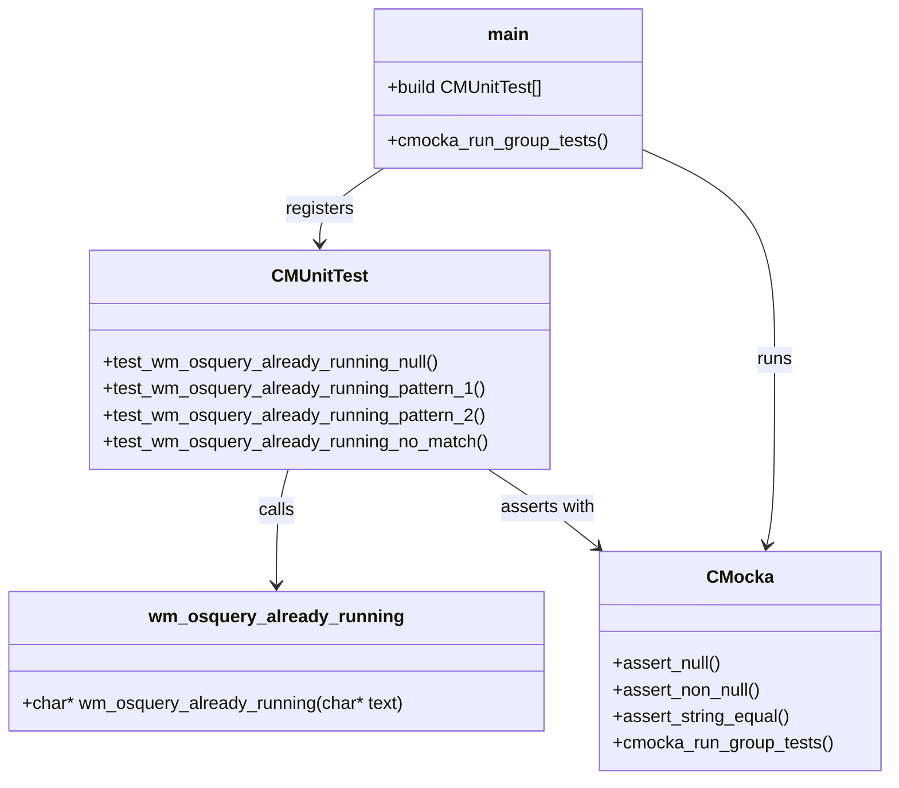
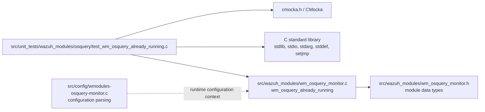
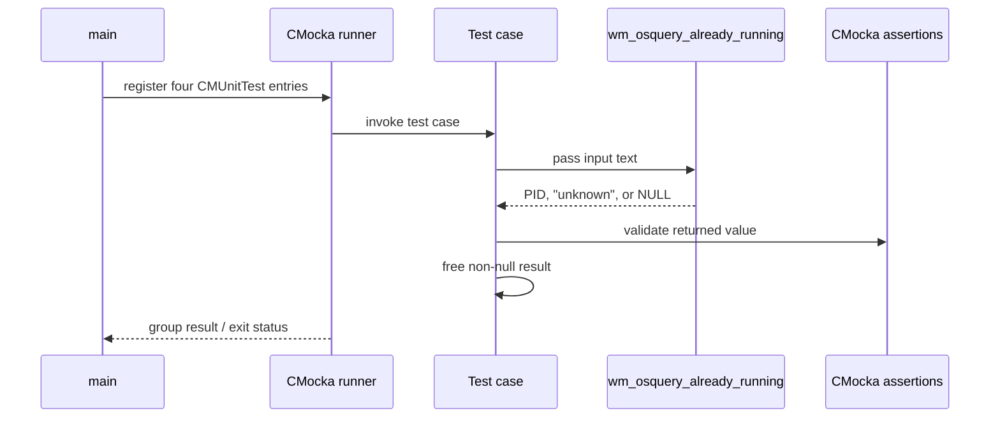
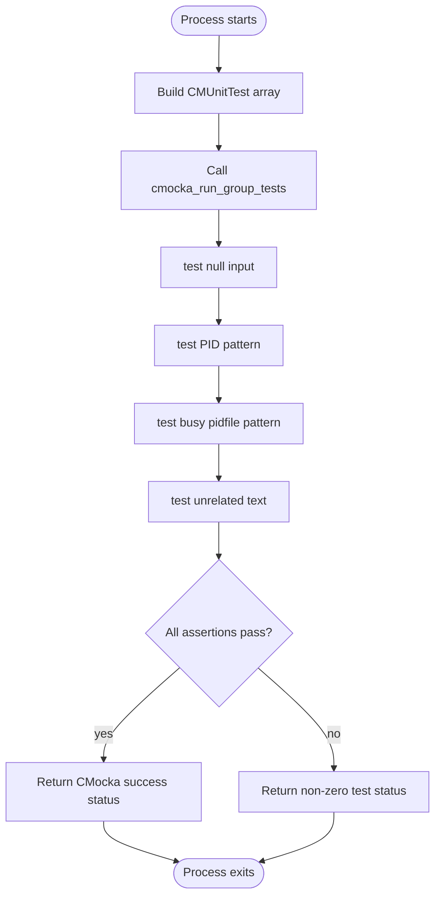
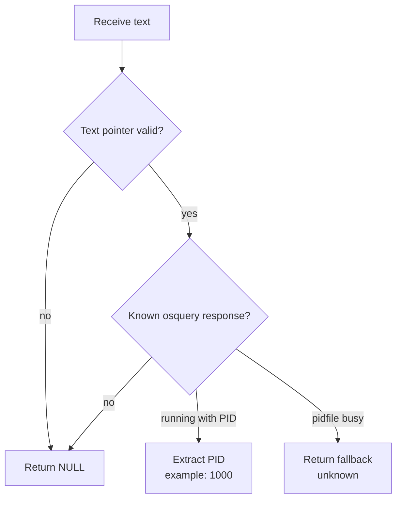

# `wm_osquery_tests`

`wm_osquery_tests` is the CMocka unit-test module for the Wazuh osquery-monitor helper `wm_osquery_already_running`. The helper interprets text returned when `osqueryd` cannot start because another instance is active, extracting a process identifier when available and returning a stable fallback when the response only reports a busy pidfile.

The module is deliberately narrow: it validates the helper's null-input, recognized-message, fallback-message, and unmatched-message behavior. Runtime configuration and daemon orchestration are documented in [Wmodules_Config_osquery_monitor.md](Wmodules_Config_osquery_monitor.md) and [wazuh_modules_core_system_management_process_integrations.md](wazuh_modules_core_system_management_process_integrations.md).

## Scope and responsibilities

The test module covers one externally visible contract:

| Input condition | Expected result | Ownership |
| --- | --- | --- |
| `NULL` input | `NULL` | `wm_osquery_already_running` |
| `osqueryd (1000) is already running` | Newly allocated string containing `1000` | `wm_osquery_already_running` |
| `Pidfile::Error::Busy` | Newly allocated string containing `unknown` | `wm_osquery_already_running` |
| Any unrelated text, such as `No match` | `NULL` | `wm_osquery_already_running` |

The tests also verify ownership expectations for successful non-null results by calling `free(output)`. The null and unmatched cases do not require deallocation.

## Architecture

The module is a standalone unit-test executable. It declares the production helper locally and links against its implementation during the test build. CMocka supplies the test runner and assertions; standard C headers provide allocation and basic runtime support.



### Component relationships

`main` constructs a fixed array of four `CMUnitTest` entries. Each entry invokes the same production helper with a different input class. The helper is the only production component under test; there are no mocks, fixtures, setup callbacks, teardown callbacks, sockets, databases, or external services in this file.



## Dependencies

### Direct source dependencies

The file includes:

- `<stdarg.h>`, `<stddef.h>`, and `<setjmp.h>` for CMocka-compatible test signatures and platform types.
- `<cmocka.h>` for `CMUnitTest`, test registration, assertions, and the runner.
- `<stdio.h>` and `<stdlib.h>` for standard C support and `free`.

The production function is introduced through the declaration:

```c
char * wm_osquery_already_running(char * text);
```

Its implementation belongs to the osquery-monitor module, represented in the module tree by `wm_osquery_monitor.c` and `wm_osquery_monitor.h`.



The configuration parser and module lifecycle are contextual dependencies, not test-time calls. This distinction prevents the unit tests from being mistaken for end-to-end osquery-monitor coverage.

## Data flow

Each test passes a mutable C string, or a null pointer, into the helper. The helper classifies the message. A recognized PID message produces a heap-allocated PID string; the busy-pidfile message produces a heap-allocated `unknown` string; all other inputs produce `NULL`.

```mermaid
flowchart LR
    I[Input: char* text]
    N{Input is NULL?}
    P{Matches running PID\npattern?}
    B{Matches busy pidfile\npattern?}
    Z[Return NULL]
    PID[Allocate and return\n"1000"-style PID text]
    U[Allocate and return\n"unknown"]
    F[Caller test frees\nnon-null result]

    I --> N
    N -- yes --> Z
    N -- no --> P
    P -- yes --> PID
    P -- no --> B
    B -- yes --> U
    B -- no --> Z
    PID --> F
    U --> F
```

The test does not inspect allocation internals or the matching algorithm. It verifies the observable result and, for successful results, that the returned pointer can be released by the caller.

## Test interaction flow

The CMocka runner executes the registered test cases as a group. The source does not define per-test setup or teardown functions, so each case creates its own input and validates its own result.



## Process flows

### Test execution lifecycle



### Classification behavior exercised by the tests



## Test case details

### `test_wm_osquery_already_running_null`

Passes `NULL` and requires a null result. This establishes defensive behavior before any string matching or allocation occurs.

### `test_wm_osquery_already_running_pattern_1`

Passes `osqueryd (1000) is already running`. It requires a non-null result equal to `1000`, then frees the result. This is the positive extraction path.

### `test_wm_osquery_already_running_pattern_2`

Passes `Pidfile::Error::Busy`. It requires a non-null result equal to `unknown`, then frees the result. This represents an active-instance response without an exposed PID.

### `test_wm_osquery_already_running_no_match`

Passes `No match` and requires a null result. This ensures arbitrary daemon output is not treated as an already-running condition.

## Coverage boundaries

The module verifies the helper's result contract, but does not cover:

- osquery monitor configuration parsing;
- osquery pack and decorator handling;
- process spawning, pidfile creation, or lifecycle cleanup;
- repeated polling, scheduling, or daemon restart behavior;
- message forwarding through Wazuh queues;
- platform-specific process inspection.

For those concerns, follow the references in [Wmodules_Config_osquery_monitor.md](Wmodules_Config_osquery_monitor.md) and [wazuh_modules_core_system_management_process_integrations.md](wazuh_modules_core_system_management_process_integrations.md). Broader module-test conventions are covered by [test_infrastructure.md](test_infrastructure.md).

## Maintenance guidance

When changing `wm_osquery_already_running`, preserve the four-way contract unless the production API intentionally changes. A change to recognized response text should update the positive or fallback fixture and its expected output. If the function changes ownership semantics, update the explicit `free(output)` calls and document the new contract in this file. If matching becomes platform-dependent, add focused cases rather than expanding this unit into daemon or integration testing.

## Source reference

Primary test source: `src/unit_tests/wazuh_modules/osquery/test_wm_osquery_already_running.c`.

Tested production symbol: `wm_osquery_already_running(char * text)`.
