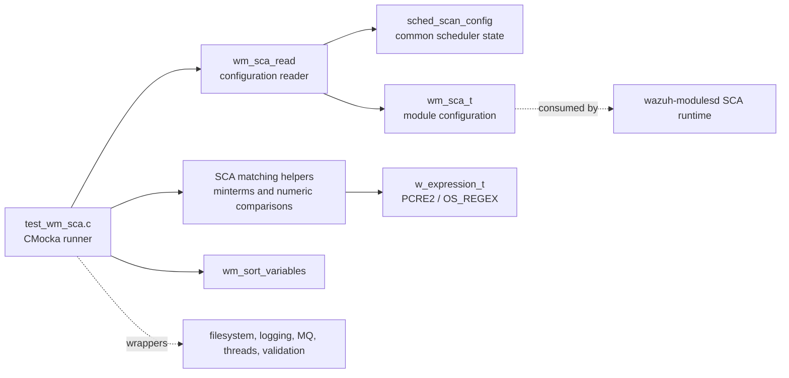
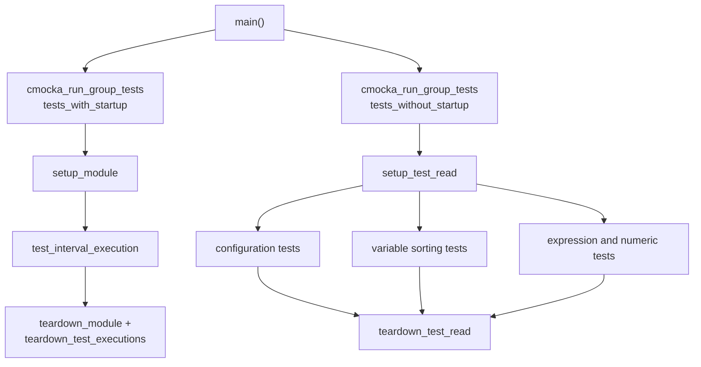
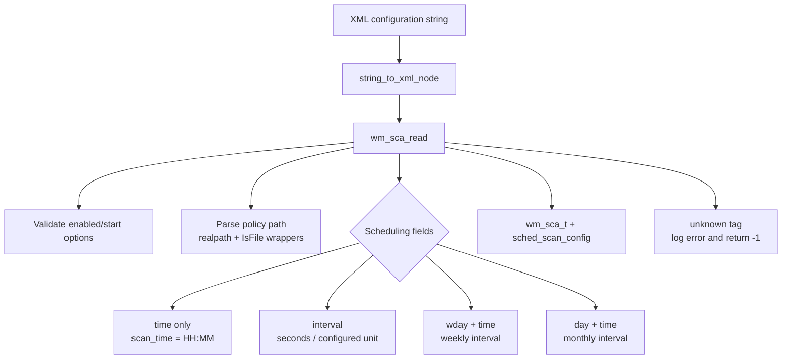
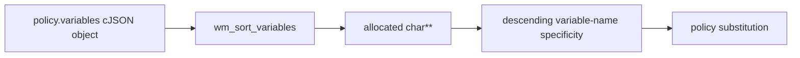
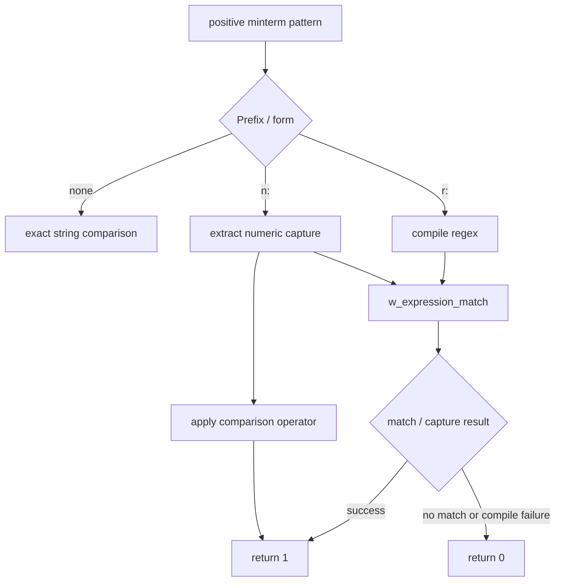
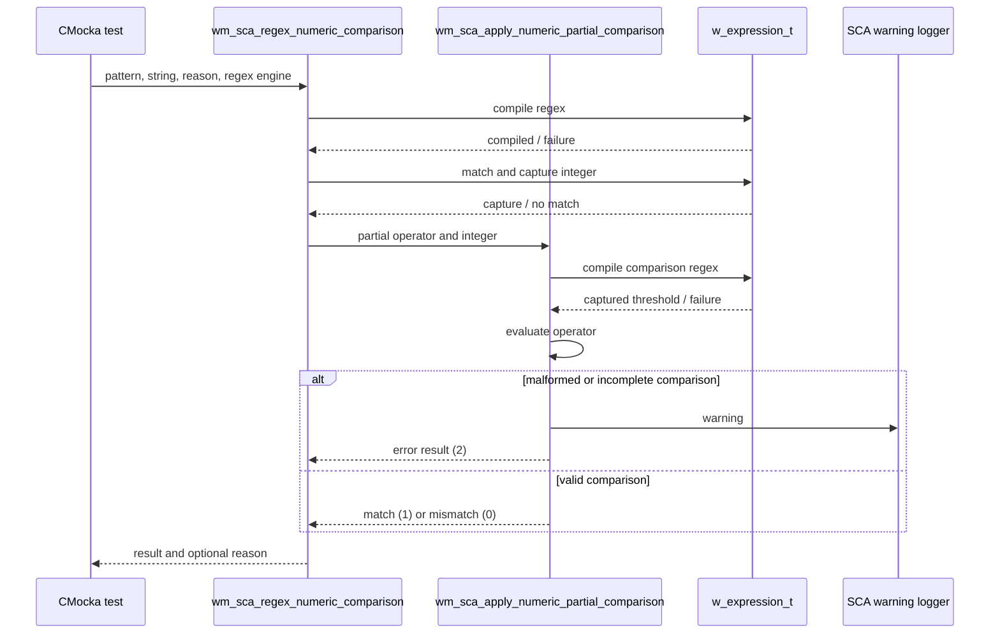
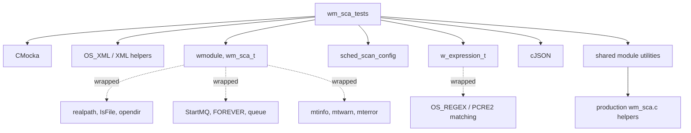
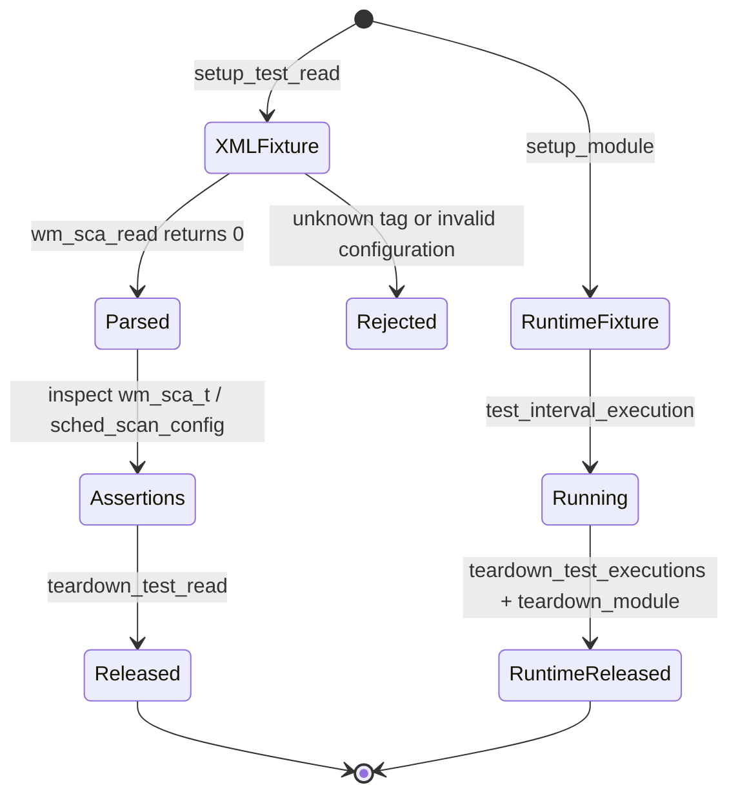

# `wm_sca_tests` module

`wm_sca_tests` is the CMocka unit-test suite for the Wazuh Security Configuration Assessment (SCA) module. It validates the module’s configuration reader, common scan scheduling modes, policy-variable ordering, positive minterm matching, and numeric comparison behavior without running a real SCA scan or depending on live policy files.

The tests exercise internal SCA helpers from `src/wazuh_modules/wm_sca.c` through the test source `src/unit_tests/wazuh_modules/sca/test_wm_sca.c`. For production behavior, policy evaluation, event generation, persistence, and runtime threads, see [SCA compliance scanner](wazuh_modules_core_compliance_scanners_sca.md). Scheduling primitives are shared with other periodic modules and documented in [system scheduling](shared_lib_system_utils_config_scheduling.md). Regex compilation and matching are delegated to the shared expression/regex layer; see [OS regex](os_regex.md).

## Position in the system

The target belongs to the Wazuh Modules unit-test area. It sits below the generic module scheduler and above the SCA implementation seams that are wrapped or scripted by CMocka.



The suite is intentionally narrower than the production module. It does not verify YAML policy loading, file/registry/process/command checks, hash persistence, alert serialization, or request/dump threads. Those behaviors are covered by the production SCA module and its surrounding integration tests.

## Test architecture

`main` creates two CMocka groups:

1. `tests_with_startup` runs `test_interval_execution` with a module-level setup and teardown. This group exercises the module start callback and its interval-driven loop.
2. `tests_without_startup` runs configuration, variable, minterm, and numeric-comparison tests. These cases use per-test fixtures where required and call internal helpers directly.



The setup functions construct only the state needed for the group. External effects are intercepted through wrappers such as `__wrap_StartMQ`, `__wrap_FOREVER`, `__wrap_w_expression_compile`, `__wrap_w_expression_match`, `__wrap_realpath`, `__wrap_IsFile`, and Wazuh logging wrappers. This makes scheduling and error paths deterministic.

## Components and responsibilities

| Component | Source or symbol | Responsibility |
|---|---|---|
| Test runner | `main`, `CMUnitTest` | Registers the two test groups and returns their aggregate status. |
| Module fixture | `setup_module`, `teardown_module` | Builds an enabled SCA `wmodule` from XML and releases its policy/module state. |
| Execution fixture | `setup_test_executions`, `teardown_test_executions` | Configures the EPS limit, scheduler state, policy hash tables, request queue, and scan allocations. |
| Read fixture | `setup_test_read`, `teardown_test_read` | Supplies a fresh XML document and `wmodule` for each configuration-reader test. |
| Scheduling tests | `test_read_scheduling_*`, `test_interval_execution` | Verify daytime, interval, weekday, month-day, and runtime interval behavior. |
| Unknown-tag test | `test_fake_tag` | Ensures unsupported SCA XML tags produce an error and a failed read. |
| Variable tests | `test_wm_sort_variables*` | Verify deterministic ordering, duplicate preservation, and NULL handling. |
| Positive-minterm tests | `test_wm_sca_test_positive_minterm*` | Verify exact matches, regex matches, and numeric-expression matches. |
| Numeric comparison tests | `test_wm_sca_regex_numeric_comparison*`, `test_wm_sca_apply_numeric_partial_comparison*` | Verify captured integers, operators, regex failures, malformed comparisons, and reason handling. |
| Test seam | `wm_sca_send_policies_scanned` | Replaces the production reporting function so scheduling can be observed without sending policy events. |

## Configuration and scheduling coverage

The reader is fed XML strings containing `<enabled>`, `<scan_on_start>`, an optional `<interval>`, `<day>`, `<wday>`, `<time>`, and `<policies>` element. The policy path is passed through wrapped `realpath` and `IsFile` calls; the host filesystem is never consulted.



### Expected normalized scheduling state

| Test | Input | Main assertions |
|---|---|---|
| `test_read_scheduling_daytime_configuration` | `<time>05:30</time>` | Default interval (`WM_DEF_INTERVAL`), no month mode, no weekday, time `05:30`. |
| `test_read_scheduling_interval_configuration` | `<interval>2h</interval>` | Interval becomes `7200` seconds; no month mode or weekday. |
| `test_read_scheduling_weekday_configuration` | `<wday>Monday</wday><time>04:30</time>` | Weekday becomes `1`; interval is normalized to `604800` seconds and a warning announces `1w`. |
| `test_read_scheduling_monthday_configuration` | `<day>7</day><time>03:30</time>` | Day becomes `7`; month mode is enabled; interval is normalized to `1` month and a warning announces `1M`. |
| `test_interval_execution` | Runtime interval of `60` seconds | Starts `DEFAULTQUEUE` for writing and enters the module start loop for three scripted dates. |
| `test_fake_tag` | Adds `<fake>invalid</fake>` | Logs `No such tag 'fake' at module 'sca'.` and returns `-1`. |

The weekday and month-day tests are important because the common scheduler requires an interval compatible with the selected calendar mode. The SCA reader corrects an implicit/default interval and emits a warning rather than leaving an invalid schedule in module state.

## Policy-variable ordering

`wm_sort_variables` receives the JSON `variables` object from a policy and returns a NULL-terminated array of variable names. The tests establish a length-oriented ordering: names with longer prefixes are placed before shorter names, which supports safe substitution when one variable name is a prefix of another.



The expected order for the representative input is:

```text
$system_root_file
$ssh_&_ssl_path
$system_root
$file
```

The suite also verifies that duplicate names are retained in the returned array and that a NULL input object returns NULL. The duplicate case documents current behavior rather than imposing uniqueness.

## Positive minterms and expression engines

`wm_sca_test_positive_minterm` supports three observable forms:

- Plain text: the pattern must exactly match the value (`test` versus `test`).
- Regex form: an `r:` pattern is compiled and matched through a supplied `w_expression_t` using either PCRE2 or OS_REGEX.
- Numeric form: an `n:` expression captures a number from the tested string and delegates the comparison to the numeric-comparison helper.



PCRE2 and OS_REGEX are both tested for successful matching and no-match behavior. PCRE2 tests additionally cover failed compilation. Numeric-expression tests use a captured `20` and compare it with `30` using `<=`, covering the extraction-plus-comparison path.

## Numeric comparison behavior

The numeric helpers separate regex extraction from operator evaluation:

1. Compile the regex portion of a numeric expression.
2. Match the tested string and capture the comparison number.
3. Parse the partial comparison (`==`, `<`, `>`, and the operators supported by the implementation).
4. Compare the captured or supplied integer.
5. Return success, mismatch, or an invalid/error result and optionally populate `reason`.



The tests explicitly cover:

- PCRE2 and OS_REGEX extraction.
- Successful and unsuccessful `<`, `>`, and `==` evaluations.
- Missing `compare` text, missing comparison text, and unsupported `!` operation.
- Regex compilation failure (`Cannot compile regex`).
- No numeric capture (`No number was captured.`).
- No comparison match (`No integer was found within the comparison ...`).
- NULL and preallocated `reason` pointers, ensuring error handling does not assume the reason buffer is absent or already populated.

The expected result convention in these tests is `1` for a satisfied comparison, `0` for a valid comparison that does not satisfy the value, and `2` for malformed or otherwise unevaluable input. The production implementation remains the source of truth for the complete operator grammar.

## Dependency and mocking model



Important isolation boundaries include:

- `__wrap_StartMQ` and `__wrap_FOREVER`: prevent a real queue connection or unbounded loop during `test_interval_execution`.
- `__wrap_w_expression_compile` and `__wrap_w_expression_match`: script regex compilation, match status, and captured text.
- `__wrap_realpath`, `__wrap_IsFile`, and `__wrap_opendir`: make policy-file validation independent of the test host.
- `__wrap__mtinfo`, `__wrap__mtwarn`, and `__wrap__mterror`: assert user-visible diagnostics and normalization warnings.
- `wm_sca_send_policies_scanned`: suppresses production policy-report emission while preserving the call boundary used by scheduling tests.

The suite also references module globals such as `request_queue`, `last_sha256`, `cis_db`, `cis_db_for_hash`, and `policies_count`. `teardown_test_executions` releases these resources, scheduler state, and hash data; failure to update this cleanup when module state changes can cause cross-test contamination or leaks.

## Lifecycle and invariants



Key invariants established by the fixture design are:

- Each read test receives a fresh `wmodule` and XML tree.
- Module-owned policy paths, tags, alert data, and policy arrays are freed exactly once.
- Scheduler state is freed after execution tests.
- Regex engines allocated by expression tests are released with `w_free_expression_t`.
- Returned variable names and cJSON objects are explicitly freed by their tests.

## Maintainer guidance

Changes to SCA XML tags or scheduling normalization should update the corresponding `test_read_scheduling_*` case and its expected warning or normalized fields. Changes to variable substitution should preserve the specificity ordering contract and the duplicate/NULL tests. Changes to regex or numeric parsing should update both the success path and the three-way result behavior (`1`, `0`, `2`), including warning text and `reason` ownership.

Changes to the SCA scan engine, event generation, integrity hashes, policy loading, or daemon threads belong in the production SCA test coverage and documentation referenced above; duplicating those details here would obscure the unit-test boundary.

## Source map

| Concern | Primary implementation | Test source |
|---|---|---|
| SCA XML configuration | `src/wazuh_modules/wm_sca.c`, `src/wazuh_modules/wm_sca.h` | `test_fake_tag`, `test_read_scheduling_*` |
| Calendar and interval scheduling | shared scheduling helpers | `test_interval_execution`, scheduling configuration tests |
| Policy variable ordering | `wm_sort_variables` in SCA implementation | `test_wm_sort_variables*` |
| Positive minterms | `wm_sca_test_positive_minterm` | `test_wm_sca_test_positive_minterm*` |
| Numeric extraction/comparison | `wm_sca_regex_numeric_comparison`, `wm_sca_apply_numeric_partial_comparison` | `test_wm_sca_regex_numeric_comparison*`, `test_wm_sca_apply_numeric_partial_comparison*` |
| Regex abstraction | shared Wazuh expression/regex layer | `os_regex.md` and wrapped expression calls |
| Full SCA runtime | `src/wazuh_modules/wm_sca.c` | [SCA compliance scanner](wazuh_modules_core_compliance_scanners_sca.md) |

