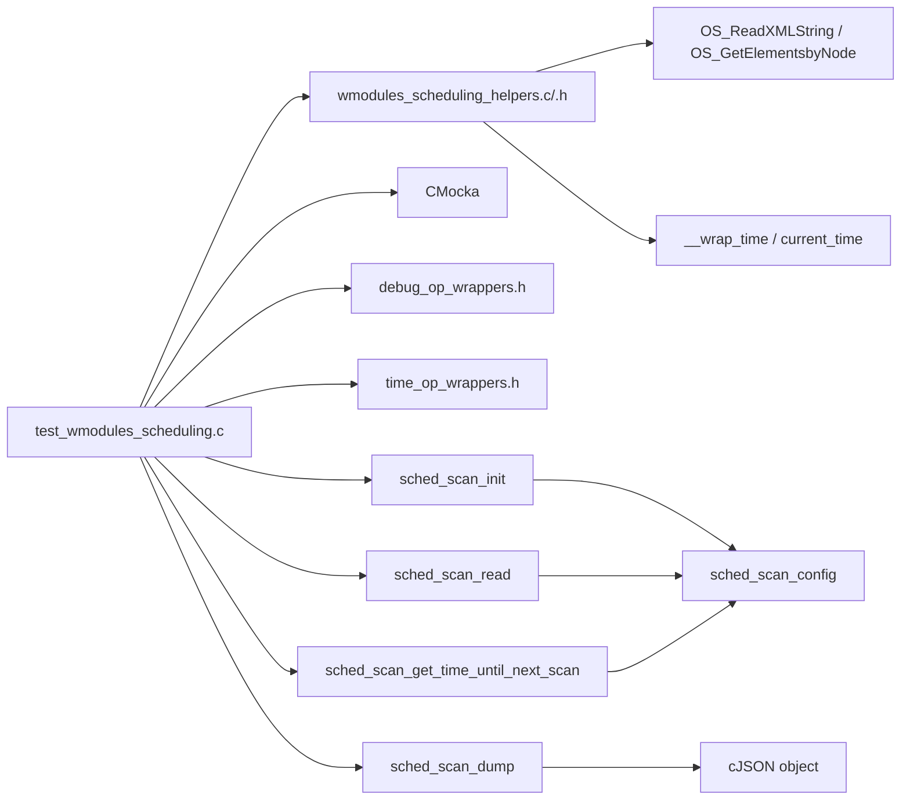
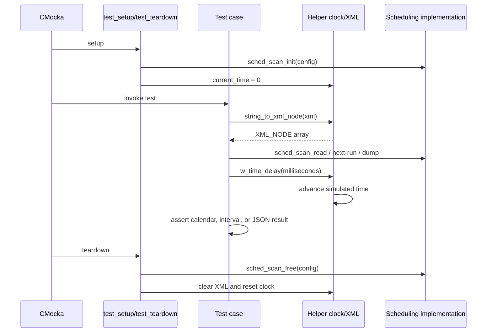
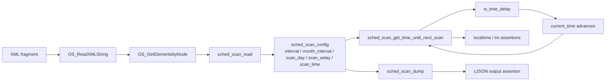
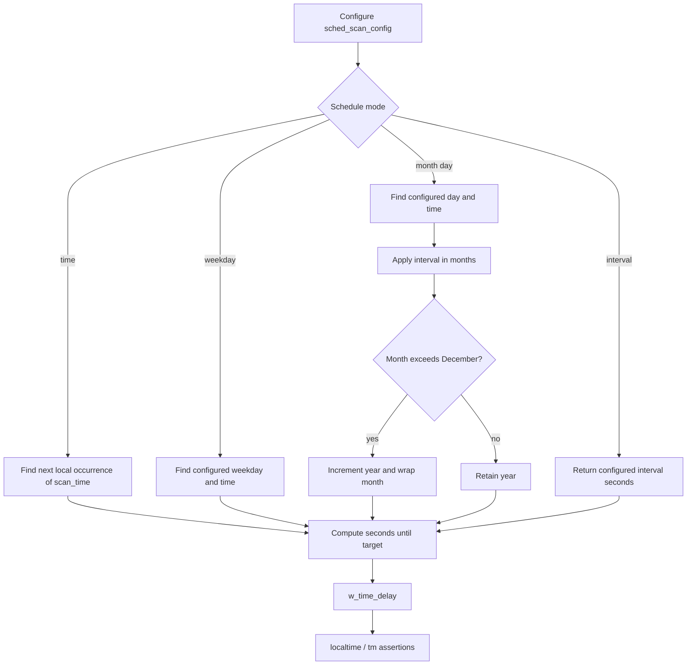
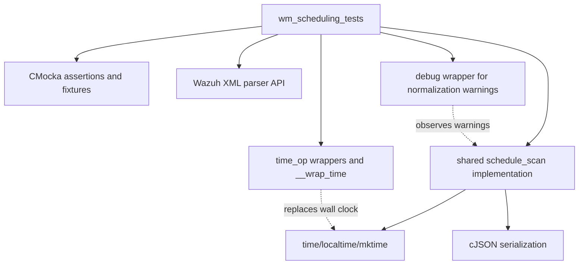

# `wm_scheduling_tests` module

`wm_scheduling_tests` is the CMocka unit-test suite for the scheduling behavior consumed by Wazuh modules. It exercises the shared `sched_scan_config` lifecycle through XML parsing, next-run calculation, simulated time advancement, and JSON dumping. The production scheduling algorithm is documented in [shared_lib_system_utils_config_scheduling](shared_lib_system_utils_config_scheduling.md); this page focuses on the module-level test harness and its coverage.

## Scope and role

| Item | Value |
|---|---|
| Test source | `src/unit_tests/wazuh_modules/scheduling/test_wmodules_scheduling.c` |
| Test helpers | `src/unit_tests/wazuh_modules/scheduling/wmodules_scheduling_helpers.c/.h` |
| Framework | CMocka (`CMUnitTest`, `cmocka_run_group_tests`) |
| Production subject | `sched_scan_init`, `sched_scan_read`, `sched_scan_get_time_until_next_scan`, `sched_scan_dump` |
| Shared implementation | `src/shared/schedule_scan.c` and `src/headers/schedule_scan.h` |
| Module-tree location | `Unit_Tests_-_Wazuh_Modules_(Cloud_Misc)` → `wm_scheduling_tests` |
| Test registration | Seven entries are declared; six are active and one is commented out |

The suite validates the observable scheduling contract used by periodic wodules such as SCA, CIS-CAT, OSCAP, cloud integrations, and other module consumers. Those consumers and their configuration readers are documented separately; see [wazuh_modules_core](wazuh_modules_core.md), [Wmodules_Config_sca](Wmodules_Config_sca.md), and [gcp_wmodules](gcp_wmodules.md).

It does not start `wazuh-modulesd`, run a module worker loop, or test platform-specific scheduling integrations. The lower-level shared suite [test_schedule_scan](test_schedule_scan.md) covers broader parser validation, defaults, daylight-saving behavior, and internal calendar helpers.

## Architecture

```mermaid
flowchart TD
    Main[main()] --> Register[CMUnitTest registration]
    Register --> Runner[cmocka_run_group_tests]
    Runner --> Setup[test_setup]
    Setup --> State[state_structure fixture]
    State --> Config[sched_scan_config]
    State --> XML[OS_XML and XML_NODE]
    Runner --> Cases[Active test cases]
    Cases --> Read[sched_scan_read]
    Cases --> Next[sched_scan_get_time_until_next_scan]
    Cases --> Dump[sched_scan_dump]
    Read --> Shared[shared/schedule_scan.c]
    Next --> Shared
    Dump --> Shared
    Cases --> Clock[w_time_delay / mocked time]
    Cases --> Assert[CMocka assertions]
    Runner --> Teardown[test_teardown]
    Teardown --> Free[sched_scan_free + XML cleanup]
```

Each test receives a fresh `state_structure`. The fixture contains the XML parser state, parsed XML nodes, and one `sched_scan_config`; this keeps configuration and simulated-time state isolated between cases.

## Component relationships



The test code calls the real scheduling functions. CMocka and wrapper headers provide control over warnings and time-related behavior, while the helper source provides an in-memory XML construction path and a deterministic clock. No scheduler wrapper replaces the production calculation itself.

## Fixture lifecycle

`test_setup` allocates the fixture with `calloc`, initializes the schedule using `sched_scan_init`, and resets the simulated clock to zero. The clock wrapper lazily selects a fixed baseline timestamp when the first time query occurs.

`test_teardown` frees the schedule, clears XML nodes and parser state, releases the fixture, and resets `current_time`. This cleanup is important because the schedule may own `scan_time`, and several tests mutate calendar fields directly rather than parsing them.



## Helper components

### `string_to_xml_node`

`string_to_xml_node` converts a short XML fragment into the `XML_NODE` array expected by `sched_scan_read`. It calls `OS_ReadXMLString` and then `OS_GetElementsbyNode`, allowing tests to express configurations such as `<interval>5m</interval>` or `<wday>tuesday</wday>` without filesystem-backed configuration.

### `init_config_from_string`

`init_config_from_string` is a convenience helper for callers that need a complete parsed `sched_scan_config`. It creates parser state, initializes the schedule, reads the XML fragment, and clears temporary XML resources before returning the configuration by value. The main suite mostly uses the explicit fixture because it must retain XML state until teardown.

### `__wrap_time` and simulated time

`__wrap_time` returns the global `current_time` instead of the host clock. If the value is zero, it initializes a stable baseline (`1606797884`). `set_current_time` can replace that baseline for boundary tests. The test cases use `w_time_delay` with milliseconds to move through the calculated sleep period, preserving the production-facing time-delay call shape while avoiding real waiting.

## Data flow: XML to schedule to assertion



The suite checks both directions of the contract: parsed configuration produces the correct delay/calendar date, and parsed configuration can be serialized into the expected normalized JSON representation.

## Test coverage

### Interval mode — `test_interval_mode`

The test parses `<interval>5m</interval>` and expects a five-minute delay (`300` seconds). It then advances the mocked clock by that interval and verifies that the next interval remains five minutes. This checks recurring interval behavior rather than only first-run initialization.

### Day-of-month mode — `test_day_of_the_month_mode`

The test constructs a monthly schedule directly with a one-month interval and `01:00` execution time. It repeats the calculation for days 3, 8, 15, and 21 and verifies that each resulting date has the configured `tm_mday`.

### Consecutive monthly execution — `test_day_of_the_month_consecutive`

This test is present in the source but commented out in `main`, so it is not currently executed. If enabled, it parses day 20 at 01:00, changes the interval to two months, advances to the first execution, and verifies that the following execution preserves the day and advances the month by two. It also expects the parser warning that normalizes a missing monthly unit to `1M`.

### Day-of-week mode — `test_day_of_the_week`

The XML configuration selects Tuesday at 01:00 with a three-week interval. After advancing beyond the first execution, the test checks both executions’ weekday and verifies a 21-day year-day displacement. The assertion intentionally reflects the implementation’s day-based calculation; year-boundary behavior is covered separately by the shared scheduling tests.

### Time-of-day mode — `test_time_of_day`

The test parses `<time>5:18</time>`, calculates the delay, advances simulated time, and asserts that the resulting local time is 05:18. This isolates daily time targeting from interval and weekday configuration.

### Parse and dump round trip — `test_parse_xml_and_dump`

The test parses Friday at 13:14, expects the scheduler’s default-week normalization warning, and serializes the result. The exact expected output is:

```json
{"interval":604800,"wday":"friday","time":"13:14"}
```

This protects the public normalized representation used by module dump/configuration paths.

### Month wraparound — `test_day_of_month_wrap_year`

The test seeds simulated time to December 5, configures a two-month schedule on day 5 at midnight, advances to the next execution, and verifies February 5 of the following year. It specifically protects both month wraparound and year increment.

### Long monthly interval — `test_day_of_month_very_long_time`

The test seeds November 1 and configures a 25-month interval on day 1 at midnight. It expects December 1 two calendar years later, validating that month arithmetic is not limited to a single-year range.

## Process flow for a calendar calculation



The diagram describes the behavior observed by this suite; detailed validation rules and internal helper functions belong to [shared_lib_system_utils_config_scheduling](shared_lib_system_utils_config_scheduling.md).

## Dependency and isolation model



The suite is deterministic because XML is created in memory, time is mocked, and warning expectations are explicit. It still uses the real calendar conversion functions (`localtime`, `mktime`) against the controlled timestamp, so the assertions cover the production date arithmetic rather than a duplicated test implementation.

## Test execution and maintenance notes

- `main` registers `test_interval_mode`, `test_day_of_the_month_mode`, `test_day_of_the_week`, `test_time_of_day`, `test_parse_xml_and_dump`, `test_day_of_month_wrap_year`, and `test_day_of_month_very_long_time`.
- `test_day_of_the_month_consecutive` is intentionally excluded by a commented registration and should not be counted as an active test until re-enabled.
- Tests that parse XML retain `OS_XML` and `XML_NODE` in the fixture so teardown can release both parser-owned allocations.
- Tests that assign `scan_time` directly rely on `sched_scan_free` to release the duplicated string.
- Warning expectations are part of the contract: normalization from a bare `<time>`/`<wday>` configuration to a weekly interval and from a bare `<day>` configuration to a monthly interval must remain visible to the test.
- When changing date arithmetic, update both boundary tests and the corresponding lower-level coverage in [test_schedule_scan](test_schedule_scan.md).

## Related documentation

- [shared_lib_system_utils_config_scheduling](shared_lib_system_utils_config_scheduling.md) — production scheduling structure, parser, validation, next-run calculation, and serialization.
- [test_schedule_scan](test_schedule_scan.md) — lower-level shared scheduling test suite.
- [wazuh_modules_core](wazuh_modules_core.md) — how module workers consume the next-scan delay.
- [Wmodules_Config_sca](Wmodules_Config_sca.md) — a representative module configuration reader that delegates schedule parsing.
- [gcp_wmodules](gcp_wmodules.md) — module-level scheduling configuration and wrapper conventions in a cloud integration.
- [test_infrastructure](test_infrastructure.md) — common CMocka and wrapper patterns used by neighboring test suites.
