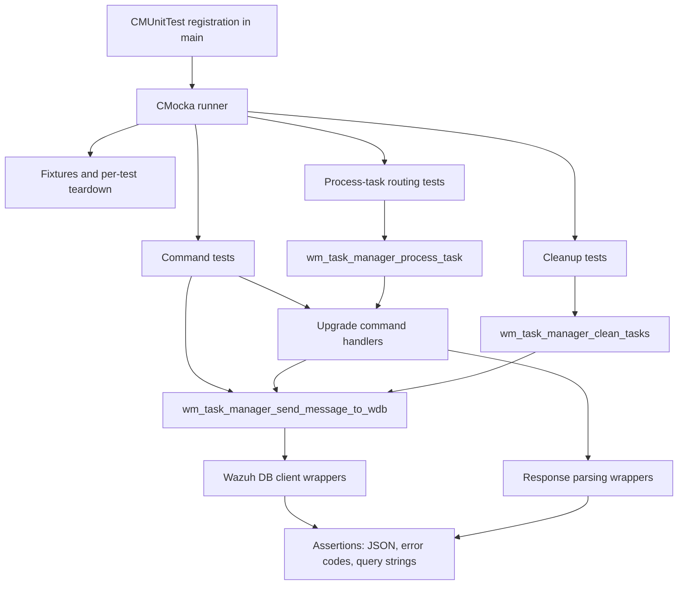
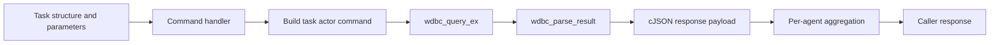
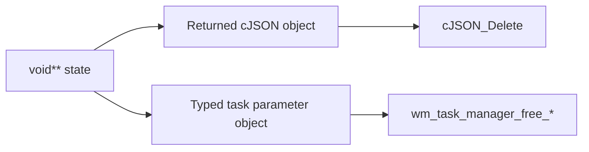
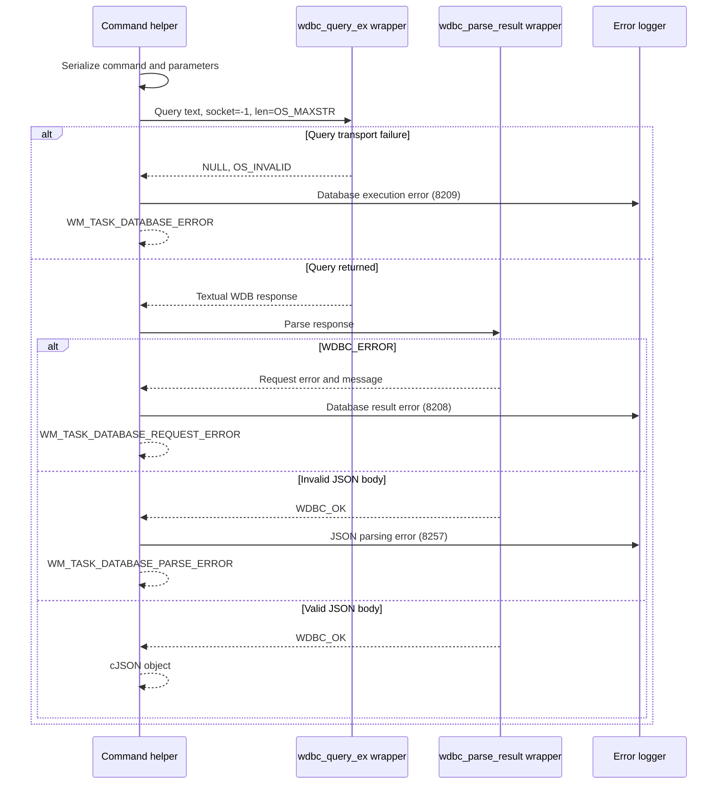
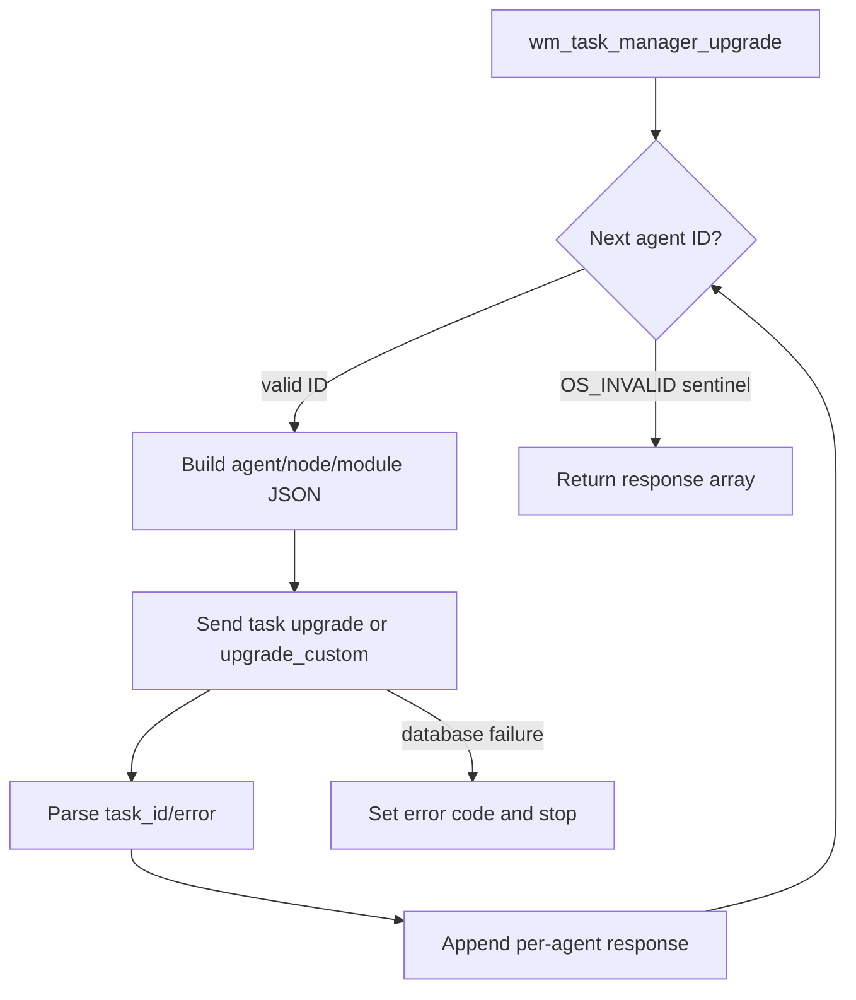
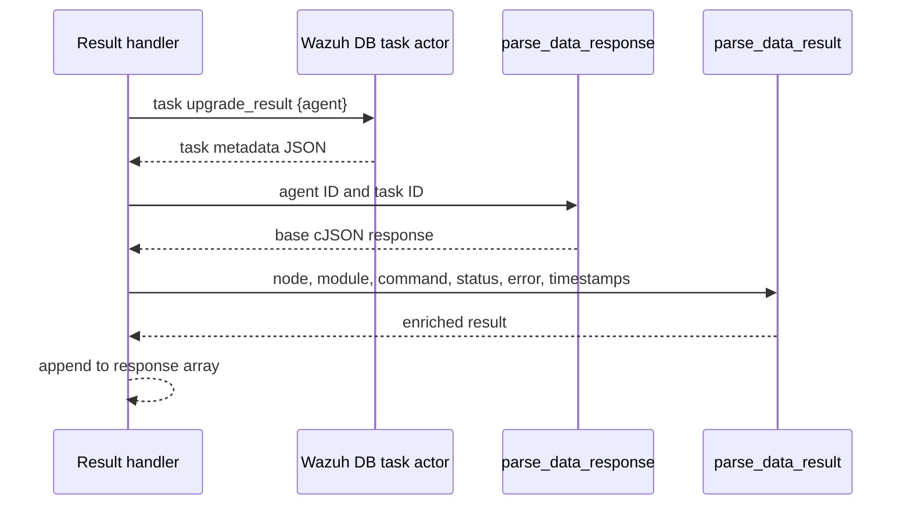
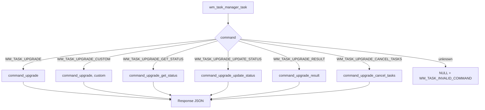
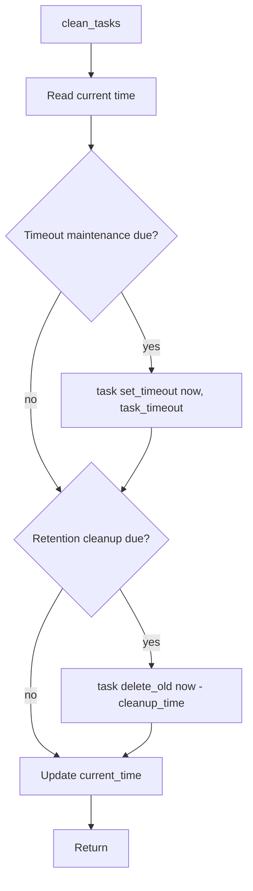
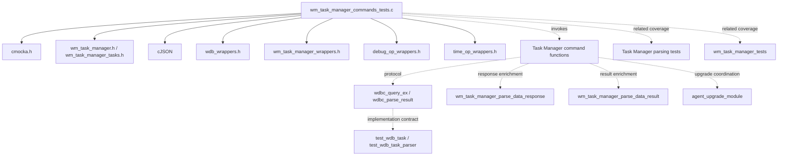

# `wm_task_manager_commands_tests` module

`wm_task_manager_commands_tests` is the CMocka unit-test suite for the command and maintenance layer of the Wazuh Task Manager module. It verifies translation between task-manager command structures, `wazuh-db` task requests, parsed database responses, per-agent result aggregation, and stale-task cleanup.

The suite calls the command implementation directly while replacing the Wazuh DB client, response parser, logging, clock, and selected task-parser helpers with deterministic wrappers. It does not test socket lifecycle or message syntax parsing in detail; socket behavior is covered by [wm_task_manager_tests](wm_task_manager_tests.md), while the companion parsing suite is `src/unit_tests/wazuh_modules/task_manager/test_wm_task_manager_parsing.c`. Overall Task Manager behavior is described in [task_manager_module](task_manager_module.md), while persistence-side behavior is covered by [test_wdb_task](test_wdb_task.md) and [test_wdb_task_parser](test_wdb_task_parser.md).

## Scope and location

| Item | Value |
|---|---|
| Test source | `src/unit_tests/wazuh_modules/task_manager/test_wm_task_manager_commands.c` |
| Test framework | CMocka (`CMUnitTest`, `cmocka_run_group_tests`) |
| Module-tree location | `Unit_Tests_-_Wazuh_Modules_(Cloud_Misc)` → `wm_task_manager_commands_tests` |
| Primary production area | `src/wazuh_modules/task_manager/` |
| Main external boundary | Wazuh DB task actor through `wdbc_query_ex` |
| Registered cases | 31 |

The test file is organized into seven behavioral groups:

1. `wm_task_manager_send_message_to_wdb` protocol handling.
2. `wm_task_manager_command_upgrade` and custom upgrade commands.
3. `wm_task_manager_command_upgrade_get_status` status retrieval.
4. `wm_task_manager_command_upgrade_update_status` status persistence.
5. `wm_task_manager_command_upgrade_result` result retrieval.
6. `wm_task_manager_command_upgrade_cancel_tasks` cancellation.
7. `wm_task_manager_process_task` routing and `wm_task_manager_clean_tasks` maintenance.

## Architecture

The suite tests the command layer as a narrow adapter:

The Wazuh DB daemon and agent-upgrade implementation are not linked as live services during these tests. Their contracts are represented by wrappers and scripted responses. This makes the suite deterministic and keeps database schema and package-transfer details in their own test/documentation areas.

## Fixtures and ownership

`setup_config` allocates a zeroed `wm_task_manager` object for cleanup tests. `teardown_config` releases it with `os_free`.

The command tests allocate parameter structures with the production constructors, populate node/module/status/agent fields, and register a matching teardown function. The cleanup functions follow the two-pointer CMocka state convention:

The relevant teardown functions are `teardown_jsons`, `teardown_json_task`, `teardown_json_upgrade_task`, `teardown_json_upgrade_get_status_task`, `teardown_json_upgrade_update_status_task`, `teardown_json_upgrade_result_task`, and `teardown_json_upgrade_cancel_tasks_task`. They ensure that the test verifies ownership-compatible return values without leaking the generated JSON or command parameters.

## Wazuh DB request contract

`wm_task_manager_send_message_to_wdb` serializes a command and cJSON parameter object into a textual task request. The tests establish the exact shape of the request:

| Operation | Representative request |
|---|---|
| Start upgrade | `task upgrade {"agent":35,"node":"node02","module":"upgrade_module"}` |
| Start custom upgrade | `task upgrade_custom {"agent":35,"node":"node02","module":"upgrade_module"}` |
| Get status | `task upgrade_get_status {"agent":35,"node":"node02"}` |
| Update status | `task upgrade_update_status {"agent":35,"node":"node02","status":"Done"}` |
| Update status with error | `task upgrade_update_status {"agent":45,"node":"node02","status":"Failed","error_msg":"Error message"}` |
| Get result | `task upgrade_result {"agent":35}` |
| Cancel tasks | `task upgrade_cancel_tasks {"node":"node02"}` |
| Set timeout | `task set_timeout {"now":123456789,"interval":850}` |
| Delete old tasks | `task delete_old {"timestamp":123455789}` |

Every request is expected to use the invalid/default socket handle (`-1`) and `OS_MAXSTR` as the maximum response length. A successful Wazuh DB response has the form `ok {JSON}`. The helper then calls `wdbc_parse_result` and returns the parsed JSON object to the command handler.

### Transport, protocol, and payload errors

The four `send_message_to_wdb` tests distinguish failure layers:

| Test | Simulated condition | Expected result |
|---|---|---|
| `test_wm_task_manager_send_message_to_wdb_ok` | Valid `ok` response with task ID | JSON object and error code `0` |
| `test_wm_task_manager_send_message_to_wdb_parse_err` | Valid WDB envelope but malformed JSON body | `NULL`, `WM_TASK_DATABASE_PARSE_ERROR` |
| `test_wm_task_manager_send_message_to_wdb_request_err` | `wdbc_parse_result` returns `WDBC_ERROR` | `NULL`, `WM_TASK_DATABASE_REQUEST_ERROR` |
| `test_wm_task_manager_send_message_to_wdb_response_err` | Query returns `NULL`/`OS_INVALID` | `NULL`, `WM_TASK_DATABASE_ERROR` |

This separation is important to callers: a database transport failure is not the same as a task-not-found response or malformed task data. The underlying task actor and parser are documented in [wazuh_db_command_parser](wazuh_db_command_parser.md).

## Command handlers

### Upgrade and custom upgrade

`wm_task_manager_command_upgrade` accepts a `wm_task_manager_upgrade` structure containing a node, module, and sentinel-terminated agent ID array. It sends one Wazuh DB request per agent and appends each parsed result to a cJSON array. The custom path is selected by `WM_TASK_UPGRADE_CUSTOM` and changes only the task actor command from `upgrade` to `upgrade_custom`.

The success tests use agents `35`, `45`, and `49` and verify task IDs returned by Wazuh DB. Database errors (`{"error":-1}`) and a NULL query response map to `WM_TASK_DATABASE_ERROR`.

### Status retrieval

`wm_task_manager_command_upgrade_get_status` sends `upgrade_get_status` for every requested agent and includes the node. The response parser receives the returned status, such as `In progress`, and an invalid task ID because this operation is status-oriented rather than task-ID creation.

### Status update

`wm_task_manager_command_upgrade_update_status` sends the node, agent, and status, optionally adding `error_msg`. A Wazuh DB task error (`{"error":-2}`) is passed to the response parser as `WM_TASK_DATABASE_NO_TASK`; the handler still returns the parser-produced response and leaves the top-level command error at success when the response is representable. This distinction tests the difference between a task-level result and a command/database transport failure.

### Result retrieval

`wm_task_manager_command_upgrade_result` sends `upgrade_result` per agent. A successful response contains task metadata—task ID, node, module, command, creation/update timestamps, status, and error text. The handler first creates the base per-agent response and then invokes `wm_task_manager_parse_data_result` to enrich it.

The not-found test uses `{"error":-2}` and expects `WM_TASK_DATABASE_NO_TASK` to reach the response parser, while the command remains able to return a structured per-agent result. A transport-level NULL response remains `WM_TASK_DATABASE_ERROR`.

### Cancel pending tasks

`wm_task_manager_command_upgrade_cancel_tasks` sends one node-only request to `upgrade_cancel_tasks`. The successful response has no task ID or agent ID; the parser is called with both set to `OS_INVALID`. The handler returns the parser-generated object directly rather than an array, matching the node-scoped nature of cancellation.

## Task routing

`wm_task_manager_process_task` dispatches a `wm_task_manager_task` based on its `command` discriminator and delegates to the corresponding command handler.

The six successful process tests confirm that each command reaches the expected handler and preserves the response shape: arrays for per-agent upgrade/status/result operations and a direct object for cancellation. `test_wm_task_manager_process_task_command_err` confirms that `WM_TASK_UNKNOWN` returns NULL with `WM_TASK_INVALID_COMMAND`.

## Cleanup and timeout maintenance

`wm_task_manager_clean_tasks` uses the configured `cleanup_time` and `task_timeout` values together with the current clock. It may perform two independent Wazuh DB operations:

1. `set_timeout` marks long-running tasks as timed out.
2. `delete_old` removes records older than the retention cutoff.

The three tests cover the scheduling branches:

| Test | Clock scenario | Expected DB operations |
|---|---|---|
| `test_wm_task_manager_clean_tasks` | Both maintenance intervals are due | `set_timeout`, then `delete_old`; `current_time = now + task_timeout` |
| `test_wm_task_manager_clean_tasks_timeout` | Timeout cycle is not yet due but prior timeout state advances the clock | `set_timeout`; preserves the advanced `current_time` |
| `test_wm_task_manager_clean_tasks_clean` | Retention cleanup is due while timeout work is not | `delete_old`; preserves the later current time |

The clock is wrapped through `__wrap_time`, so the tests validate scheduling without waiting. Database-side cleanup semantics belong to [test_wdb_task](test_wdb_task.md).

## Test-to-component dependency map

The wrapper headers identify the seams explicitly:

- `wdb_wrappers.h` scripts query text, response text, parser status, and transport return codes.
- `wm_task_manager_wrappers.h` scripts response parsing and result enrichment.
- `debug_op_wrappers.h` verifies diagnostic messages for malformed or failed Wazuh DB interactions.
- `time_op_wrappers.h` controls cleanup scheduling.

## Maintenance guidance

- Update exact query-string assertions when task actor names or JSON field ordering changes.
- Preserve sentinel-terminated agent arrays (`OS_INVALID`) in new fixtures and ensure the matching production free function is used in teardown.
- Keep transport, Wazuh DB request, task-level, and JSON parse errors as separate cases; callers depend on these error-code distinctions.
- Add a command-routing test whenever a new `command_list` value is introduced.
- Update cleanup tests if timeout or retention scheduling changes, especially the expected `current_time` behavior.
- Keep database schema or SQL assertions in [test_wdb_task](test_wdb_task.md); this suite should verify the Task Manager protocol contract rather than duplicate SQLite implementation tests.

## Execution

The file defines its own CMocka executable entry point. In a build configured for Wazuh unit tests, run the generated `wm_task_manager_commands_tests` target or invoke the repository’s standard unit-test runner for the `wazuh_modules/task_manager` test group. The test executable requires no running Wazuh DB daemon because all database communication is wrapped.
