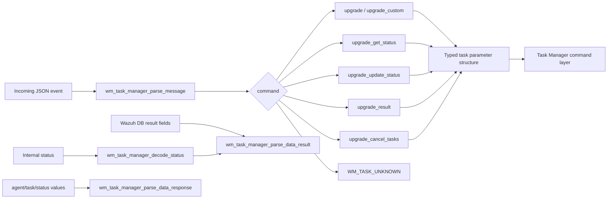
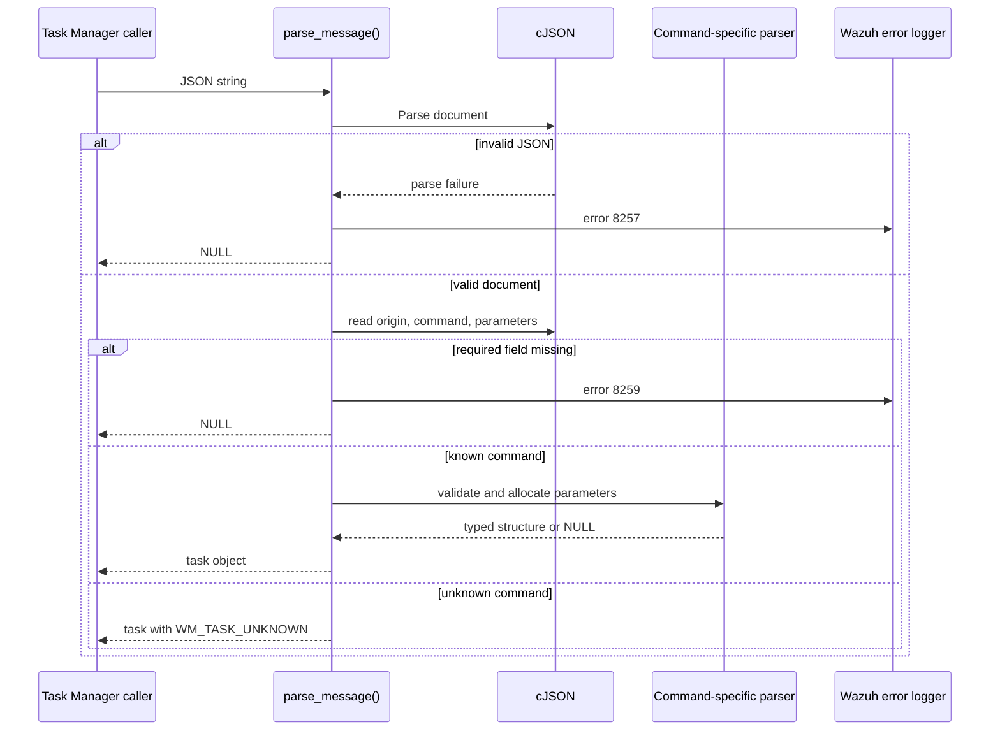
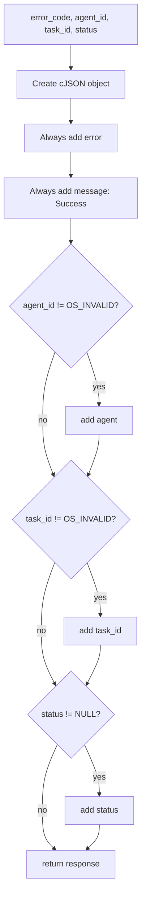
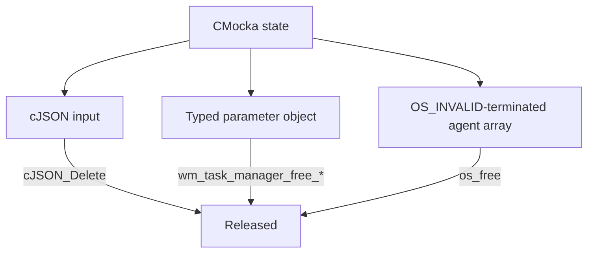
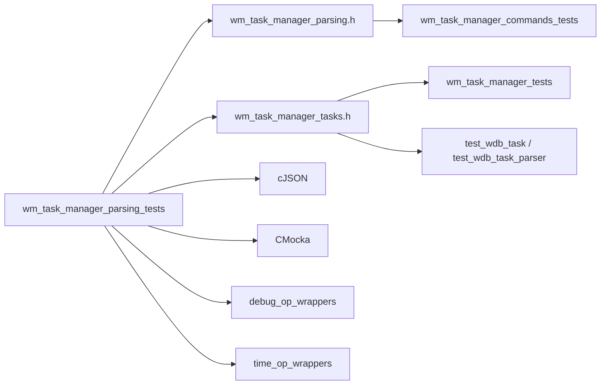

# `wm_task_manager_parsing_tests` module

`wm_task_manager_parsing_tests` is the CMocka unit-test suite for the Wazuh Task Manager’s JSON parsing and response-formatting boundary. It verifies that task-manager messages are converted into typed task structures, that upgrade-related parameters are validated, that task results are serialized consistently, and that human-readable status values are normalized.

The suite exercises parser functions directly and uses logging/time wrappers to make failures deterministic. Task execution, database command handling, and socket lifecycle are covered by the companion [wm_task_manager_commands_tests](wm_task_manager_commands_tests.md), [wm_task_manager_tests](wm_task_manager_tests.md), and [test_wdb_task](test_wdb_task.md) modules. The production role of the task subsystem is described in [task_module](task_module.md).

## Scope and location

| Item | Value |
|---|---|
| Test source | `src/unit_tests/wazuh_modules/task_manager/test_wm_task_manager_parsing.c` |
| Framework | CMocka (`CMUnitTest`, `cmocka_run_group_tests`) |
| Primary production header | `src/wazuh_modules/task_manager/wm_task_manager_parsing.h` |
| Related task structures | `src/wazuh_modules/task_manager/wm_task_manager_tasks.h` |
| Main concerns | JSON message parsing, parameter validation, response shaping, status decoding |
| External controls | cJSON ownership, Wazuh logging, timestamp conversion |

## Architecture

The file tests the parser layer in isolation. A typical request is parsed in three stages:

1. `wm_task_manager_parse_message` parses the JSON document and requires `origin`, `command`, and `parameters`.
2. The command selects a specialized parameter parser, which validates required fields and allocates a typed structure.
3. The command layer later uses the typed structure to call Wazuh DB or agent-upgrade operations; those consumers are documented elsewhere rather than re-tested here.

## Component responsibilities

| Function or fixture | Responsibility |
|---|---|
| `wm_task_manager_parse_message` | Parse an event, validate its top-level envelope, map command strings to `WM_TASK_*`, and attach typed parameters. |
| `wm_task_manager_parse_ids` | Convert a JSON array of numeric agent IDs into an `OS_INVALID`-terminated C array. |
| `wm_task_manager_parse_upgrade_parameters` | Validate `origin.name`, `origin.module`, and `parameters.agents` for upgrade commands. |
| `wm_task_manager_parse_upgrade_get_status_parameters` | Validate node and agent IDs for status queries. |
| `wm_task_manager_parse_upgrade_update_status_parameters` | Validate node, agent IDs, and status; preserve optional `error_msg`. |
| `wm_task_manager_parse_upgrade_result_parameters` | Validate and convert agent IDs for result queries. |
| `wm_task_manager_parse_upgrade_cancel_tasks_parameters` | Build a node-scoped cancellation request from `origin.name`. |
| `wm_task_manager_parse_data_response` | Build the standard `{error,message,agent,task_id,status}` response envelope, omitting invalid optional identifiers. |
| `wm_task_manager_parse_data_result` | Add task metadata and formatted timestamps to a response; decode legacy statuses for `upgrade_result`. |
| `wm_task_manager_decode_status` | Map internal statuses to API-facing text, returning `NULL` for unknown values. |
| `teardown_*` fixtures | Release cJSON trees, sentinel arrays, and each typed parameter structure according to its production free function. |

## Message parsing and command routing

The successful message tests cover six recognized command strings:

| JSON command | Enum asserted | Parameter type |
|---|---|---|
| `upgrade` | `WM_TASK_UPGRADE` | `wm_task_manager_upgrade` |
| `upgrade_custom` | `WM_TASK_UPGRADE_CUSTOM` | `wm_task_manager_upgrade` |
| `upgrade_get_status` | `WM_TASK_UPGRADE_GET_STATUS` | `wm_task_manager_upgrade_get_status` |
| `upgrade_update_status` | `WM_TASK_UPGRADE_UPDATE_STATUS` | `wm_task_manager_upgrade_update_status` |
| `upgrade_result` | `WM_TASK_UPGRADE_RESULT` | `wm_task_manager_upgrade_result` |
| `upgrade_cancel_tasks` | `WM_TASK_UPGRADE_CANCEL_TASKS` | `wm_task_manager_upgrade_cancel_tasks` |

An unrecognized command still produces a task object, but sets its command to `WM_TASK_UNKNOWN` and leaves `parameters` `NULL`. Missing or malformed envelope fields are hard failures: the parser logs an error under `wazuh-modulesd:task-manager` and returns `NULL`.

### Validation behavior

The tests establish the required-field and type contracts:

- `origin.name` is the target node for all node-scoped commands.
- `origin.module` is required by `upgrade` and `upgrade_custom`.
- `parameters.agents` must be a non-empty JSON array containing only numbers.
- `parameters.status` is required by `upgrade_update_status`.
- `parameters.error_msg` is optional and is retained when present.
- Agent arrays are copied into heap memory and terminated with `OS_INVALID` (`-1` in the fixtures).
- Missing fields and invalid array elements generate specific error-log expectations and return `NULL`.

`test_wm_task_manager_parse_ids_agents_empty_err` treats an empty array as invalid. `test_wm_task_manager_parse_ids_agents_type_err` confirms that mixed numeric/string arrays are rejected rather than partially converted.

## Response construction

### Per-agent response envelope

`wm_task_manager_parse_data_response` always emits `error` and `message`. The tests verify that `message` is `"Success"` for the supplied error code and that `agent`, `task_id`, and `status` are conditional:

The omission rules are important for node-scoped cancellation and responses where the database has not assigned a task ID or agent ID.

### Detailed task result

`wm_task_manager_parse_data_result` conditionally adds `node`, `module`, `command`, `status`, `error_msg`, `create_time`, and `update_time`. Integer timestamps are converted through `w_get_timestamp`; the tests replace that dependency with `__wrap_w_get_timestamp` and assert exact output strings.

| Input condition | Expected output |
|---|---|
| Valid create and update times | Both formatted timestamp fields are present. |
| `create_time == OS_INVALID` | `create_time` is omitted. |
| `last_update == 0` or `OS_INVALID` | `update_time` is omitted. |
| `error == NULL` | `error_msg` is omitted. |
| Any nullable text field is `NULL` | Its response property is omitted. |
| `req_command == "upgrade_result"` and status is `Legacy` | Status becomes the explanatory legacy-upgrade message. |

The tests for missing node/module/command/status ensure that the formatter does not manufacture empty strings or JSON null values; absent inputs remain absent.

## Status normalization

`wm_task_manager_decode_status` translates internal task states into stable user-facing text:

| Internal status | Decoded text |
|---|---|
| `Done` | `Updated` |
| `Pending` | `In queue` |
| `In progress` | `Updating` |
| `Failed` | `Error` |
| `Cancelled` | `Task cancelled since the manager was restarted` |
| `Timeout` | `Timeout reached while waiting for the response from the agent, check the result manually on the agent for more information` |
| `Legacy` | `Legacy upgrade: check the result manually since the agent cannot report the result of the task` |
| Unknown value | `NULL` |

The decoder is used directly by the status tests and indirectly by `parse_data_result` for upgrade-result responses.

## Ownership and teardown model

The suite uses CMocka state slots to keep inputs and returned allocations together. This is especially important for parser tests because production constructors allocate strings and sentinel arrays.

The helper teardown functions are:

- `teardown_json`: frees one cJSON object.
- `teardown_json_array`: frees JSON plus a parsed ID array.
- `teardown_json_upgrade_*_task`: frees JSON plus the matching upgrade parameter structure.
- `teardown_task`: calls `wm_task_manager_free_task`, which releases the command-specific parameter object.

Tests that expect a parser failure still register teardown handlers; those handlers tolerate `NULL`, making failure-path cleanup part of the contract.

## Test organization and coverage

`main` registers the suite in functional groups:

1. Status decoding.
2. Basic response construction.
3. Detailed result formatting.
4. Generic response wrapping for array and object data.
5. Command-specific parameter parsing.
6. Agent-ID array conversion.
7. Complete message parsing and invalid-envelope handling.

The suite covers both positive and negative paths. Negative cases assert not only `NULL` returns, but also the exact logger tag and error text for malformed messages and missing fields. This protects operational diagnostics as well as parser behavior.

## Dependency map

The parser suite deliberately stops before command execution. For downstream behavior, follow these references:

- [wm_task_manager_commands_tests](wm_task_manager_commands_tests.md) for command dispatch, Wazuh DB requests, result aggregation, and cleanup of stale tasks.
- [wm_task_manager_tests](wm_task_manager_tests.md) for queue initialization, socket processing, lifecycle, and dispatch error mapping.
- [test_wdb_task](test_wdb_task.md) and [test_wdb_task_parser](test_wdb_task_parser.md) for persistence and Wazuh DB task-command parsing.
- [task_module](task_module.md) for the API/framework read path that exposes task status.

## Maintenance guidance

- Keep command strings, `WM_TASK_*` values, and typed parameter structures synchronized when adding a new task command.
- Preserve the `OS_INVALID` sentinel in every parsed agent array and use the matching production free function in new teardown fixtures.
- Add both missing-field and wrong-type tests for every new required JSON property.
- Preserve omission semantics for invalid IDs and nullable result fields; callers distinguish absent fields from empty values.
- Keep timestamp conversion mocked in unit tests so assertions remain independent of wall-clock time and locale.
- Update the status table and decoder tests whenever an internal status or API-facing message changes.

## Execution

The test is built as part of the Wazuh unit-test targets. When running the generated test binary directly, success is reported through CMocka’s normal group-test exit status. The suite has no external service requirement because JSON, logging, and timestamp dependencies are controlled by fixtures and wrappers.
