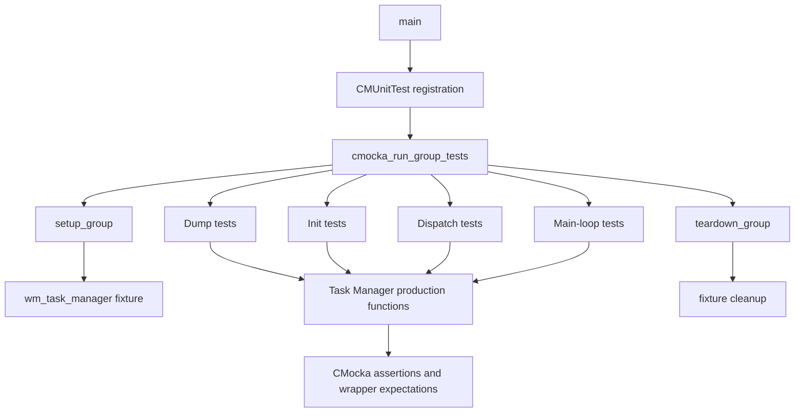
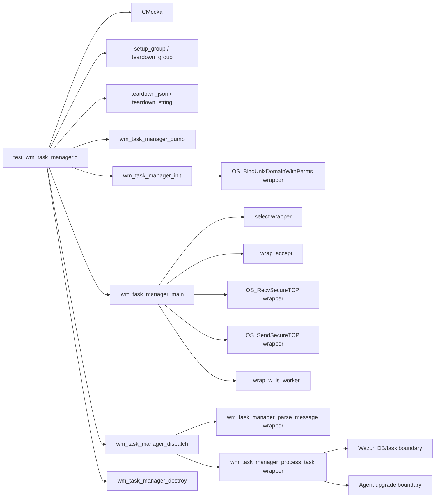
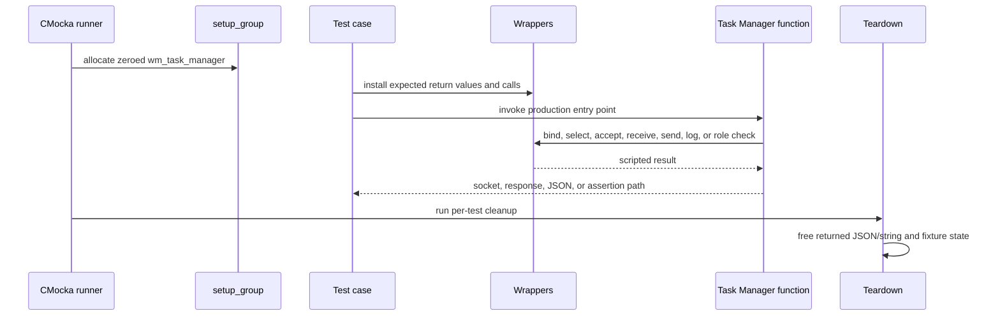
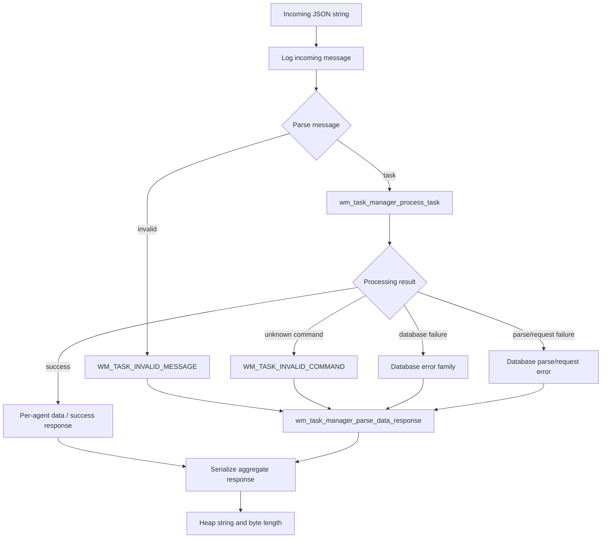
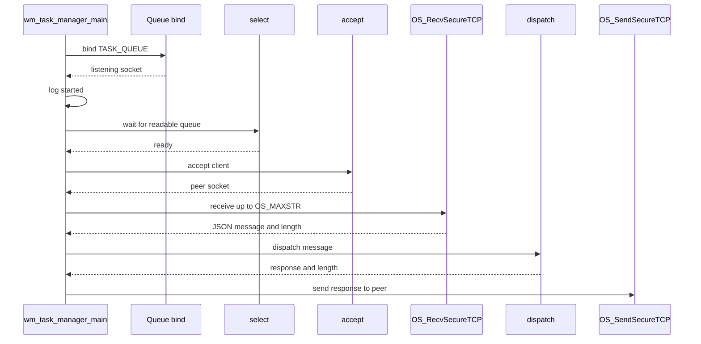
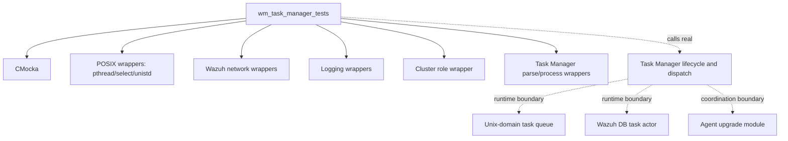

# `wm_task_manager_tests` module

`wm_task_manager_tests` is the CMocka unit-test suite for the Wazuh Task Manager module. It verifies the module’s configuration dump, lifecycle entry points, Unix-domain task queue initialization, request dispatch, secure socket loop, cluster-role restriction, and error translation. The suite tests the Task Manager boundary with controlled wrappers; it does not duplicate the implementation of upgrade execution or Wazuh DB persistence.

Production responsibilities are documented in [task_manager_module](task_manager_module.md). The database-side task operations are covered by [test_wdb_task](test_wdb_task.md), and common `wazuh-modulesd` lifecycle behavior is described in [wazuh_modules_core_lifecycle](wazuh_modules_core_lifecycle.md).

## Scope and test location

| Item | Value |
|---|---|
| Test source | `src/unit_tests/wazuh_modules/task_manager/test_wm_task_manager.c` |
| Framework | CMocka (`CMUnitTest`, `cmocka_run_group_tests`) |
| Production subject | `wm_task_manager_dump`, `wm_task_manager_init`, `wm_task_manager_dispatch`, `wm_task_manager_main`, `wm_task_manager_destroy` |
| Related production header | `src/wazuh_modules/task_manager/wm_task_manager.h` |
| Related task structures | `src/wazuh_modules/task_manager/wm_task_manager_tasks.h` |
| Module-tree location | `Unit_Tests_-_Wazuh_Modules_(Cloud_Misc)` → `wm_task_manager_tests` |
| External boundary | `TASK_QUEUE`, secure local TCP socket calls, and Wazuh DB/task callbacks |

The suite contains 21 registered cases: two dump tests, one destroy test, three initialization tests, six dispatch tests, and nine main-loop tests. It uses a shared fixture for `wm_task_manager`, plus per-test cleanup for returned cJSON objects and heap strings.

## Architecture

The test executable calls real Task Manager functions. CMocka wrappers replace or observe operating-system and module dependencies, allowing each path to be driven deterministically. The test file includes wrappers for pthreads, `select`, `accept`, `recv`, secure socket operations, cluster role checks, logging, and Task Manager parsing/processing callbacks.

## Component relationships

The parser and processor are mocked in dispatch tests. This isolates dispatch’s response construction from the detailed command behavior tested in the task-manager implementation and its companion command/parsing suites. The database operation contract is tested independently in [test_wdb_task](test_wdb_task.md).

## Fixture and cleanup lifecycle

`setup_group` allocates a zeroed `wm_task_manager` and places it in the CMocka state. `teardown_group` releases that structure. Dispatch tests register `teardown_string` because `wm_task_manager_dispatch` returns a heap-allocated serialized response. Dump tests register `teardown_json` because `wm_task_manager_dump` returns a cJSON tree.

The fixture is intentionally minimal: most behavior is represented by wrapper expectations rather than a fully configured daemon. This makes failures attributable to the tested boundary—configuration, socket control flow, dispatch, or error mapping.

## Coverage by production entry point

### Configuration dump

`test_wm_task_manager_dump_enabled` and `test_wm_task_manager_dump_disabled` set `config->enabled` to `1` and `0`, respectively. They verify that the returned object contains a `task-manager.enabled` field with the string value `"yes"` or `"no"`. These tests protect the module’s human-readable configuration serialization used by module inspection and diagnostics.

### Destruction

`test_wm_task_manager_destroy` verifies the module completion log using the `wazuh-modulesd:task-manager` tag and message `(8201): Module Task Manager finished.` The test does not assert data ownership beyond invoking destruction on an allocated configuration, so resource details remain the responsibility of the production implementation.

### Initialization

The successful initialization case verifies the exact queue contract:

| Parameter | Expected value |
|---|---|
| Path | `TASK_QUEUE` |
| Socket type | `SOCK_STREAM` |
| Maximum message size | `OS_MAXSTR` |
| Owner UID | `getuid()` |
| Owner GID | `0` |
| Permissions | `0660` |

`test_wm_task_manager_init_ok` expects the wrapper to return descriptor `555` and checks that the same descriptor is returned. `test_wm_task_manager_init_bind_err` returns `OS_INVALID`, verifies the queue-access error, and expects an assertion failure. `test_wm_task_manager_init_disabled` verifies that a disabled module logs `(8202): Module disabled. Exiting...` and fails initialization rather than creating a queue.

## Dispatch flow and response mapping

Dispatch tests use a representative JSON request from `node05` and `upgrade_module` targeting agents `1` and `2`. The normal path mocks parsing to a `wm_task_manager_task`, mocks processing to success, supplies two per-agent success objects, and verifies the serialized aggregate response.

The error cases establish stable response contracts:

| Test | Error code | Meaning asserted |
|---|---:|---|
| `test_wm_task_manager_dispatch_parse_err` | `WM_TASK_INVALID_MESSAGE` (`1`) | Input cannot be parsed. |
| `test_wm_task_manager_dispatch_command_err` | `WM_TASK_INVALID_COMMAND` (`2`) | Parsed command has no action. |
| `test_wm_task_manager_dispatch_db_err` | `WM_TASK_DATABASE_ERROR` (`4`) | Task processing hit a database failure. |
| `test_wm_task_manager_dispatch_db_parse_err` | `WM_TASK_DATABASE_PARSE_ERROR` (`5`) | Database response could not be parsed. |
| `test_wm_task_manager_dispatch_db_request_err` | `WM_TASK_DATABASE_REQUEST_ERROR` (`6`) | Database request could not be completed. |

All error responses are produced through `wm_task_manager_parse_data_response` with invalid agent and task IDs. This confirms that dispatch centralizes response formatting rather than allowing each failure branch to construct a different envelope.

## Main-loop process flow

`wm_task_manager_main` tests the daemon-facing event loop after initialization. The normal case verifies startup logging, one `select` result, `accept`, secure receive of a bounded message, dispatch, and secure response transmission.

The loop’s failure behavior is covered by the following cases:

- `test_wm_task_manager_main_select_empty_err`: a zero `select` result is tolerated and the loop continues.
- `test_wm_task_manager_main_select_err`: a negative `select` result logs `(8252)` and causes an assertion failure.
- `test_wm_task_manager_main_accept_err`: an `accept` failure logs `(8253)` and the loop can continue to a later client.
- `test_wm_task_manager_main_recv_empty_err`: zero-length input is logged as an empty local-client message `(8203)`.
- `test_wm_task_manager_main_recv_err`: a negative receive result logs `(8254)`.
- `test_wm_task_manager_main_sockterr_err`: `OS_SOCKTERR` logs `(8255)` for an oversized or invalid response condition.
- `test_wm_task_manager_main_recv_max_err`: `OS_MAXLEN` logs `(8256)` when the received message exceeds the allowed maximum.
- `test_wm_task_manager_main_worker_err`: a worker node logs `(8207)` because the module only runs on cluster master nodes.

The exact cluster topology and module startup registration belong to [cluster_module](cluster_module.md) and [wazuh_modules_core_lifecycle](wazuh_modules_core_lifecycle.md); this suite only verifies the Task Manager’s role check.

## Dependency and isolation model

The wrappers are test seams, not production dependencies. In particular, no real `TASK_QUEUE` socket, peer connection, `wazuh-db` database, or agent upgrade is required. The suite therefore validates control flow and contracts without introducing filesystem, network, database, or cluster-state nondeterminism.

## Maintenance guidance

- Keep socket parameter expectations synchronized with `wm_task_manager_init`; changes to queue path, permissions, message limits, or socket type should update the initialization tests.
- Preserve the response envelope and error-code mapping when changing dispatch logic; the dispatch cases intentionally assert complete serialized strings.
- Add new command-specific behavior to the Task Manager command/parsing tests and database behavior to [test_wdb_task](test_wdb_task.md), keeping this suite focused on lifecycle and boundary orchestration.
- Use the existing `teardown_json` and `teardown_string` registrations when adding cases that return heap-owned cJSON or string values.
- When changing cluster behavior, update both the worker-node test and the related cluster documentation rather than assuming a single-node runtime.

