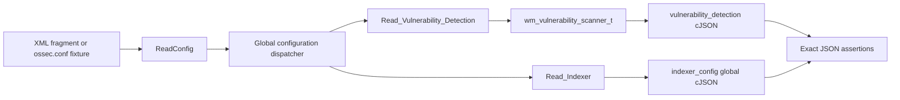
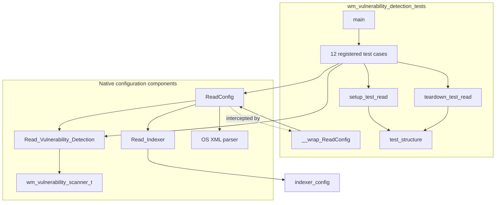
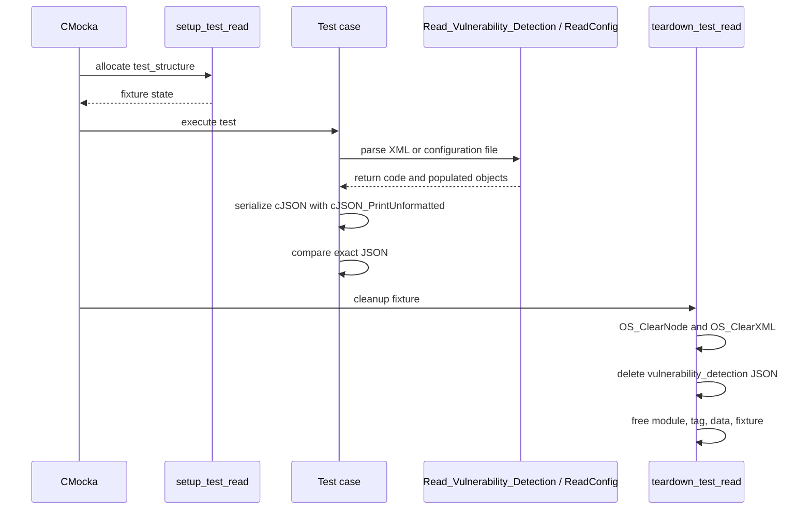
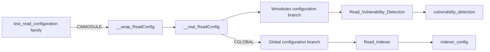
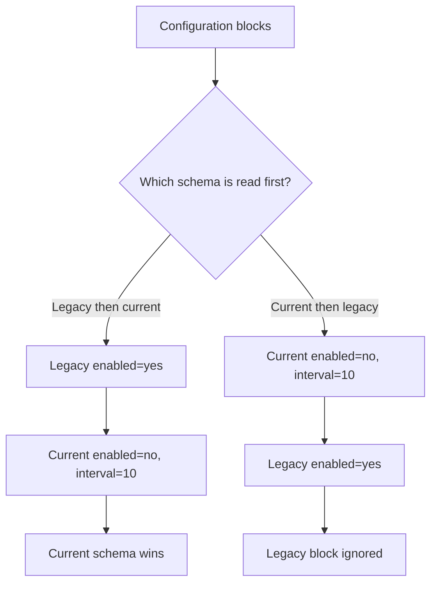
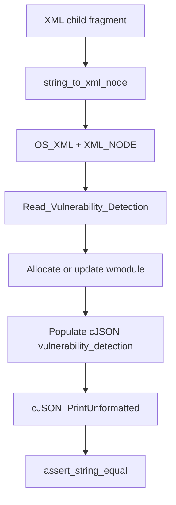
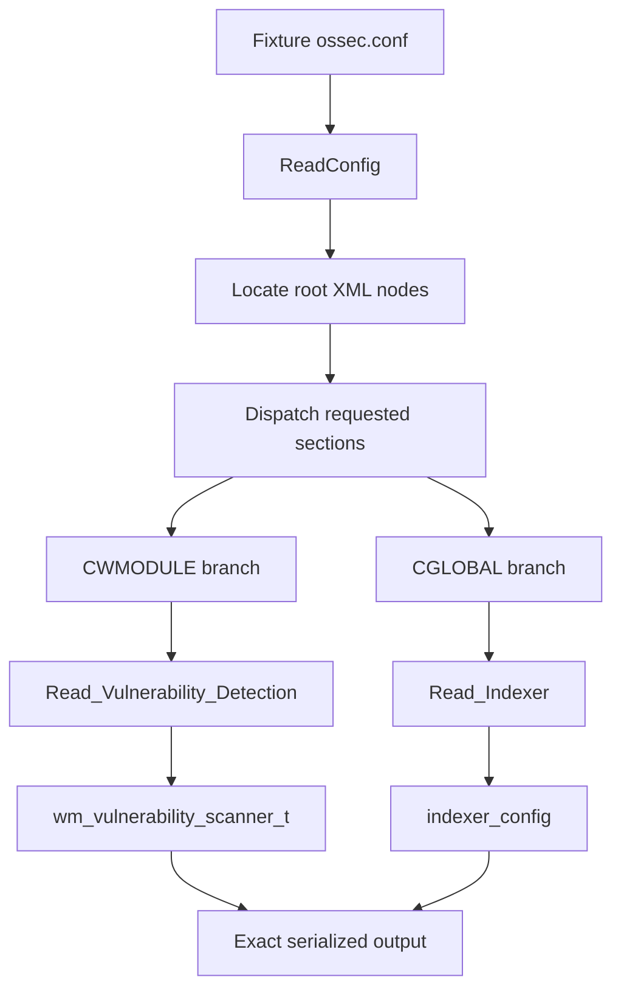
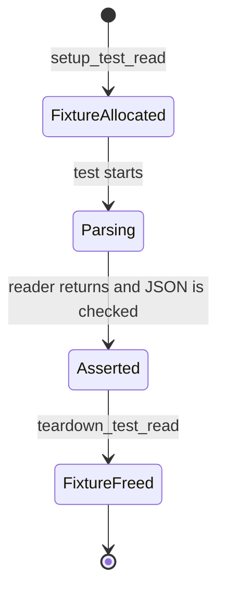

# `wm_vulnerability_detection_tests`

`wm_vulnerability_detection_tests` is a CMocka unit-test suite for Wazuh’s native vulnerability-detection configuration reader. It verifies the XML-to-JSON contract implemented by `Read_Vulnerability_Detection()` and the way that reader is dispatched through `ReadConfig()`.

The suite does not run vulnerability scans, download CTI feeds, compare versions, or index findings. Those runtime responsibilities belong to the [vulnerability scanner facade](vulnerability_scanner_facade.md), [database feed manager](database_feed_manager.md), and [version matcher](version_matcher.md). This module isolates startup configuration behavior.

## Purpose and scope

The tests cover four closely related concerns:

- parsing the current vulnerability-detection settings;
- parsing the legacy vulnerability-detector settings;
- precedence when both configuration formats occur in `ossec.conf`;
- parsing the global indexer settings that are loaded alongside the vulnerability module.

The reader stores the vulnerability-detection block as a `cJSON` object inside `wm_vulnerability_scanner_t`, which is attached to a `wmodule`. The reader also obtains the CTI URL from global configuration. When no custom CTI URL is available, the production default is used.



The top-level dispatch and XML loading model are documented in [Global Config Core](Global_Config_Core.md). This page focuses on the vulnerability-detection branch and its tests.

## Architecture



### Component responsibilities

| Component | Role in the suite |
|---|---|
| `main` | Defines the CMocka test table and runs the group. |
| `CMUnitTest` | Describes each test and associates setup/teardown callbacks. |
| `setup_test_read` | Allocates a zeroed `test_structure`; initializes an empty module state. |
| `teardown_test_read` | Clears XML nodes/documents and frees module data, JSON, and tags. |
| `__wrap_ReadConfig` | Verifies expected module masks and config paths, then redirects file loading to `test_path`. |
| `test_structure` | Holds the temporary XML document, XML node list, and resulting `wmodule`. |
| `Read_Vulnerability_Detection` | Parses vulnerability-detection XML children into `module->data`. |
| `ReadConfig` | Exercises full dispatcher behavior, including vulnerability and indexer sections. |
| `wm_vulnerability_scanner_t` | Production configuration container; its `vulnerability_detection` member is the asserted JSON object. |
| `indexer_config` | Global JSON output produced by the indexer reader during full-dispatch tests. |

## Test fixture and lifecycle



`setup_test_read` allocates the shared `test_structure` used by direct-reader tests. XML fragments are built with `string_to_xml_node`, supplied by the scheduling test helpers. The helper allows tests to bypass disk parsing when validating only the vulnerability-detection child elements.

`teardown_test_read` owns cleanup for direct-reader tests. It clears the XML tree, conditionally deletes the nested cJSON object, frees `module->data`, `module->tag`, and the module itself, then releases the fixture. Full-dispatch tests allocate a separate `wmodule` and release it with `wm_free`.

## Configuration data model

The current reader accepts the following fields:

| XML field | JSON field | Meaning | Tested behavior |
|---|---|---|---|
| `<enabled>` | `enabled` | Enables vulnerability detection. | Preserved as a string; later configuration can replace earlier values. |
| `<index-status>` | `index-status` | Controls vulnerability-result indexing. | Preserved as a string. |
| `<feed-update-interval>` | `feed-update-interval` | CTI/feed update cadence. | Values such as `60m`, `10h`, and `24h` are retained. Empty values are retained when explicitly present. |
| `<offline-url>` | `offline-url` | Local/offline feed location. | File URL is retained. |
| global CTI setting | `cti-url` | CTI catalog endpoint. | Custom global URL wins; otherwise the built-in Wazuh CTI URL is used. |

The resulting object is attached to the vulnerability scanner module:

```text
wmodule
└── data: wm_vulnerability_scanner_t
    └── vulnerability_detection: cJSON object
```

The native module bridge and runtime configuration assembly are described in [Wazuh modules core native bridges](wazuh_modules_core_native_bridges.md). This test page only asserts the parser output, not the later runtime interpretation.

## Configuration loading and dependencies

Full-dispatch tests call `ReadConfig(CWMODULE, OSSECCONF, ...)`. The `ReadConfig` wrapper checks the expected arguments and redirects the real reader to a fixture path through the global `test_path` variable. The wrapper therefore provides deterministic file selection without changing the production parser.



The wrapper expects `OSSECCONF` as the logical configuration path and uses fixture-specific paths such as `test_vulnerability_detection.conf` internally. This preserves the production call contract while allowing each test to select a different input.

The indexer object is intentionally asserted in the full-dispatch tests because vulnerability detection depends on manager-side indexer configuration at runtime. Detailed indexer field semantics are documented in [config indexer tests](config_indexer_tests.md), and the shared dispatcher behavior is documented in [Global Config Core](Global_Config_Core.md).

## Test cases and behavioral contract

### Direct vulnerability-detection reader tests

| Test | Scenario | Expected behavior |
|---|---|---|
| `test_read_custom_cti_url_full_configuration` | All current fields plus a custom CTI URL. | Return `0`; all fields are present and `cti-url` is `random.cti.url.com` from the global fixture. |
| `test_read_empty_configuration` | Empty XML fragment. | Return `0`; output is `{}`. |
| `test_read_empty_field_default_cti_url_configuration` | Empty feed interval and no usable custom CTI URL. | Return `0`; empty interval is retained and the built-in CTI URL is inserted. |
| `test_read_vd_duplicate_configuration` | Same current configuration appears twice. | Return `0`; one effective value per field is retained. |
| `test_read_vd_multiple_configuration` | Two current configurations with different values. | Return `0`; later values overwrite earlier values. |

### Full dispatcher tests

| Test | Scenario | Expected behavior |
|---|---|---|
| `test_read_configuration` | One current vulnerability-detection block and one indexer block. | Current VD JSON and indexer JSON match the fixture exactly. |
| `test_read_duplicate_configuration` | Duplicate complete configuration. | Effective VD and indexer configuration remains stable and non-duplicated. |
| `test_read_multiple_configuration` | Multiple blocks with changed values. | The later effective VD and indexer values are asserted. |

### Legacy compatibility and precedence tests

The `is_legacy` argument distinguishes the old vulnerability-detector schema from the current vulnerability-detection schema.

| Test | Scenario | Expected behavior |
|---|---|---|
| `test_read_old_vd_config` | Legacy mode with only `<enabled>`. | Only `enabled` plus the CTI URL is emitted. |
| `test_read_old_vd_config_with_ignored_keys` | Legacy mode with `<enabled>` and current-schema fields. | Only `enabled` is accepted; other keys are ignored. |
| `test_read_old_vd_config_after_new_vd_config` | Current schema is parsed first, legacy schema second. | Legacy input is ignored; current values remain effective. |
| `test_read_new_vd_config_overwrite_old_vd_config` | Legacy schema is parsed first, current schema second. | Current schema overwrites the old `enabled` value and adds current fields. |



This is the compatibility contract used when both old and new tags are present in `ossec.conf`: the new configuration takes precedence regardless of the order in which the parser encounters the blocks.

## Data-flow details

### Direct XML fragment path



### Full configuration file path



The suite compares compact serialized JSON rather than individual fields. This makes field presence, field order where relevant, replacement behavior, and default insertion visible in one assertion. It also means a change to the parser’s output representation can require test updates even when the underlying configuration meaning is unchanged.

## Error and edge-case coverage

The suite is primarily a successful-parse suite. It verifies important edge cases without expecting parser failures:

- empty XML produces an empty JSON object;
- an explicitly empty feed interval is retained;
- duplicate fields do not create duplicate JSON keys or duplicate effective configuration;
- repeated configurations use later values;
- legacy mode ignores fields that belong only to the current schema;
- the default CTI URL is injected when no custom URL is available.

It does not directly test malformed XML, invalid interval syntax, invalid URL syntax, allocation failures, or scanner runtime errors. Those concerns should be covered by the native configuration tests and scanner/runtime suites rather than inferred from this module.

## Test registration

`main` registers 12 tests with `cmocka_unit_test_setup_teardown` and runs them through `cmocka_run_group_tests`. There is no group-level setup or teardown. Each test receives a fresh fixture, which is important because the production readers populate module/global state rather than returning an isolated value object.



## Maintenance guidance

When changing vulnerability-detection configuration:

1. Update the direct-reader tests for the XML-to-JSON contract.
2. Update full-dispatch fixtures if the module mask, global CTI setting, or indexer settings change.
3. Preserve the old/new schema precedence tests unless the deprecation policy intentionally changes.
4. Keep `test_path` redirection in `__wrap_ReadConfig`; it is what makes fixture selection deterministic.
5. Keep JSON cleanup aligned with ownership in `wm_vulnerability_scanner_t` and `wmodule`.
6. Link runtime behavior to [vulnerability scanner facade](vulnerability_scanner_facade.md) rather than duplicating scanner implementation documentation here.

The most fragile areas are global-state cleanup (`indexer_config` and module data), legacy precedence, and default CTI URL selection. Changes in any of those areas can make tests order-dependent or silently alter startup behavior.

## Source references

- Test source: `src/unit_tests/wazuh_modules/vulnerability_detection/test_wm_vulnerability_detection.c`
- Dispatcher and top-level XML loading: [Global Config Core](Global_Config_Core.md)
- Indexer parser test contract: [config indexer tests](config_indexer_tests.md)
- Native vulnerability scanner bridge: [Wazuh modules core native bridges](wazuh_modules_core_native_bridges.md)
- Runtime scanner façade: [vulnerability scanner facade](vulnerability_scanner_facade.md)
- Feed storage and content processing: [database feed manager](database_feed_manager.md)
- Version comparison used by scanning: [version matcher](version_matcher.md)
