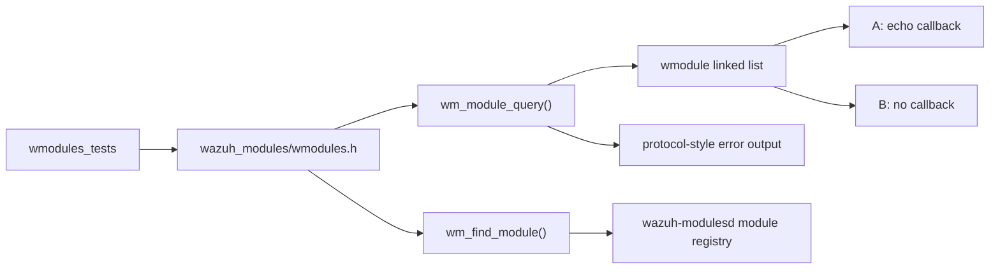
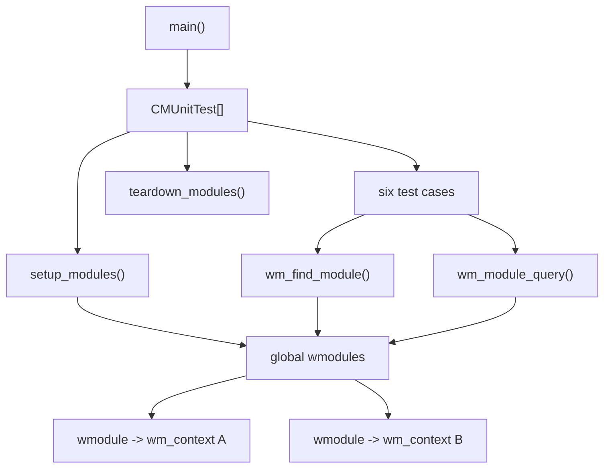
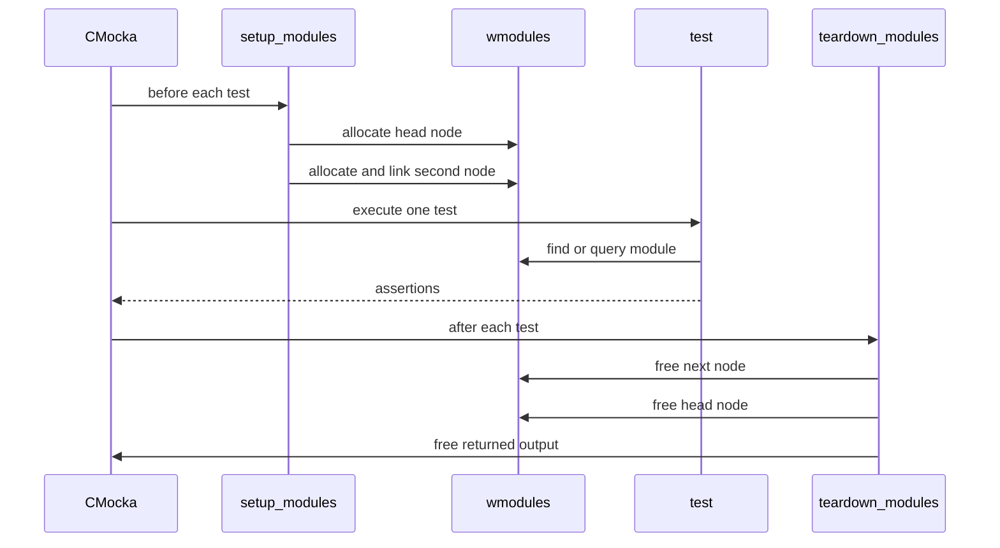
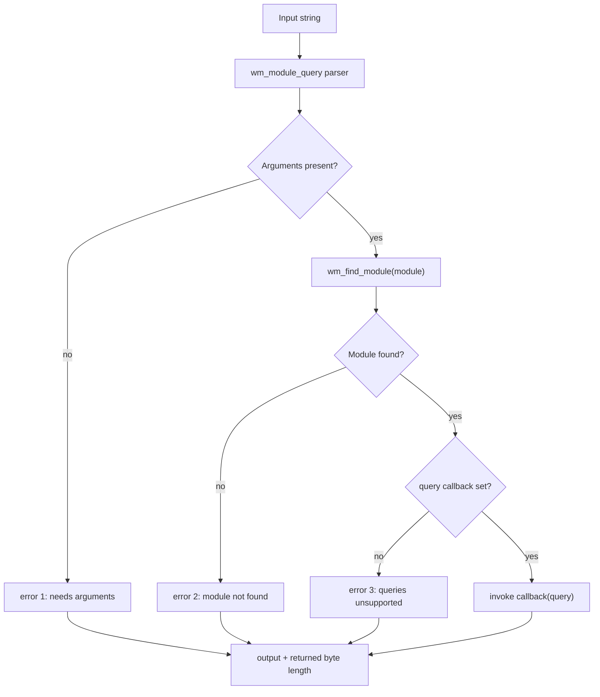
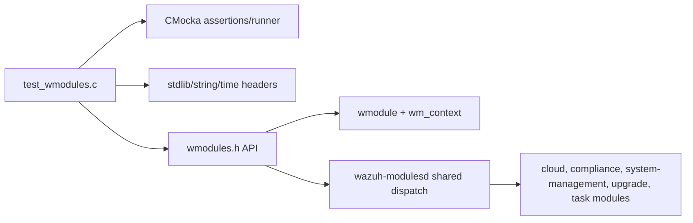
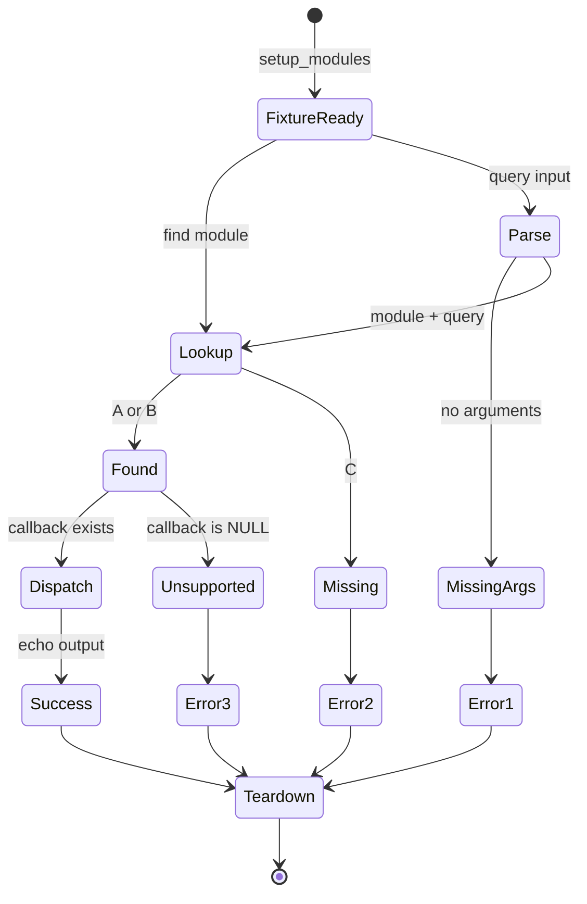

# `wmodules_tests`

`wmodules_tests` is the CMocka unit-test module for the shared Wazuh modules-daemon dispatch helpers. It validates two public behaviors from `wazuh_modules/wmodules.h`: locating a configured module with `wm_find_module()` and routing a textual request through `wm_module_query()`.

The tests intentionally use a small in-memory module list rather than starting `wazuh-modulesd`. This isolates list traversal, query dispatch, error classification, output ownership, and returned-length semantics. Runtime daemon behavior is documented in [wazuh_modules_core.md](wazuh_modules_core.md) and lifecycle behavior in [wazuh_modules_core_lifecycle.md](wazuh_modules_core_lifecycle.md).

## Scope and position in the system

The production modules daemon owns a linked list of `wmodule` records. Each record points to a `wm_context`, which supplies the module name and, optionally, a query callback. `wmodules_tests` supplies two synthetic records:

| Module | Query callback | Purpose |
|---|---|---|
| `A` | `echo` | Positive dispatch path; returns the query unchanged. |
| `B` | `NULL` | Configured module that does not support queries. |

The test suite also queries nonexistent module `C` and malformed/no-argument input to cover the dispatcher’s negative paths.

## Architecture

The test fixture has three layers:

1. **CMocka runner** — `main()` registers six tests and runs them as one group.
2. **Fixture layer** — `setup_modules()` constructs the linked list; `teardown_modules()` releases it.
3. **Unit under test** — `wm_find_module()` and `wm_module_query()` operate on the global `wmodules` registry.

## Fixture and lifecycle

### `setup_modules`

`setup_modules(void **state)` defines a static `CONTEXTS` array:

- Context `A` has `.query = echo`.
- Context `B` has `.query = NULL`.

It allocates the first `wmodule`, assigns it to `wmodules`, allocates a second node, and links it through `wmodules->next`. The CMocka state pointer is explicitly set to `NULL`; test output is later returned through that pointer by casting it to `char **`.

### `teardown_modules`

The teardown frees `wmodules->next` and `wmodules`. It also calls `free(*state)`. This is safe for the query tests because their output is heap allocated by either `echo()` or the production error path. The fixture does not free the static `wm_context` array because it has static storage duration.

## Component behavior

### `echo`

`echo(void *module, char *query, char **output)` is a minimal `wm_context.query` implementation. It ignores the module pointer, duplicates `query` into `*output` using `strdup()`, and returns `strlen(query)`. It provides a deterministic success callback for validating that `wm_module_query()` forwards the query text without modification.

### `wm_find_module`

The lookup tests establish the expected registry contract:

- Looking up `A` returns a non-null node whose context name is `A`.
- Looking up `B` returns a non-null node whose context name is `B`.
- Looking up unknown module `C` returns `NULL`.

The test does not assert ordering beyond the configured linked-list order, nor does it exercise duplicate names or a null global registry.

### `wm_module_query`

Requests are passed as mutable strings in the form `module [query]`. The dispatcher is expected to parse the module name, resolve it, and either call its callback or return a protocol-style error string.

| Input | Expected output | Meaning |
|---|---|---|
| `none` | `err {"error":1,"message":"Module query needs arguments"}` | No module/query arguments are available. |
| `C some-command` | `err {"error":2,"message":"Module not found or not configured"}` | The module is absent from the registry. |
| `B some-command` | `err {"error":3,"message":"This module does not support queries"}` | The module exists but has no callback. |
| `A echo` | `echo` | The callback receives and returns the query. |

For every error path, the test asserts both the exact output and that the returned size equals `strlen(output)`. The success path asserts the same length contract (`4`).

## Test cases

| Test | Coverage | Assertions |
|---|---|---|
| `test_find_module_found` | Positive linked-list lookup | Both `A` and `B` resolve and retain their names. |
| `test_find_module_not_found` | Lookup miss | `C` resolves to `NULL`. |
| `test_module_query_no_args` | Input validation | Exact error 1 output and matching length. |
| `test_module_query_no_module` | Unknown module handling | Exact error 2 output and matching length. |
| `test_module_query_no_queries` | Missing callback handling | Exact error 3 output and matching length. |
| `test_module_query_echo` | Successful callback dispatch | Output is `echo`; length is `4`. |

Each test uses `cmocka_unit_test_setup_teardown`, so the registry is rebuilt and destroyed independently for every case. This prevents a prior test’s global list or output buffer from affecting later assertions.

## Dependencies and boundaries

The test directly depends on CMocka and the modules-daemon header. It does not instantiate cloud integrations, compliance scanners, task management, agent upgrade, or native bridges. Those components have their own documentation and tests, such as [wm_sca_tests.md](wm_sca_tests.md), [wm_task_manager_tests.md](wm_task_manager_tests.md), [wm_vulnerability_detection_tests.md](wm_vulnerability_detection_tests.md), and [wazuh_modules_core_native_bridges.md](wazuh_modules_core_native_bridges.md).

## Data and ownership model

The dispatcher returns output through a `char **` supplied by the caller. The success callback allocates the output with `strdup()`, while error responses are expected to provide an allocated string compatible with the fixture teardown. The test therefore checks observable ownership indirectly by freeing `*state` after every case.

The returned `size_t` is treated as the number of bytes in the output string, not including a terminating null byte. This is verified for every tested response.

## Process flow

## Maintenance notes

- Keep the fixture’s module names and callback arrangement minimal; they represent dispatcher states, not real product modules.
- When changing query error codes or messages, update the exact string assertions in the three negative query tests.
- When changing output allocation or length semantics, review both `echo()` and `teardown_modules()` for ownership mismatches.
- Add tests for duplicate names, empty queries, null registry state, or callback failure if those behaviors become part of the public contract.
- Use the broader [wazuh_modules_core.md](wazuh_modules_core.md) documentation when tracing how real module contexts are registered and serviced.

