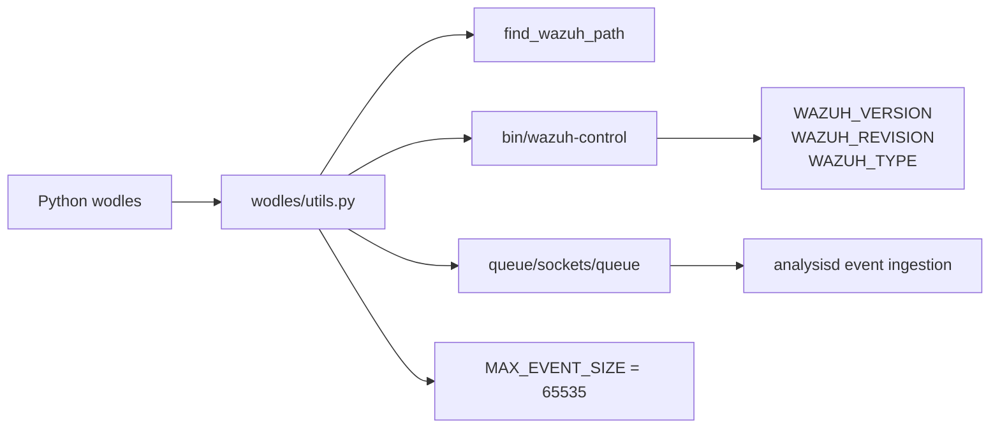
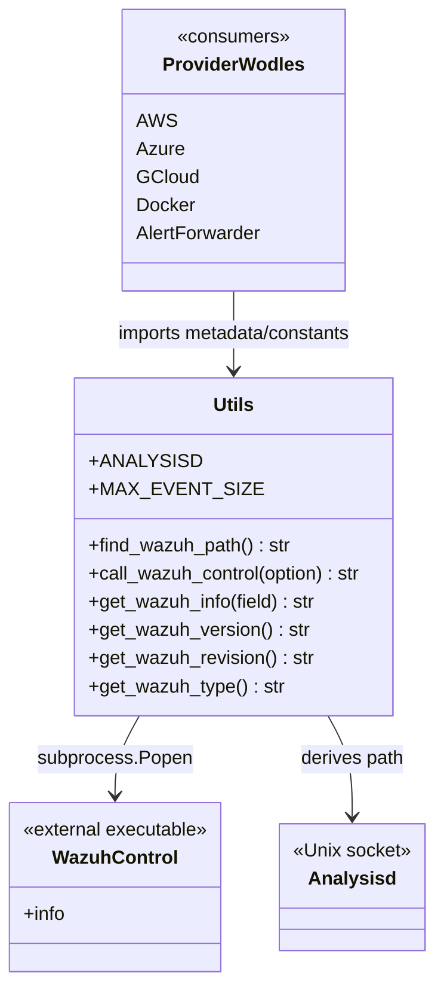
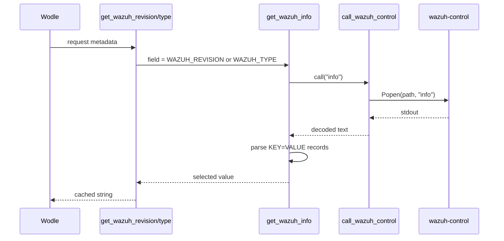
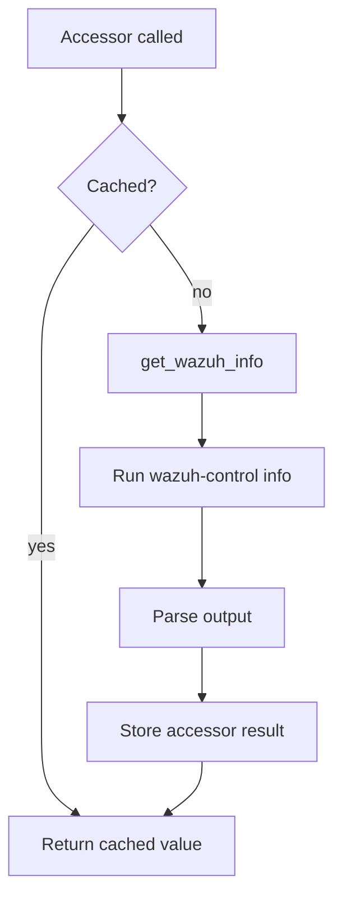
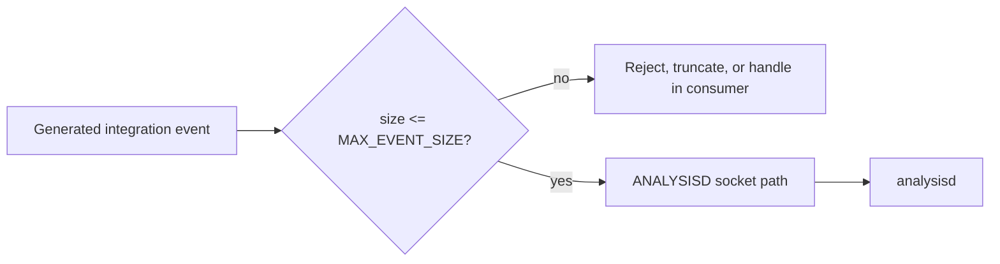

# Wodles utilities

`wodles/utils.py` is the small shared runtime-support module used by Wazuh cloud and container integration wodles. It locates the Wazuh installation, invokes `bin/wazuh-control` to read installation metadata, exposes cached accessors for the revision and instance type, and defines the analysis daemon socket and event-size limits used by integrations.

The module is intentionally procedural and has no service-specific logic. AWS, Azure, Google Cloud, Docker, and alert-forwarding modules consume the values exposed here; their provider-specific behavior is documented in [aws_core.md](aws_core.md), [azure_services.md](azure_services.md), [gcloud_core.md](gcloud_core.md), [docker_listener.md](docker_listener.md), and [alert_forwarder.md](alert_forwarder.md) where available.

## Scope and public surface

Although the module tree highlights `get_wazuh_revision` and `get_wazuh_type`, the file also contains the shared helpers and constants below.

| Symbol | Role | Caching / side effects |
| --- | --- | --- |
| `find_wazuh_path()` | Walks upward from the directory containing `utils.py` and returns the path preceding the `wodles` directory. | `lru_cache`; filesystem-path inspection only. |
| `call_wazuh_control(option)` | Runs `<Wazuh path>/bin/wazuh-control <option>` and decodes stdout. | Starts a child process; exits with status 1 on `OSError` or `ChildProcessError`. |
| `get_wazuh_info(field)` | Calls `wazuh-control info`, optionally parses `KEY=VALUE` lines, and returns one field. | Invokes the control script on every uncached call. |
| `get_wazuh_version()` | Returns `WAZUH_VERSION`. | Unbounded `lru_cache`. |
| `get_wazuh_revision()` | Returns `WAZUH_REVISION`. | Unbounded `lru_cache`. |
| `get_wazuh_type()` | Returns `WAZUH_TYPE`. | Unbounded `lru_cache`. |
| `ANALYSISD` | Path to `queue/sockets/queue` below the installation path. | Computed at import time. |
| `MAX_EVENT_SIZE` | Maximum event payload accepted by analysisd: `65535` bytes. | Constant. |

## Architecture

The module forms an adapter between Python wodles and the installed Wazuh control-plane script. Provider integrations do not need to know how the installation directory is discovered or how the control output is parsed.



### Component relationships



## Path discovery

`find_wazuh_path()` starts at `os.path.dirname(__file__)`, converts it to an absolute path, splits it into path components, and searches for the component named `wodles`. It joins every component before that marker. For a normal installation such as `/var/ossec/wodles/utils.py`, the result is `/var/ossec`.

If the marker is absent, the function returns an empty string. That makes the module importable in environments that contain the source file without a complete Wazuh installation, but downstream execution of `wazuh-control` will then fail. The result is cached for the process lifetime.

`ANALYSISD` is built at import time from this result:

```text
<wazuh_path>/queue/sockets/queue
```

This is a derived pathname, not an opened socket or a connection object.

## Metadata retrieval flow

The metadata accessors share one pipeline. `call_wazuh_control("info")` launches the control script with stdout captured. `get_wazuh_info()` parses each non-empty output line by splitting on `=` and removes surrounding double quotes from values. With an empty `field`, it returns the complete raw output; with a field, it indexes the parsed dictionary.



If the command returns no output, `get_wazuh_info()` returns the literal string `"ERROR"`. If process creation fails, `call_wazuh_control()` prints an error and calls `sys.exit(1)`, so callers should treat this path as process-fatal rather than a recoverable provider error.

## Caching and lifecycle behavior

`find_wazuh_path`, `get_wazuh_version`, `get_wazuh_revision`, and `get_wazuh_type` use `functools.lru_cache(maxsize=None)`. Consequently:

- repeated metadata requests in one process normally execute `wazuh-control info` only once per accessor;
- changes to the installed version, revision, type, or filesystem location are not observed until the process restarts or the relevant cache is cleared;
- `get_wazuh_info()` itself is not cached, so callers requesting arbitrary fields bypass the accessor caches.



## Event-ingestion constants

`ANALYSISD` identifies the local Unix socket used by the analysis daemon. `MAX_EVENT_SIZE` documents the maximum event size that analysisd can handle and should be used by producers when validating or truncating generated events. This module does not send events itself; the event-forwarding behavior belongs to the consumers, such as the alert forwarder and provider integrations.



## Error and compatibility considerations

- The control command is executed with an argument list, avoiding shell interpolation of `option`.
- Only `OSError` and `ChildProcessError` are caught around process creation/execution. Decode errors, malformed `KEY=VALUE` output, missing requested keys, and unexpected extra `=` characters are not normalized by this module.
- The parser assumes each metadata line contains exactly one `=` and that the final output line is empty; malformed control output can therefore raise a parsing exception.
- `get_wazuh_info("")` returns the complete output, while an unknown field raises a dictionary lookup error rather than returning `"ERROR"`.
- The source imports `exit` directly from `sys`; this is used only for command-execution failure.

## Extension and maintenance guidance

When adding a metadata accessor, prefer the existing cached-accessor pattern and use a stable `WAZUH_*` field emitted by `wazuh-control info`. Keep provider-specific parsing and transport in the corresponding module documentation. Changes to socket paths or event limits should be reviewed with the analysis daemon and all wodles that publish events.

Related documentation:

- [aws_core.md](aws_core.md)
- [azure_services.md](azure_services.md)
- [gcloud_core.md](gcloud_core.md)
- [docker_listener.md](docker_listener.md)
- [alert_forwarder.md](alert_forwarder.md)

