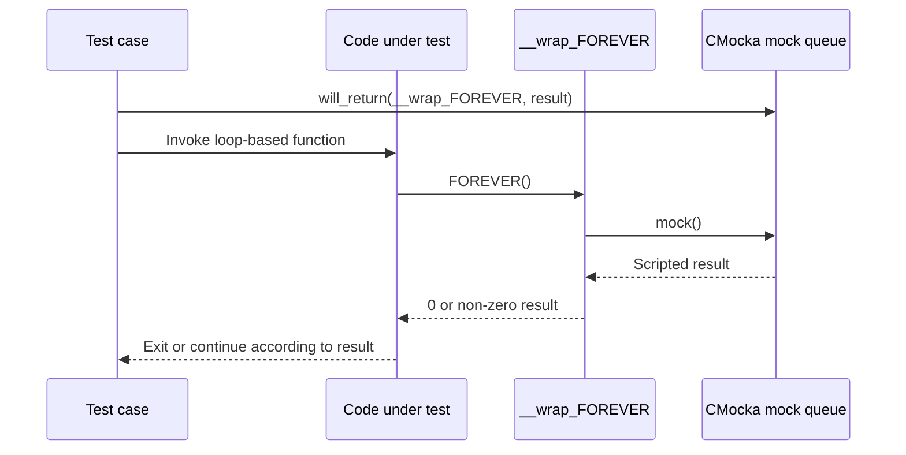
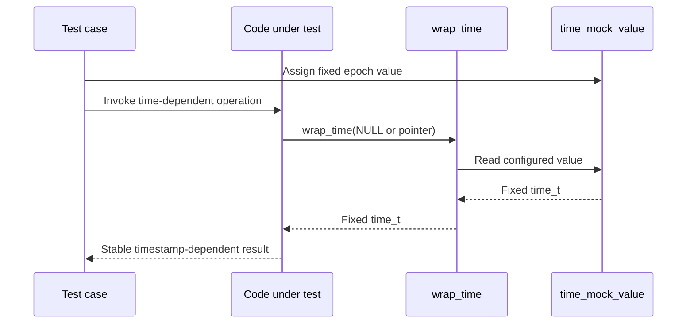
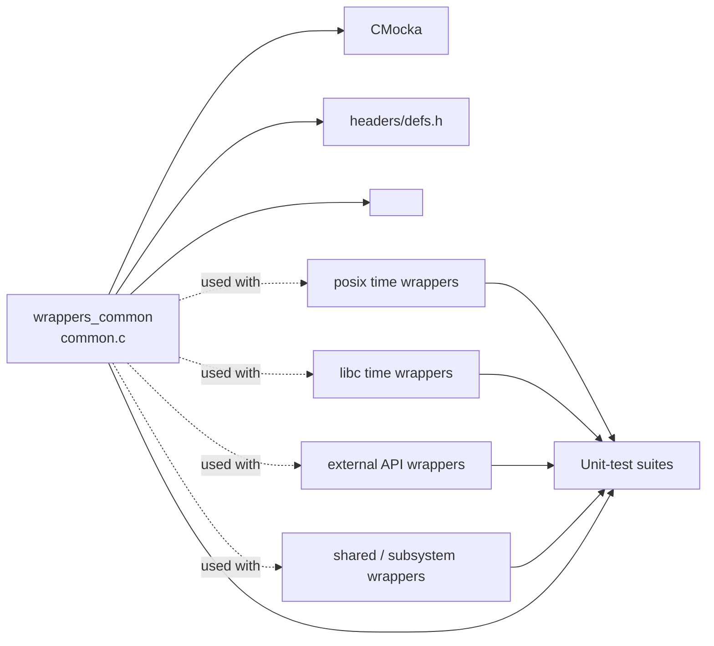
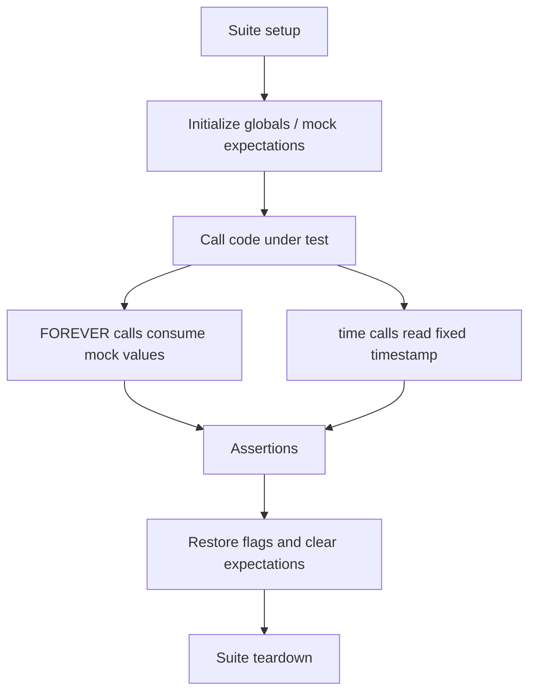

# Common unit-test wrappers

`wrappers_common` is the base test-support module for Wazuh’s C unit-test wrapper tree. It provides two minimal seams in [`src/unit_tests/wrappers/common.c`](src/unit_tests/wrappers/common.c): a controllable replacement for the `FOREVER()` loop predicate and a deterministic replacement for `time()`. These seams let tests drive otherwise long-running code and make time-dependent behavior reproducible.

The module contains no production business logic and no standalone test runner. It is linked into tests together with more specialized wrapper modules under [`src/unit_tests/wrappers/`](src/unit_tests/wrappers/) and subsystem-specific wrappers documented with their owning test suites, such as [`Unit Tests - Shared Library`](Unit_Tests_-_Shared_Library.md).

## Purpose and scope

The common wrapper establishes process-wide test controls:

- `__wrap_FOREVER()` delegates to CMocka’s `mock()` API, allowing each test to decide whether a loop continues or exits.
- `wrap_time()` returns the global `time_mock_value`, allowing callers to observe a fixed timestamp regardless of wall-clock time.
- `test_mode` and `activate_full_db` are shared flags declared here for the wider test harness. This file initializes them to zero; their interpretation belongs to the tests or production seams that consume them.

The implementation includes CMocka and Wazuh definitions from [`headers/defs.h`](src/headers/defs.h). The wrapper is intended for linker substitution, where calls to `FOREVER()` or a configured time seam resolve to these test functions.

## Architecture

```mermaid
flowchart TD
    Suite[Test suite] --> SUT[Production code under test]
    SUT -->|FOREVER() symbol| Loop[__wrap_FOREVER]
    SUT -->|time seam| Clock[wrap_time]
    Loop --> Mock[CMocka mock queue]
    Clock --> Fixed[time_mock_value]
    Mock --> Decision[Per-test loop result]
    Fixed --> Timestamp[Deterministic time result]

    Suite --> Flags[test_mode / activate_full_db]
    Flags --> Other[Specialized wrappers and fixtures]
```

`wrappers_common` is therefore a dependency of tests, not a dependency of the runtime Wazuh daemon. It sits below test fixtures and beside the more focused wrappers that mock operating-system, database, networking, and Wazuh subsystem APIs.

## Components

| Component | Definition | Responsibility |
|---|---|---|
| `time_mock_value` | `time_t time_mock_value` | Shared timestamp returned by `wrap_time()`. Tests may update it before invoking time-sensitive code. |
| `test_mode` | `int test_mode = 0` | Global test-mode switch exposed to wrapper-backed code and fixtures. |
| `activate_full_db` | `int activate_full_db = 0` | Global database-mode switch used by tests that need to enable full-database behavior. |
| `FOREVER` contract | `int FOREVER()` | Production loop predicate represented as an externally replaceable symbol. |
| `__wrap_FOREVER` | `int __wrap_FOREVER()` | CMocka replacement; returns the next value supplied through `mock()`. |
| `wrap_time` | `time_t wrap_time(time_t *t)` | Ignores the optional output pointer and returns `time_mock_value`. |

The `__attribute__((__unused__))` annotation on the `wrap_time` parameter documents that this harness deliberately does not write through the caller’s `time_t *` argument. Its contract is to return the configured value only.

## Control flow

### Loop control



`__wrap_FOREVER()` has no internal state and does not hard-code termination. The test controls the number and order of returned values through CMocka. A finite sequence can model startup, repeated work, and shutdown without sleeping or waiting indefinitely.

### Deterministic time



The pointer argument is accepted for signature compatibility but intentionally ignored. This keeps tests independent of the host clock and avoids requiring a writable caller buffer.

## Dependency relationships



The sibling wrapper modules own their respective APIs. For example, POSIX time wrappers cover `gettimeofday()` and related calls, while this module supplies the common fixed `time()` seam. They may be linked into the same test binary when a test needs both controls; the build configuration must avoid defining conflicting replacements for the same symbol.

## Usage patterns

### Testing a loop

Tests configure CMocka’s return queue for `__wrap_FOREVER` before calling the function under test. A zero return conventionally terminates code that uses `while (FOREVER())`, while a non-zero value allows another iteration. The exact loop semantics remain defined by the production caller.

### Testing time-dependent logic

Tests assign `time_mock_value` to a known epoch before invoking code that calls the wrapped time function. Typical cases include expiration, scheduling, state transitions, and reproducible timestamp serialization. Tests that need `gettimeofday()` or monotonic behavior should use the appropriate sibling time wrapper instead of assuming this module provides it.

### Shared flags

`test_mode` and `activate_full_db` are mutable globals. Tests that change them should restore their original values during teardown, especially when multiple suites execute in one process. Their presence does not imply that every test uses them; they are common storage for consumers elsewhere in the wrapper/test tree.

## Process and lifecycle considerations



Because the globals have external linkage, state can leak between tests if setup and teardown are incomplete. The wrapper itself performs no cleanup, reset, synchronization, logging, or validation. Those responsibilities belong to each test fixture.

## Limitations and maintenance notes

- `wrap_time()` does not update the caller-provided `time_t *`; callers that depend on that side effect require a different wrapper or an explicit test helper.
- `__wrap_FOREVER()` requires CMocka mock values to be configured. Calling it without an available mock value follows CMocka’s behavior and is a test setup error.
- The globals are not thread-local and are not protected by locks. This module is best suited to deterministic, isolated unit tests rather than concurrent tests that mutate shared controls.
- The wrapper only models symbol-level behavior. Tests still need specialized wrappers for files, sockets, databases, cryptography, and platform APIs.
- Changes to the signatures of `FOREVER()` or the selected time seam must be kept ABI-compatible with all linked test targets.

## Related documentation

- [`Unit Tests - Shared Library`](Unit_Tests_-_Shared_Library.md) — representative consumers of shared Wazuh utilities and their mocks.
- [`test_infrastructure.md`](test_infrastructure.md) — representative CMocka fixture and wrapper lifecycle.
- [`systemd_journal_wrappers.md`](systemd_journal_wrappers.md) — an example of an external-library wrapper module.
- [`data_provider_wrappers_unix.md`](data_provider_wrappers_unix.md) and [`data_provider_wrappers_windows.md`](data_provider_wrappers_windows.md) — platform-specific wrapper organization.

## Source reference

| File | Symbols |
|---|---|
| `src/unit_tests/wrappers/common.c` | `time_mock_value`, `test_mode`, `activate_full_db`, `FOREVER`, `__wrap_FOREVER`, `wrap_time` |
