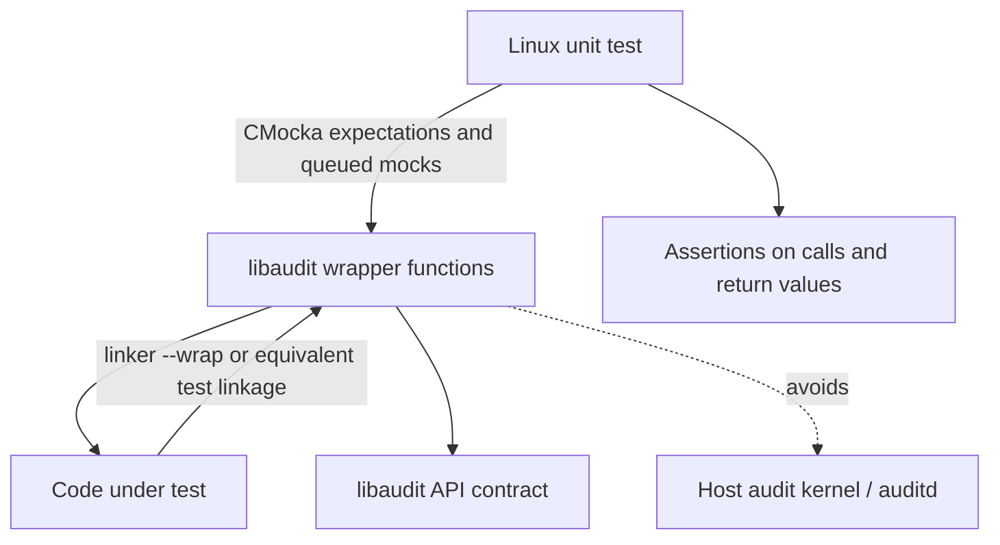
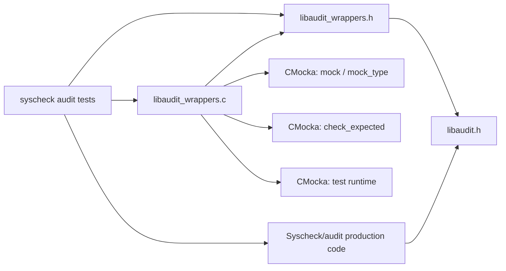
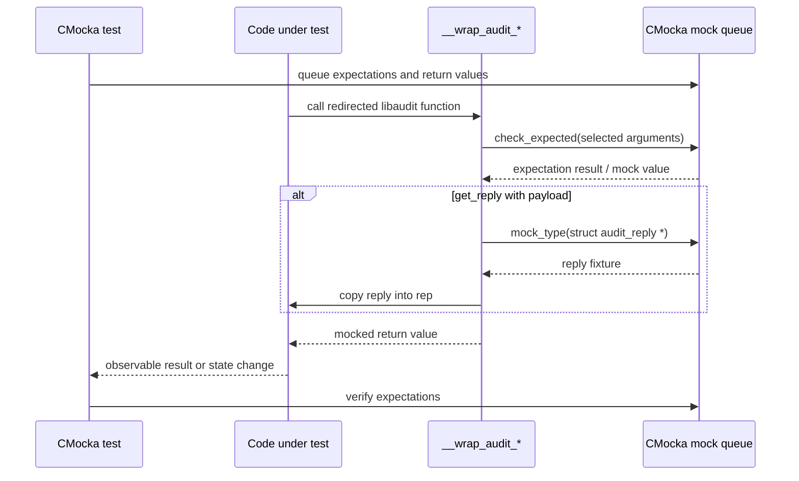
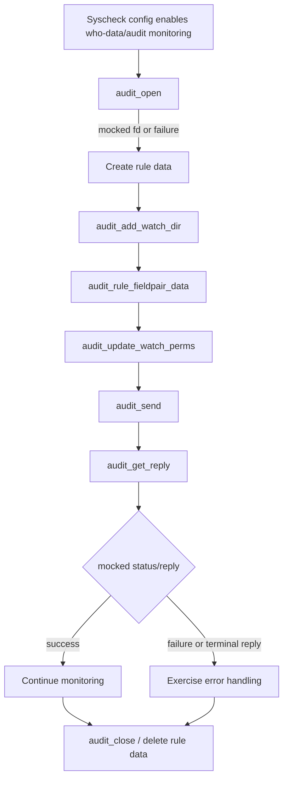
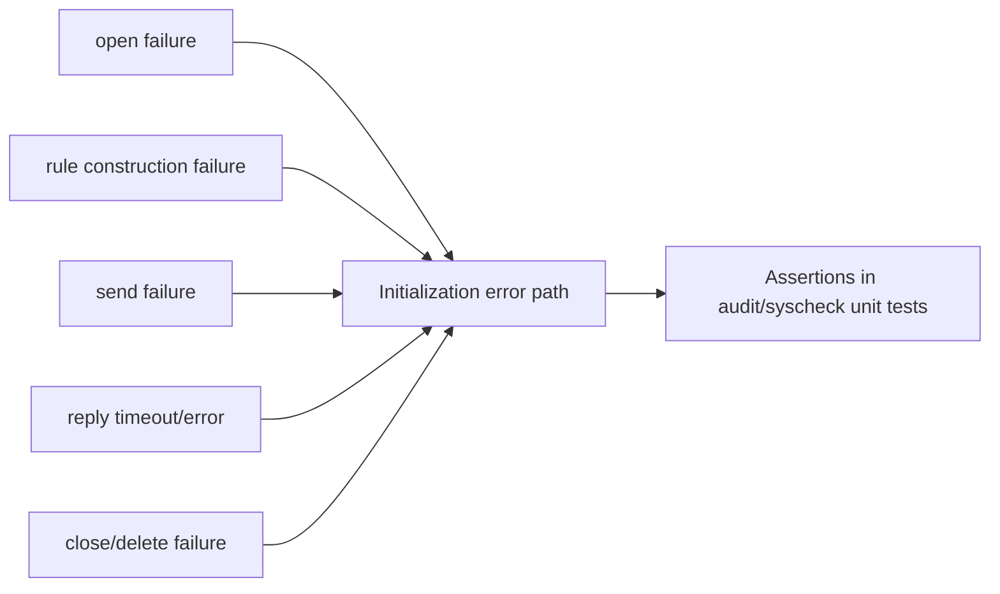

# `wrappers_externals_audit`

`wrappers_externals_audit` is the Linux-only CMocka wrapper layer for `libaudit`. It replaces selected auditd library calls during unit tests so Wazuh code can exercise audit-rule setup, rule updates, status requests, message exchange, and cleanup without opening or modifying the host audit subsystem.

The module is test infrastructure rather than production functionality. Its implementation is split between a header that exposes linker-wrapper signatures and a source file that delegates behavior to CMocka’s expectation and mock queues.

## Scope and role

The wrappers are used by tests around syscheck “who-data” and audit handling. They provide three capabilities:

1. Record and validate important arguments with `check_expected()`.
2. Return deterministic values supplied by a test through `mock()` or `mock_type()`.
3. Copy a caller-selected `struct audit_reply` into the real output buffer, allowing tests to model auditd responses.

The module is compiled only when `__MACH__` is not defined. This reflects the availability of `libaudit` and the Linux audit API; macOS builds do not expose these wrappers.

## Architecture



In a test build, the wrapper symbols stand in for the corresponding external functions. The production code continues to call the normal API names; test linking redirects those calls to `__wrap_*` implementations. No live audit socket or kernel rule mutation is required.

## Files and public interface

### `src/unit_tests/wrappers/externals/audit/libaudit_wrappers.h`

The header includes `<libaudit.h>` and declares the wrapper entry points using the library’s native types:

| Wrapper | Purpose | Test-controlled inputs |
|---|---|---|
| `__wrap_audit_add_rule_data` | Add/encode audit rule data | Return value |
| `__wrap_audit_add_watch_dir` | Add a watched directory to a rule | `type`, `path`, return value |
| `__wrap_audit_close` | Close an audit descriptor | Return value |
| `__wrap_audit_delete_rule_data` | Release rule data | Return value |
| `__wrap_audit_errno_to_name` | Convert an audit error to a name | Returned `char *` |
| `__wrap_audit_get_reply` | Obtain an audit reply | `fd`, blocking mode, reply payload, return value |
| `__wrap_audit_open` | Open an audit connection | Return value |
| `__wrap_audit_rule_fieldpair_data` | Add a field/value pair to a rule | `pair`, `flags`, return value |
| `__wrap_audit_send` | Send a command/message to auditd | `fd`, message type, data pointer, return value |
| `__wrap_audit_update_watch_perms` | Set permissions for a watched rule | `perms`, return value |
| `__wrap_audit_request_status` | Request audit subsystem status | Return value |

The header also makes `struct audit_reply` and `struct audit_rule_data` available to tests through `libaudit.h`. The wrapper source intentionally omits unused parameters with compiler attributes where appropriate.

## Implementation behavior

### Simple return-value wrappers

`__wrap_audit_add_rule_data`, `__wrap_audit_close`, `__wrap_audit_delete_rule_data`, `__wrap_audit_open`, and `__wrap_audit_request_status` do not inspect arguments. Each returns the next value from CMocka’s mock queue:

```c
return mock();
```

This lets a test model success, failure, file-descriptor allocation, or a sequence of retries without requiring a live audit service.

### Error-name wrapper

`__wrap_audit_errno_to_name` returns a pointer from the typed mock queue:

```c
return mock_type(char *);
```

Tests can therefore model both a named audit error and a null result.

### Argument-checking wrappers

The wrappers for rule construction and message operations validate selected arguments before returning their configured result:

- `__wrap_audit_add_watch_dir` checks `type` and `path`.
- `__wrap_audit_rule_fieldpair_data` checks `pair` and `flags`.
- `__wrap_audit_send` checks `fd`, `type`, and `data`.
- `__wrap_audit_update_watch_perms` checks `perms`.
- `__wrap_audit_get_reply` checks `fd` and `block`.

Pointer-heavy objects such as `rulep`, `rule`, and the send `size` are not checked by this layer. Tests that need to verify their contents must do so separately or use a higher-level wrapper.

### Reply-buffer transfer

`__wrap_audit_get_reply` has the only output-buffer behavior in this module. It obtains a test-provided `struct audit_reply *` and, if non-null, copies the complete structure into the caller’s `rep` buffer:

```c
struct audit_reply *reply = mock_type(struct audit_reply *);
if (reply) {
    *rep = *reply;
}
```

The wrapper then returns `mock()`. This separates the simulated payload from the simulated API status and allows tests to cover valid replies, empty replies, malformed/terminal message types, and error returns.

## Dependency relationships



The direct dependencies are deliberately small:

- `libaudit.h` supplies ABI-compatible declarations and audit structures.
- CMocka supplies the mock queue, typed mock extraction, and expectation assertions.
- Linux unit tests include or link the wrapper when they test code that invokes `libaudit`.
- Higher-level behavior belongs to the syscheck/audit modules, especially [`syscheckd_whodata_audit.md`](syscheckd_whodata_audit.md), [`test_syscheck_audit.md`](test_syscheck_audit.md), and [`test_audit_rule_handling.md`](test_audit_rule_handling.md).

The shared wrapper conventions are described in [`wrappers_common.md`](wrappers_common.md); this module follows those conventions but does not duplicate shared test utilities.

## Call and data flow



The normal path is intentionally synchronous. There are no threads, queues, file descriptors owned by the wrapper, or persistent module-level state. CMocka owns test state and determines the result of each call.

## Representative process flows

### Audit rule setup



The wrapper does not implement this workflow; it supplies controllable boundaries for the production workflow. Detailed rule lifecycle behavior should be read in [`syscheckd_whodata_audit.md`](syscheckd_whodata_audit.md).

### Failure injection



Each failure is injected by placing a return value in the relevant CMocka mock queue. Argument expectations can be combined with failure injection to ensure the code fails at the intended stage.

## Test-author guidance

1. Include `libaudit_wrappers.h` in tests that need the declarations or audit structures.
2. Queue `expect_*` values before invoking the production function. Use CMocka’s expected-value API for arguments checked by the wrapper.
3. Queue `will_return()` values for every wrapper call whose result matters. For `audit_get_reply`, queue both the reply pointer with `mock_type()` compatibility and the function return value in the order expected by the test harness.
4. Use a separately initialized `struct audit_reply` fixture when testing reply parsing. A null reply fixture tests the no-payload path; the wrapper does not dereference it.
5. Keep assertions about unvalidated arguments—such as rule contents or `size`—in the test or a more specialized wrapper.
6. Keep Linux-specific tests guarded or excluded on macOS, because the entire wrapper implementation is disabled under `__MACH__`.

## Maintenance considerations

- Preserve the exact native signatures expected by `libaudit` and the linker wrapping configuration. Signature drift can produce ABI errors or silently invalidate tests.
- Add `check_expected()` only when a new assertion is broadly useful; over-checking makes unrelated tests brittle.
- When adding an output structure, copy it defensively as `audit_get_reply` does and keep payload selection separate from the return code.
- Do not add production policy or auditd lifecycle logic here. This module should remain deterministic, stateless test infrastructure.
- If the audit API changes, update both the declaration header and the implementation, then review affected tests in [`test_audit_parse.md`](test_audit_parse.md), [`test_audit_healthcheck.md`](test_audit_healthcheck.md), and [`test_audit_op_shared.md`](test_audit_op_shared.md).

## Related documentation

- [`syscheck_module.md`](syscheck_module.md) — API/framework view of syscheck functionality.
- [`syscheckd_whodata.md`](syscheckd_whodata.md) — who-data subsystem overview.
- [`syscheckd_whodata_audit.md`](syscheckd_whodata_audit.md) — audit-backed who-data implementation.
- [`test_syscheck_audit.md`](test_syscheck_audit.md) — tests for audit event handling.
- [`test_audit_rule_handling.md`](test_audit_rule_handling.md) — tests for audit rule lifecycle operations.
- [`test_audit_parse.md`](test_audit_parse.md) — audit event parsing tests.
- [`test_audit_healthcheck.md`](test_audit_healthcheck.md) — audit health-check tests.
- [`test_audit_op_shared.md`](test_audit_op_shared.md) — shared audit helper tests.
- [`wrappers_common.md`](wrappers_common.md) — common wrapper test infrastructure.

