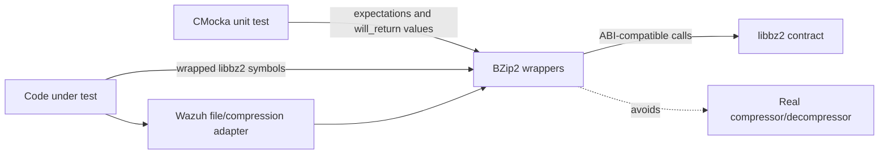
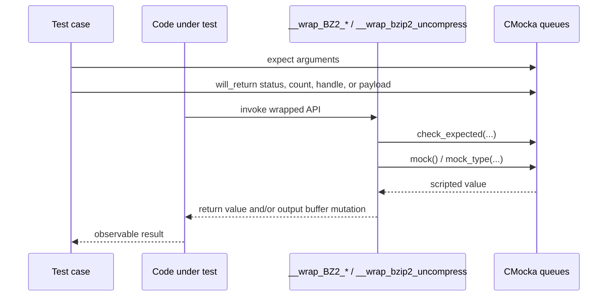
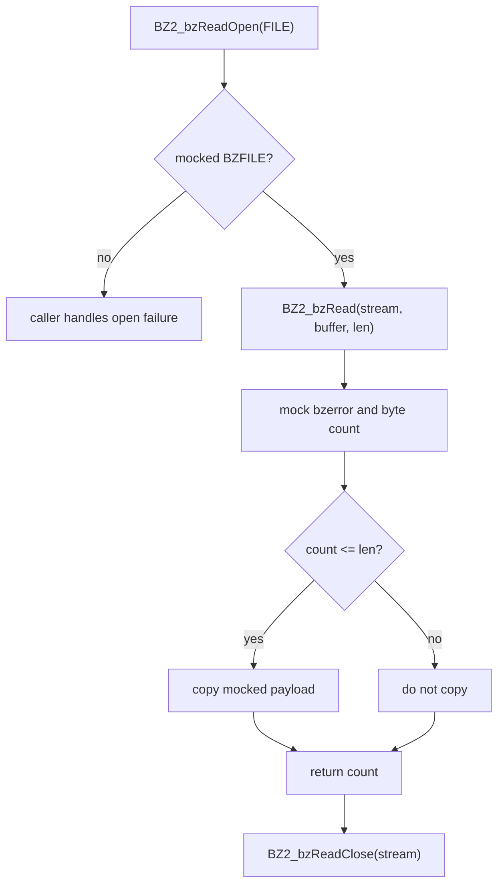
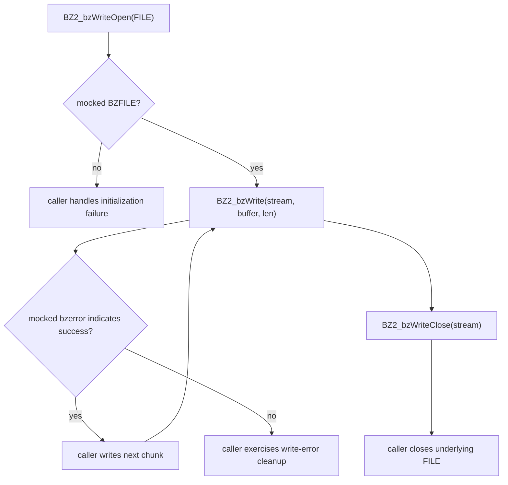
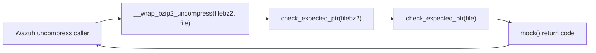
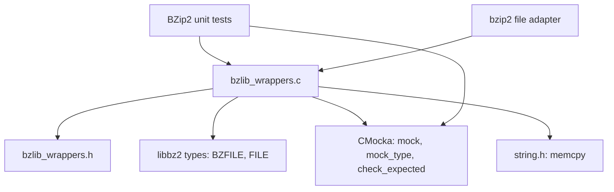
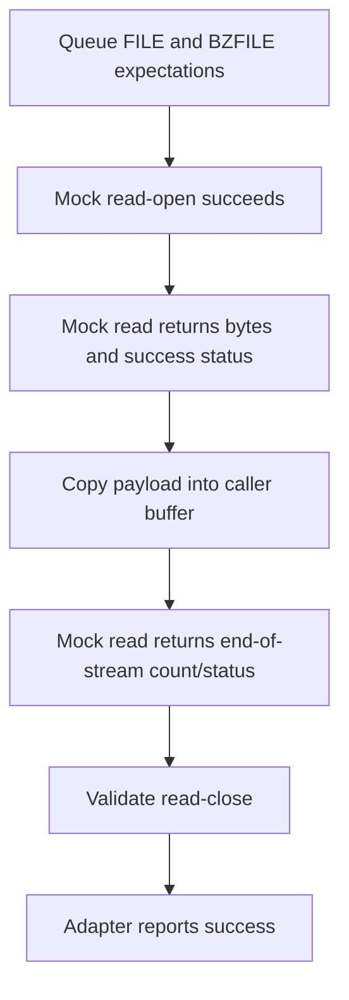
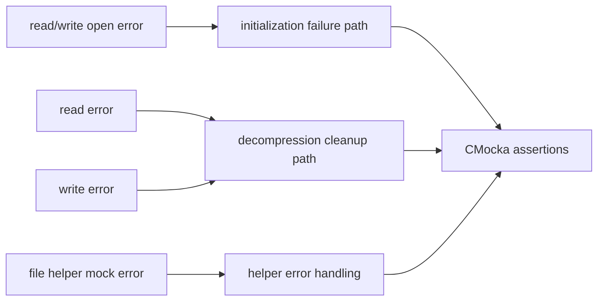

# `wrappers_externals_bzip2`

`wrappers_externals_bzip2` is Wazuh’s CMocka wrapper layer for the external BZip2 library. It replaces BZip2 stream operations during native unit tests with deterministic implementations that validate selected arguments, consume values from CMocka’s mock queue, and optionally copy mock data into caller buffers.

The module is test infrastructure, not a runtime compression component. The file-level adapter tests that exercise the production compression contract are documented in [`test_bzip2_op_shared.md`](test_bzip2_op_shared.md); shared wrapper conventions are described in [`wrappers_common.md`](wrappers_common.md).

## Purpose and system position

Production code calls libbz2 through Wazuh’s compression/file utilities. In unit tests, linker wrapping redirects those calls to this module so tests can model successful streams, initialization failures, read/write errors, and cleanup without invoking libbz2 or relying on real files.

The wrapper is used by tests such as [`test_bzip2_op_shared.md`](test_bzip2_op_shared.md), which verifies the higher-level `bzip2_compress` and `bzip2_uncompress` workflows.

## Components

Implementation: [`src/unit_tests/wrappers/externals/bzip2/bzlib_wrappers.c`](src/unit_tests/wrappers/externals/bzip2/bzlib_wrappers.c).

| Wrapper | Role | Controlled behavior |
|---|---|---|
| `__wrap_BZ2_bzReadOpen` | Open a BZip2 reader | Validates the `FILE *`, scripts `*bzerror`, returns a mocked `BZFILE *` |
| `__wrap_BZ2_bzRead` | Read decompressed bytes | Validates the stream, scripts status and byte count, copies mock bytes when safe |
| `__wrap_BZ2_bzReadClose` | Close a reader | Validates the stream handle |
| `__wrap_BZ2_bzWriteOpen` | Open a BZip2 writer | Validates the `FILE *`, scripts `*bzerror`, returns a mocked `BZFILE *` |
| `__wrap_BZ2_bzWrite` | Write input bytes to a compressed stream | Validates stream, buffer, and length; scripts `*bzerror` |
| `__wrap_BZ2_bzWriteClose` | Close a writer | Validates the stream handle |
| `__wrap_bzip2_uncompress` | Mock Wazuh’s file-to-file helper | Validates both path pointers and returns `mock()`; omitted for `TEST_WINAGENT` |

The supplied component list names the read/write operations and `bzip2_uncompress`; the source also defines the corresponding `BZ2_bzReadOpen` and `BZ2_bzWriteOpen`/close entry points. They are included here because they are part of the wrapper’s actual public test seam.

## CMocka interaction model

The wrappers use three CMocka mechanisms:

- `check_expected_ptr()` validates pointer identity for stream and file handles.
- `check_expected()` validates values such as the write buffer and length.
- `mock()` and `mock_type()` supply scripted error codes, byte counts, stream handles, and payload pointers.

The wrappers do not maintain persistent state. Every result is supplied by the active test, so call order and repeated operations are controlled by CMocka’s queues.

## Read path

`__wrap_BZ2_bzReadOpen` checks the underlying `FILE *`, writes a test-provided error code into `bzerror`, and returns a test-provided `BZFILE *`. This allows a test to represent either a failed open (`NULL`) or a usable synthetic stream.

`__wrap_BZ2_bzRead` checks the stream, obtains the error code and requested byte count from the mock queue, and copies a mock payload into `buf` only when `n <= len`. The guard prevents the test double from writing beyond the caller’s advertised buffer length. It returns `n`, allowing callers to distinguish data, end-of-stream conventions, and read failures according to the scripted `bzerror`.

`__wrap_BZ2_bzReadClose` only checks the stream pointer. It deliberately does not manufacture a close status because the wrapped API has no return value used by this test seam.

## Write path

`__wrap_BZ2_bzWriteOpen` validates the `FILE *`, scripts the BZip2 error code, and returns a mocked stream. `__wrap_BZ2_bzWrite` validates the stream, exact buffer pointer, and length, then scripts the error code. `__wrap_BZ2_bzWriteClose` validates the stream and ignores close metadata such as `abandon`, `nbytes_in`, and `nbytes_out`.

The wrapper does not inspect or transform bytes. Content assertions are made by the test through CMocka expectations; compression-format correctness belongs to libbz2 and higher-level adapter tests.

## File-to-file helper seam

When `TEST_WINAGENT` is not defined, `__wrap_bzip2_uncompress` provides a separate wrapper for Wazuh’s higher-level helper. It checks the input and output path pointers and returns the next integer from CMocka. It does not open files, inspect extensions, or copy data.

On Windows-agent builds this function is excluded, while the BZip2 stream wrappers remain source-visible. This conditional prevents the helper wrapper from conflicting with the Windows-agent test/build arrangement.

## Dependencies

The implementation includes standard C headers plus CMocka and the local wrapper header. Its only data-copy operation is `memcpy` in the mocked read path. No filesystem, compression context, allocation, thread, or network state is created by this module.

## Typical process flows

### Successful decompression test

### Failure injection

## Test-author guidance

1. Queue pointer expectations before invoking the production function. The wrapper checks the exact `FILE *` and `BZFILE *` values passed by the caller.
2. Queue values in the order of invocation: BZip2 open error code, returned stream handle, read/write error code, byte count, and payload pointer where applicable.
3. For `BZ2_bzRead`, keep the mocked byte count at or below `len` when a payload copy is expected. Counts above `len` intentionally exercise the no-copy guard.
4. Use `expect_value()` for the write buffer and length when validating chunk boundaries; the wrapper checks both.
5. Test resource cleanup in the higher-level adapter suite. The wrappers only observe close calls; they do not close or free anything themselves.

## Limitations and maintenance notes

- The wrappers model API boundaries, not actual BZip2 behavior. They do not detect corrupt streams, validate compressed bytes, or calculate byte totals.
- Read payload copying is guarded by `n <= len`, but negative mock counts are not otherwise normalized; tests should use realistic BZip2 return values.
- Close metadata and several open parameters are intentionally ignored. Add expectations only when a new test contract requires them, because extra checks can make unrelated tests brittle.
- Keep function signatures synchronized with the libbz2 ABI and the linker `--wrap` configuration.
- Preserve the `TEST_WINAGENT` conditional around `__wrap_bzip2_uncompress` unless the Windows-agent build contract changes.

## Related documentation

- [`test_bzip2_op_shared.md`](test_bzip2_op_shared.md) — higher-level compression/decompression tests using this seam.
- [`wrappers_common.md`](wrappers_common.md) — common CMocka wrapper infrastructure.
- [`test_os_zlib.md`](test_os_zlib.md) — neighboring zlib adapter tests and compression-contract coverage.
- [`shared_lib_file_io.md`](shared_lib_file_io.md) — shared file-I/O boundaries used by related native code.
