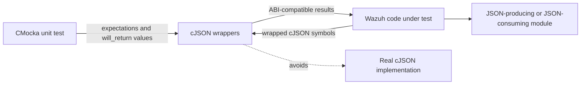
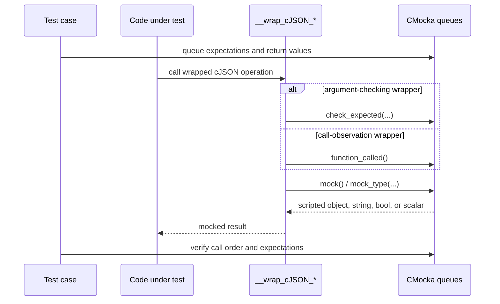
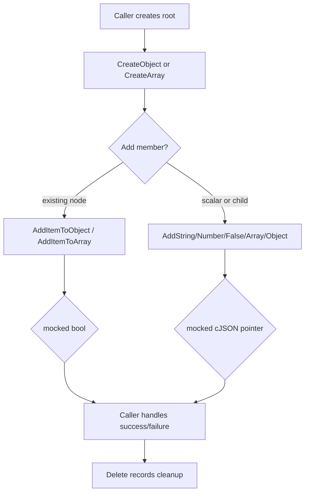
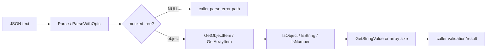
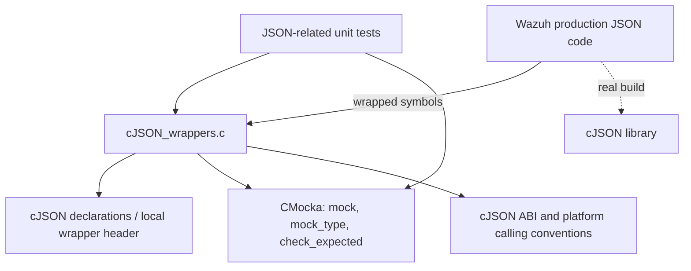

# `wrappers_externals_cjson`

`wrappers_externals_cjson` is Wazuh’s CMocka wrapper layer for the external cJSON library. It replaces selected cJSON operations in native unit tests with deterministic functions that validate selected arguments, record calls, and return values supplied by CMocka’s mock queues.

This module is test infrastructure, not a JSON implementation. It allows production code that builds, reads, prints, or destroys cJSON trees to be tested without depending on cJSON allocation, parser behavior, or a particular JSON document. Higher-level JSON behavior remains the responsibility of the production modules and their tests, such as [`test_json_op.md`](test_json_op.md), [`test_string_op.md`](test_string_op.md), and the Wazuh DB tests that use JSON payloads.

## Purpose and system position

The wrappers sit between code under test and the cJSON ABI. Linker wrapping redirects calls to the `__wrap_cJSON_*` functions during unit-test builds. Tests then use CMocka expectations and queued return values to model success, null results, type mismatches, parse failures, and cleanup paths.

The wrapper deliberately avoids maintaining a cJSON tree. Returned objects, strings, booleans, numbers, and parser results are all supplied by the active test. This makes failure injection repeatable and keeps tests focused on the caller’s control flow.

## Implementation

Implementation: [`src/unit_tests/wrappers/externals/cJSON/cJSON_wrappers.c`](src/unit_tests/wrappers/externals/cJSON/cJSON_wrappers.c).

The source includes the local wrapper declarations, CMocka, and the standard headers needed by the test framework. It also uses `WSTD_CALL` and conditional `__stdcall` declarations where the cJSON ABI requires platform-specific calling conventions.

### Component inventory

| Wrapper | Role | Control mechanism |
|---|---|---|
| `__wrap_cJSON_AddItemToArray` | Add an existing item to an array | Records the call with `function_called()`; returns `mock_type(cJSON_bool)` |
| `__wrap_cJSON_AddItemToObject` | Add an existing item under an object key | Records the call; returns `mock_type(cJSON_bool)` |
| `__wrap_cJSON_AddStringToObject` | Add a string member | Checks non-null `name` and `string`; returns a mocked `cJSON *` |
| `__wrap_cJSON_AddArrayToObject` | Add an array member | Checks non-null `name`; returns a mocked `cJSON *` |
| `__wrap_cJSON_AddNumberToObject` | Add a numeric member | Checks `name` and `number`; returns a mocked `cJSON *` |
| `__wrap_cJSON_AddFalseToObject` | Add a false-valued member | Checks non-null `name`; returns a mocked `cJSON *` |
| `__wrap_cJSON_AddObjectToObject` | Add a nested object member | Checks `name` and `object`; returns a mocked `cJSON *` |
| `__wrap_cJSON_AddBoolToObject` | Add a boolean member | Returns a mocked `cJSON *`; arguments are ignored |
| `__wrap_cJSON_CreateArray` | Create an array root/node | Returns a mocked `cJSON *` |
| `__wrap_cJSON_CreateObject` | Create an object root/node | Returns a mocked `cJSON *` |
| `__wrap_cJSON_CreateNumber` | Create a numeric node | Checks `num`; returns a mocked `cJSON *` |
| `__wrap_cJSON_CreateString` | Create a string node | Checks `string`; returns a mocked `cJSON *` |
| `__wrap_cJSON_Delete` | Delete a cJSON node | Records the call with `function_called()`; no real deletion occurs |
| `__wrap_cJSON_GetObjectItem` | Retrieve a child by key | Returns a mocked `cJSON *` |
| `__wrap_cJSON_GetStringValue` | Read a string value | Returns a mocked `char *` |
| `__wrap_cJSON_IsNumber` | Check numeric type | Returns a mocked `cJSON_bool` |
| `__wrap_cJSON_IsString` | Check string type | Returns a mocked `cJSON_bool` |
| `__wrap_cJSON_IsObject` | Check object type | Returns a mocked `cJSON_bool` |
| `__wrap_cJSON_Parse` | Parse a JSON string | Returns a mocked `cJSON *` |
| `__wrap_cJSON_ParseWithOpts` | Parse with end-pointer reporting | Mocks `*return_parse_end` and returns a mocked `cJSON *` |
| `__wrap_cJSON_PrintUnformatted` | Serialize without formatting | Returns a mocked `char *` |
| `__wrap_cJSON_Print` | Serialize with formatting | Returns a mocked `char *` |
| `__wrap_cJSON_GetArraySize` | Query array length | Returns `mock()` |
| `__wrap_cJSON_GetArrayItem` | Retrieve an array child | Returns a mocked `cJSON *` |
| `__wrap_cJSON_Duplicate` | Duplicate a tree | Returns a mocked `cJSON *` |

The module tree highlights the seven core components most directly used by the generated dependency view: `AddItemToArray`, `AddItemToObject`, `Delete`, `GetArraySize`, `IsNumber`, `IsObject`, and `IsString`. The inventory above also documents the other wrapper entry points implemented in the file because they form the same external-library seam.

## CMocka interaction model

The wrapper uses three distinct interaction styles:

1. `function_called()` records that an operation occurred. This is used by the item-add and delete wrappers.
2. `check_expected(...)` validates selected scalar, pointer, or string arguments. Checks are conditional for optional string arguments where the source tests only non-null values.
3. `mock()`, `mock_type(...)`, and typed mock values provide return values and, for `ParseWithOpts`, the parse-end pointer.

No wrapper allocates, parses, serializes, traverses, or frees a real cJSON value. A test that returns a non-null `cJSON *` is responsible for treating it as a fixture handle; `__wrap_cJSON_Delete` only records the cleanup call.

## Data and control flows

### Constructing a JSON tree

The add-item wrappers model status-returning cJSON APIs, while the typed add-to-object and create wrappers model APIs that return a node pointer. The distinction is important when testing callers that treat `0` and `NULL` as different failure signals.

### Reading and validating JSON

`ParseWithOpts` writes a test-provided pointer to `return_parse_end` before returning its mocked tree. The caller can therefore test both parse success and end-pointer handling without parsing input.

### Serialization

`Print` and `PrintUnformatted` return a mocked heap-like `char *`; they do not allocate a printable buffer. Tests should arrange any ownership and cleanup behavior expected by the caller through additional mocks or the caller’s own abstraction. This wrapper does not provide a `cJSON_free` seam.

## Dependencies

The module has no dependency on Wazuh runtime state, databases, sockets, filesystem contents, or threads. It is consumed by unit-test targets and participates in the broader wrapper hierarchy documented in [`wrappers_common.md`](wrappers_common.md). Neighboring external-library seams include [`wrappers_externals_audit.md`](wrappers_externals_audit.md), [`wrappers_externals_bzip2.md`](wrappers_externals_bzip2.md), and [`wrappers_externals_sqlite.md`](wrappers_externals_sqlite.md).

## Test-author guidance

- Queue `expect_*` values before invoking code that calls an argument-checking wrapper. The wrapper checks only the arguments listed in the component inventory.
- Queue typed results with the type expected by the wrapper: `cJSON *`, `char *`, or `cJSON_bool` as appropriate.
- Use `function_called()` expectations for add-item and delete operations when call occurrence or ordering matters.
- For `ParseWithOpts`, provide a valid `const char **return_parse_end` in the caller and queue the mocked end pointer before the mocked parse result.
- Treat returned pointers as synthetic handles. Do not assume the wrapper created a valid tree or allocated memory.
- Test semantic JSON construction and parsing in the higher-level module tests; use this layer to inject boundary outcomes and verify interactions.

## Limitations and maintenance notes

- The wrappers do not validate JSON syntax, object ownership, tree structure, numeric ranges, or serialization output.
- Argument checking is intentionally selective. For example, `GetObjectItem`, `GetStringValue`, type predicates, parsing, printing, array access, duplication, and `AddBoolToObject` return mocks without checking their arguments.
- `__wrap_cJSON_Delete` does not free memory, so it cannot detect double frees or ownership violations.
- Keep wrapper signatures synchronized with the cJSON version and the linker wrapping configuration, including Windows calling-convention branches.
- When adding a new wrapper, document whether it records a call, checks arguments, returns a mock, or mutates an output parameter. Preserve this deterministic, stateless design.

## Related documentation

- [`wrappers_common.md`](wrappers_common.md) — shared CMocka wrapper conventions.
- [`test_json_op.md`](test_json_op.md) — higher-level JSON file I/O and parsing tests.
- [`test_string_op.md`](test_string_op.md) — shared string/JSON helper tests.
- [`sqlite_wrapper.md`](sqlite_wrapper.md) — SQLite abstraction used by Wazuh database tests.
