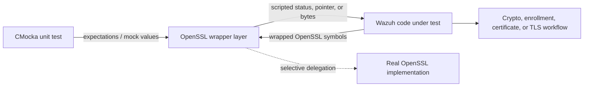
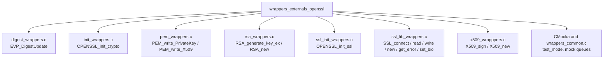
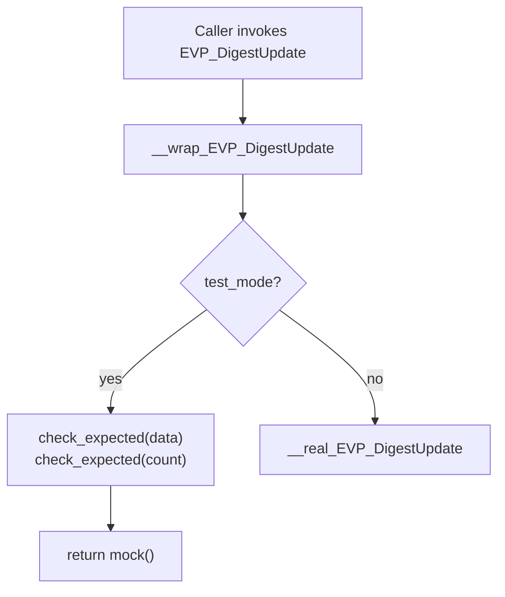
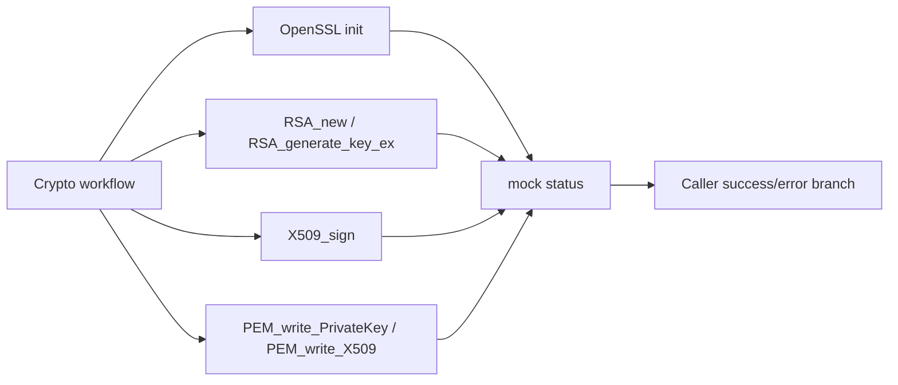
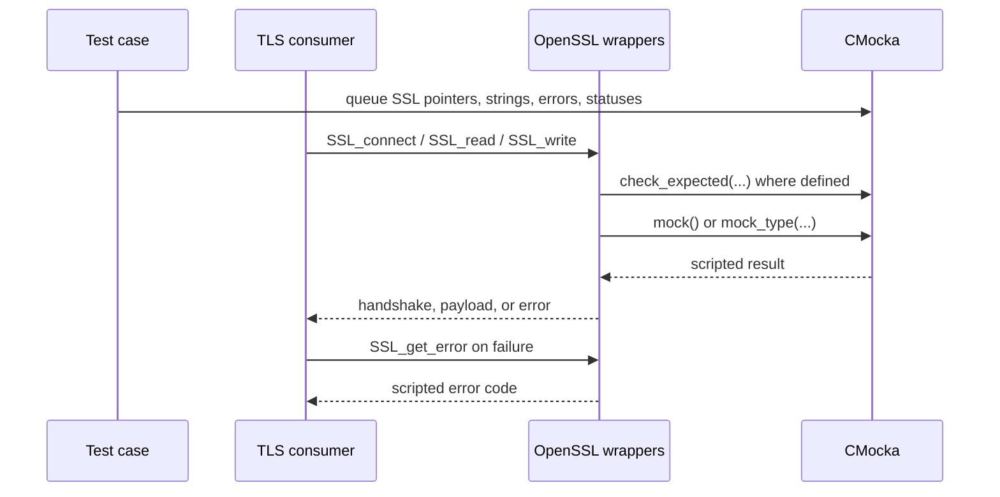
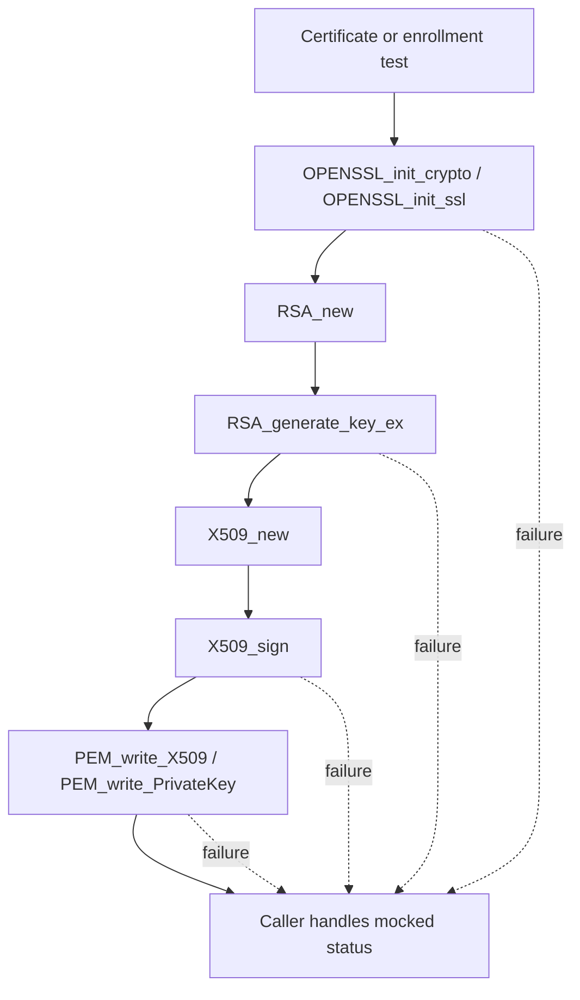
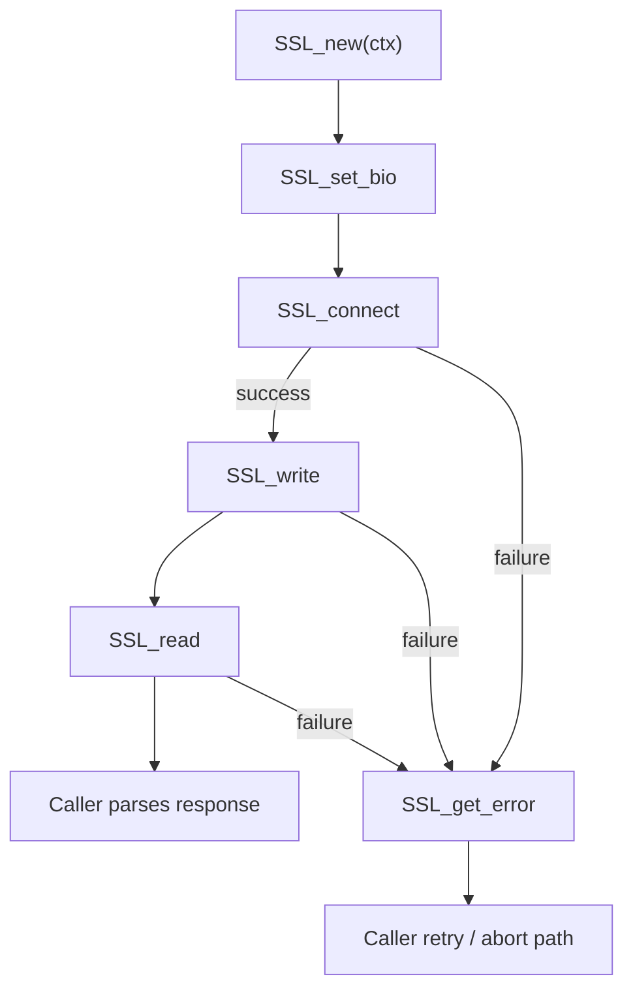
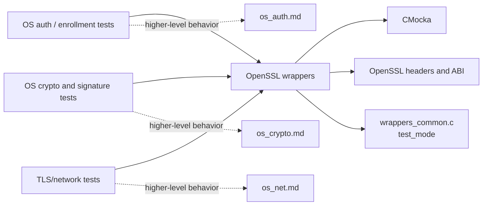

# `wrappers_externals_openssl`

`wrappers_externals_openssl` is Wazuh’s CMocka-based test seam for OpenSSL cryptography and TLS APIs. It replaces selected OpenSSL calls at link time so unit tests can control initialization, key generation, certificate signing, PEM output, digest updates, and TLS I/O without creating real cryptographic state or network connections.

This module is test infrastructure, not a cryptographic implementation. Production behavior remains in the consumers documented by modules such as [`os_auth.md`](os_auth.md), [`os_crypto.md`](os_crypto.md), and [`shared_lib_networking.md`](shared_lib_networking.md).

## Purpose and system position

The wrappers intercept symbols named by the linker’s `--wrap` mechanism. A test queues CMocka expectations and return values; code under test calls the normal OpenSSL symbol; the wrapper either returns the scripted result or, for selected constructors and digest operations, delegates to the real function when configured to do so.

The module is part of the broader wrapper hierarchy described in [`wrappers_common.md`](wrappers_common.md). It is consumed by native unit-test targets rather than by the running Wazuh daemons.

## Architecture

The implementation is split by OpenSSL concern:

### Component inventory

| Source | Wrapper entry points | Behavior |
|---|---|---|
| `digest_wrappers.c` | `__wrap_EVP_DigestUpdate` | In `test_mode`, checks `data` and `count` and returns `mock()`; otherwise calls `__real_EVP_DigestUpdate`. |
| `init_wrappers.c` | `__wrap_OPENSSL_init_crypto` | Ignores initialization arguments and returns the queued `mock()` result. |
| `pem_wrappers.c` | `__wrap_PEM_write_PrivateKey`, `__wrap_PEM_write_X509` | Return queued `int` values through `mock_type(int)`; no PEM is written. |
| `rsa_wrappers.c` | `__wrap_RSA_generate_key_ex`, `__wrap_RSA_new` | Key generation returns a queued status. `RSA_new` either delegates to `__real_RSA_new` when `mock()` is true or returns a queued `RSA *`. |
| `ssl_init_wrappers.c` | `__wrap_OPENSSL_init_ssl` | Ignores initialization arguments and returns `mock()`. |
| `ssl_lib_wrappers.c` | `__wrap_SSL_connect`, `__wrap_SSL_read`, `__wrap_SSL_write`, `__wrap_SSL_get_error`, `__wrap_SSL_new`, `__wrap_SSL_set_bio` | Models TLS connection, reads, writes, error codes, object construction, and BIO attachment. `SSL_read` can copy a mocked string into the caller buffer. |
| `x509_wrapppers.c` | `__wrap_X509_sign`, `__wrap_X509_new` | Certificate signing returns a queued status. `X509_new` conditionally delegates to the real constructor or returns a queued pointer. |

Some wrappers in `ssl_lib_wrappers.c`, `rsa_wrappers.c`, and `x509_wrapppers.c` are present in the implementation even though the module tree identifies only a subset as core components. They belong to the same external-library boundary and are documented here to preserve the complete ABI surface.

## Wrapper behavior

### Digest updates

`__wrap_EVP_DigestUpdate` is the only wrapper with an explicit runtime switch. When `test_mode` is enabled, it validates the input pointer and byte count and returns the test-selected result. When disabled, it forwards the operation to OpenSSL through `__real_EVP_DigestUpdate`. This allows tests to inject digest failures while retaining a path for real digest processing when required by a test fixture.

### Initialization, signing, serialization, and key generation

The initialization wrappers do not inspect `opts` or settings. PEM writers, RSA key generation, and X.509 signing return values supplied by CMocka. Consequently, tests can cover success and failure branches without generating keys, serializing certificates, or writing files.

`RSA_new` and `X509_new` have a two-mode pattern: a truthy `mock()` causes a real OpenSSL object to be allocated, while a false value causes `mock_type(...)` to provide the pointer. Tests using the real-construction branch remain responsible for releasing the resulting OpenSSL object through the appropriate consumer path.

### TLS library calls

The TLS wrappers model both control-plane calls and payload transfer:

- `SSL_connect` returns a mocked handshake result.
- `SSL_get_error` checks the supplied error-producing integer and returns a mocked OpenSSL error code.
- `SSL_read` checks `ssl`, `buf`, and `num`, copies a mocked string into `buf` with `snprintf`, and returns a mocked byte count or failure code.
- `SSL_write` checks `ssl` and `buf`, then returns a mocked result. Its `num` argument is intentionally not checked.
- `SSL_new` checks its `SSL_CTX *` and returns a mocked `SSL *`.
- `SSL_set_bio` is a no-op; it does not attach or free BIO objects.

## Data and process flows

### Certificate creation flow

The wrappers model the decision points, not the certificate contents. They do not verify key parameters, X.509 fields, signatures, PEM syntax, or filesystem output.

### TLS exchange flow

`SSL_read` writes the queued string before returning its queued integer. Tests should ensure the destination buffer and `num` are compatible with the supplied string; the wrapper uses `snprintf`, so truncation follows standard C library behavior rather than OpenSSL semantics.

## Dependencies and consumers

The closest documented consumers are:

- [`os_auth.md`](os_auth.md) for certificate enrollment, certificate validation, and SSL-based authentication.
- [`os_crypto.md`](os_crypto.md) for hashing, signatures, key material, and cryptographic helpers.
- [`os_net.md`](os_net.md) and [`os_auth_server_daemon.md`](os_auth_server_daemon.md) for higher-level secure socket and authentication flows, where available.
- [`wrappers_externals_audit.md`](wrappers_externals_audit.md), [`wrappers_externals_bzip2.md`](wrappers_externals_bzip2.md), and [`wrappers_externals_cjson.md`](wrappers_externals_cjson.md) for neighboring external-library seams.

The wrappers themselves do not depend on Wazuh databases, queues, daemon state, or network sockets. Those concerns are mocked by separate wrapper modules or tested at the higher-level consumer boundary.

## CMocka interaction contract

| Pattern | Used by | Test responsibility |
|---|---|---|
| `mock()` | OpenSSL initialization and digest update; constructor delegation switch | Queue a scalar result before the call. For constructors, understand that a truthy value selects real allocation. |
| `mock_type(int)` | PEM writers, RSA generation, TLS connect/read/write/error, X.509 signing | Queue an `int` with the exact expected type. |
| `mock_ptr_type(...)` | `SSL_new`, `RSA_new`, `X509_new`, and mocked TLS read text | Queue a pointer of the matching type. |
| `check_expected(...)` | Digest inputs, TLS handles/buffers, SSL error integer, SSL context, selected write/read arguments | Register expectations before calling production code. |
| `snprintf(...)` | `SSL_read` | Queue a valid `char *` payload and provide a writable buffer. |

Tests should queue values in the same order that the production path consumes them. A missing CMocka value usually indicates a setup error, while a returned failure value is the intended way to exercise the caller’s error handling.

## Limitations and maintenance notes

- These wrappers do not perform cryptographic operations, validate certificates, establish sockets, negotiate TLS, or write PEM files.
- `SSL_set_bio` is intentionally inert; BIO ownership and lifetime are not tested here.
- `SSL_write` does not check `num`, and initialization wrappers do not check their option/settings arguments. This is deliberate but should be preserved in test expectations.
- The wrapper set does not itself model OpenSSL error queues, peer certificates, cipher negotiation, or partial-write semantics beyond the returned integer.
- Keep signatures synchronized with the OpenSSL version and linker wrapping flags. The filename `x509_wrapppers.c` contains the existing spelling and should not be changed casually because build rules may reference it.
- When adding a wrapper, document whether it checks arguments, records output, delegates to a real symbol, or returns a queued value. Avoid introducing real cryptographic state into this seam.

## Related documentation

- [`wrappers_common.md`](wrappers_common.md) — shared wrapper conventions and test-mode support.
- [`os_auth.md`](os_auth.md) — authentication and certificate consumers.
- [`os_crypto.md`](os_crypto.md) — Wazuh cryptographic helpers and tests.
- [`wrappers_externals_cjson.md`](wrappers_externals_cjson.md) — analogous CMocka wrappers for an external library.
