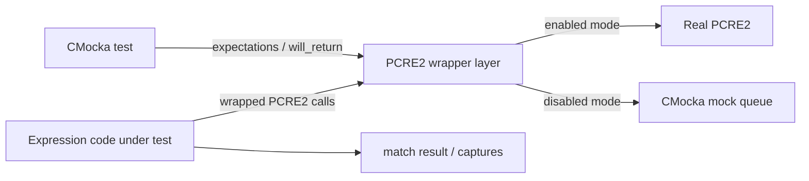
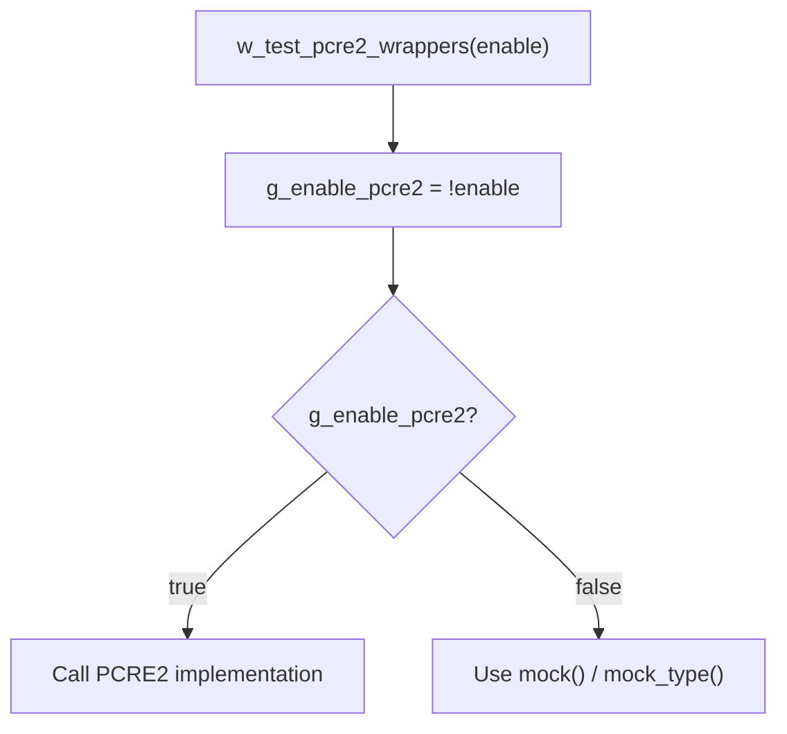
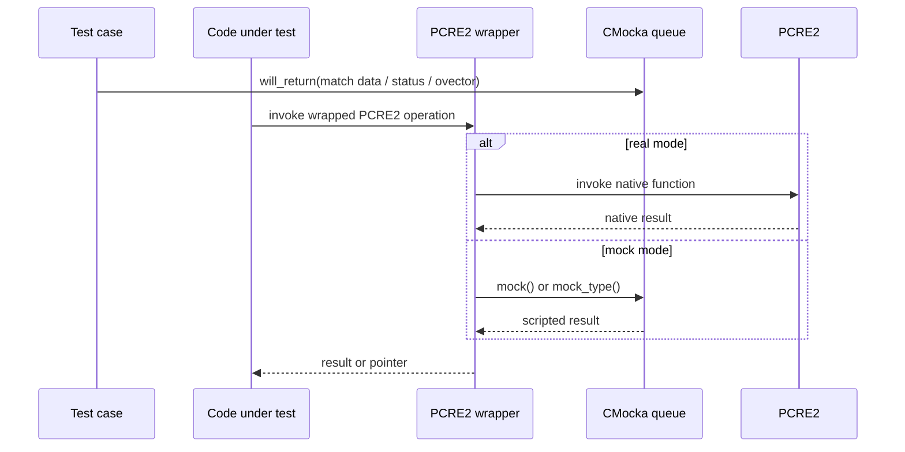
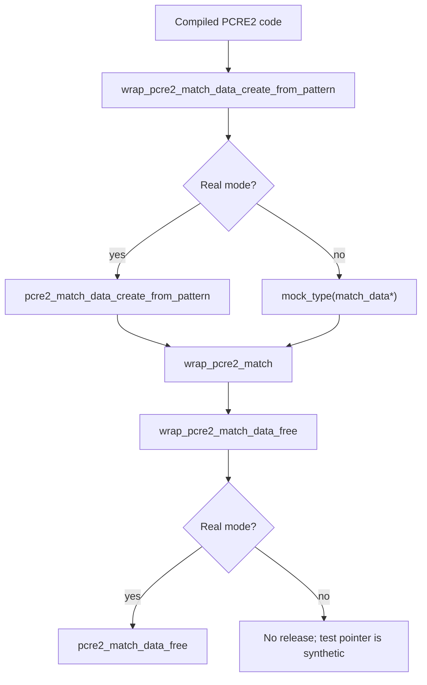
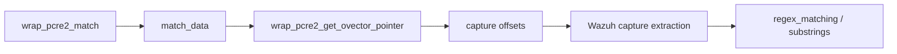
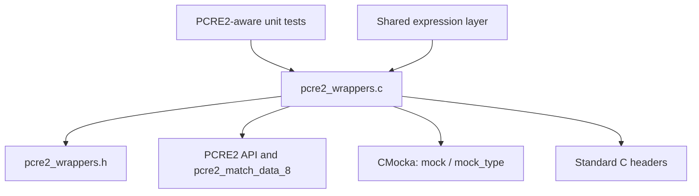
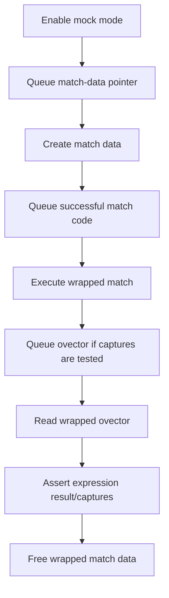
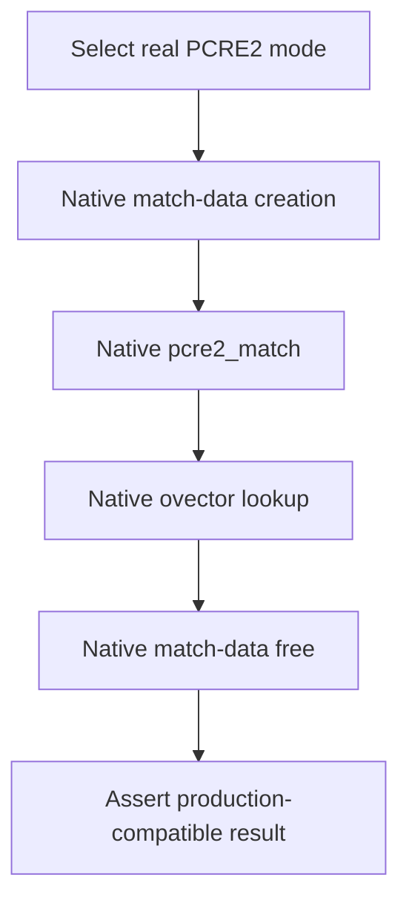

# `wrappers_externals_pcre2`

`wrappers_externals_pcre2` is Wazuh’s CMocka adapter for selected PCRE2 calls used by native unit tests. It lets tests choose between the real PCRE2 implementation and deterministic mock return values for match-data creation, matching, match-data cleanup, and capture-vector access.

This module is test infrastructure; it is not part of Wazuh’s production regular-expression engine. The expression abstraction and its PCRE2 behavior are documented in [`test_expression.md`](test_expression.md) and [`os_regex.md`](os_regex.md).

## Purpose and system position

Production code normally reaches PCRE2 through Wazuh’s shared expression layer. During unit tests, linker wrapping redirects selected PCRE2 symbols to this file. Tests can therefore exercise success, no-match, allocation failure, capture-group, and cleanup paths without depending on a particular PCRE2 state or pattern result.



The wrapper is especially relevant to [`test_expression.md`](test_expression.md), where PCRE2 dispatch, matching, and capture extraction are validated at the expression boundary.

## Components

Implementation: `src/unit_tests/wrappers/externals/pcre2/pcre2_wrappers.c`.

| Component | Role | Controlled behavior |
|---|---|---|
| `w_test_pcre2_wrappers` | Selects the real-library or mock path | Updates the internal mode flag |
| `wrap_pcre2_match_data_create_from_pattern` | Creates match data from compiled code | Delegates to PCRE2 or returns `mock_type(pcre2_match_data_8*)` |
| `wrap_pcre2_match` | Executes a PCRE2 match | Delegates to PCRE2 or returns `mock()` |
| `wrap_pcre2_match_data_free` | Releases match data | Frees only when real mode is enabled |
| `wrap_pcre2_get_ovector_pointer` | Retrieves capture offsets | Delegates to PCRE2 or returns `mock_type(size_t*)` |

The supplied core-component list identifies `wrap_pcre2_match` and `wrap_pcre2_match_data_free`; the source also defines the match-data creation, mode-selection, and ovector helpers. They are documented here because they form the complete behavior of the source file and its test seam.

## Mode selection

The file stores mode in the static variable `g_enable_pcre2`. Its initial value is `false`. `w_test_pcre2_wrappers(bool enable)` assigns the inverse of its argument:

```c
g_enable_pcre2 = !enable;
```

Consequently, callers must account for the wrapper’s historical inverted control convention. When `g_enable_pcre2` is true, wrappers invoke PCRE2 directly. When it is false, wrappers use CMocka. The inversion should not be “simplified” without checking all existing tests and build conventions.



## CMocka interaction model

The mock branch does not inspect the compiled pattern, subject string, match options, or auxiliary context. It consumes values queued by the current test:

- `mock_type(pcre2_match_data_8*)` supplies synthetic match data or `NULL`.
- `mock()` supplies a PCRE2 return code, such as a successful match or a negative no-match/error code.
- `mock_type(size_t*)` supplies a synthetic ovector for capture extraction.



Tests must queue values in the same order as the production call sequence. A missing or incorrectly typed mock value is a test setup error, not a PCRE2 runtime error.

## Match-data lifecycle

The match-data helpers provide a controllable lifecycle around a compiled PCRE2 pattern. In mock mode, creation returns a test-supplied opaque pointer and free is a no-op. This avoids allocating or releasing a real PCRE2 object while still allowing callers to test null checks and cleanup branches.



`wrap_pcre2_match` passes all arguments through unchanged in real mode. In mock mode, only the queued integer result is observable. This supports tests that need to distinguish a match (`>= 0` in normal PCRE2 conventions) from no-match or error results without executing the pattern.

## Capture-vector access

`wrap_pcre2_get_ovector_pointer` controls the offset vector used by callers to extract captured substrings. In real mode it returns the vector owned by the PCRE2 match-data object. In mock mode it returns a test-supplied `size_t *`.



The wrapper does not validate offsets or copy capture text. Offset interpretation, bounds checking, and substring ownership belong to the expression implementation and are covered by [`test_expression.md`](test_expression.md).

## Dependencies



The implementation includes CMocka and the local wrapper header, and uses PCRE2 types and functions. The standard headers provide basic declarations used by the wrapper source. No filesystem, network, thread, or persistent allocation is introduced by this module.

## Typical process flows

### Mocked successful match



### Injected failure or no-match


### Real-library verification



## Test-author guidance

1. Confirm the wrapper mode before queuing mocks; real mode bypasses the CMocka queue.
2. Queue a `pcre2_match_data_8 *` for match-data creation, then queue the integer result expected from `wrap_pcre2_match`.
3. Queue an ovector pointer only when the code under test calls `wrap_pcre2_get_ovector_pointer` in mock mode.
4. Use `NULL` match data or negative match results to exercise defensive and no-match paths.
5. Keep cleanup assertions in the higher-level expression tests. The mock free wrapper intentionally does not release synthetic pointers.

## Limitations and maintenance notes

- The mock path does not validate PCRE2 arguments or execute patterns; semantic regex coverage belongs to real PCRE2 tests and the expression layer.
- Mocked match-data and ovector pointers are opaque test values. They must not be dereferenced by the wrapper itself.
- `wrap_pcre2_match_data_free` is intentionally a no-op in mock mode, preventing invalid frees of CMocka-supplied pointers.
- The mode flag uses an inverted setter convention. Preserve this behavior unless all callers are migrated together.
- Keep wrapper signatures synchronized with the PCRE2 ABI and linker wrapping configuration, including the `_8` API types.

## Related documentation

- [`test_expression.md`](test_expression.md) — expression compilation, matching, PCRE2 capture extraction, and cleanup tests.
- [`os_regex.md`](os_regex.md) — Wazuh’s regex abstraction and backend relationships.
- [`wrappers_externals_cjson.md`](wrappers_externals_cjson.md) — neighboring external-library CMocka wrapper conventions.
- [`wrappers_common.md`](wrappers_common.md) — common wrapper infrastructure, if present in the generated documentation set.
