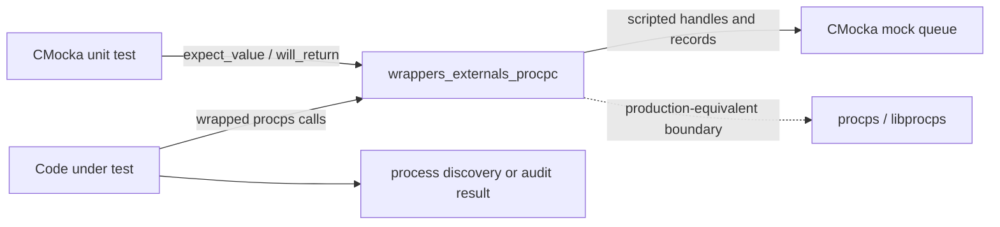
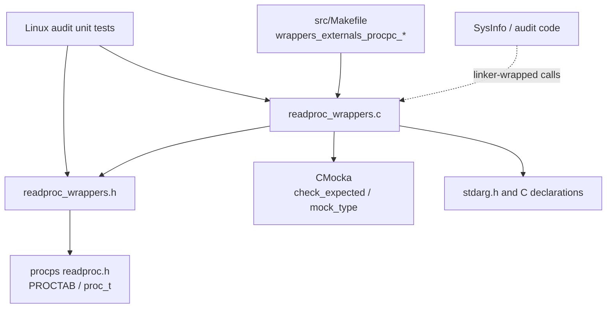
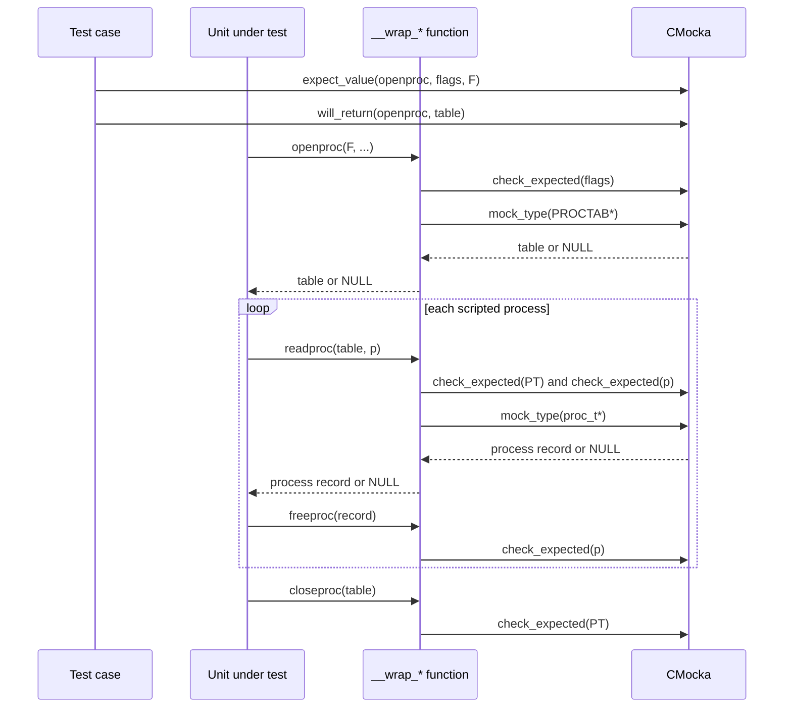
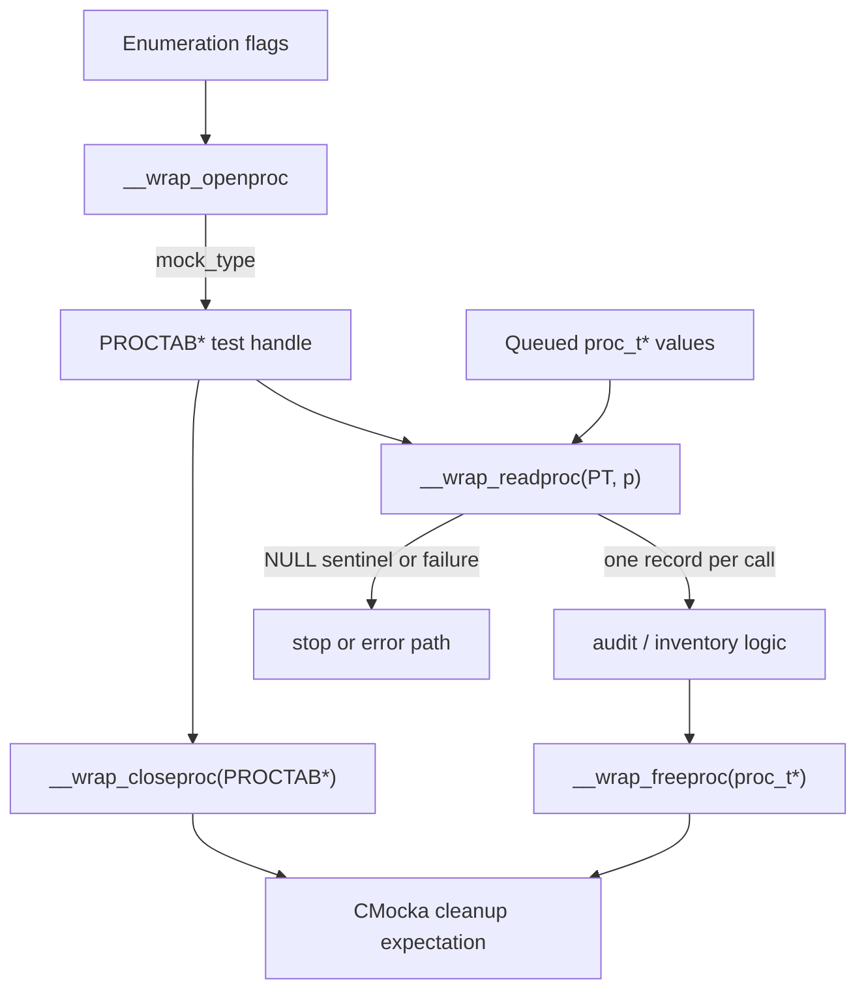
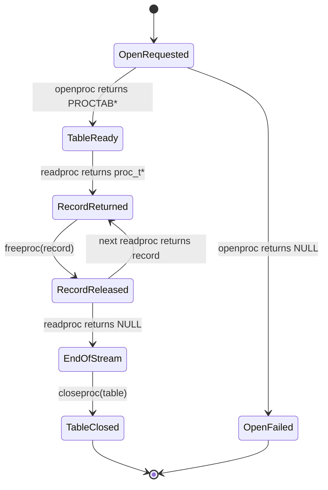

# `wrappers_externals_procpc`

`wrappers_externals_procpc` provides CMocka linker wrappers for the `procps` process-table API used by Wazuh’s native unit tests. The seam replaces process-table opening, iteration, and cleanup with expectation checks and scripted return values, allowing tests to model normal process enumeration and failures without reading the host `/proc` state.

The implementation is `src/unit_tests/wrappers/externals/procpc/readproc_wrappers.c`; its declarations and `procps` types are provided by `readproc_wrappers.h`. The module belongs to test infrastructure, not to Wazuh’s production process scanner.

## Purpose and system position

The wrapper isolates code that calls `openproc()`, `readproc()`, `freeproc()`, and `closeproc()`. In production, these functions come from the external `procps` library. In unit tests, linker wrapping redirects calls to the `__wrap_*` functions below.



The primary observed consumer is the Linux audit test suite, documented in [`test_syscheck_audit.md`](test_syscheck_audit.md). The production process inventory implementation uses the same external API; its platform-specific behavior is described in [`data_provider_sysinfo_core_unix.md`](data_provider_sysinfo_core_unix.md).

## Components

| Wrapper | Signature | Behavior |
|---|---|---|
| `__wrap_openproc` | `PROCTAB *(int flags, ...)` | Verifies the requested `flags` and returns a test-supplied `PROCTAB *` via `mock_type(PROCTAB*)`. The variadic arguments are intentionally not inspected. |
| `__wrap_readproc` | `proc_t *(PROCTAB *PT, proc_t *p)` | Verifies `PT` and `p`, then returns a test-supplied process record or `NULL` via `mock_type(proc_t*)`. |
| `__wrap_freeproc` | `void (proc_t *p)` | Verifies that the expected process record is released. It does not free memory itself. |
| `__wrap_closeproc` | `void (PROCTAB *PT)` | Verifies that the expected process table is closed. It does not close an external handle. |

The supplied component list highlights `__wrap_closeproc` and `__wrap_freeproc`; `__wrap_openproc` and `__wrap_readproc` are also defined in the same source and are required to understand the complete process-table lifecycle.

## Architecture and dependencies



The source has no persistent state, allocation, filesystem access, process enumeration, or cleanup side effects. Its only observable effects are CMocka expectation validation and consumption of values from the current test’s mock queue.

## Wrapper interaction model



`check_expected()` asserts argument identity/value but does not alter it. `mock_type()` supplies the return object queued with `will_return()`. Therefore, the wrapper does not interpret process fields such as PID, command, thread ID, or status; higher-level code performs that interpretation.

## Data flow



Typical iteration uses a `NULL` result from `readproc()` as the end-of-stream sentinel. A `NULL` result from `openproc()` represents failure before iteration starts. Since the wrapper returns exactly what the test queues, callers can also exercise partial enumeration and cleanup paths deterministically.

## Process-table lifecycle



The wrapper itself does not enforce this state machine. It records the calls the unit under test makes, so incorrect lifecycle behavior is detected through unmet or unexpected CMocka expectations.

## Test setup patterns

For a successful sequence, tests generally:

1. Expect the exact `PROC_FILL*` flag mask passed to `openproc()`.
2. Queue a synthetic `PROCTAB *` handle.
3. Expect each `readproc()` call with the same table and the expected input process pointer, commonly `NULL` for fresh records.
4. Queue one `proc_t *` per process, followed by `NULL` to terminate iteration.
5. Expect `freeproc()` for every returned record and `closeproc()` for the table.

```c
expect_value(__wrap_openproc, flags, PROC_FILLSTAT | PROC_FILLSTATUS | PROC_FILLCOM);
will_return(__wrap_openproc, table);

expect_value(__wrap_readproc, PT, table);
expect_value(__wrap_readproc, p, NULL);
will_return(__wrap_readproc, process);

expect_value(__wrap_readproc, PT, table);
expect_value(__wrap_readproc, p, NULL);
will_return(__wrap_readproc, NULL);

expect_value(__wrap_freeproc, p, process);
expect_value(__wrap_closeproc, PT, table);
```

Failure tests can queue `NULL` from `openproc()` or `readproc()`. The caller’s expected return code and whether cleanup is attempted are assertions in the consuming test, not decisions made by this wrapper.

## Integration with Wazuh tests

The wrapper header is included by Linux audit-related tests such as `test_syscheck_audit.c`, `test_audit_parse.c`, `test_audit_rule_handling.c`, and `test_audit_healthcheck.c`. Those tests use synthetic `proc_t` records to control process-name and thread-related logic. See [`test_syscheck_audit.md`](test_syscheck_audit.md) for the audit test scenarios and [`rootcheck_checks.md`](rootcheck_checks.md) for the separate rootcheck `/proc` cross-check behavior.

The source is collected into the unit-test wrapper objects by the `wrappers_externals_procpc_*` variables in `src/Makefile`. This keeps the external seam available to test binaries while leaving production builds linked to the real `procps` implementation.

## Maintenance considerations

- Keep declarations in `readproc_wrappers.h` synchronized with the external `procps` ABI and the linker `--wrap` symbols.
- Preserve the variadic `openproc` signature; callers may pass library-specific optional arguments even though this wrapper only validates `flags`.
- Do not add real process-table cleanup to `__wrap_freeproc` or `__wrap_closeproc`; tests may pass stack, static, or synthetic objects.
- Queue return values in exact call order. CMocka does not infer which `proc_t *` belongs to which iteration.
- Add behavior to the consuming unit test when validating process-field interpretation; this module should remain a narrow call/return seam.

## Related documentation

- [`test_syscheck_audit.md`](test_syscheck_audit.md) — Linux audit tests that consume the procps wrappers.
- [`data_provider_sysinfo_core_unix.md`](data_provider_sysinfo_core_unix.md) — production Unix process inventory and its `openproc`/`readproc` loop.
- [`rootcheck_checks.md`](rootcheck_checks.md) — rootcheck process visibility checks and `/proc` thread disambiguation.
- [`wrappers_externals_pcre2.md`](wrappers_externals_pcre2.md) — neighboring external-library wrapper conventions.
- [`wrappers_common.md`](wrappers_common.md) — common wrapper test infrastructure.
