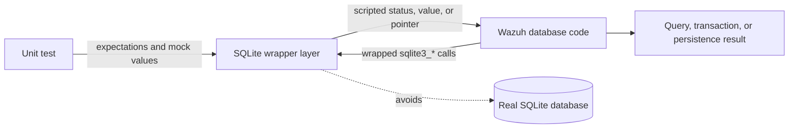
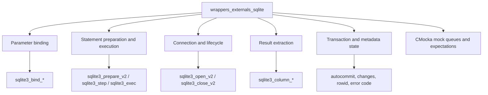
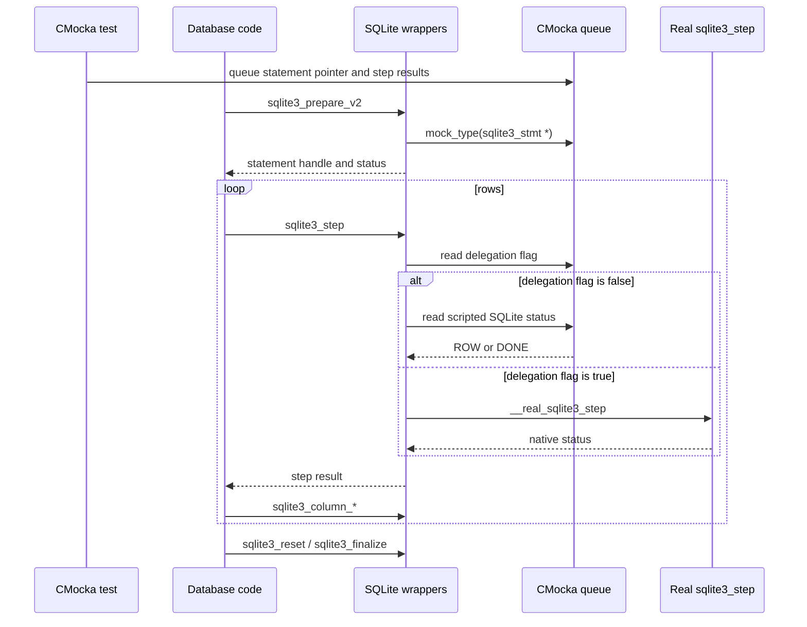
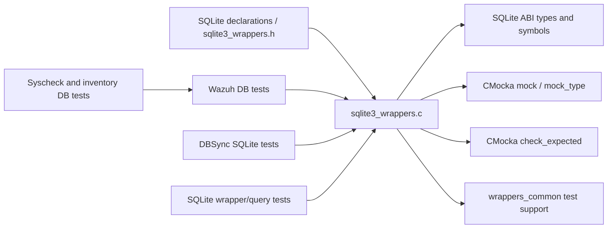
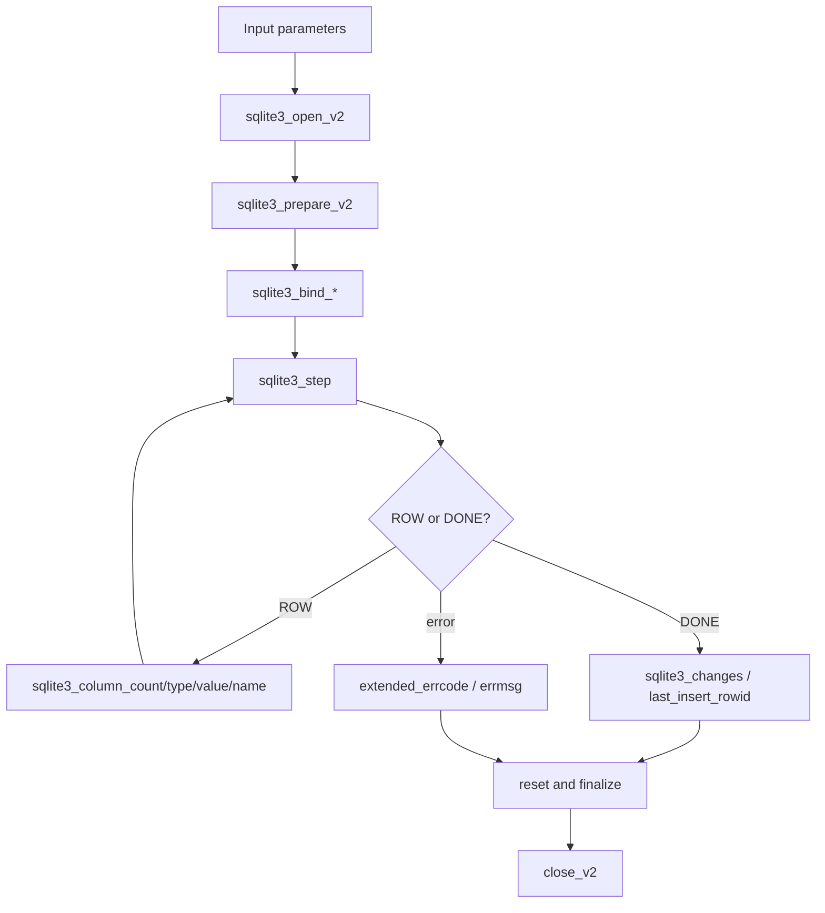
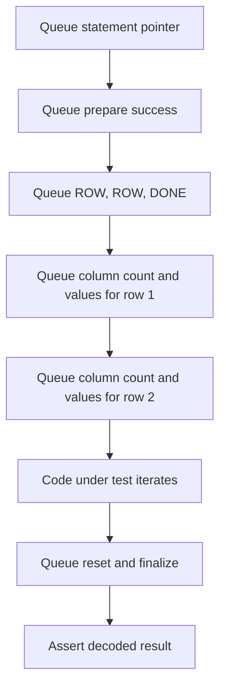
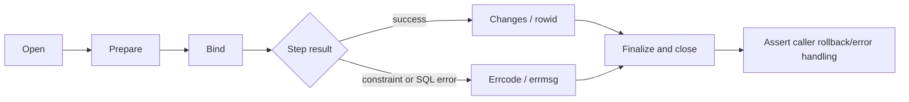
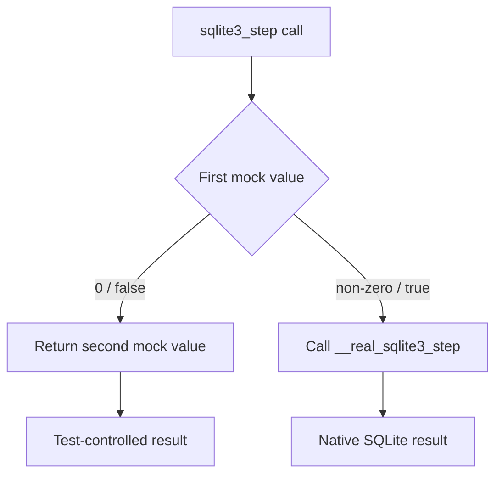

# `wrappers_externals_sqlite`

`wrappers_externals_sqlite` is Wazuh’s CMocka-based test seam for the SQLite C API. It replaces database handles, prepared statements, binding, stepping, result extraction, transaction state, and cleanup with deterministic mocks so unit tests can exercise database code without depending on a real database file or a particular SQLite result.

The module is test infrastructure, not a database implementation. Production persistence and query behavior remain in consumers such as [`wazuh_db.md`](wazuh_db.md), [`dbsync_sqlite_backend.md`](dbsync_sqlite_backend.md), [`sqlite_wrapper.md`](sqlite_wrapper.md), and the higher-level framework query modules.

## Purpose and system position

The wrappers intercept selected `sqlite3_*` symbols in unit-test builds. Tests register argument expectations and return values with CMocka; the code under test continues to call the normal SQLite API and receives the scripted result.

This boundary makes it possible to test success, constraint errors, preparation failures, empty result sets, transaction failures, and multi-row iteration without creating or mutating a live SQLite database.

## Architecture

All functions are implemented in one source file:

`src/unit_tests/wrappers/externals/sqlite/sqlite3_wrappers.c`

The source includes SQLite declarations, CMocka, and the shared wrapper support in `../../common.h`. The wrapper functions ignore database and statement pointers unless an argument is explicitly checked; those pointers are supplied by tests as opaque handles.

## Component inventory

### Parameter binding

| Wrapper | Checked arguments | Returned behavior |
|---|---|---|
| `__wrap_sqlite3_bind_int` | `index`, `value` | Returns `mock()`; `expect_sqlite3_bind_int_call()` queues a complete expectation. |
| `__wrap_sqlite3_bind_int64` | `index`, `value` | Returns `mock()`. |
| `__wrap_sqlite3_bind_double` | `index`, `value` | Returns `mock()`. |
| `__wrap_sqlite3_bind_null` | `index` | Returns `mock()`. |
| `__wrap_sqlite3_bind_text` | `pos`, and `buffer` when non-null | Returns `mock()`; length and destructor are intentionally not checked. |
| `__wrap_sqlite3_bind_parameter_index` | `zName` | Returns `mock()`. |
| `__wrap_sqlite3_clear_bindings` | None | Returns `mock()`. |

`check_expected()` runs before the return value is consumed. A mismatch fails the CMocka test, which makes these wrappers useful for verifying that query builders bind the intended position and value. The helper `expect_sqlite3_bind_int64_call()` has a `double` parameter in the source even though the wrapped SQLite value is `sqlite3_int64`; callers should preserve the existing helper signature and use it consistently with the test suite.

### Query preparation and execution

| Wrapper | Behavior |
|---|---|
| `__wrap_sqlite3_prepare_v2` | Places a mocked `sqlite3_stmt *` in `*ppStmt`, sets `*pzTail` to null when supplied, and returns `mock()`. SQL text is not checked by this wrapper. |
| `__wrap_sqlite3_exec` | Checks `sql`, writes a mocked `char *` to `*errmsg`, and returns `mock()`. |
| `__wrap_sqlite3_step` | Uses a two-stage mock protocol: a truthy first mock delegates to `__real_sqlite3_step`; a false first mock returns the next queued value. |
| `__wrap_sqlite3_reset` | Returns `mock()`. |
| `__wrap_sqlite3_finalize` | Returns `mock()`. |

The step wrapper is the module’s main iteration seam. `expect_sqlite3_step_call(ret)` queues the non-delegating path, and `expect_sqlite3_step_count(ret, count)` repeats that setup for a known number of calls. This models common SQLite sequences such as `SQLITE_ROW`, followed by `SQLITE_DONE`, without needing a prepared statement backed by real tables.

### Result extraction

| Wrapper | Checked arguments | Mocked result |
|---|---|---|
| `__wrap_sqlite3_column_count` | None | `int` from `mock()`. |
| `__wrap_sqlite3_column_type` | Column index `i` | `int` from `mock()`. |
| `__wrap_sqlite3_column_int` | Column index `iCol` | `int` from `mock()`. |
| `__wrap_sqlite3_column_int64` | Column index `iCol` | `sqlite3_int64` from `mock()`. |
| `__wrap_sqlite3_column_double` | Column index `iCol` | `double` from `mock_type(double)`. |
| `__wrap_sqlite3_column_text` | Column index `iCol` | `const unsigned char *` from `mock_type(...)`. |
| `__wrap_sqlite3_column_name` | Column index `N` | `char *` from `mock_ptr_type(...)`. |
| `__wrap_sqlite3_sql` | None | `char *` from `mock_ptr_type(...)`. |

These functions let tests control both SQLite’s reported type and the converted value. They do not enforce consistency between the type and value; tests that need conversion behavior should queue a coherent combination explicitly.

### Connection, errors, and metadata

| Wrapper | Behavior |
|---|---|
| `__wrap_sqlite3_open_v2` | Checks `filename` and `flags`, stores a mocked `sqlite3 *` in `*ppDb`, and returns `mock()`. |
| `__wrap_sqlite3_close_v2` | Returns `mock()`. |
| `__wrap_sqlite3_extended_errcode` | Returns a mocked extended error code. |
| `__wrap_sqlite3_errmsg` | Returns a mocked `const char *`. |
| `__wrap_sqlite3_free` | No-op; it never frees the supplied pointer. |
| `__wrap_sqlite3_get_autocommit` | Returns a mocked autocommit state. |
| `__wrap_sqlite3_changes` | Returns a mocked affected-row count. |
| `__wrap_sqlite3_last_insert_rowid` | Returns a mocked row identifier. |

The no-op `sqlite3_free` is intentional: ownership of mocked error strings and other SQLite-managed memory remains with the test fixture. It prevents the wrapper from freeing arbitrary mock pointers.

## Dependency relationships

The module is consumed directly or indirectly by tests for:

- [`wazuh_db.md`](wazuh_db.md), including global, FIM, syscollector, task, integrity, and metadata database behavior.
- [`dbsync.md`](dbsync.md) and [`dbsync_sqlite_backend.md`](dbsync_sqlite_backend.md), where SQLite is the concrete DBSync engine.
- [`sqlite_wrapper.md`](sqlite_wrapper.md), which provides higher-level C++/C++-adjacent SQLite abstractions.
- [`syscheckd_db.md`](syscheckd_db.md) and inventory persistence tests, where SQLite-backed state is exercised through Wazuh DB or DBSync layers.

The external wrapper itself does not know about agents, FIM records, inventory schemas, RBAC, or API responses. Those domain concerns belong to the consuming modules and should be linked rather than reproduced here.

## Data flow through a database operation

Every external interaction in this flow is independently scriptable. A test can therefore isolate whether a failure came from opening the database, preparing SQL, binding a value, stepping, decoding a column, or cleaning up.

## Representative test flows

### Select with multiple rows

The step-count helper is useful for the repeated return values, while column wrappers provide the row payload. The wrapper does not retain row state; the test must queue values in the order the production code reads them.

### Write or transaction failure injection

The same flow covers transaction helpers that invoke `sqlite3_exec` for `BEGIN`, `COMMIT`, or `ROLLBACK`: check the SQL string, queue an error message pointer, and return the desired SQLite status.

### Real-step escape hatch

Most unit tests should use the fully mocked path. The delegation branch exists for tests that construct a real SQLite statement but still need the wrapper symbol in the link. Its use couples a test to SQLite setup and should be documented in that test.

## Test-author guidance

1. Queue all `expect_value()` or `expect_string()` checks before calling the production function.
2. Queue `will_return()` values in the exact order that the wrapper consumes them. This is especially important for `sqlite3_step`, which consumes a delegation flag and, when false, a second status value.
3. Use `mock_type()` or `mock_ptr_type()` for pointers, `double`, and SQLite integer values where the wrapper expects typed extraction.
4. Provide output locations for `sqlite3_open_v2`, `sqlite3_prepare_v2`, and `sqlite3_exec`; the wrappers write to `*ppDb`, `*ppStmt`, `*pzTail`, and `*errmsg` when applicable.
5. Keep mocked text and error pointers valid for the duration of the caller’s use. `sqlite3_free` is a no-op, so cleanup must be handled by the fixture if the test allocated the memory.
6. Do not assume that unchecked arguments are validated. SQL text is checked by `sqlite3_exec`, but not by `sqlite3_prepare_v2`; binding length/destructor and several pointer arguments are intentionally ignored.

## Limitations and maintenance considerations

- The wrappers do not parse SQL, enforce schema constraints, implement transactions, or reproduce SQLite locking and WAL behavior.
- They do not maintain statement or connection state between calls. Any state machine must be represented by the test’s mock queue.
- `sqlite3_free` is deliberately inert and should remain so unless ownership semantics are redesigned across the test suite.
- `sqlite3_step` has an unusual delegation protocol. Changes to it require reviewing every use of `expect_sqlite3_step_call()` and `expect_sqlite3_step_count()`.
- Preserve native SQLite signatures and output-pointer behavior. Link-time wrapping is sensitive to ABI and declaration drift.
- Add argument checks sparingly. A new check can make existing tests fail even when the production behavior remains valid.
- Keep database-domain assertions in the consuming test modules; this layer should remain deterministic, stateless, and focused on the SQLite ABI boundary.

## Related documentation

- [`wrappers_common.md`](wrappers_common.md) — shared CMocka wrapper conventions.
- [`wazuh_db.md`](wazuh_db.md) — Wazuh database daemon and persistence responsibilities.
- [`dbsync.md`](dbsync.md) — database synchronization abstractions.
- [`dbsync_sqlite_backend.md`](dbsync_sqlite_backend.md) — SQLite-backed DBSync implementation.
- [`sqlite_wrapper.md`](sqlite_wrapper.md) — higher-level SQLite wrapper abstractions.
- [`wrappers_externals_audit.md`](wrappers_externals_audit.md) and [`wrappers_externals_openssl.md`](wrappers_externals_openssl.md) — neighboring external-library test seams.
