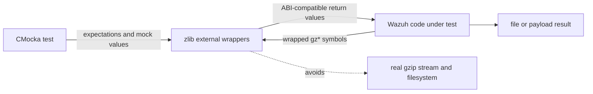
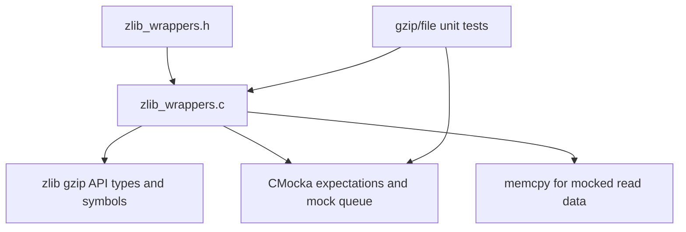
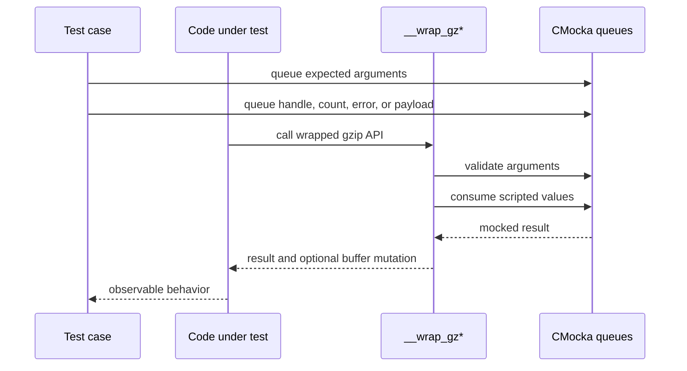
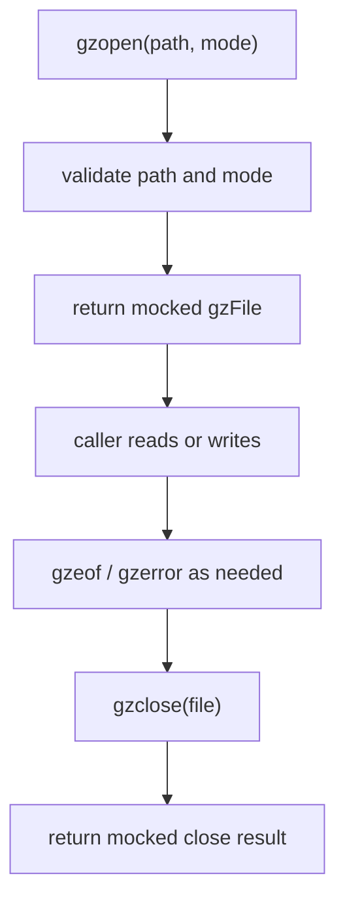
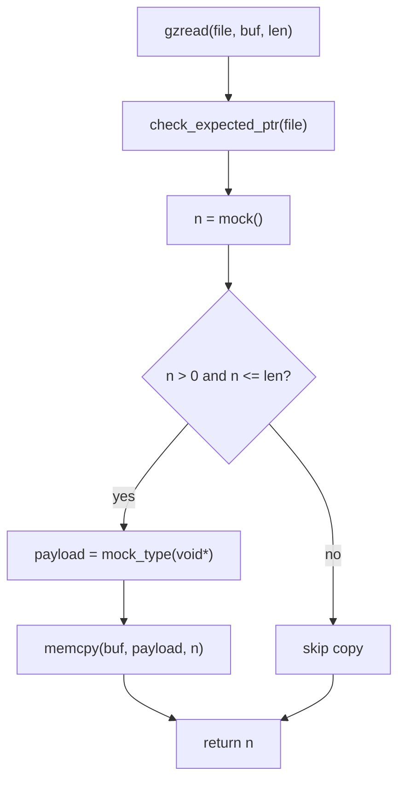
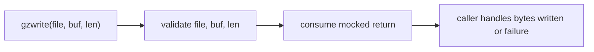
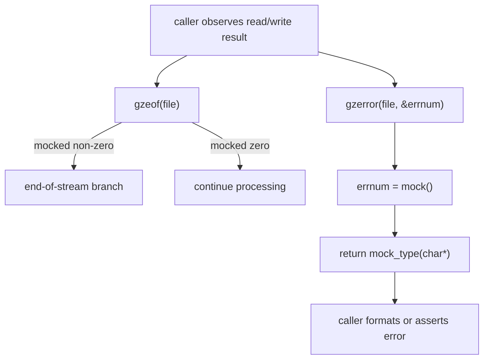
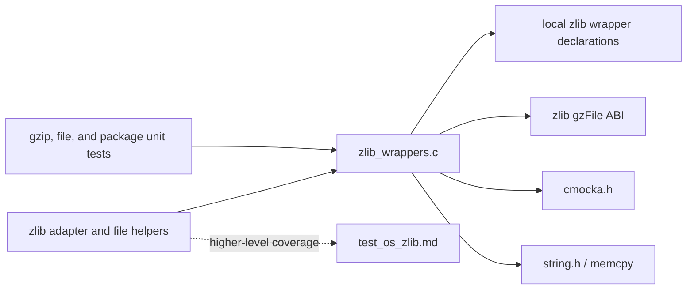
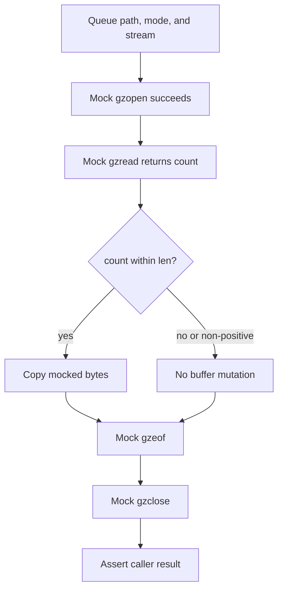
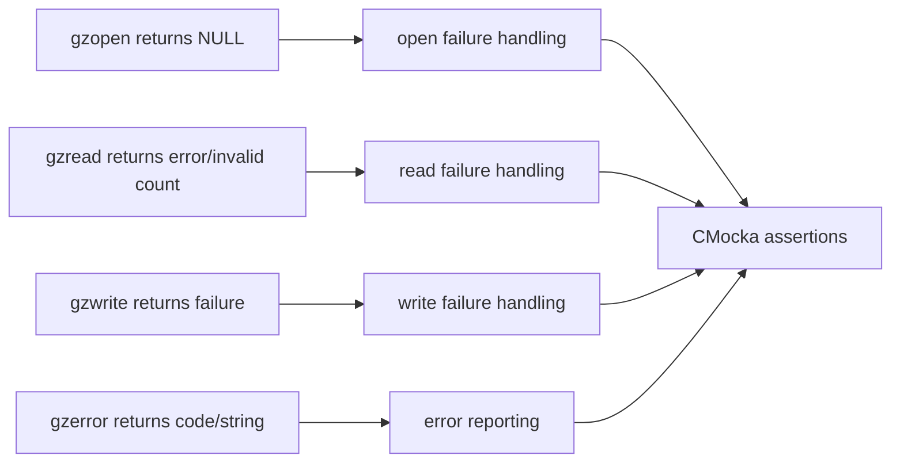

# `wrappers_externals_zlib`

`wrappers_externals_zlib` is Wazuh’s CMocka wrapper layer for the external zlib gzip-stream API. It replaces `gzopen`, `gzread`, `gzwrite`, `gzeof`, `gzclose`, and `gzerror` during unit tests with deterministic functions that validate selected arguments and return values supplied by the active test.

This module is test infrastructure, not a compression implementation. The production zlib adapter and its contract are covered by [`test_os_zlib.md`](test_os_zlib.md); this document describes the external-call seam used when code works with `gzFile` streams. Shared wrapper conventions belong to [`wrappers_common.md`](wrappers_common.md).

## Purpose and system position

Production code can use zlib stream operations for gzip-compatible file or payload handling. In unit-test builds, linker wrapping redirects those calls to this module. Tests therefore control open handles, read/write results, end-of-file state, error codes, and error strings without creating real gzip files or depending on the host zlib runtime.

The wrapper is used alongside higher-level tests such as [`test_os_zlib.md`](test_os_zlib.md), but it does not duplicate their compression/decompression assertions. The adapter tests establish behavior such as successful round trips and invalid-argument handling; this module only controls the external API boundary.

## Architecture

Implementation: [`src/unit_tests/wrappers/externals/zlib/zlib_wrappers.c`](src/unit_tests/wrappers/externals/zlib/zlib_wrappers.c).

The implementation is stateless. It does not allocate, open, close, or retain gzip state. Every result is consumed from CMocka’s queue, and every argument check is performed against expectations registered by the test.

## Component inventory

| Wrapper | Responsibility | Controlled behavior |
|---|---|---|
| `__wrap_gzopen` | Open a gzip stream | Checks `path` and `mode`; returns a mocked `gzFile`. |
| `__wrap_gzread` | Read decompressed bytes | Checks the stream; returns a mocked count; conditionally copies a mocked payload. |
| `__wrap_gzwrite` | Write bytes to a gzip stream | Checks stream, buffer, and length; returns a mocked count/status. |
| `__wrap_gzeof` | Query end-of-file state | Checks the stream; returns a mocked integer. |
| `__wrap_gzclose` | Close a gzip stream | Checks the stream; returns a mocked integer. |
| `__wrap_gzerror` | Retrieve stream error information | Checks the stream, writes a mocked error number, and returns a mocked error string. |

The supplied module tree identifies the first five wrappers. `__wrap_gzerror` is also present in the source and is included because it is part of the file’s effective test surface.

## CMocka interaction model

The wrappers use three kinds of CMocka operations:

- `check_expected()` validates scalar arguments such as paths, modes, buffers, and lengths.
- `check_expected_ptr()` validates opaque handles such as `gzFile` values.
- `mock()` and `mock_type()` supply return values, payload pointers, and error numbers.

The order of `will_return()` values matters. A test must queue values in the order the wrapper consumes them, including the payload pointer after a read count when a copy is expected.

## Open and lifecycle flow

`__wrap_gzopen` validates the exact path and mode passed by the caller, then returns the next mocked `gzFile`. A `NULL` handle can model an open failure. `__wrap_gzclose` validates that same handle and returns a scripted close result; it does not release anything.

The wrapper does not validate or interpret the mode string beyond passing it through CMocka expectations. File existence, compression format, and stream allocation remain outside this module.

## Read path

`__wrap_gzread` first checks the stream pointer and then consumes an integer `n` from `mock()`. When `n` is positive and no greater than the caller’s `len`, it copies `n` bytes from the next mocked pointer into `buf` with `memcpy`. It returns `n` in all cases.

The length guard prevents the test double from writing beyond the advertised destination capacity. It also allows tests to model zero, negative, or oversized read results without mutating the caller’s buffer. The wrapper does not add a terminator or interpret gzip end-of-stream semantics; callers use the scripted count and any separately scripted `gzeof` result.

## Write path

`__wrap_gzwrite` checks the stream pointer, the exact input buffer pointer, and the requested `unsigned int len`, then returns `mock()`.

No bytes are copied and no stream state is updated. Content verification belongs in the caller’s test expectations or in an integration test that deliberately uses real zlib.

## End-of-file and error paths

`__wrap_gzeof` checks the stream and returns a mocked integer, allowing tests to distinguish “more data available” from end-of-stream without performing a read. `__wrap_gzerror` checks the stream, stores a mocked value in `*errnum`, and returns a mocked `char *` error string.

The wrapper assumes `errnum` is non-null and writes through it unconditionally. Tests should provide a valid integer pointer. The returned string is not copied or freed by the wrapper; its lifetime is owned by the test fixture or mock setup.

## Dependencies and consumers

The wrapper has no dependency on Wazuh domain objects, databases, sockets, or persistent files. Consumers should document domain behavior in their own module files and link back here for the external-call mechanics.

## Representative process flows

### Successful read

### Failure injection

## Test-author guidance

1. Queue path and mode expectations before calling code that opens a stream.
2. Queue the returned `gzFile` with `mock_type(gzFile)` and use the same pointer in later `gzread`, `gzeof`, `gzerror`, and `gzclose` expectations.
3. For reads that should populate a buffer, queue a positive count no greater than `len`, followed by a valid payload pointer.
4. For writes, expect the exact buffer pointer and length; the wrapper does not copy or inspect the bytes.
5. Queue `gzeof`, `gzclose`, and `gzerror` results independently; the wrapper maintains no stream state.
6. Provide a valid `errnum` pointer for `gzerror`, because the wrapper dereferences it unconditionally.

## Limitations and maintenance notes

- The wrappers do not compress, decompress, open files, or validate gzip headers.
- They do not model internal zlib state, buffering, partial writes, CRC failures, or stream corruption.
- `gzread` copies only under its explicit size guard and does not append a NUL terminator.
- `gzerror` assumes a non-null error-number pointer and returns the test-provided string without ownership management.
- Keep signatures synchronized with the zlib ABI and linker `--wrap` configuration.
- Add argument checks cautiously: existing tests may intentionally leave unrelated parameters unchecked.
- Keep compression-format and adapter assertions in [`test_os_zlib.md`](test_os_zlib.md) or the relevant higher-level test documentation.

## Related documentation

- [`test_os_zlib.md`](test_os_zlib.md) — higher-level zlib adapter tests and round-trip behavior.
- [`wrappers_common.md`](wrappers_common.md) — shared CMocka wrapper conventions.
- [`wrappers_externals_bzip2.md`](wrappers_externals_bzip2.md) — analogous external compression wrappers.
- [`wrappers_externals_sqlite.md`](wrappers_externals_sqlite.md) — analogous stateless external-library test seam.
