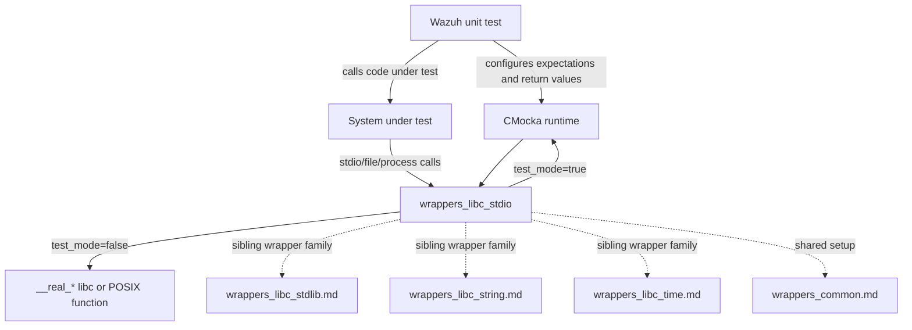
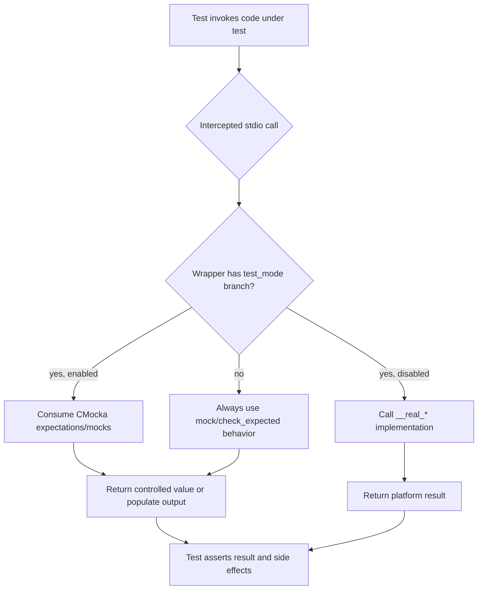
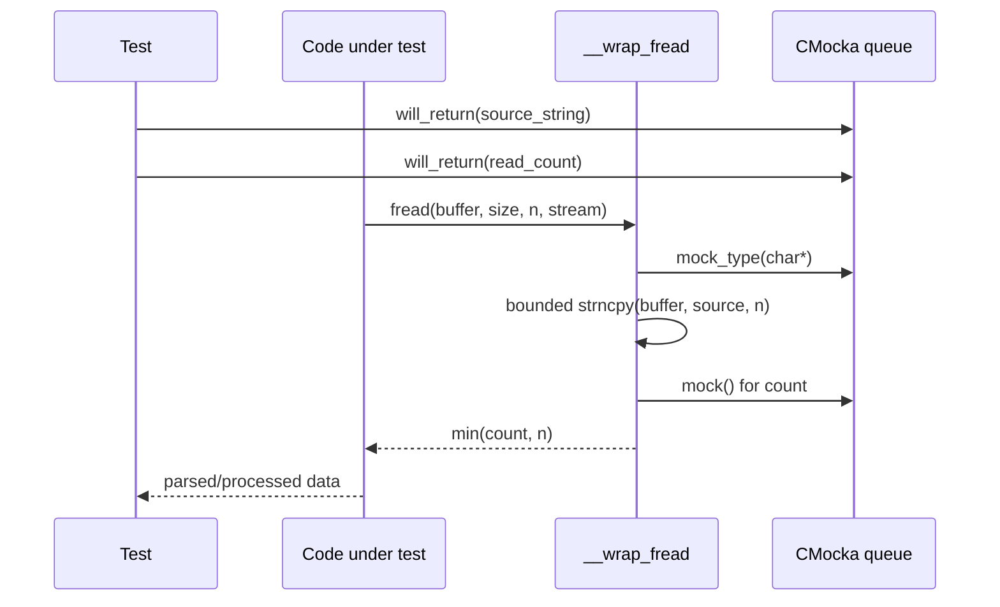
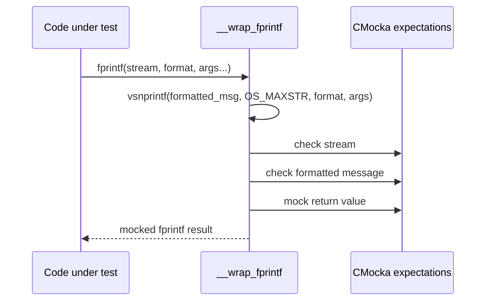
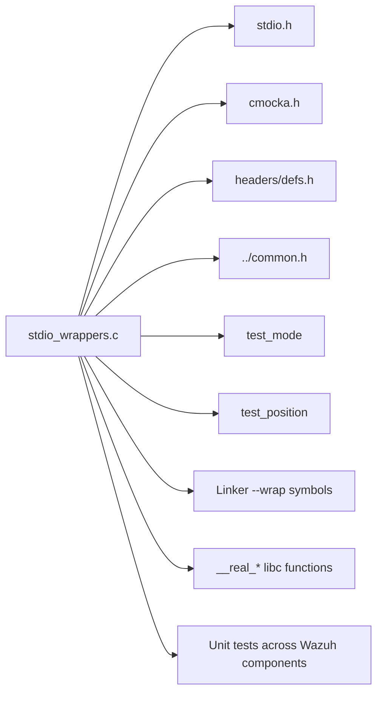

# `wrappers_libc_stdio`

`wrappers_libc_stdio` is the CMocka/linker-wrapper adapter for C standard I/O operations used by Wazuh unit tests. It replaces selected `stdio.h` and related file/process functions with controllable test doubles, allowing tests to simulate successful reads, short writes, stream errors, EOF, file-position failures, and external-process failures without touching the host filesystem.

The implementation is in [`src/unit_tests/wrappers/libc/stdio_wrappers.c`](src/unit_tests/wrappers/libc/stdio_wrappers.c). It belongs to the `Unit_Test_Wrappers_&_Mocks` tree and is consumed by tests throughout the native daemons, shared library, Wazuh DB, and module layers.

## Purpose and scope

The module provides two related capabilities:

1. **Link-time interception**: functions named `__wrap_<symbol>` are selected by the linker when a test binary is built with `--wrap=<symbol>`.
2. **CMocka control**: wrappers use `mock()`, `mock_type()`, `check_expected*()`, `will_return()`, and `function_called()` to let each test define inputs and return values.

When `test_mode` is disabled, wrappers that have a corresponding `__real_<symbol>` delegate to the platform implementation. This keeps production-like behavior available in tests that only need interception in selected scenarios.

## Architectural position

The wrapper is deliberately infrastructure rather than business logic. It does not parse Wazuh data or own persistent state. Instead, it supplies deterministic seams beneath components such as logcollector, Wazuh DB, agent upgrade, syscheck, remoted, and shared file utilities. Related platform-specific wrappers, such as macOS stdio wrappers, should be consulted for platform behavior rather than duplicated here.

## Components and responsibilities

### Stream lifecycle and positioning

| Wrapper | Test behavior | Native behavior |
|---|---|---|
| `__wrap_fopen` | Checks `path` and `mode`; returns a mocked `FILE *`. | Calls `__real_fopen`. |
| `__wrap_fclose` | Checks the stream and returns a mocked integer. | Calls `__real_fclose`. |
| `__wrap_fflush` | Always returns `0` in test mode. | Calls `__real_fflush`. |
| `__wrap_fgetpos` | Checks the stream, copies global `test_position` into `*pos`, then returns a mock result. | Calls `__real_fgetpos`. |
| `__wrap_fseek` | Returns a mocked result. | Calls `__real_fseek`. |
| `__wrap__fseeki64` | Returns a mocked result; it is always mock-driven. | No real-function fallback is implemented. |
| `__wrap_ftell` | Returns `mock()` regardless of `test_mode`. | No real-function fallback is implemented. |
| `__wrap_fileno` | Checks the stream and returns a mocked descriptor. | No real-function fallback is implemented. |
| `__wrap_clearerr` | Records the call and checks the stream. | No real-function fallback is implemented. |

`test_position` is a process-global pointer supplied by the test harness. Tests using `__wrap_fgetpos` must initialize it before invocation; otherwise the wrapper dereferences an invalid/null position source.

### Reading and writing

| Wrapper | Behavior in test mode |
|---|---|
| `__wrap_fgets` | Takes a mocked string, copies it into the caller buffer with bounded termination, and returns the caller buffer; a null mocked string yields `NULL`. |
| `__wrap_getline` | Supplies a mocked allocated line pointer, sets `*n` to its string length, and returns that length. |
| `__wrap_fgetc` | Returns a mocked `int`. |
| `__wrap_fread` | Copies a mocked source string into `ptr`, obtains a mocked count, and caps the result at `n`. |
| `__wrap_fprintf` | Formats variadic arguments using `vsnprintf`, checks the stream and resulting formatted message, then returns a mocked status. |
| `__wrap_snprintf` | Checks the maximum length and format pointer, clears the destination buffer, and returns a mocked integer. |
| `__wrap_fputc` | Checks the character and stream, then returns a mocked status. |
| `__wrap_fwrite` | Returns a mocked `size_t`. |
| `__wrap_open_memstream` | Supplies mocked buffer, size, and `FILE *` outputs. |

The file contains `__wrap_fgets`, `__wrap_popen`, and `__wrap_open_memstream` even though they are not listed in the supplied module tree’s core-component summary. They are part of the module’s effective public test surface and should be included when maintaining linker flags or documentation.

### Filesystem mutation and subprocess streams

| Wrapper | Behavior |
|---|---|
| `__wrap_remove` | Checks the filename and returns a mocked status in test mode; otherwise calls `__real_remove`. |
| `__wrap_rename` | Checks old and new paths and returns a mocked status. It is not guarded by `test_mode`. |
| `__wrap_popen` | In test mode checks command/type and returns a mocked `FILE *`; otherwise calls `__real_popen`. |
| `__wrap_pclose` | Checks the stream and returns a mocked status. |

The `expect_*` helpers simplify repeated CMocka setup:

- `expect_fopen(path, mode, fp)` configures path/mode matching and the returned stream.
- `expect_fclose(stream, ret)` configures stream matching and the close result.
- `expect_fprintf(stream, formatted_msg, ret)` configures formatted-output matching.
- `expect_fread(file, ret)` queues the mocked source string and read count.
- `expect_popen(command, type, ret)` configures subprocess stream expectations.

## Control flow

The distinction in the diagram matters. `fopen`, `fclose`, `fflush`, `fgets`, `fgetpos`, `fgetc`, `fread`, `fseek`, `fwrite`, `popen`, and `remove` explicitly support real-function fallback. `ftell`, `rename`, `clearerr`, `fileno`, `pclose`, `fputc`, `open_memstream`, and several other wrappers are intrinsically mock-oriented and require expectations even if the test does not set `test_mode` in the same way.

## Representative interactions

### Mocked file read

`__wrap_fread` treats `n` as the copy/count bound. This is useful for testing short reads and over-reported counts, but callers should remember that the wrapper models the test contract rather than every detail of libc’s `size * nmemb` semantics.

### Formatted output verification

This verifies the rendered message, not only the original format string. It is therefore appropriate for tests of log, status, configuration, and generated-file output.

## Dependency and ownership model

`cmocka.h` supplies the expectation and mock APIs. `headers/defs.h` supplies Wazuh limits such as `OS_MAXSTR`, used when formatting `fprintf` arguments. `../common.h` supplies shared wrapper state, notably `test_mode`. The linker supplies the `__real_*` symbols when wrapping is enabled.

Sibling infrastructure is intentionally referenced rather than repeated:

- [`wrappers_common.md`](wrappers_common.md) — shared wrapper state and common test helpers.
- [`wrappers_libc_stdlib.md`](wrappers_libc_stdlib.md) — process/temporary-file helpers such as `system`, `mkstemp`, and `atexit`.
- [`wrappers_libc_string.md`](wrappers_libc_string.md) — string-function interception.
- [`wrappers_libc_time.md`](wrappers_libc_time.md) — time formatting and `struct tm` support.
- [`wrappers_posix_stat.md`](wrappers_posix_stat.md) and [`wrappers_posix_unistd.md`](wrappers_posix_unistd.md) — adjacent filesystem metadata and descriptor operations.

Some sibling documents may be generated independently and not exist in every documentation snapshot; the links identify the intended module boundaries.

## Test author guidance

1. Configure expectations before calling the system under test. For pointer arguments use the pointer-aware helpers where the wrapper does (`expect_fopen`, `check_expected_ptr`); for strings use `expect_string` or the wrapper’s helper.
2. Queue return values in the exact order consumed. For example, `expect_fread` queues the source pointer first and the count second.
3. Set `test_position` before testing `__wrap_fgetpos` and provide a valid destination `fpos_t`.
4. Exercise both success and failure paths by returning `NULL`, short counts, negative/error statuses, or zero values as appropriate.
5. Avoid assuming all wrappers honor `test_mode`. Always mock `ftell`, `rename`, `clearerr`, `fileno`, `pclose`, `fputc`, and `open_memstream` explicitly.
6. Keep mocked buffers valid for the duration of the call. `__wrap_getline` returns a pointer supplied by CMocka and does not allocate or free it.

## Error and boundary semantics

- `__wrap_fgets` truncates to `n - 1` and explicitly null-terminates when the mocked string is too long.
- `__wrap_fread` prevents a mocked count greater than `n` from escaping the wrapper.
- `__wrap_fprintf` limits formatted text to `OS_MAXSTR`; tests should account for truncation when verifying unusually large messages.
- `__wrap_snprintf` clears the destination but does not synthesize formatted content, so tests that inspect the destination must provide their own higher-level setup or use `__wrap_fprintf`/`__wrap_fgets` as appropriate.
- `__wrap_getline` assumes the mocked line pointer is non-null because it immediately calls `strlen`.
- The wrappers do not generally set `errno`; code that depends on `errno` needs a separate test seam or an explicit platform wrapper.

## Maintenance checklist

When adding a stdio dependency to a Wazuh component, determine whether the test needs a new wrapper, a real-function fallback, or only an expectation helper. Update the linker wrap list and this document together. Preserve the existing distinction between production passthrough and deterministic mock-only wrappers, and add tests for null pointers, short reads/writes, stream-position errors, and cleanup failures where those paths affect the caller.
