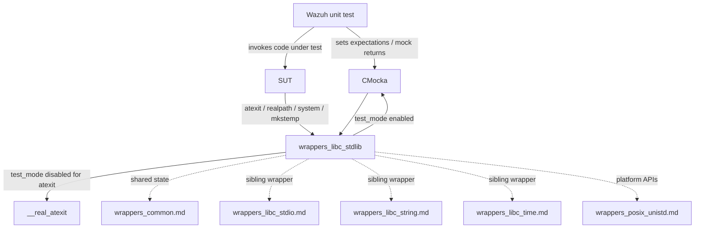
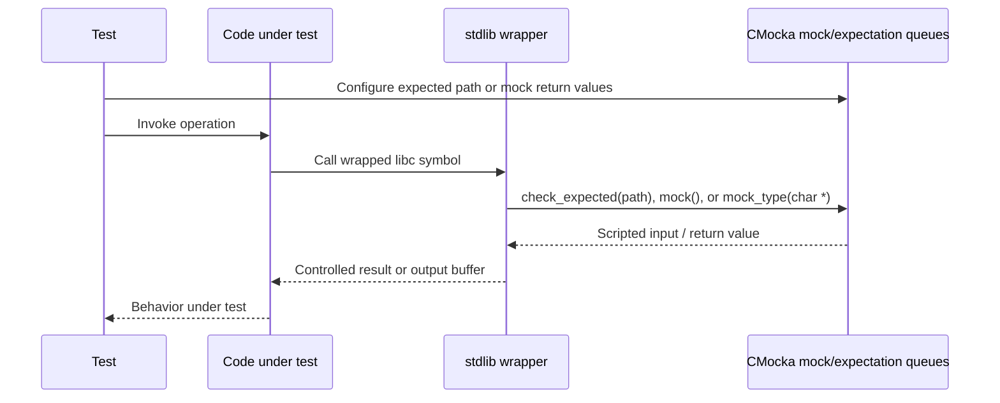
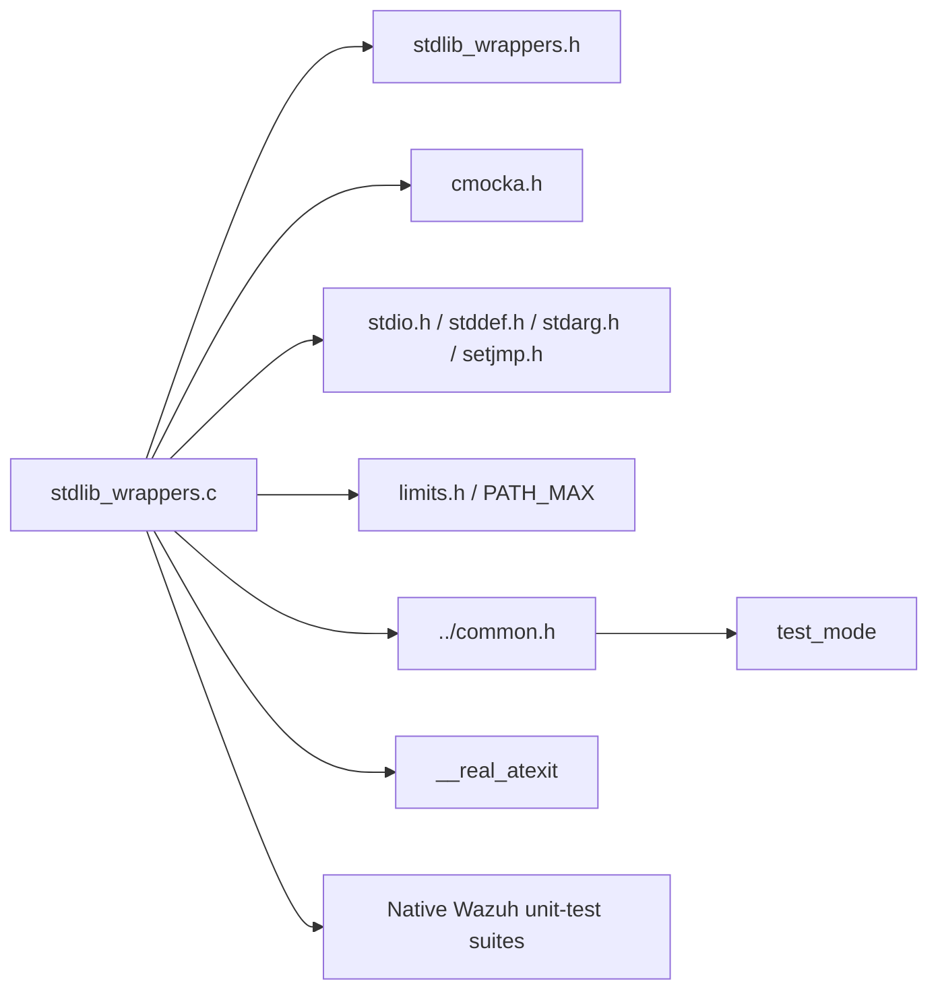
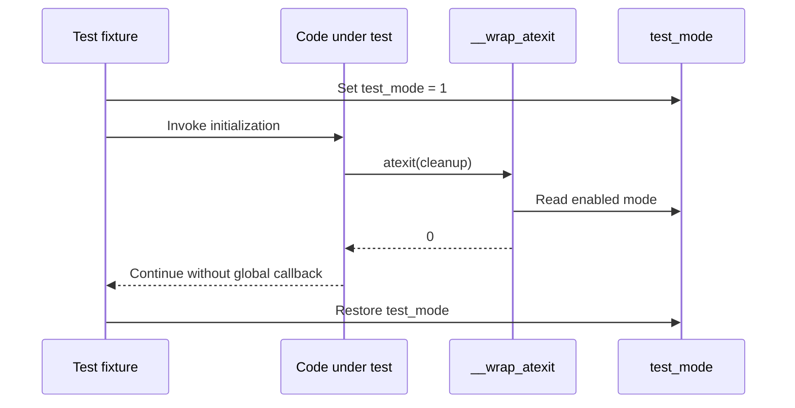

# `wrappers_libc_stdlib`

`wrappers_libc_stdlib` is a small CMocka-based test-wrapper module for selected C standard-library operations used by Wazuh unit tests. It intercepts process termination registration, temporary-file creation, shell command execution, and path canonicalization so tests can control return values and avoid invoking the host system unintentionally.

The implementation is [`src/unit_tests/wrappers/libc/stdlib_wrappers.c`](src/unit_tests/wrappers/libc/stdlib_wrappers.c). It belongs to the `Unit_Test_Wrappers_&_Mocks` family and is linked into test binaries through linker wrapping (`--wrap=<symbol>`). The module contains no production business logic and no persistent state of its own.

## Purpose and scope

The module provides two complementary behaviors:

- **Deterministic mocks** for `system()` and `mkstemp()`, whose results come directly from CMocka’s mock queue.
- **Conditional interception** for `atexit()`, which bypasses registration while the shared `test_mode` flag is enabled and otherwise delegates to the real libc implementation.
- **Expectation-driven path resolution** for `realpath()`, which validates the requested path and either writes a mocked resolved path or returns a mocked pointer.

The wrapper prevents tests from spawning shell commands, creating real temporary files, or registering process-exit callbacks unless a test explicitly chooses that behavior. Shared wrapper state, including `test_mode`, is defined by [`wrappers_common.md`](wrappers_common.md).

## Architectural position



The module sits below Wazuh components and test fixtures. It may support tests in the shared library, Wazuh DB, native daemons, and Wazuh modules, but it does not depend on those subsystems. Its only cross-wrapper coupling is the shared `test_mode` flag and the common CMocka conventions.

## Components

| Component | Responsibility | Test control |
|---|---|---|
| `__wrap_atexit` | Intercepts exit-handler registration. | Returns `0` without registering when `test_mode` is non-zero; otherwise calls `__real_atexit`. |
| `__wrap_realpath` | Intercepts path canonicalization. | Checks the input path, then returns or copies a path supplied with `mock_type(char *)`. |
| `__wrap_system` | Prevents execution of a shell command. | Returns the next value from CMocka’s `mock()` queue. |
| `expect_system` | Convenience setup helper. | Queues a return value for `__wrap_system` with `will_return`. |
| `__wrap_mkstemp` | Prevents creation of a real temporary file. | Returns the next value from CMocka’s `mock()` queue. |

The source declares `__real_atexit` explicitly because `__wrap_atexit` can delegate to the original libc symbol when test mode is disabled. The other wrappers are mock-oriented and do not provide real-function fallbacks.

## Control flow

```mermaid
flowchart TD
    A[Test invokes SUT] --> B{SUT calls wrapped libc function}
    B --> C{Function}

    C -->|atexit| D{test_mode != 0?}
    D -->|yes| E[Return 0; do not register callback]
    D -->|no| F[Call __real_atexit(callback)]

    C -->|system / mkstemp| G[Consume CMocka mock value]
    C -->|realpath| H[check_expected(path)]
    H --> I{resolved_path != NULL?}
    I -->|no| J[Return mocked char pointer]
    I -->|yes| K[Consume mocked auxiliary path]
    K --> L{Auxiliary path is NULL?}
    L -->|yes| M[Return NULL]
    L -->|no| N[Copy into resolved_path with PATH_MAX bound]
    N --> O[Return resolved_path]

    E --> P[Test asserts behavior]
    F --> P
    G --> P
    J --> P
    M --> P
    O --> P
```

## Component behavior in detail

### `__wrap_atexit`

```c
int __wrap_atexit(void (*callback)(void));
```

When `test_mode` is enabled, the wrapper returns success immediately and deliberately ignores the callback. This keeps unit tests from adding process-global exit handlers that could run after the test fixture has been destroyed or interfere with later tests.

When `test_mode` is disabled, the wrapper calls `__real_atexit(callback)`, preserving normal libc behavior. The wrapper does not validate `callback` and does not add a CMocka expectation of its own.

### `__wrap_realpath`

```c
char *__wrap_realpath(const char *path, char *resolved_path);
```

The wrapper always calls `check_expected(path)`, so tests must configure the expected input path. Its output behavior depends on the destination pointer:

1. If `resolved_path == NULL`, it returns a mocked `char *` directly.
2. If `resolved_path != NULL`, it consumes a mocked auxiliary `char *`.
3. A null auxiliary value simulates resolution failure and returns `NULL`.
4. A non-null auxiliary value is copied into the caller’s buffer using `snprintf(resolved_path, PATH_MAX, "%s", aux)` and the destination buffer is returned.

This models both common `realpath` usage patterns: obtaining an allocated result and writing into caller-owned storage. The wrapper does not allocate or free the auxiliary string, and it does not set `errno`.

### `__wrap_system` and `expect_system`

```c
int __wrap_system(const char *__command);
void expect_system(int ret);
```

`__wrap_system` ignores the command argument and returns `mock()`. It therefore never launches a shell command. `expect_system(ret)` is the preferred setup helper:

```c
expect_system(0);       /* simulate successful command execution */
```

Tests can queue non-zero values to model command failure, signal-like statuses, or caller-specific error handling. Because the command itself is not checked, tests that need to verify command construction should assert the command before the call or add a more specialized wrapper.

### `__wrap_mkstemp`

```c
int __wrap_mkstemp(char *template);
```

The template argument is intentionally unused and the wrapper returns `mock()`. This allows callers to exercise success and failure branches without modifying the filesystem. A successful test should provide a plausible file descriptor; a negative value can model creation failure. The wrapper does not write a generated filename into `template`.

## Data flow and CMocka interaction



For `realpath`, the order of CMocka interactions matters. The path expectation is checked first; when a destination buffer is supplied, the auxiliary path is consumed before the wrapper returns. For `system` and `mkstemp`, each invocation consumes one value from the relevant CMocka queue.

## Dependencies



The wrapper uses `snprintf` from the standard I/O library for bounded path copying; detailed stream interception belongs to [`wrappers_libc_stdio.md`](wrappers_libc_stdio.md). It uses `test_mode` from the common wrapper layer rather than defining a second mode flag. POSIX filesystem and process primitives outside this file are documented in the corresponding wrapper modules instead of being duplicated here.

## Typical test flows

### Suppress an exit-handler registration



### Simulate temporary-file and command outcomes

```mermaid
flowchart LR
    Setup[Test setup] --> A[expect_system(ret)]
    Setup --> B[will_return(__wrap_mkstemp, fd_or_error)]
    A --> System[SUT calls system]
    B --> Temp[SUT calls mkstemp]
    System --> Result[Branch on scripted result]
    Temp --> Result
```

## Test author guidance

- Configure every `mock()` or `mock_type()` value before the wrapped call and in the exact order the wrapper consumes them.
- For `realpath`, configure `check_expected(path)` with the expected path. If `resolved_path` is non-null, also queue the auxiliary string consumed by `mock_type(char *)`.
- Use a valid writable buffer of at least `PATH_MAX` bytes when testing the destination-buffer form of `realpath`.
- Use `NULL` as the auxiliary `realpath` value to exercise resolution failure. The wrapper returns `NULL` but does not set `errno`.
- Use `expect_system()` instead of calling `will_return()` directly when only the command result matters.
- Restore `test_mode` during teardown because it is process-global and can affect unrelated wrappers.
- Do not expect `__wrap_mkstemp` to populate the template string; tests concerned with generated names need a higher-level seam or a dedicated helper.
- If command text or temporary-file template validation is part of the behavior under test, this module’s arguments are intentionally too weak to perform that assertion; add expectations at the caller or extend the wrapper carefully.

## Error and boundary semantics

| Scenario | Result |
|---|---|
| `atexit` with `test_mode != 0` | Returns `0`; callback is not registered. |
| `atexit` with `test_mode == 0` | Delegates to `__real_atexit`. |
| `realpath` with null destination and mocked pointer | Returns the mocked pointer unchanged. |
| `realpath` with destination and null auxiliary path | Returns `NULL`. |
| `realpath` with destination and non-null auxiliary path | Copies at most `PATH_MAX` bytes through `snprintf` and returns the destination. |
| `system` without a queued mock | CMocka reports a missing mock setup. |
| `mkstemp` without a queued mock | CMocka reports a missing mock setup. |
| `system` or `mkstemp` failure value | Returned unchanged to the caller. |

The wrappers do not manage memory, set `errno`, inspect the `system` command, or create filesystem objects. Those omissions are intentional: the module isolates caller control flow rather than reproducing libc internals.

## Related documentation

- [`wrappers_common.md`](wrappers_common.md) — shared `test_mode` state and common wrapper conventions.
- [`wrappers_libc_stdio.md`](wrappers_libc_stdio.md) — standard I/O, file streams, and formatted output.
- [`wrappers_libc_string.md`](wrappers_libc_string.md) — string-function wrappers.
- [`wrappers_libc_time.md`](wrappers_libc_time.md) — time-formatting wrappers.
- [`Unit Tests - Shared Library`](Unit_Tests_-_Shared_Library.md) — representative consumers of native utility seams.

## Source reference

| File | Symbols |
|---|---|
| [`src/unit_tests/wrappers/libc/stdlib_wrappers.c`](src/unit_tests/wrappers/libc/stdlib_wrappers.c) | `__wrap_atexit`, `__wrap_realpath`, `__wrap_system`, `expect_system`, `__wrap_mkstemp` |
