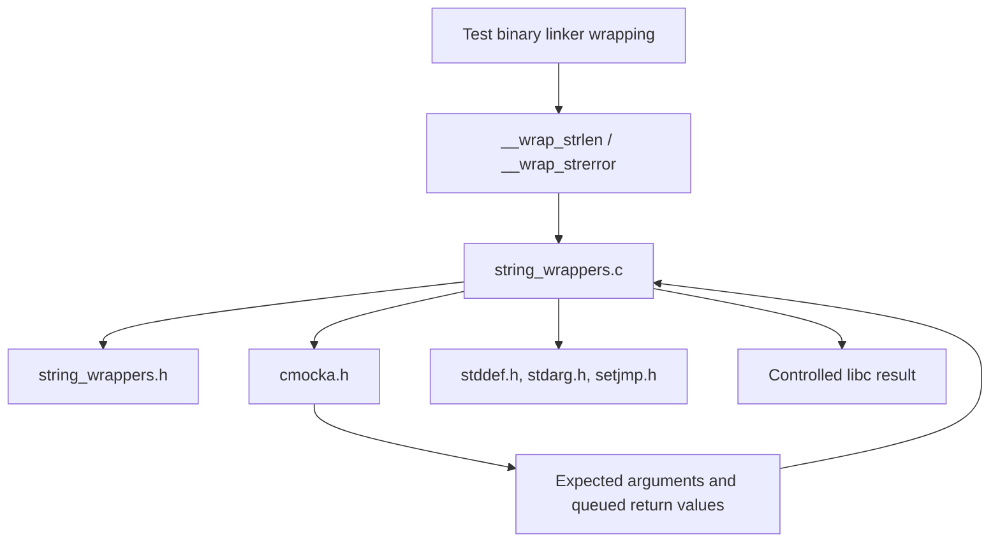
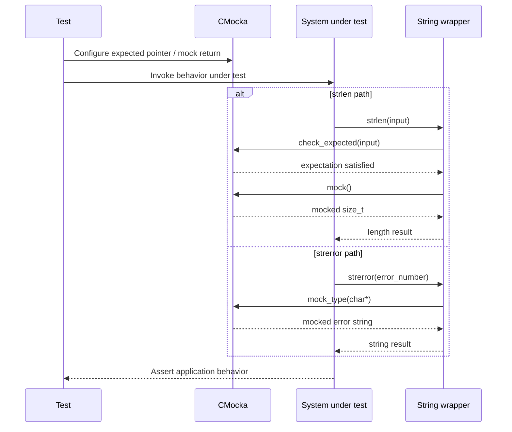
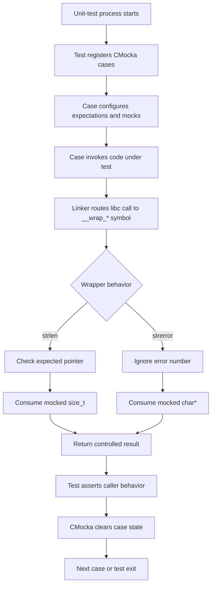
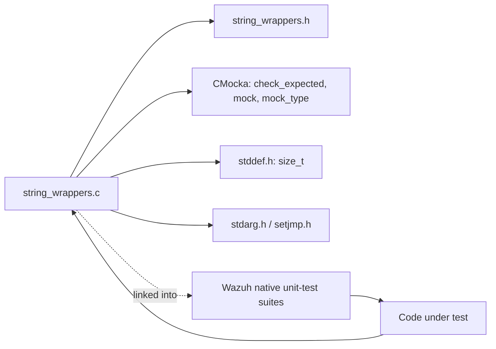

# `wrappers_libc_string`

`wrappers_libc_string` is a small CMocka test-wrapper module for selected C string-library functions used by Wazuh unit tests. It replaces `strlen` and `strerror` with deterministic test doubles so code under test can exercise length-dependent branches and error-message paths without relying on the host libc implementation.

The implementation is [`src/unit_tests/wrappers/libc/string_wrappers.c`](src/unit_tests/wrappers/libc/string_wrappers.c). It belongs to the `Unit_Test_Wrappers_&_Mocks` family. The module is test infrastructure only: it contains no Wazuh business logic, persistent state, filesystem activity, or production runtime behavior.

## Purpose and system position

The wrappers sit between native Wazuh unit-test subjects and libc. A test configures CMocka expectations and return values, invokes the system under test, and receives a controlled result from the wrapped function.

```mermaid
flowchart LR
    Test["Wazuh unit test"] -->|configures expectations / mocks| CMocka[CMocka]
    Test --> SUT["Code under test"]
    SUT -->|strlen / strerror| W["wrappers_libc_string"]
    W -->|check_expected(s)| CMocka
    W -->|mock() / mock_type(char*)| CMocka
    CMocka --> W
    W --> SUT
    SUT --> Higher["Shared helpers, daemons, database, and module tests"]
```

The module complements, but does not duplicate, the sibling wrapper layers:

- [`wrappers_libc_stdio.md`](wrappers_libc_stdio.md) covers streams and formatted I/O.
- [`wrappers_libc_stdlib.md`](wrappers_libc_stdlib.md) covers process, shell, and temporary-file functions.
- [`wrappers_libc_time.md`](wrappers_libc_time.md) covers time formatting.
- [`wrappers_common.md`](wrappers_common.md) describes shared wrapper conventions and test support.

## Architecture



The source includes `string_wrappers.h`, standard C headers, and CMocka. The linker exposes the `__wrap_*` symbols when the corresponding libc symbols are wrapped in a unit-test target. No `__real_*` fallback is implemented in this file; calls routed to these wrappers remain mock-controlled for the duration of the test binary.

## Components

| Component | Responsibility | Test control |
|---|---|---|
| `__wrap_strerror` | Replaces `strerror(int)` and returns a mocked error string. | `mock_type(char *)` supplies the result. The error number is intentionally ignored. |
| `__wrap_strlen` | Replaces `strlen(const char *)`, validates the input pointer against a CMocka expectation, and returns a mocked length. | `check_expected(s)` validates the argument; `mock()` supplies the `size_t` result. |

### `__wrap_strerror`

```c
char *__wrap_strerror(int __errnum);
```

The parameter is marked unused. The wrapper returns the next `char *` from the CMocka mock queue:

```c
return mock_type(char*);
```

This allows tests to simulate any error text, including a null pointer, an empty string, a localized message, or a deliberately unexpected message. The wrapper neither allocates nor frees the returned string and does not inspect or modify `errno`.

### `__wrap_strlen`

```c
size_t __wrap_strlen(const char *s);
```

The wrapper performs two operations in a fixed order:

1. `check_expected(s)` verifies the pointer argument configured by the test.
2. `mock()` returns the queued length value.

The function does not calculate the length of `s`. This is deliberate: callers can test behavior for lengths that are difficult to construct naturally, such as zero, a boundary value, or an oversized value, while still asserting that the expected string pointer was passed.

## Data flow

```mermaid
flowchart TD
    Setup["Test setup"] --> Expect["Configure expected string pointer"]
    Setup --> Return["Queue mocked return value"]
    SUT["Code under test"] --> Call{"Wrapped function"}
    Call -->|strlen(s)| Length["__wrap_strlen"]
    Call -->|strerror(errnum)| Error["__wrap_strerror"]
    Length --> Check["check_expected(s)"]
    Check --> MockLen["mock()"]
    MockLen --> Size["Return mocked size_t"]
    Error --> MockErr["mock_type(char*)"]
    MockErr --> Text["Return mocked char*"]
    Expect --> Check
    Return --> MockLen
    Return --> MockErr
    Size --> SUT
    Text --> SUT
```

The return queue must match the wrapper’s consumption order. For `strlen`, the input expectation is checked first and then one scalar mock value is consumed. For `strerror`, only one pointer mock value is consumed; the integer error code has no expectation in this implementation.

## Component interaction



The wrapper is synchronous and stateless. All control data is held by CMocka’s expectation/mock queues; the wrapper itself does not cache inputs or outputs.

## Process flow



## Dependencies



The direct functional dependency is CMocka. The standard headers provide compilation support, while the wrapper header provides the module’s declarations and any build-specific symbol definitions. The broader unit-test harness is documented in [`test_infrastructure.md`](test_infrastructure.md); this module does not require a shared fixture or teardown routine.

## Test author guidance

- Before calling code that reaches `strlen`, configure the expected pointer and queue one `size_t` return value.
- Use the same pointer identity expected by `check_expected(s)`; the wrapper does not compare string contents itself.
- Before calling code that reaches `strerror`, queue one `char *` with `will_return` or an equivalent CMocka setup.
- Use `NULL` deliberately to test callers that handle missing error text, but ensure the caller’s contract permits a null return.
- Remember that the mocked `strlen` result does not need to match the actual C string length. This is useful for branch testing but should be documented in the test name or setup.
- Do not expect the wrappers to set `errno`, allocate memory, free returned strings, or delegate to real libc functions.
- Keep mocked error strings alive until the wrapped call and all caller assertions that use the returned pointer have completed.

## Error and boundary semantics

| Scenario | Result |
|---|---|
| `strlen` with a configured expected pointer and mock | Returns the queued `size_t` unchanged. |
| `strlen` with an unexpected pointer | CMocka reports an expectation failure. |
| `strlen` without a queued return value | CMocka reports a missing mock value. |
| `strerror` with a queued string | Returns the queued pointer unchanged. |
| `strerror` with a queued `NULL` | Returns `NULL`; caller behavior determines whether this is valid. |
| `strerror` without a queued return value | CMocka reports a missing mock value. |
| Error number passed to `strerror` | Ignored by the wrapper and not expectation-checked. |

These semantics intentionally model caller-visible outcomes rather than libc internals. If a test must verify the actual error-number-to-message mapping or actual string length, it should use an integration test without this wrapper or a specialized wrapper that checks those inputs.

## Maintenance considerations

Changes to this module can affect any native test binary that links the libc string wrappers. Preserve the established CMocka call order when extending a wrapper, because existing tests may rely on the queue sequence. If argument validation is added to `__wrap_strerror`, update all affected test setup and this document. If real-function fallbacks are introduced, document the new mode switch and ownership/error behavior alongside the wrapper rather than assuming standard libc semantics.
