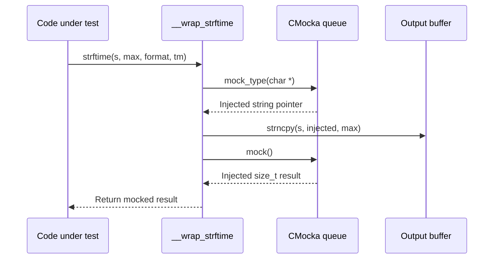
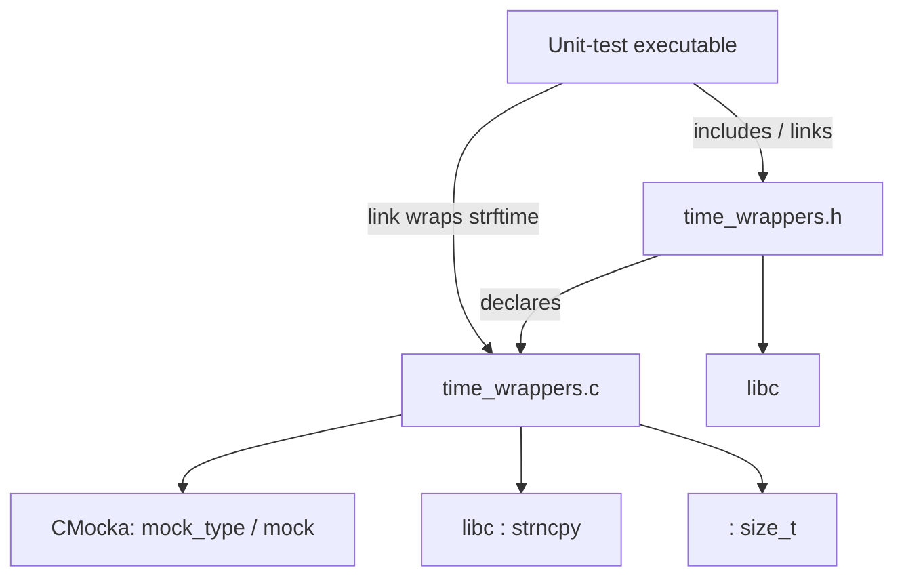

# `wrappers_libc_time`

## Introduction

`wrappers_libc_time` is the unit-test wrapper for the C standard-library time-formatting function `strftime`. It replaces the real libc implementation with a CMocka-controlled test double, allowing tests to inject deterministic formatted output and return values without depending on locale, calendar state, platform behavior, or the current clock.

The module is part of the shared test-wrapper infrastructure, not a production Wazuh runtime component. It is consumed by tests that exercise code which formats `struct tm` values, including scheduling, log/state formatting, and other time-oriented paths. Those consumers should be documented in their respective module or test documentation; this file describes only the substitution boundary.

## Purpose and responsibilities

The module has three responsibilities:

- expose the linker-compatible wrapper declaration for `strftime`;
- copy a caller-provided mock string into the destination buffer;
- return a caller-provided CMocka value so tests can model success, truncation, or failure-like outcomes.

It deliberately does not calculate dates, interpret format strings, inspect the supplied `struct tm`, or emulate libc semantics beyond the minimal behavior needed by tests.

## Module structure

| File | Role |
| --- | --- |
| `src/unit_tests/wrappers/libc/time_wrappers.h` | Declares `__wrap_strftime` and imports `struct tm` through `<time.h>`. |
| `src/unit_tests/wrappers/libc/time_wrappers.c` | Implements the CMocka-backed wrapper. |

The wrapper source includes CMocka facilities (`mock_type`, `mock`) and uses `strncpy` from libc to place the injected output in the caller’s buffer.

## Architecture

```mermaid
flowchart LR
    Test[Unit test] -->|will_return / mock setup| Mock[CMocka mock queue]
    TestTarget[Code under test] -->|calls strftime| Linker[Link-time wrapper substitution]
    Linker --> Wrapper[__wrap_strftime]
    Wrapper -->|mock_type(char *)| Mock
    Wrapper -->|strncpy to s, max bytes| Buffer[Caller output buffer]
    Wrapper -->|mock() return value| TestTarget
```

The wrapper is normally selected by the test build/link configuration using the linker-wrap convention. A production build continues to use the platform’s libc `strftime`; the `__wrap_` symbol exists for test binaries only.

## API contract

### `__wrap_strftime`

```c
size_t __wrap_strftime(char *s,
                       size_t max,
                       const char *format,
                       const struct tm *tm);
```

| Parameter | Meaning in the wrapper | Observed behavior |
| --- | --- | --- |
| `s` | Destination buffer supplied by the caller | Receives the mock string through `strncpy`. |
| `max` | Maximum number of bytes passed to `strncpy` | Limits the copy length. The wrapper does not add its own terminator. |
| `format` | libc format string | Intentionally unused. No format parsing occurs. |
| `tm` | Broken-down time input | Intentionally unused. Its fields do not affect output. |

The return value is obtained from CMocka with `mock()`. Tests therefore control the apparent `strftime` result independently of the bytes copied to `s`.

### `struct tm`

`time_wrappers.h` includes `<time.h>` so the declaration uses the platform’s standard `struct tm` definition. The header does not define or alter the structure. The `tm` symbol shown in the module tree is the type dependency rather than a module-owned data structure.

## Runtime behavior

The implementation follows this sequence:



Important consequences:

1. Output and return value are separate controls. A test can provide formatted bytes while returning zero, or provide an empty/partial buffer while returning a nonzero length.
2. `format` and `tm` are not validated. This makes tests deterministic but means invalid inputs are not diagnosed by this wrapper.
3. The copy uses the requested maximum length exactly. Callers and tests must provide a sufficiently sized destination and account for `strncpy`’s termination rules.
4. The wrapper assumes the CMocka mock queue has been configured. Calling it without the expected mock values produces test-framework-dependent behavior rather than normal libc behavior.

## Data flow

```mermaid
flowchart TD
    Setup[Test setup] --> S[Mock output string]
    Setup --> R[Mock return value]
    Call[Call with s, max, format, tm] --> W[__wrap_strftime]
    S --> W
    W --> Copy[strncpy(s, output, max)]
    Copy --> Out[Mutated destination buffer]
    R --> W
    W --> Ret[Mocked size_t result]
    Ret --> Caller[Caller assertions / branch behavior]
```

No time data flows from `tm` into the result. The only data produced by the module is the bounded byte copy and the mocked `size_t` return value.

## Component interactions and dependencies



Direct dependencies are intentionally small:

- `<time.h>` supplies `struct tm` and the standard declaration context;
- `<stddef.h>` supplies `size_t`;
- `<stdarg.h>` and `<setjmp.h>` support CMocka’s inclusion requirements in this test source;
- `<cmocka.h>` supplies `mock_type` and `mock`;
- `<string.h>` supplies `strncpy`.

The module belongs beside other libc wrappers. For related filesystem/stream, allocation/process, and string substitutions, see [wrappers_libc_stdio.md](wrappers_libc_stdio.md), [wrappers_libc_stdlib.md](wrappers_libc_stdlib.md), and [wrappers_libc_string.md](wrappers_libc_string.md). POSIX wall-clock wrappers such as `time` and `gettimeofday` are separate concerns and should not be conflated with this formatting wrapper.

## Typical test process flow

```mermaid
flowchart TD
    A[Create test case] --> B[Prepare destination buffer]
    B --> C[Queue output string for mock_type(char *)]
    C --> D[Queue size_t result for mock()]
    D --> E[Invoke code that formats a time]
    E --> F{Code observes return value}
    F -->|nonzero| G[Consumes copied formatted text]
    F -->|zero| H[Exercises formatting failure / empty result path]
    G --> I[Assert output and downstream behavior]
    H --> I
```

A test should queue mocks in the order consumed by the wrapper: first the string returned by `mock_type(char *)`, then the numeric value returned by `mock()`. When several calls occur, the queues must contain one corresponding pair per invocation.

## Testing guidance

Use this wrapper when the behavior under test depends on the result of `strftime`, but the test should not depend on the host’s locale or calendar implementation. Useful scenarios include:

- a stable formatted timestamp expected by a state or log serializer;
- a zero return value representing an unsuccessful or empty formatting operation;
- a bounded destination buffer scenario;
- a caller branch that treats the returned length independently from buffer content.

Tests should separately verify the caller’s handling of buffer size and return value. The wrapper itself does not verify that the injected string is a valid formatted representation.

## Build and linkage role

The source is compiled into unit-test targets that need to intercept `strftime`. The test linker maps calls to the real symbol to `__wrap_strftime`, while the wrapper’s declaration is available through `time_wrappers.h`. This arrangement keeps production code unchanged and centralizes libc substitution in the unit-test tree.

The module has no executable entry point, configuration file, persistent state, worker thread, socket, database, or production deployment lifecycle.

## Failure modes and boundaries

Because this is a deliberately thin mock:

- a null destination, invalid `max`, or invalid mock string is not normalized or reported by the wrapper;
- null or malformed `format` and `tm` values are ignored;
- termination behavior follows `strncpy`, not necessarily the behavior a caller would receive from real `strftime`;
- missing or incorrectly typed CMocka values are test setup errors;
- successful compilation does not imply platform-independent behavior if the surrounding test assumes a particular `struct tm` ABI.

These limitations are appropriate for isolation tests, but integration tests requiring real format-string semantics should call libc without this wrapper.

## Maintenance notes

When changing this module, preserve the linker-compatible function signature and keep the header declaration synchronized with the implementation. Changes to copy or termination behavior can affect tests that intentionally model truncation. Changes to mock consumption order require updating every test that queues the wrapper’s expectations.

For broader unit-test wrapper organization and consumers, follow the neighboring wrapper documentation rather than duplicating their implementation details: [wrappers_libc_stdio.md](wrappers_libc_stdio.md), [wrappers_libc_stdlib.md](wrappers_libc_stdlib.md), and [wrappers_libc_string.md](wrappers_libc_string.md).
