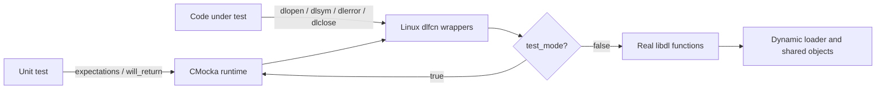
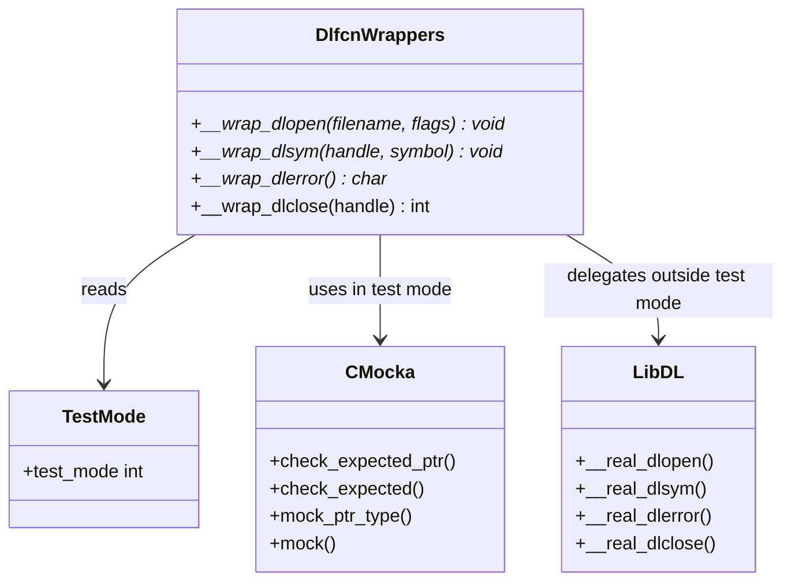
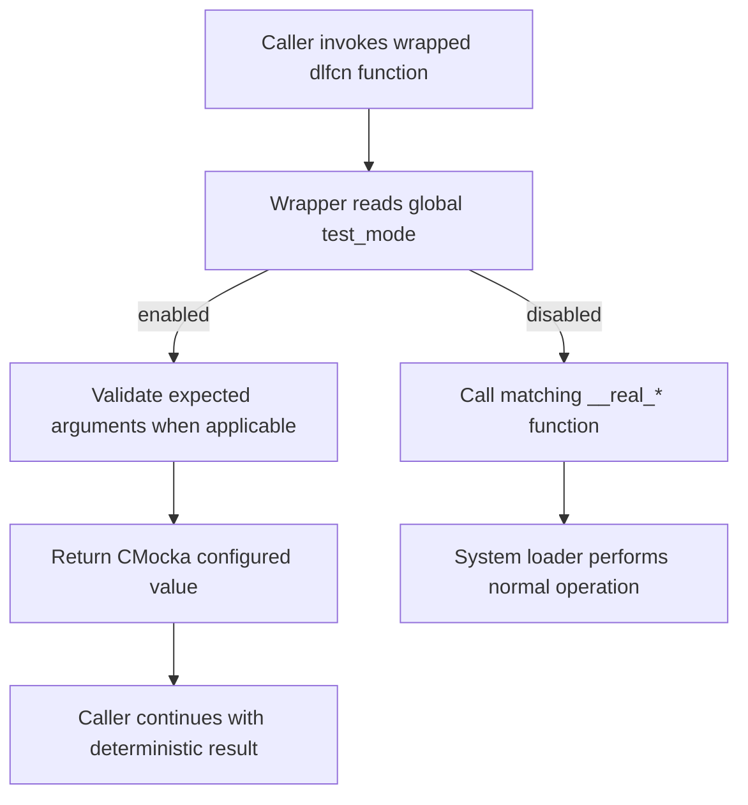
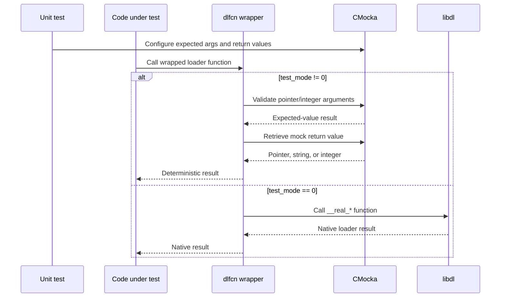
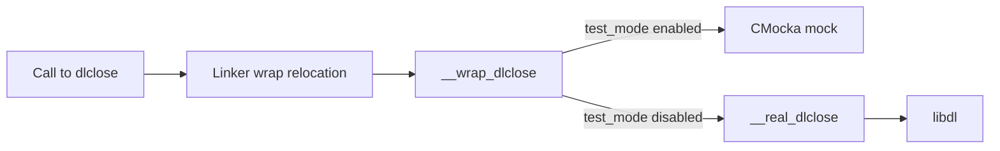

# Linux dynamic-loader wrappers

The `wrappers_linux_dlfcn` module supplies test-aware interposition wrappers for the POSIX dynamic-loading API used by Wazuh’s Linux code. It allows unit tests to replace `dlopen`, `dlsym`, `dlerror`, and `dlclose` with deterministic CMocka behavior while preserving the real `libdl` implementation when tests are not running in mock mode.

The implementation is located at `src/unit_tests/wrappers/linux/dlfcn_wrappers.c`. Although the module tree highlights `__wrap_dlclose`, the source defines wrappers for the complete dynamic-loader lifecycle.

## Purpose and scope

Dynamic loading is difficult to test directly because library availability, symbol resolution, loader errors, and handle lifetime depend on the host system. This module isolates those concerns behind linker-wrap functions:

| Wrapper | Real function | Test-mode behavior |
| --- | --- | --- |
| `__wrap_dlopen` | `__real_dlopen` | Verifies `filename` and `flags`, then returns a configured mock pointer. |
| `__wrap_dlsym` | `__real_dlsym` | Verifies `handle` and `symbol`, then returns a configured mock pointer. |
| `__wrap_dlerror` | `__real_dlerror` | Returns a configured mock error string. |
| `__wrap_dlclose` | `__real_dlclose` | Verifies `handle`, then returns a configured mock integer. |

The wrappers do not implement loader policy or symbol lookup themselves. They provide a seam for tests; production behavior remains delegated to the platform loader.

## Architecture

The module sits in the Linux-specific portion of the unit-test wrapper library. Test executables link with linker wrapping enabled, so calls made by the code under test resolve to `__wrap_*`. Each wrapper uses the shared `test_mode` switch to select between CMocka-controlled behavior and the corresponding `__real_*` function.

### Components and relationships

The source includes `dlfcn_wrappers.h` for the wrapper declarations and CMocka headers for mock helpers. The `__real_*` symbols are supplied by the linker-wrap arrangement and represent the original dynamic-loader functions.

## Control flow

All wrappers follow the same high-level decision process:

Argument validation is intentionally asymmetric:

- `dlopen` checks both the requested filename and loader flags.
- `dlsym` checks the library handle and symbol name.
- `dlclose` checks the library handle.
- `dlerror` has no arguments and therefore only consumes a configured return value.

If an expected argument is absent or differs from the test setup, CMocka reports the failure. Return values are controlled by the test through CMocka’s mock return facilities, allowing tests to model successful loads, missing symbols, loader errors, and close failures without touching the host filesystem or loader state.

## Data and interaction flow

The module does not retain handles, copy symbol names, or allocate error buffers. Ownership and lifetime remain the responsibility of the caller or the real loader. This keeps the test seam side-effect-light and avoids changing the contract being tested.

## API details

### `__wrap_dlopen`

Signature: `void * __wrap_dlopen(const char *filename, int flags)`

In test mode, the wrapper checks the expected `filename` and `flags` and returns `mock_ptr_type(void *)`. Tests can use this to represent a valid loader handle or a `NULL` failure. Outside test mode, it calls `__real_dlopen`.

### `__wrap_dlsym`

Signature: `void * __wrap_dlsym(void *handle, const char *symbol)`

In test mode, the wrapper checks the expected handle and symbol and returns a configured pointer, typically representing a resolved function or a failed lookup. Outside test mode, it calls `__real_dlsym`.

### `__wrap_dlerror`

Signature: `char * __wrap_dlerror(void)`

In test mode, the wrapper returns `mock_ptr_type(char *)`, allowing tests to model a loader diagnostic or a `NULL` error state. Outside test mode, it calls `__real_dlerror`.

### `__wrap_dlclose`

Signature: `int __wrap_dlclose(void *handle)`

In test mode, the wrapper validates the expected handle and returns `mock()`. This supports tests for successful handle release and close errors. Outside test mode, it calls `__real_dlclose`.

## Testing considerations

Tests using this module should set `test_mode` before invoking code that reaches the dynamic-loader API. In mock mode, configure pointer expectations with CMocka’s pointer expectation helpers and configure return values with the matching mock facilities. For `dlclose`, configure an integer return value because its result is not a pointer.

Typical scenarios include:

- library cannot be opened (`dlopen` returns `NULL`);
- symbol is missing (`dlsym` returns `NULL`, followed by a mocked `dlerror` message);
- a dynamically loaded function is resolved successfully;
- the loader reports a close failure;
- production-like behavior is required by leaving `test_mode` disabled.

The wrappers are shared test infrastructure rather than a standalone test suite. Individual behavior is verified by the unit tests that exercise dynamic loading, while this module supplies their controlled boundary. Related wrapper infrastructure is documented in [wrappers_common](wrappers_common.md), [wrappers_linux_ebpf](wrappers_linux_ebpf.md), [wrappers_linux_inotify](wrappers_linux_inotify.md), and [wrappers_linux_socket](wrappers_linux_socket.md).

## Build and integration model

The wrapper names follow the GNU ld `--wrap=symbol` convention. A wrapped call is redirected as follows:

This means the production symbol is not replaced globally in the implementation; the redirection is established by the test target’s link configuration. The same pattern applies to the other three functions.

## Maintenance notes

- Keep wrapper signatures exactly aligned with the platform declarations; mismatches can corrupt arguments at the linker boundary.
- Preserve the test-mode/real-mode split so the wrapper remains usable in both mocked tests and integration-style tests.
- Add argument checks only for inputs that are part of the test contract; return-value setup should remain under test control.
- When adding a new dynamic-loader function, declare its `__real_*` symbol and mirror the established dispatch pattern.
- Avoid adding resource ownership or loader-specific policy here; those belong in the module that uses `libdl`.

