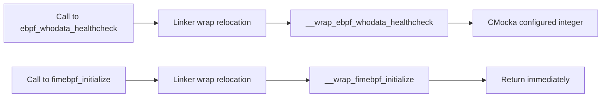
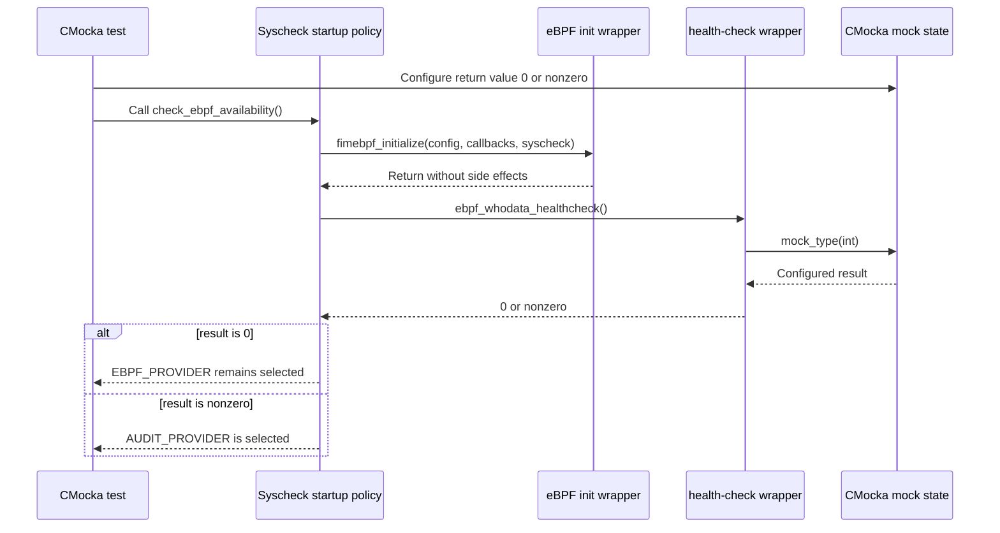
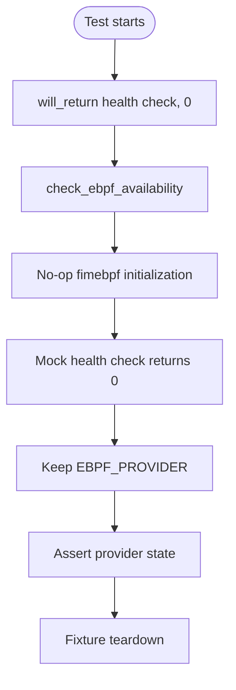
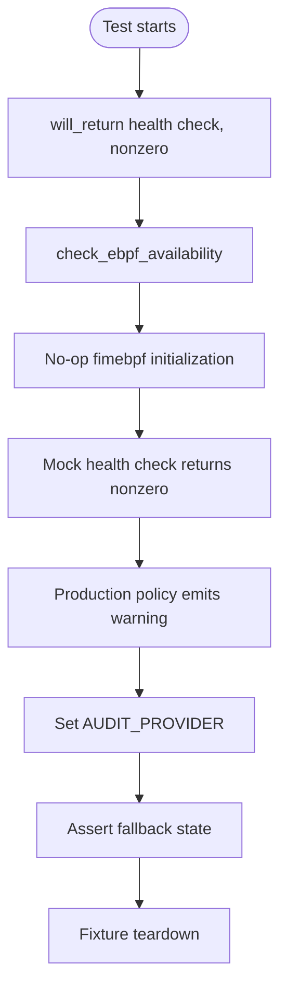

# Linux eBPF test wrappers

The `wrappers_linux_ebpf` module provides linker-interposition test doubles for the Linux eBPF whodata entry points used by Syscheck/FIM. It prevents unit tests from loading libbpf, attaching kernel programs, creating ring buffers, or depending on a supported host kernel.

The module contains two wrappers:

- `__wrap_ebpf_whodata_healthcheck()` returns a CMocka-configured health-check result.
- `__wrap_fimebpf_initialize(...)` replaces eBPF initialization with a no-op.

Runtime eBPF behavior belongs to [syscheckd_ebpf_orchestrator](syscheckd_ebpf_orchestrator.md) and [syscheckd_ebpf](syscheckd_ebpf.md). The policy test that consumes these wrappers is documented in [test_syscheck_ebpf](test_syscheck_ebpf.md).

## Scope and purpose

The wrapper is shared unit-test infrastructure, not an eBPF implementation. Its purpose is to isolate the Syscheck startup decision in `check_ebpf_availability()`:

| Wrapper | Replaces | Test behavior |
| --- | --- | --- |
| `__wrap_ebpf_whodata_healthcheck` | `ebpf_whodata_healthcheck` | Returns `mock_type(int)`, allowing tests to model success (`0`) or failure (nonzero). |
| `__wrap_fimebpf_initialize` | `fimebpf_initialize` | Accepts the complete initialization contract and deliberately performs no work. |

This separation lets tests assert provider selection without exercising kernel probes or the production eBPF lifecycle.

## Position in the system

```mermaid
flowchart LR
    Syscheck[Syscheck/FIM startup] -->|check_ebpf_availability| Policy[Provider-selection policy]
    Policy -->|fimebpf_initialize| Init[__wrap_fimebpf_initialize]
    Policy -->|ebpf_whodata_healthcheck| Health[__wrap_ebpf_whodata_healthcheck]
    Health --> Mock[CMocka mock_type(int)]
    Policy -->|healthy| EBPF[Keep EBPF_PROVIDER]
    Policy -->|unhealthy| Audit[Select AUDIT_PROVIDER]
    Init -. replaces .-> ProductionInit[fimebpf_initialize]
    Health -. replaces .-> ProductionHealth[ebpf_whodata_healthcheck]
```

The production path initializes the eBPF singleton and validates the end-to-end kernel-to-user-space pipeline. Those responsibilities are intentionally bypassed here; see [syscheckd_ebpf_orchestrator](syscheckd_ebpf_orchestrator.md) for the full flow and [test_syscheck_ebpf](test_syscheck_ebpf.md) for the consuming tests.

## Module components

### `ebpf_wrappers.c`

Source: `src/unit_tests/wrappers/linux/ebpf_wrappers.c`

#### `__wrap_ebpf_whodata_healthcheck`

```c
int __wrap_ebpf_whodata_healthcheck(void);
```

The function has no inputs and returns `mock_type(int)`. CMocka supplies the value with `will_return(__wrap_ebpf_whodata_healthcheck, value)`. The caller interprets the result using the production contract:

- `0`: health check passed; retain `EBPF_PROVIDER`.
- nonzero: health check failed; fall back to `AUDIT_PROVIDER`.

The wrapper does not validate kernel versions, load dynamic libbpf symbols, attach `modern.bpf.c`, poll a ring buffer, or create the health-check canary file.

#### `__wrap_fimebpf_initialize`

```c
void __wrap_fimebpf_initialize(const char* config_dir,
                                FunctionPtr get_user,
                                FunctionPtr get_group,
                                FunctionPtr whodata_event,
                                FunctionPtr free_whodata_event,
                                FunctionPtr loggingFunction,
                                FunctionPtr abspath,
                                FunctionPtr is_shutdown,
                                syscheck_config syscheck);
```

The body is empty. All arguments are intentionally ignored. This preserves the call boundary expected by Syscheck while avoiding mutation of the eBPF singleton or registration of callbacks.

The callback parameters are represented by the permissive `FunctionPtr` type:

```c
typedef void (*FunctionPtr)();
```

This is an unspecified-argument function pointer used by the test seam to carry several callback signatures. It is not a production callback API and should remain aligned with the wrapper’s linker-facing declaration.

### `ebpf_wrappers.h`

Source: `src/unit_tests/wrappers/linux/ebpf_wrappers.h`

The header exposes the wrapper declarations and supplies the test-side type declarations:

- `syscheck_config` is declared as `struct _config`.
- `FunctionPtr` is declared for callback parameters.
- Both `__wrap_*` functions are declared for test targets and linker wrapping.

The implementation includes `syscheck.h` before this header, so the forward-declared `syscheck_config` is completed by the time the function definition is compiled. The header itself remains independent of the full Syscheck configuration definition.

## Architecture and dependencies

```mermaid
graph TD
    Test[test_syscheck_ebpf] -->|calls production startup policy| Syscheck[Syscheck object code]
    Syscheck -->|wrapped symbol| Health[__wrap_ebpf_whodata_healthcheck]
    Syscheck -->|wrapped symbol| Init[__wrap_fimebpf_initialize]
    Health --> CMocka[CMocka runtime]
    Health -->|mock_type(int)| Result[Configured integer result]
    Init --> NoOp[No-op boundary]
    Syscheck --> Config[syscheck_config / provider state]
    Production[Real syscheckd eBPF orchestrator] -. excluded from this unit link .-> Syscheck
```

The key dependency is link-time symbol replacement, commonly configured with GNU ld options such as `--wrap=ebpf_whodata_healthcheck` and `--wrap=fimebpf_initialize`. A call to the production symbol is redirected to the matching `__wrap_*` function in the test binary.



## Interaction and data flow



No configuration, callback, queue, file, socket, or kernel-event data is consumed by the wrappers. The only test-controlled data crossing the boundary is the health-check integer. Initialization arguments are accepted solely to preserve the production call signature.

## Process flows

### Healthy eBPF branch



### Fallback branch



The wrapper itself does not select either provider. It only supplies the result that drives the policy in the caller. This distinction keeps assertions meaningful: provider selection is tested in [test_syscheck_ebpf](test_syscheck_ebpf.md), while actual eBPF availability is tested by the production-oriented eBPF components.

## Testing guidance

Tests using this module should:

1. Enable the test environment before invoking code that reaches the wrapped symbols.
2. Configure `__wrap_ebpf_whodata_healthcheck` with CMocka’s `will_return` mechanism.
3. Use `0` for a successful health check and a nonzero value for failure.
4. Assert the caller’s resulting provider state and expected logs.
5. Release Syscheck fixtures in the test’s normal teardown path.

The wrapper does not need a return-value setup for `__wrap_fimebpf_initialize`, because it returns `void` and has no observable behavior. Tests should not assert that its callback arguments were invoked: the no-op is the intended contract.

## Maintenance notes

- Keep both wrapper declarations exactly compatible with the symbols and call sites being wrapped.
- Preserve the zero/nonzero health-check contract; changing it would invalidate the Syscheck fallback tests.
- If `fimebpf_initialize` gains a meaningful test-observable side effect, add explicit mock state rather than silently implementing production behavior in this wrapper.
- If callback signatures change, update the wrapper declaration and the corresponding production/test link boundary together.
- Keep low-level kernel, libbpf, ring-buffer, and canary-file behavior in [syscheckd_ebpf_orchestrator](syscheckd_ebpf_orchestrator.md), not in this test seam.
- Related Linux wrapper modules include [wrappers_linux_dlfcn](wrappers_linux_dlfcn.md), [wrappers_linux_inotify](wrappers_linux_inotify.md), and [wrappers_linux_socket](wrappers_linux_socket.md).

## File inventory

| File | Contents |
| --- | --- |
| `src/unit_tests/wrappers/linux/ebpf_wrappers.c` | CMocka health-check mock and no-op initialization wrapper. |
| `src/unit_tests/wrappers/linux/ebpf_wrappers.h` | Public declarations and lightweight type aliases used by the test wrapper. |

