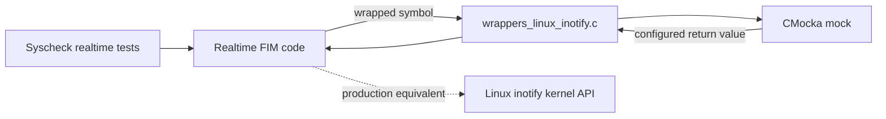
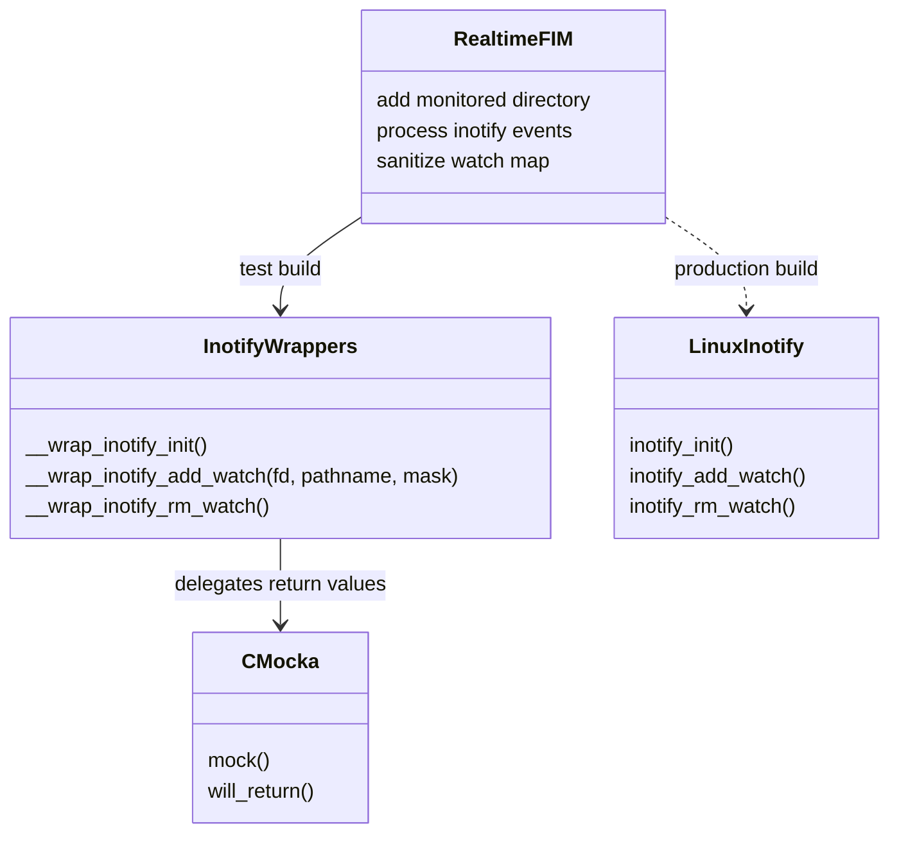
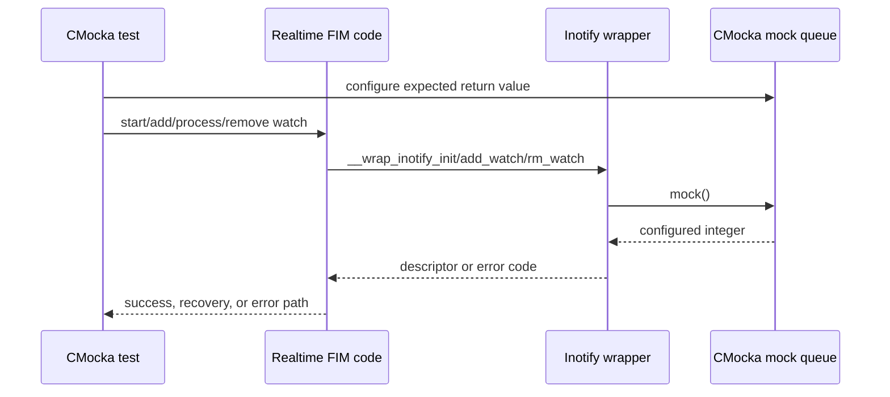
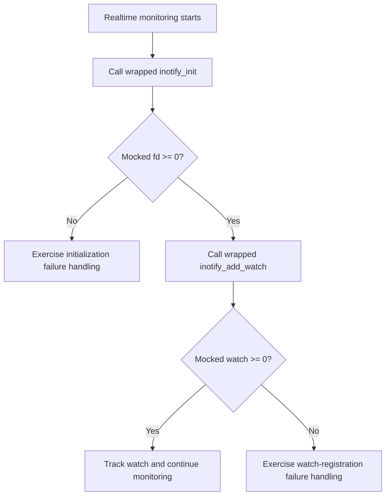
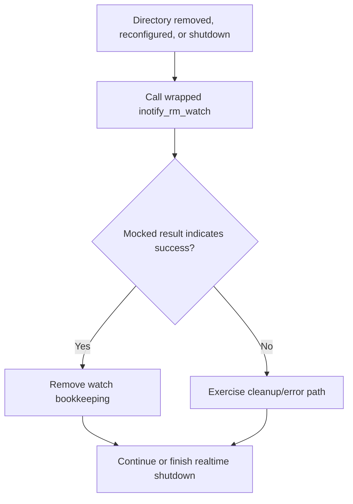
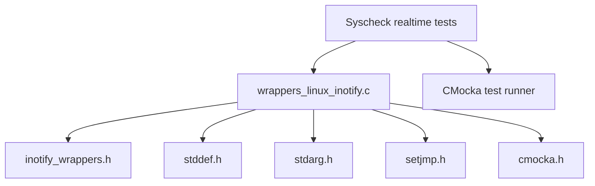

# `wrappers_linux_inotify`

The `wrappers_linux_inotify` module provides CMocka link-time wrappers for Linux `inotify` system calls used by Wazuh tests. Each wrapper delegates its result to CMocka's `mock()` facility, allowing a test to simulate successful initialization, watch registration/removal, and system-call failures without accessing the host kernel or filesystem.

This is test infrastructure, not production runtime code. The wrappers are consumed by tests for Linux realtime file monitoring, especially the Syscheck/FIM paths documented in [test_run_realtime](test_run_realtime.md) and [syscheckd_core_realtime](syscheckd_core_realtime.md) when that module documentation is present.

## Purpose and scope

The implementation in `src/unit_tests/wrappers/linux/inotify_wrappers.c` intercepts three APIs:

| Wrapper | Intercepted operation | Test-controlled result |
|---|---|---|
| `__wrap_inotify_init()` | Creates an inotify instance | `mock()` return value, normally a file descriptor or `-1` |
| `__wrap_inotify_add_watch(fd, pathname, mask)` | Adds a filesystem watch | `mock()` return value, normally a watch descriptor or `-1` |
| `__wrap_inotify_rm_watch()` | Removes a filesystem watch | `mock()` return value, normally `0` or `-1` |

The `fd`, `pathname`, and `mask` parameters of `__wrap_inotify_add_watch` are explicitly marked unused. The wrapper therefore validates no paths or event masks; those concerns belong to the code under test and its associated Syscheck tests.

## Architecture

The module sits between Syscheck realtime logic and the Linux kernel API. Linker wrapping redirects calls from the production-facing code path to the test doubles below.



In a test build, the wrapper is selected by the linker (commonly through `--wrap=inotify_init`, `--wrap=inotify_add_watch`, and `--wrap=inotify_rm_watch`). The real libc calls are not required for the exercised path.

## Component relationships



The wrapper has no persistent state and no business logic. CMocka owns the scenario state, typically configured by the test with `will_return()` or related mock APIs before invoking the function under test.

## Data and control flow

The wrapper does not transform arguments or produce event data. Its data flow is limited to the call context and a scalar mocked return value.



## Process flows

### Successful watch setup



### Watch removal and cleanup



These flows describe the integration contract exposed by the wrappers. Exact retry, logging, and watch-map behavior is implemented by the Syscheck realtime module; see [test_run_realtime](test_run_realtime.md) for the corresponding test scenarios.

## API behavior

### `__wrap_inotify_init`

```c
int __wrap_inotify_init(void);
```

The function calls `mock()` and returns its integer result unchanged. Tests can represent a valid inotify descriptor or force initialization failure.

### `__wrap_inotify_add_watch`

```c
int __wrap_inotify_add_watch(int fd, const char *pathname, uint32_t mask);
```

The function ignores all arguments and returns `mock()`. This makes it suitable for testing both watch registration and failure handling independently of the actual directory, descriptor, and event mask.

### `__wrap_inotify_rm_watch`

```c
int __wrap_inotify_rm_watch(/* declaration supplied by inotify_wrappers.h */);
```

The implementation calls `mock()` and returns the result. The source intentionally does not inspect its arguments. The exact prototype is defined by `inotify_wrappers.h`; callers must compile against that header so the wrapper matches the intercepted symbol.

## Dependencies



The standard headers support the wrapper/test compilation environment. The functional dependency is CMocka, specifically `mock()`. The module tree also places this file beside other Linux test doubles such as [wrappers_linux_ebpf](wrappers_linux_ebpf.md), [wrappers_linux_socket](wrappers_linux_socket.md), and [wrappers_linux_wait](wrappers_linux_wait.md), which follow the same isolation pattern for platform APIs.

## Testing and maintenance notes

- Configure a return value before each wrapper invocation; otherwise the result depends on the CMocka mock queue and the test may fail or become ambiguous.
- Use negative values to drive error branches and valid descriptors to drive normal branches.
- Because arguments are ignored, argument validation must be tested separately at the caller level or with a higher-level integration test.
- Keep the wrapper prototypes synchronized with `inotify_wrappers.h` and the platform declarations. In particular, changes to `inotify_rm_watch`'s declaration should be reflected in both the header and linker configuration.
- The wrapper should remain deterministic and side-effect free. Do not add real filesystem watches here; that would make unit tests dependent on kernel limits, permissions, and host state.

## Relation to the overall system

At runtime, Wazuh Syscheck uses Linux inotify as one realtime filesystem-event source. In unit tests, this module replaces that external boundary so the Syscheck state machine can be tested deterministically. It therefore supports, but does not implement, realtime FIM behavior such as watch creation, event processing, watch-map sanitization, overflow handling, and cleanup. Those responsibilities belong to the Syscheck realtime implementation and its tests, which should be referenced rather than duplicated here.

## Source reference

- `src/unit_tests/wrappers/linux/inotify_wrappers.c`
- `src/unit_tests/wrappers/linux/inotify_wrappers.h`
