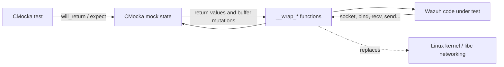
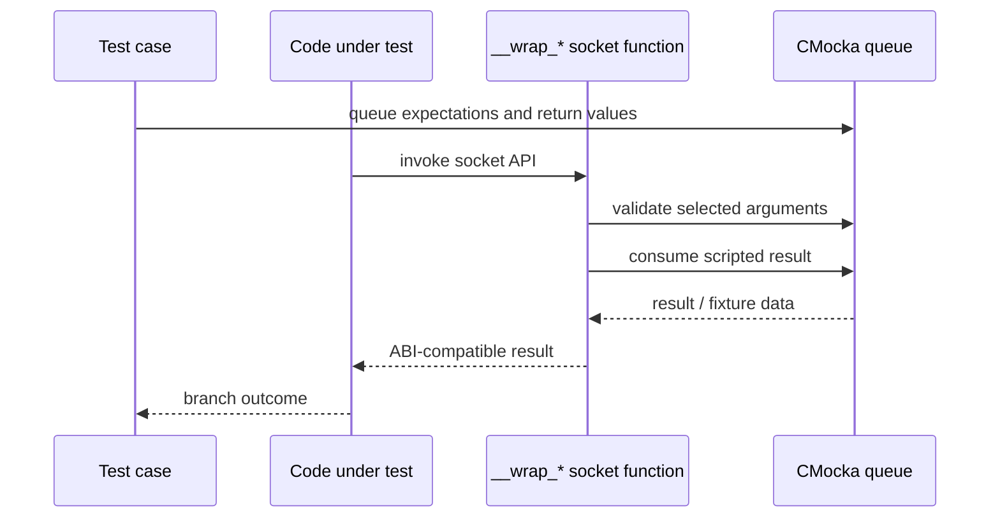
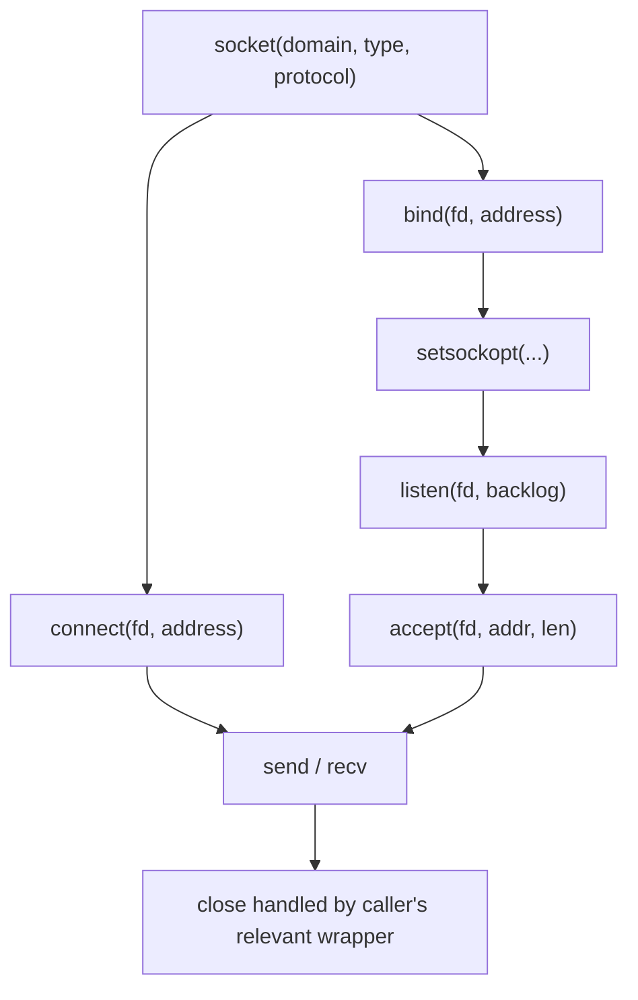
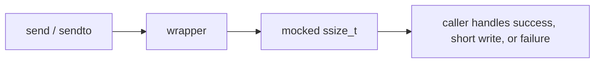
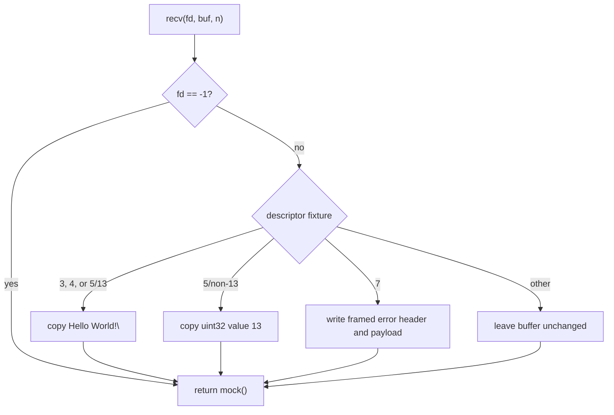
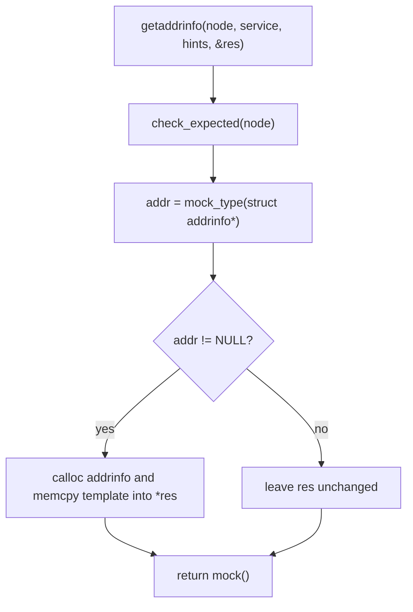
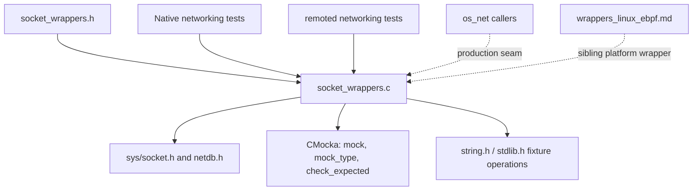
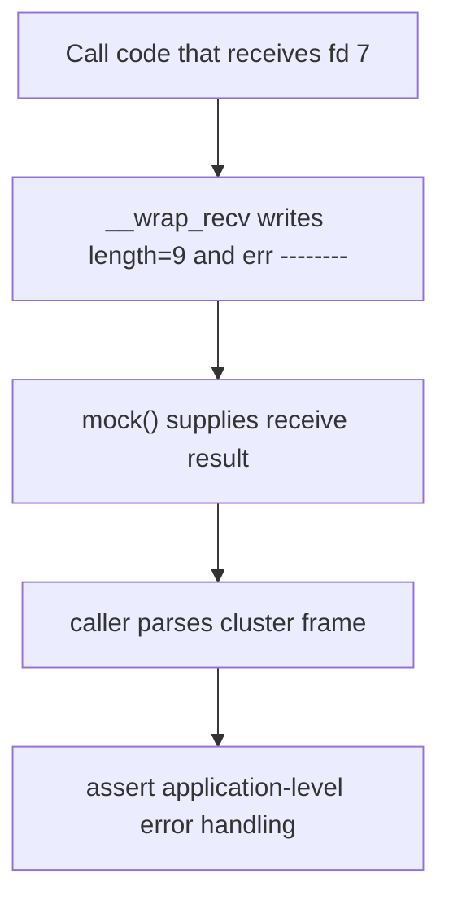
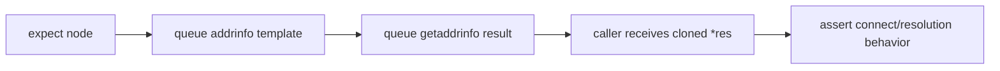

# `wrappers_linux_socket`

`wrappers_linux_socket` is Wazuh's Linux socket-system-call test seam. It
provides CMocka/linker wrappers for socket creation, setup, connection,
address resolution, and byte-stream or datagram I/O. Unit tests use these
wrappers to drive success, partial-data, malformed-data, and error paths
without opening real network connections.

This module is test infrastructure, not a networking implementation. The
production networking behavior belongs to the native networking layer and its
consumers; see [`os_net.md`](os_net.md) where available. General wrapper
conventions are described in [`wrappers_common.md`](wrappers_common.md).

## Position in the test architecture

The wrappers replace libc/POSIX socket symbols at link time. Production code
under test still follows its normal control flow, but each external result is
scripted through CMocka's mock queue.

The module consists of:

| File | Role |
|---|---|
| `src/unit_tests/wrappers/linux/socket_wrappers.c` | Wrapper implementations and deterministic fixture behavior. |
| `src/unit_tests/wrappers/linux/socket_wrappers.h` | Public wrapper declarations plus socket/address types from `<sys/socket.h>` and `<netdb.h>`. |

## Component inventory

| Wrapper | Simulated operation | Behavior |
|---|---|---|
| `__wrap_socket` | Create a socket | Returns `mock()`. |
| `__wrap_bind` | Bind an address | Returns `mock()`. Arguments are otherwise ignored. |
| `__wrap_setsockopt` | Set socket options | Returns `mock()`. |
| `__wrap_getsockopt` | Read socket options | Writes the integer `100000` to `optval`, then returns `mock()`. |
| `__wrap_listen` | Put a socket into listen mode | Returns `mock()`. |
| `__wrap_connect` | Connect to a peer | Returns `mock()`. |
| `__wrap_accept` | Accept a connection | Sets `addr->sa_family` from `mock()`, then returns a second `mock()`. |
| `__wrap_send` | Send connected-socket data | Returns `mock()`. No data is inspected or copied. |
| `__wrap_sendto` | Send datagram data | Returns `mock()`. No data is inspected or copied. |
| `__wrap_recv` | Receive connected-socket data | May populate the destination buffer based on the file descriptor and requested length, then returns `mock()`. |
| `__wrap_recvfrom` | Receive datagram data and peer address | Copies `"Hello World!\n"` when `fd != -1`, then returns `mock()`. |
| `__wrap_fcntl` | Configure/query descriptor flags | Calls the real `fcntl` outside test mode; returns `mock()` in test mode. |
| `__wrap_getaddrinfo` | Resolve a host name | Checks the expected `node`, optionally clones a mocked `addrinfo` into `*res`, and returns `mock()`. |

## CMocka interaction model

Most wrappers consume one scripted return value. `__wrap_accept` consumes two:
one for the peer address family and one for the accepted descriptor/result.
`__wrap_getaddrinfo` combines an argument expectation with an optional mocked
address template. `__wrap_fcntl` is the exception because it preserves a real
system-call path when `test_mode` is false.

## Socket lifecycle and connection flow

The wrapper layer supports the usual server and client setup sequences. It
does not enforce call ordering; the caller's test must queue the values needed
for the particular path.

`socket`, `bind`, `setsockopt`, `listen`, and `connect` are deliberately thin:
all arguments are marked unused and the return value is taken directly from
`mock()`. This makes them useful for injecting descriptor creation failures,
permission failures, unavailable listeners, and retry conditions.

`__wrap_accept` writes through `addr` unconditionally. Tests using it must
provide a valid `struct sockaddr *`; the first mock value becomes
`sa_family`, and the second becomes the function result.

## Send and receive behavior

### Send paths

`__wrap_send` and `__wrap_sendto` do not inspect or mutate the payload. Their
return values can represent a complete send, a short send, zero bytes, or an
error according to the caller's expected type.

### Connected receive path

`__wrap_recv` has deterministic fixture branches before consuming its return
value:

| Descriptor condition | Buffer mutation |
|---|---|
| `fd == -1` | None; only the mocked return is used. |
| `fd == 3`, `fd == 4`, or `fd == 5 && n == 13` | Copies `"Hello World!\n"`, including its terminating byte because `sizeof(SENDSTRING)` is used. |
| `fd == 5 && n != 13` | Copies the 32-bit value `13`. This models a length/header read. |
| `fd == 7` | Writes big-endian payload length `9` at offset 4 and `"err --------"` at offset 8. This models a cluster-framed error message. |
| Other descriptors | No buffer mutation. |

After the optional mutation, the wrapper returns `mock()`; the return value is
not automatically tied to the number of bytes copied.

### Datagram receive path

`__wrap_recvfrom` copies `"Hello World!\n"` whenever the descriptor is not
`-1`, regardless of the requested length. It does not populate the source
address or address length. Tests should therefore provide a sufficiently large
buffer and validate address handling separately if that is part of the code
under test.

## Descriptor flags and address resolution

`__wrap_fcntl` reads one variadic `unsigned long` argument to preserve the
calling convention. When `test_mode` is false it forwards the descriptor,
command, and argument to `__real_fcntl`; when test mode is enabled it returns a
mocked result. This supports tests that need real descriptor flag behavior as
well as isolated failure injection.

`__wrap_getaddrinfo` calls `check_expected(node)`, then consumes a mocked
`struct addrinfo *`. If that pointer is non-null, it allocates a new
`struct addrinfo` and copies the template into `*res`; the wrapper then returns
the next mocked integer result. The allocation is intentionally a minimal
fixture clone: nested `addrinfo` pointers and address storage are not deep
copied, and the caller is responsible for normal `freeaddrinfo`-compatible
cleanup in the test scenario.

## Dependencies and consumers

The module is especially relevant to tests around `os_net`, remoted TCP/UDP
handling, agent enrollment, local daemon IPC, and cluster framing. For
remoted's higher-level network-buffer behavior, see
[`test_netbuffer_remoted.md`](test_netbuffer_remoted.md). Platform-specific
inotify and eBPF seams remain separate; see
[`wrappers_linux_inotify.md`](wrappers_linux_inotify.md) and
[`wrappers_linux_ebpf.md`](wrappers_linux_ebpf.md) where available.

## Representative test flows

### Simulating a successful TCP listener

### Simulating a framed cluster error

### Simulating hostname resolution

## Test-author and maintenance guidance

- Queue one return value for each wrapper invocation; remember that
  `__wrap_accept` consumes two values.
- Provide valid output pointers to `__wrap_accept`, `__wrap_getsockopt`, and
  `__wrap_getaddrinfo`; these functions write through their output arguments.
- For `__wrap_recv`, use the documented descriptor/length combinations when a
  fixture payload is required. Otherwise the destination buffer is unchanged.
- Do not assume the mocked return count equals the number of bytes copied by a
  receive wrapper.
- Use a sufficiently sized buffer for `__wrap_recvfrom`; its fixed fixture
  copy is not bounded by `__n`.
- In tests involving `getaddrinfo`, account for the shallow `addrinfo` copy and
  clean up any allocated result as appropriate.
- Keep declarations in `socket_wrappers.h` synchronized with the intercepted
  platform ABI and linker `--wrap` configuration.
- Keep real socket behavior, protocol semantics, and production error policy
  in higher-level networking documentation; this module should remain
  deterministic and narrowly focused on the external-call boundary.

## Related documentation

- [`os_net.md`](os_net.md) — production native networking primitives and
  framing protocols.
- [`test_netbuffer_remoted.md`](test_netbuffer_remoted.md) — remoted network
  buffer tests that may consume socket behavior.
- [`wrappers_common.md`](wrappers_common.md) — shared CMocka wrapper patterns.
- [`wrappers_linux_inotify.md`](wrappers_linux_inotify.md) — Linux filesystem
  event wrappers.
- [`wrappers_linux_ebpf.md`](wrappers_linux_ebpf.md) — Linux eBPF test seam.
