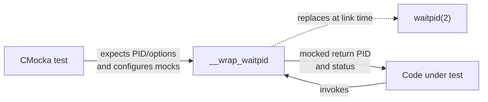
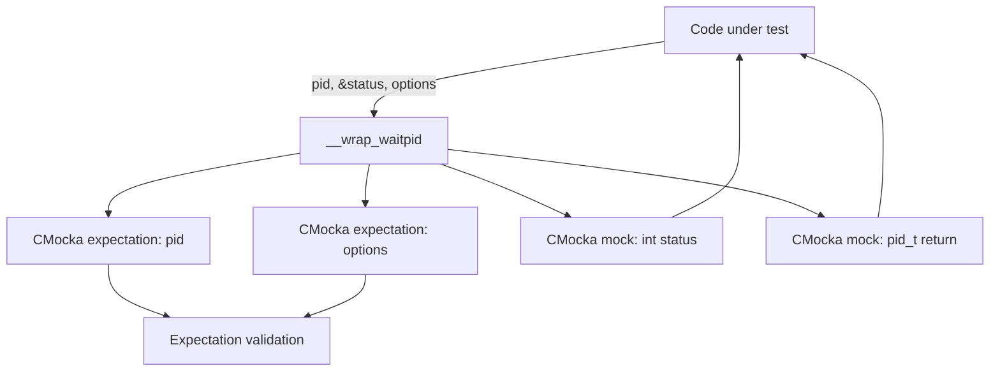
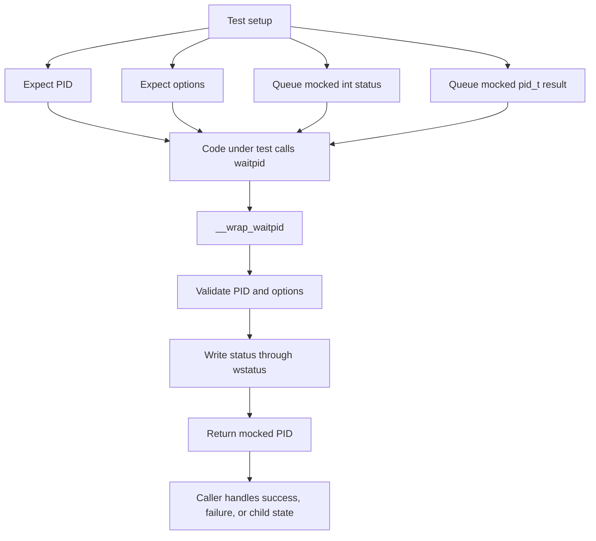
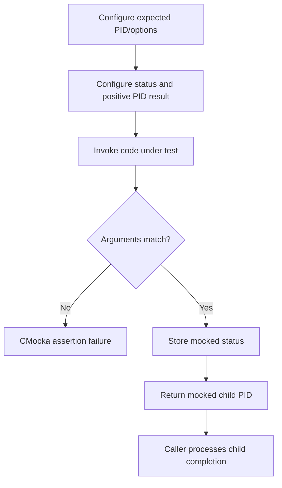
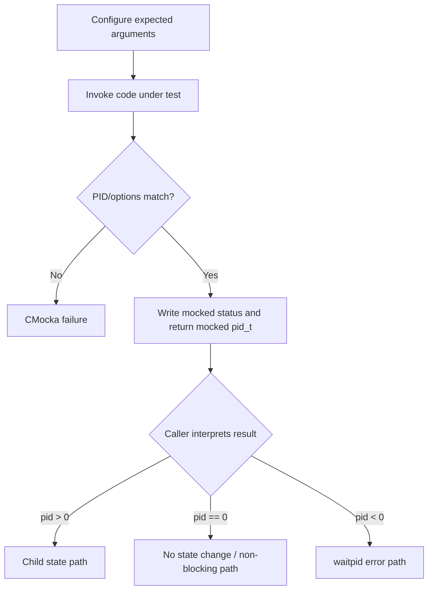
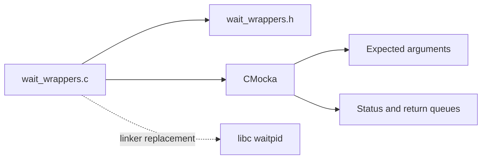

# `wrappers_linux_wait`

`wrappers_linux_wait` is a Linux-specific unit-test wrapper module for the POSIX `waitpid` system call. It replaces the real process-wait operation with a CMocka-controlled implementation so tests can verify how code waits for child processes without creating or synchronizing with real children.

The module contains one implementation unit:

`src/unit_tests/wrappers/linux/wait_wrappers.c` — `__wrap_waitpid`

It belongs to the broader native test-wrapper layer described in [Unit Test Wrappers & Mocks](Unit_Test_Wrappers_%26_Mocks.md) and follows the common CMocka conventions described in [test_infrastructure.md](test_infrastructure.md). The neighboring Linux socket wrapper is documented in [wrappers_linux_socket.md](wrappers_linux_socket.md).

## Purpose and system position

Production code that launches child processes commonly calls `waitpid` to collect termination status, avoid zombies, or implement timeout and cleanup behavior. Calling the operating-system function directly in a unit test would make the result dependent on process state and scheduling. This wrapper creates a deterministic boundary around that dependency.



The wrapper is test infrastructure, not production process-management logic. It does not start, stop, reap, or inspect an actual child process.

## Architecture

The implementation has a single component with three responsibilities:

| Component | Responsibility |
|---|---|
| `__wrap_waitpid` | Intercepts calls to `waitpid` during linked unit tests. |
| `check_expected` for `__pid` | Verifies the caller supplied the expected process identifier. |
| `check_expected` for `__options` | Verifies the caller supplied the expected wait options. |
| `mock_type(int)` and `mock_type(pid_t)` | Supplies the simulated status value and return value. |



## API contract

### `__wrap_waitpid`

```c
pid_t __wrap_waitpid(pid_t __pid, int *wstatus, int __options);
```

The function mirrors the relevant `waitpid` signature and is intended to be selected by the linker as the replacement for the real symbol.

Its behavior is fixed and ordered:

1. `check_expected(__pid)` consumes and validates the expected PID configured by the test.
2. `check_expected(__options)` consumes and validates the expected option flags.
3. `*wstatus = mock_type(int)` writes a caller-controlled status integer through the supplied pointer.
4. `return mock_type(pid_t)` returns a caller-controlled process ID result.

```mermaid
sequenceDiagram
    participant C as Code under test
    participant W as __wrap_waitpid
    participant M as CMocka mock state

    C->>W: waitpid(pid, &status, options)
    W->>M: check_expected(pid)
    M-->>W: pass or fail test
    W->>M: check_expected(options)
    M-->>W: pass or fail test
    W->>M: mock_type(int)
    M-->>W: simulated status
    W->>M: mock_type(pid_t)
    M-->>W: simulated return PID
    W-->>C: return PID; status updated
```

### Input and output semantics

| Value | Direction | Source or destination | Meaning |
|---|---|---|---|
| `__pid` | Input | Caller | PID the caller wants to wait for; validated against a CMocka expectation. |
| `wstatus` | Output pointer | Caller-owned memory | Receives the next mocked `int` value. The wrapper assumes this pointer is valid. |
| `__options` | Input | Caller | Wait behavior flags; validated against a CMocka expectation. |
| Return value | Output | CMocka mock queue | Next mocked `pid_t`, representing the OS result. |

The wrapper deliberately does not decode wait-status macros such as `WIFEXITED` or `WEXITSTATUS`. Tests that need those semantics should enqueue an appropriately encoded integer and exercise the decoding logic in the caller.

## Data flow



The effective test data flow is therefore bidirectional: arguments flow from the caller into CMocka checks, while the simulated status and return value flow back into the caller.

## Process flows

### Successful simulated wait



### Simulated error or non-blocking result

The same wrapper supports error paths because the returned `pid_t` is entirely test-controlled. A test can enqueue a negative value, zero, or another result expected by the caller, together with any status integer needed for the scenario.



## Dependencies

The source includes:

- `wait_wrappers.h` for the wrapper declaration and platform-specific declarations.
- C standard headers used by the wrapper and its test environment.
- `cmocka.h` for `check_expected` and `mock_type`.

At runtime, the wrapper depends on CMocka's per-test expectation and mock-value queues. It has no dependency on Wazuh databases, daemons, sockets, configuration files, or the Linux process table.



The module may be used alongside other platform wrappers, such as [wrappers_linux_socket.md](wrappers_linux_socket.md), when a test exercises both process lifecycle and communication behavior. Each wrapper remains focused on one external boundary.

## Test integration guidance

Tests using this wrapper should configure, in order:

1. An expected PID matching the call under test.
2. An expected `options` value matching the flags passed by the call under test.
3. A mocked integer for `*wstatus`.
4. A mocked `pid_t` return value.

The exact CMocka setup syntax depends on the test's existing conventions, but the values must be queued in the same order in which `__wrap_waitpid` consumes them. A missing expectation or mock value causes a CMocka failure rather than an operating-system wait.

Because the implementation writes unconditionally through `wstatus`, tests should pass a valid `int` object. Null-pointer behavior is not part of this wrapper's contract and should be validated separately only if the caller is expected to guard against it.

## Maintenance considerations

- Keep the wrapper signature aligned with the declaration in `wait_wrappers.h` and the platform's `waitpid` ABI.
- Preserve argument checks; they are the wrapper's primary verification value.
- Preserve the output write and mocked return so callers can exercise all wait-result branches deterministically.
- Do not add real process creation or sleeping to this module; those concerns belong in integration tests.
- If the wrapper gains additional wait-related functions, split documentation by responsibility and update the architecture diagram.

