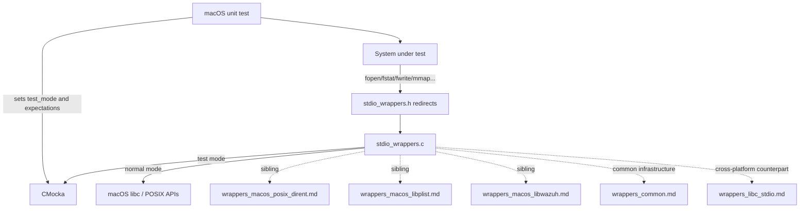
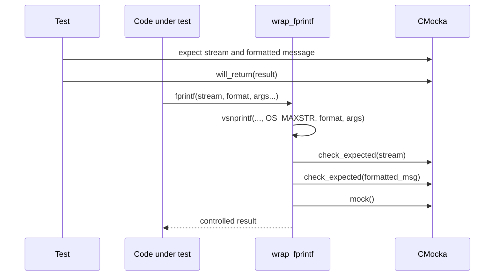
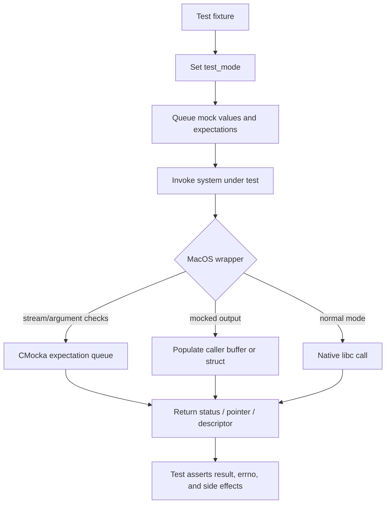
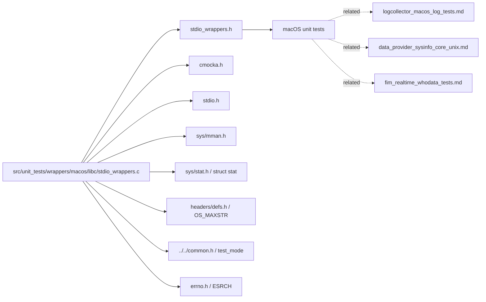

# `wrappers_macos_libc_stdio`

`wrappers_macos_libc_stdio` is the macOS-specific CMocka seam for standard I/O, file metadata, memory mapping, and temporary-file operations in Wazuh native unit tests. It lets tests control streams, descriptors, formatted output, file sizes, mappings, and cleanup outcomes without depending on the host filesystem or process state.

The implementation is [`src/unit_tests/wrappers/macos/libc/stdio_wrappers.c`](src/unit_tests/wrappers/macos/libc/stdio_wrappers.c), with macro redirects and declarations in [`src/unit_tests/wrappers/macos/libc/stdio_wrappers.h`](src/unit_tests/wrappers/macos/libc/stdio_wrappers.h). It is part of the `Unit_Test_Wrappers_&_Mocks` infrastructure and supports macOS tests in components such as logcollector, data providers, syscheck, and shared file utilities.

## Purpose and scope

The header redirects selected libc symbols to `wrap_*` functions. Each wrapper has two operating modes:

- **Test mode** (`test_mode != 0`): CMocka `mock*()` and `check_expected*()` calls provide deterministic inputs, outputs, and failures.
- **Normal mode** (`test_mode == 0`): wrappers that have a real branch delegate to the corresponding libc implementation.

The module is a test adapter, not a production runtime component. It owns no application data and does not interpret Wazuh records.

## Architecture

At link time, tests may also use linker wrapping for the underlying symbols. At source level, including the macOS header rewrites calls such as `fopen`, `fclose`, `fstat`, `mmap`, and `snprintf` to the corresponding `wrap_*` entry point.

## Component inventory

### Stream and descriptor operations

| Wrapper | Test-mode behavior | Normal-mode behavior |
|---|---|---|
| `wrap_fopen(path, mode)` | Checks both arguments and returns a mocked `FILE *`; a null result sets `errno = ESRCH`. | Calls `fopen`. |
| `wrap_tmpfile()` | Returns a mocked `FILE *`; a null result sets `errno = ESRCH`. | Calls `tmpfile`. |
| `wrap_fclose(fp)` | Checks `fp`, returns a mocked integer, and sets `errno = ESRCH` for a negative result. | Calls `fclose`. |
| `wrap_fileno(fp)` | Returns a mocked descriptor. | Calls `fileno`. |
| `wrap_fseek(fp, seek, flag)` | Checks `fp` and always returns `1`; `seek` and `flag` are not consulted. | Calls `fseek`. |
| `wrap_fwrite(src, n, size, fp)` | Checks `src` and returns `mock()`. Stream and size arguments are not expected. | Calls `fwrite`. |
| `wrap_fgets(s, n, stream)` | Takes a mocked `char *`, checks `stream`, copies it with bounded `strncpy`, and returns `s`; null input returns `NULL`. | Calls `fgets`. |

The implementation also contains `stat` as the system type used by `wrap_fstat`; it does not define a replacement `stat()` function.

### File metadata and memory mappings

| Wrapper | Test-mode behavior | Normal-mode behavior |
|---|---|---|
| `wrap_fstat(fd, buf)` | Sets `buf->st_size` from a mocked `int`, returns a second mocked integer, and sets `errno = ESRCH` if the result is negative. | Calls `fstat`. |
| `wrap_mmap(start, length, prot, flags, fd, offset)` | Checks `fd`, returns a mocked pointer, and sets `errno = ESRCH` when it is `MAP_FAILED`. | Calls `mmap`. |
| `wrap_munmap(mem, size)` | Checks `mem` and always returns `1`. | Calls `munmap`. |

Only the file descriptor is expected for `wrap_mmap` in test mode; address, length, protection, flags, and offset are passed through only in normal mode.

### Formatted output

`wrap_fprintf` consumes variadic arguments, renders them into an `OS_MAXSTR` buffer with `vsnprintf`, checks the target stream and rendered message, then returns a CMocka-mocked result. This allows tests to assert the final text rather than merely matching a format string.

`wrap_snprintf` invokes `vsnprintf` while in test mode and checks the destination buffer. In normal mode it calls `snprintf`. The implementation passes the collected `va_list` through the variadic call as written; changes to this wrapper should preserve the intended test contract and be validated with formatted-argument tests.

## Typical data and control flow

Common mock consumption order is important:

- `wrap_fstat`: mocked size first, mocked return code second.
- `wrap_fopen` and `wrap_tmpfile`: mocked stream pointer is returned directly.
- `wrap_fgets`: mocked source pointer is consumed before the stream expectation is checked.
- `wrap_fprintf`: stream expectation, formatted-message expectation, then mocked return value.
- `wrap_fwrite`: source expectation, then mocked return value.
- `wrap_mmap`: file-descriptor expectation, then mocked pointer.

## Dependency relationships

The shared `test_mode` lifecycle and general CMocka conventions belong to [`wrappers_common.md`](wrappers_common.md). The cross-platform stdio family is described in [`wrappers_libc_stdio.md`](wrappers_libc_stdio.md); this document records the macOS implementation’s distinct names, signatures, and semantics rather than duplicating that module’s general design.

The macOS wrapper family often operates alongside [`wrappers_macos_libplist.md`](wrappers_macos_libplist.md), [`wrappers_macos_libwazuh.md`](wrappers_macos_libwazuh.md), and [`wrappers_macos_posix_dirent.md`](wrappers_macos_posix_dirent.md). Those modules isolate plist conversion, Wazuh logging/message calls, and directory traversal respectively.

## Header surface

`stdio_wrappers.h` undefines and redirects these symbols:

`fprintf`, `snprintf`, `fstat`, `fileno`, `fclose`, `fwrite`, `fseek`, `fgets`, `mmap`, `munmap`, `tmpfile`, and `fopen`.

The header exposes declarations for all corresponding wrappers. The supplied component summary lists the principal functions (`stat`, `wrap_fclose`, `wrap_fileno`, `wrap_fprintf`, `wrap_fseek`, `wrap_fstat`, `wrap_fwrite`, `wrap_munmap`, and `wrap_snprintf`), but `wrap_fgets`, `wrap_mmap`, `wrap_tmpfile`, and `wrap_fopen` are also part of the effective module API and must be maintained when changing the redirect list.

## Test author guidance

1. Enable and restore the shared `test_mode` in a fixture; do not let global state leak between test groups.
2. Queue mock values in the order each wrapper consumes them, especially for `wrap_fstat`, `wrap_fgets`, and `wrap_mmap`.
3. Use pointer-aware expectations for `FILE *`, buffers, and paths where appropriate.
4. Test `NULL`, `MAP_FAILED`, negative return values, short writes, and file-size variations when the caller has error branches for them.
5. Remember that `wrap_fseek` and `wrap_munmap` return `1` in test mode regardless of the requested operation; callers should be tested against that contract.
6. Do not assume every wrapper fully validates its arguments. For example, `wrap_fwrite` checks only `src`, and `wrap_fseek` checks only `fp`.
7. Keep mocked pointers valid for the complete wrapped call. The wrappers do not allocate or free mocked streams, buffers, or mappings.

## Maintenance considerations

When adding a macOS libc dependency to a unit-tested component, decide whether the operation needs a new redirect, a CMocka expectation, or a normal-mode passthrough. Update the header and implementation together, then add success and failure tests for the wrapper’s exact mock-consumption order. Keep platform-specific behavior here and reference the generic [`wrappers_libc_stdio.md`](wrappers_libc_stdio.md) documentation for shared wrapper-family concepts.
