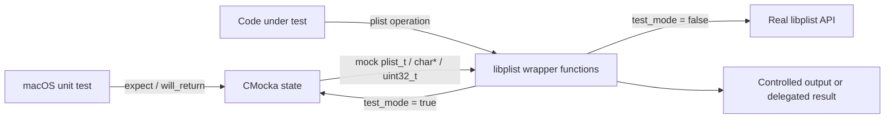
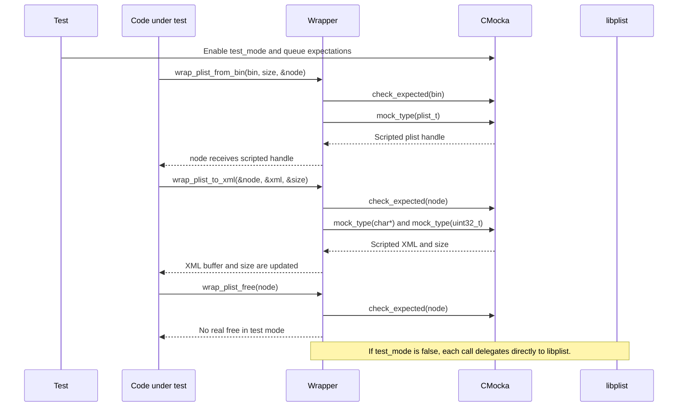
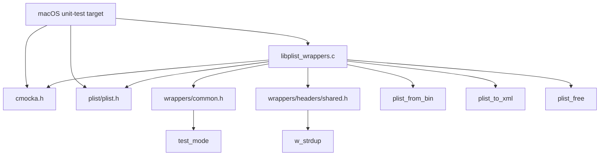
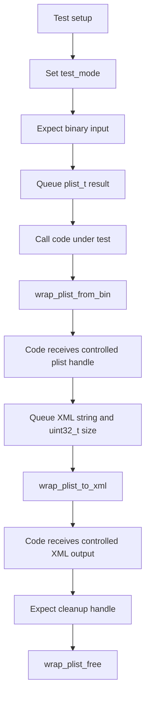
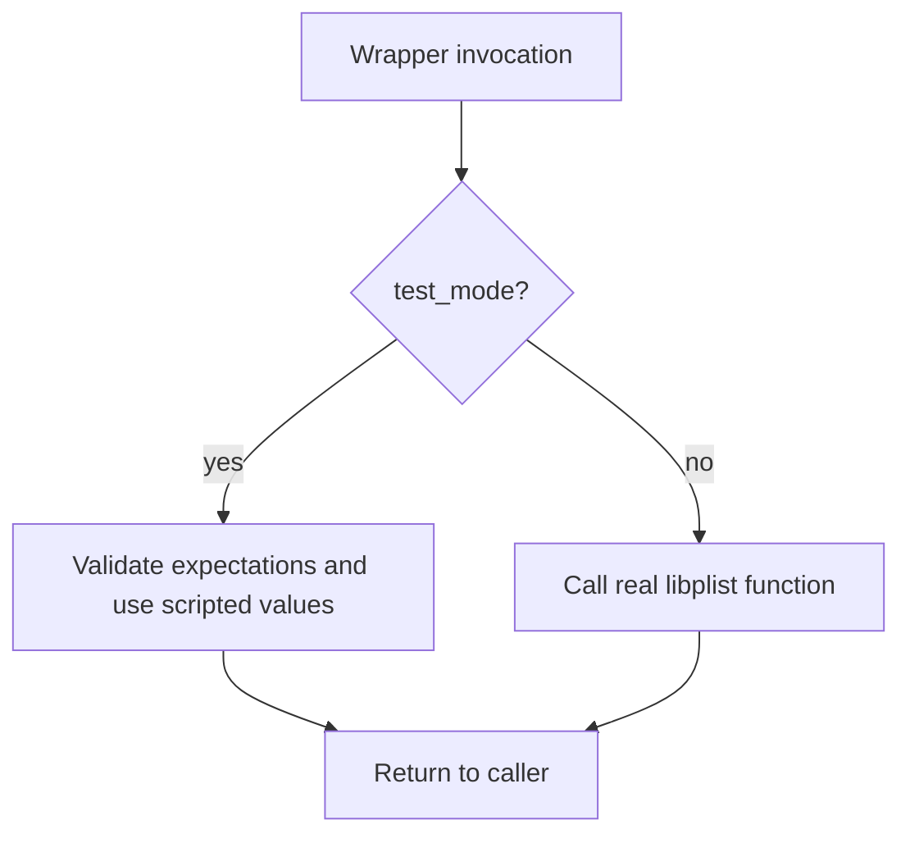

# `wrappers_macos_libplist`

## Introduction

`wrappers_macos_libplist` provides CMocka-aware test seams for the macOS `libplist` conversion and release functions used by Wazuh code. It allows unit tests to control binary-property-list parsing, XML serialization, and plist cleanup without invoking the external library implementation.

The module is test infrastructure only. It contains no production plist processing logic, daemon lifecycle, persistent state, or standalone test runner. The wrapper is compiled into macOS unit-test targets and is activated when the shared `test_mode` flag is enabled.

## Purpose and responsibilities

The wrapper source has three responsibilities:

- intercept `plist_from_bin` through `wrap_plist_from_bin`;
- intercept `plist_to_xml` through `wrap_plist_to_xml`;
- intercept `plist_free` through `wrap_plist_free`.

In test mode, the functions use CMocka expectations and return queues. Outside test mode, they delegate directly to the corresponding `libplist` function. This dual path lets the same wrapper object support isolated unit tests while retaining production-like behavior when mocking is disabled.

## Module structure

| File | Role |
| --- | --- |
| `src/unit_tests/wrappers/macos/libplist_wrappers.c` | Implements the three libplist seams. |
| `src/unit_tests/wrappers/common.c` / `common.h` | Provides the shared `test_mode` control used by wrapper code. |
| `src/unit_tests/wrappers/headers/shared.h` | Supplies shared Wazuh test declarations, including `w_strdup`. |
| `external/libplist/include/plist/plist.h` | Declares `plist_t`, `plist_from_bin`, `plist_to_xml`, and `plist_free`. |

The module tree identifies the following exported wrapper functions:

- `wrap_plist_from_bin`
- `wrap_plist_to_xml`
- `wrap_plist_free`

These names do not use the linker `__wrap_` prefix. They are helper-level seams selected by the macOS unit-test build or called through the code under test’s wrapper configuration.

## Architecture



The wrapper is a conditional adapter. Its observable behavior changes at the `test_mode` branch; there is no independent mock object or persistent module state.

## API contracts

### `wrap_plist_from_bin`

```c
void wrap_plist_from_bin(char *bin, size_t size, plist_t *node);
```

When `test_mode` is enabled, the function:

1. checks that `bin` matches the CMocka expected argument with `check_expected(bin)`;
2. obtains a scripted `plist_t` value using `mock_type(plist_t)`;
3. writes that value into the caller-provided `node` output parameter;
4. returns without calling `plist_from_bin`.

When test mode is disabled, it forwards `bin`, `size`, and `node` unchanged to `plist_from_bin`.

`size` is not independently validated in the mock path. Tests that need to exercise malformed or truncated input should encode that condition in their expected argument and scripted node result.

### `wrap_plist_to_xml`

```c
void wrap_plist_to_xml(plist_t *node, char **xml, uint32_t *size);
```

When `test_mode` is enabled, the function:

1. checks the plist pointer with `check_expected(node)`;
2. retrieves a mock `char *` value;
3. copies that value into the existing `*xml` destination through `w_strdup(tmp, *xml)`;
4. retrieves a mock `uint32_t` and stores it through `size`;
5. returns without calling the real serializer.

The mock path therefore controls both serialized XML content and its reported size. The wrapper does not parse XML, inspect the plist object, or calculate the length of the copied string. In normal mode it delegates unchanged to `plist_to_xml`.

### `wrap_plist_free`

```c
void wrap_plist_free(plist_t node);
```

In test mode, `check_expected(node)` verifies that the expected plist handle would have been released, but no deallocation occurs. In normal mode, the wrapper calls `plist_free(node)`.

This behavior prevents a mock plist handle from being passed to the external allocator while still allowing tests to assert cleanup interactions.

## Mock and data flow



The expected ordering for one complete mocked conversion is:

| Operation | CMocka interaction | Value controlled by test |
| --- | --- | --- |
| Binary parse | `check_expected(bin)` | Input pointer identity/content expectation |
| Binary parse | `mock_type(plist_t)` | Resulting plist handle |
| XML conversion | `check_expected(node)` | Input plist pointer expectation |
| XML conversion | `mock_type(char*)` | XML source string copied into `*xml` |
| XML conversion | `mock_type(uint32_t)` | Reported XML size |
| Cleanup | `check_expected(node)` | Handle expected to be freed |

The wrapper consumes no mock value for `size` in `wrap_plist_from_bin`, because the real parser’s status is represented by the mocked output handle rather than a return value.

## Component interaction and dependencies



Direct dependencies are intentionally narrow:

- CMocka supplies `check_expected` and `mock_type`;
- libplist supplies the real parser, serializer, handle type, and release function;
- shared wrapper infrastructure supplies `test_mode`;
- Wazuh shared helpers supply the string-copy operation used for mocked XML output.

For the broader lifecycle and conventions of Wazuh’s CMocka wrappers, see [test_infrastructure.md](test_infrastructure.md). The neighboring macOS libc stream wrappers use the same platform-specific test-wrapper organization; see [wrappers_macos_libc_stdio.md](wrappers_macos_libc_stdio.md).

## Typical process flows

### Mocked plist conversion



### Delegated behavior



## Testing guidance

Tests using this module should configure expectations before invoking the code under test. In particular:

- expect the exact `bin` pointer or value passed to `wrap_plist_from_bin`;
- queue a `plist_t` with the correct CMocka type;
- expect the plist pointer passed to `wrap_plist_to_xml`;
- queue the XML pointer first and the `uint32_t` size second;
- expect the same plist handle when cleanup is performed.

Tests should use distinct mock handles when verifying ownership or cleanup paths. Since `wrap_plist_free` does not actually release anything in test mode, teardown must release any test-owned allocations separately when the test creates them outside the wrapper.

The wrapper is suitable for testing caller behavior such as:

- handling a parse result represented by a null or controlled plist handle;
- consuming serialized XML without depending on libplist formatting;
- propagating or interpreting a scripted XML size;
- ensuring that the expected plist handle is released.

It is not suitable for validating libplist’s binary format parser, XML encoding rules, malformed-input diagnostics, or allocator behavior. Those concerns require tests that invoke the real library.

## Build and linkage role

The source is compiled into macOS unit-test targets that need to isolate libplist calls. The surrounding build decides whether calls reach these helpers and supplies the external libplist dependency for the non-test path. Production Wazuh binaries do not depend on this unit-test wrapper as a runtime component.

There is no `main` function, test registration table, worker, socket, configuration file, or persistent storage in this module. Test runners and fixtures are owned by the consuming suites and documented with those suites.

## Maintenance notes

When changing this wrapper:

- preserve the public signatures and `plist_t` ABI expected by libplist;
- preserve the mock consumption order unless all consumers are updated;
- keep the test-mode and delegated paths behaviorally separate;
- maintain output-parameter semantics for `node`, `xml`, and `size`;
- verify that changes to `w_strdup` usage do not introduce ownership or termination assumptions into tests.

The most important compatibility surface is not a return value but the sequence of CMocka expectations and output-parameter writes. Any change there can silently invalidate tests that exercise macOS log, inventory, or configuration code through this shared wrapper layer.
