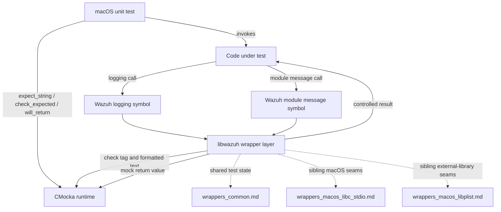
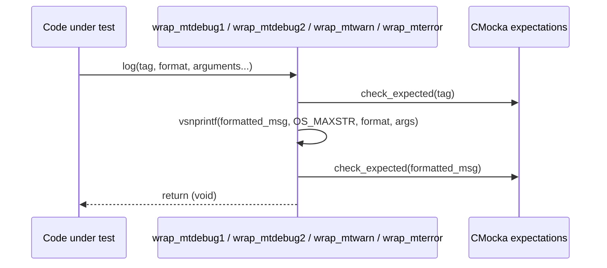
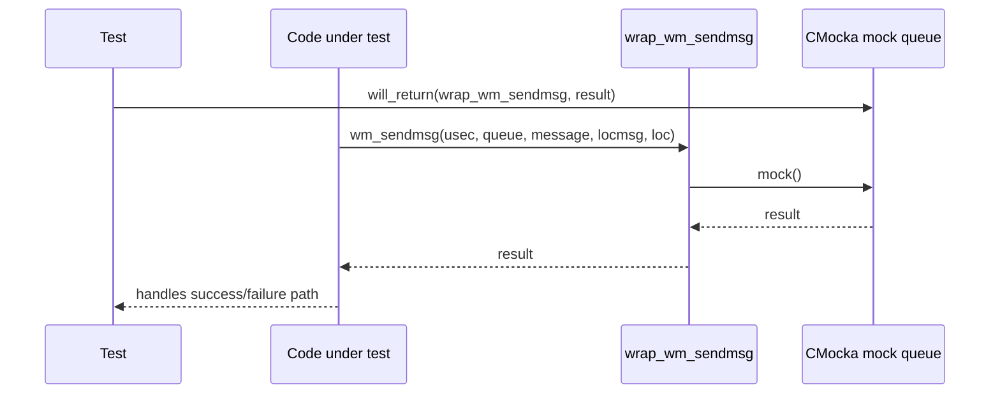
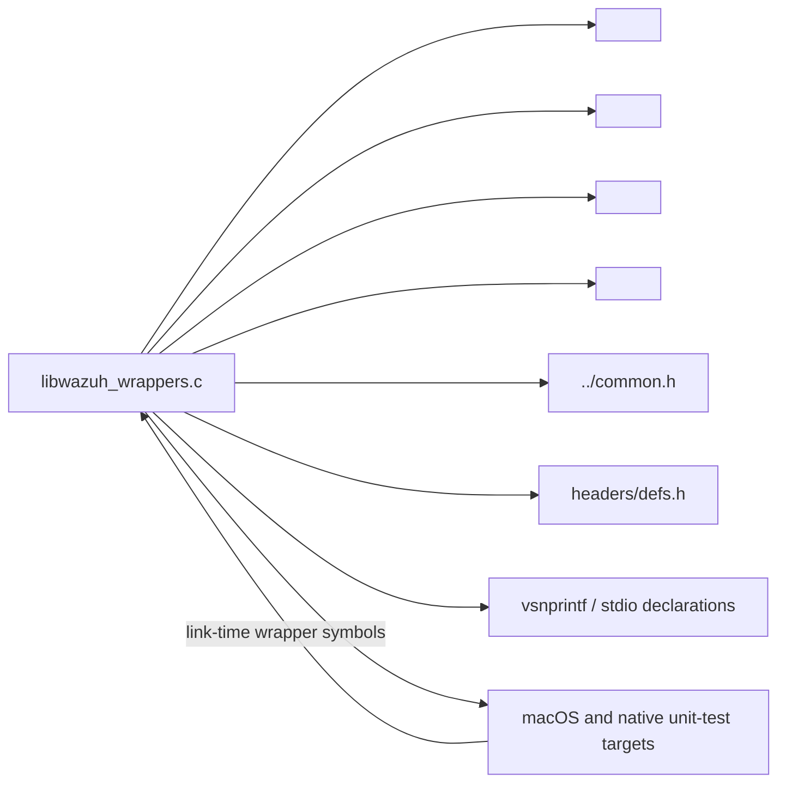

# `wrappers_macos_libwazuh`

`wrappers_macos_libwazuh` is the macOS-specific CMocka wrapper layer for a small set of Wazuh logging and module-message functions. It lets native unit tests observe formatted log messages and replace module message delivery with deterministic mock return values, without invoking the real Wazuh runtime services.

The implementation is [`src/unit_tests/wrappers/macos/libwazuh_wrappers.c`](src/unit_tests/wrappers/macos/libwazuh_wrappers.c). It belongs to the `Unit_Test_Wrappers_&_Mocks` infrastructure tree and is used as a test seam beneath macOS-oriented daemon and module tests. It is not a production runtime module.

## Purpose and scope

The wrapper file provides two kinds of isolation:

1. **Logging interception** — `wrap_mterror`, `wrap_mtwarn`, `wrap_mtdebug1`, and `wrap_mtdebug2` capture the tag and the fully rendered variadic message, then verify them through CMocka expectations.
2. **Message-dispatch mocking** — `wrap_wm_sendmsg` replaces module message delivery and returns a value supplied through CMocka’s `mock()` mechanism.

The module does not implement logging policy, queues, daemon control, or message transport. Those remain responsibilities of the production Wazuh components and their respective documentation.

## Architectural position



The wrappers are normally selected by the unit-test link configuration. Production code continues to use the real Wazuh logging and message functions; only test binaries link calls to these wrapper symbols.

## Components

| Wrapper | Role | CMocka interaction | Return behavior |
|---|---|---|---|
| `wrap_mterror` | Intercepts error-level logging | Checks `tag` and rendered `formatted_msg` | `void` |
| `wrap_mtwarn` | Intercepts warning-level logging | Checks `tag` and rendered `formatted_msg` | `void` |
| `wrap_mtdebug1` | Intercepts debug-level-1 logging | Checks `tag` and rendered `formatted_msg` | `void` |
| `wrap_mtdebug2` | Intercepts debug-level-2 logging | Checks `tag` and rendered `formatted_msg` | `void` |
| `wrap_wm_sendmsg` | Replaces module message delivery | Consumes `mock()` | Returns the mocked `int` |

The module-tree summary names `wrap_mtdebug1`, `wrap_mtdebug2`, `wrap_mtwarn`, and `wrap_wm_sendmsg`. The source also defines `wrap_mterror`; it should be treated as part of the maintained API of this wrapper file.

## Logging-wrapper behavior

All four logging wrappers have the same implementation pattern:

1. Allocate a stack buffer of `OS_MAXSTR` bytes.
2. Call `check_expected(tag)` to verify the logging category or source tag.
3. Start a `va_list` from the supplied format string.
4. Render the variadic arguments with `vsnprintf` into `formatted_msg`.
5. Call `check_expected(formatted_msg)` to verify the final rendered message.
6. End the `va_list`.



### Formatting contract

The expectation is made against the fully formatted message, not the original format string. For example, a call equivalent to `wrap_mtwarn("agent", "id=%d", 7)` must be configured with expectations for the tag `agent` and message `id=7`.

`OS_MAXSTR` comes from [`headers/defs.h`](../src/headers/defs.h) in the source tree. If a formatted message exceeds this fixed buffer, `vsnprintf` applies its normal bounded-output behavior; tests should expect the resulting truncated representation where relevant.

The wrappers do not emit logs, forward messages, mutate global logging state, or return an error. Their observable behavior is expectation checking and failure through CMocka when an expectation is absent or mismatched.

## Module-message behavior

`wrap_wm_sendmsg` has the signature:

```c
int wrap_wm_sendmsg(int usec,
                    int queue,
                    const char *message,
                    const char *locmsg,
                    char loc);
```

The implementation marks every parameter as unused and returns `mock()`. Consequently, this wrapper currently verifies neither the queue, timeout, message body, localization message, nor location character. Tests control only the return code unless an outer test seam adds separate argument assertions.



This makes the function useful for testing module startup, message-send failures, retry paths, and shutdown behavior without requiring a live Wazuh message queue.

## Data flow and control flow

```mermaid
flowchart TD
    A[Test configures CMocka] --> B{Code under test calls wrapped symbol}
    B -->|logging| C[Receive tag, format, variadic arguments]
    C --> D[vsnprintf into OS_MAXSTR buffer]
    D --> E[Check tag expectation]
    E --> F[Check rendered-message expectation]
    F --> G[Return to caller]
    B -->|wm_sendmsg| H[Receive ignored transport parameters]
    H --> I[Consume mock() return value]
    I --> J[Return controlled int to caller]
    G --> K[Test assertions]
    J --> K
```

The logging path is observational: it does not produce a value for the caller. The message path is behavioral: its mocked integer can change the caller’s control flow.

## Dependencies



The direct dependencies have distinct purposes:

- `<stdarg.h>` supplies `va_list`, `va_start`, and `va_end` for the logging wrappers.
- `<cmocka.h>` supplies `check_expected()` and `mock()`.
- `../common.h` supplies shared unit-test wrapper infrastructure and conventions.
- `headers/defs.h` supplies the Wazuh `OS_MAXSTR` limit.
- `vsnprintf` performs bounded rendering of variadic messages.

The source includes `<stddef.h>` and `<setjmp.h>` as part of the conventional CMocka wrapper setup. No database, socket, filesystem, plist, or platform service is accessed by this module.

## Relationships to neighboring modules

This module is one layer in the broader wrapper family. Use references instead of duplicating their implementation details:

- [`wrappers_common.md`](wrappers_common.md) — shared wrapper helpers and test-mode conventions.
- [`wrappers_macos_libc_stdio.md`](wrappers_macos_libc_stdio.md) — macOS stdio, file-position, and memory-mapping seams.
- [`wrappers_macos_libplist.md`](wrappers_macos_libplist.md) — plist serialization and parsing seams.
- [`shared_wrappers.md`](shared_wrappers.md) — generic Wazuh shared-library wrappers, including broader logging, queue, file, and message seams.
- [`wazuh_modules_wrappers.md`](wazuh_modules_wrappers.md) — wrappers for Wazuh module orchestration and module-specific helpers.

The production consumers are documented by their owning modules, such as the Wazuh modules daemon and logcollector. This document describes only the interception boundary they use in tests.

## Test-author guidance

For logging assertions:

1. Configure the tag expectation before invoking the code under test.
2. Render the expected message exactly as `vsnprintf` will render it, including substitutions and punctuation.
3. Configure a separate expectation for the rendered message.
4. Use the wrapper matching the production logging level so the test also verifies the intended severity path.

For `wrap_wm_sendmsg`:

1. Queue one CMocka return value for every intercepted call.
2. Use success and failure return values to exercise the caller’s send, retry, or shutdown branches.
3. Do not assume the wrapper validates arguments; argument-level checks require a different or enhanced seam.

## Failure and boundary semantics

- Missing or mismatched logging expectations fail through CMocka rather than returning an error.
- Message formatting is bounded by `OS_MAXSTR`.
- The variadic format string must be valid for the supplied arguments; the wrapper does not perform semantic validation.
- `wrap_wm_sendmsg` ignores all five input parameters and only consumes a mocked return value.
- No wrapper sets `errno`, writes to a queue, or calls a real implementation.
- The wrappers use stack storage for formatted logging messages; the checked message is valid only during the wrapper call.

## Maintenance checklist

When adding a macOS Wazuh API that needs isolation:

1. Decide whether the behavior belongs in this logging/message seam or in a sibling platform/shared wrapper.
2. Preserve the formatted-message expectation pattern for variadic logging functions.
3. Document any newly exposed wrapper symbol, including symbols not present in generated module-tree summaries.
4. Update the unit-test linker wrap list and add success/failure expectations to the owning test module.
5. Keep transport, logging policy, and production lifecycle behavior in the production module documentation rather than reproducing it here.
