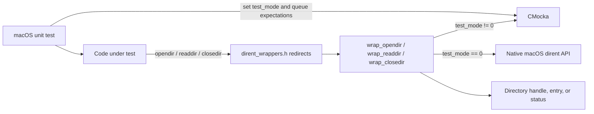
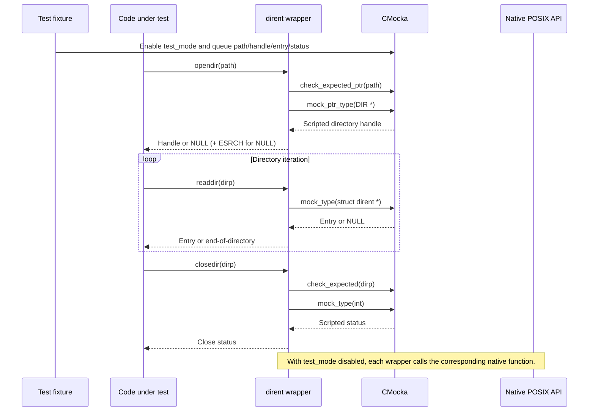
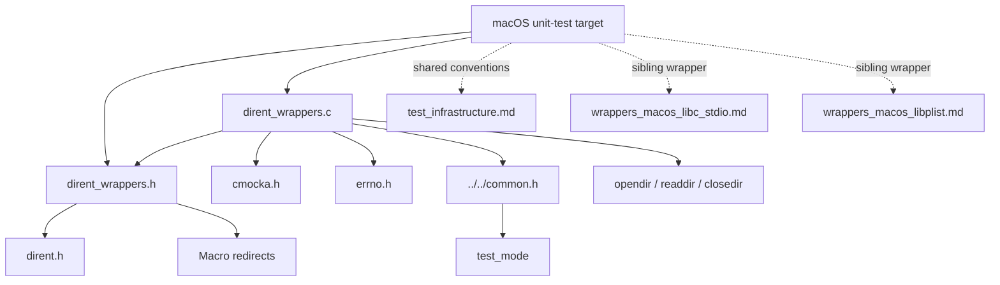
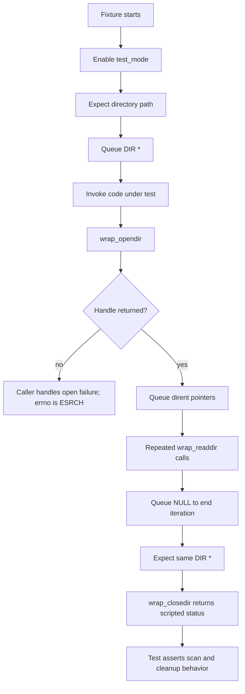
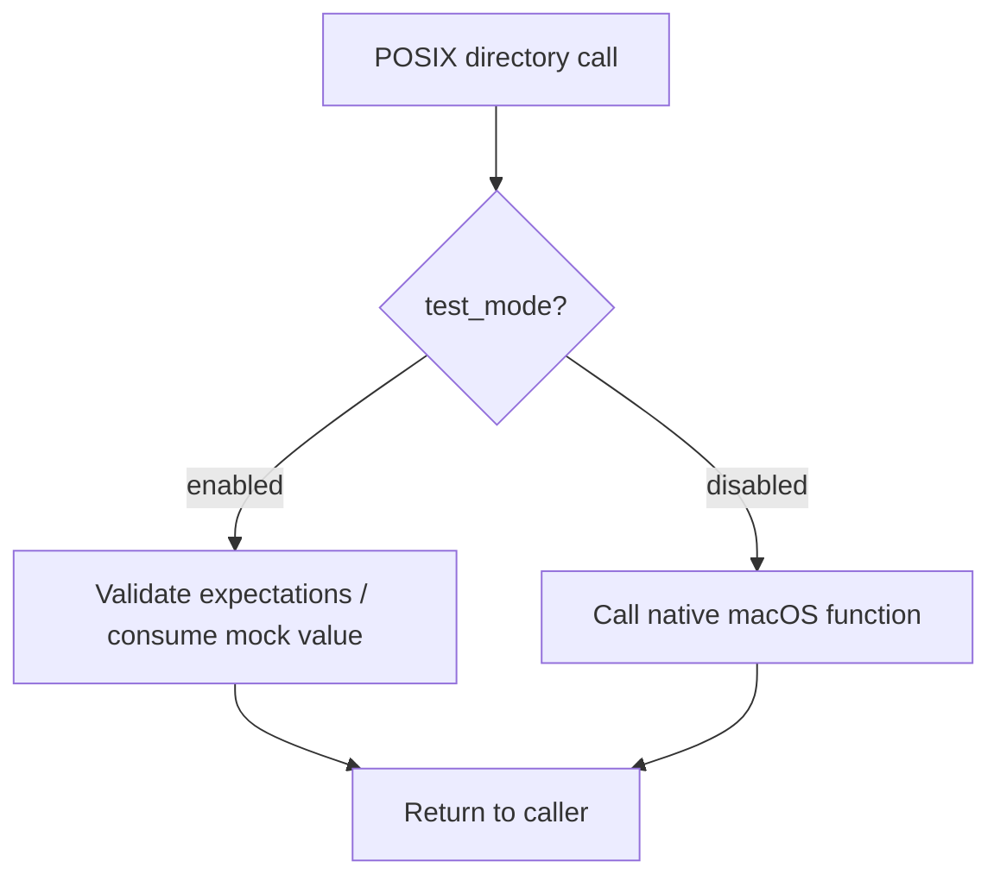

# `wrappers_macos_posix_dirent`

## Introduction

`wrappers_macos_posix_dirent` provides macOS-specific CMocka seams for POSIX directory traversal. It lets Wazuh unit tests control directory opening, entry enumeration, and directory closing without depending on the host filesystem.

The module is test infrastructure only. It has no production business logic, persistent state, daemon lifecycle, or standalone test runner. When shared `test_mode` is enabled, calls use CMocka expectations and scripted return values; otherwise they delegate to the native POSIX functions.

## Purpose and responsibilities

The module isolates three directory APIs:

- `wrap_opendir` controls directory-handle creation;
- `wrap_readdir` controls the sequence of returned `struct dirent` entries;
- `wrap_closedir` controls cleanup status.

The header redirects `opendir`, `readdir`, and `closedir` to those wrappers for code compiled with the macOS test header.

## Module structure

| File | Role |
| --- | --- |
| `src/unit_tests/wrappers/macos/posix/dirent_wrappers.c` | Implements mocked and native directory operations. |
| `src/unit_tests/wrappers/macos/posix/dirent_wrappers.h` | Includes `<dirent.h>`, redirects the POSIX symbols, and declares wrapper functions. |
| `src/unit_tests/wrappers/common.h` / `common.c` | Supplies the shared `test_mode` switch used by the wrappers. |
| `cmocka.h` | Provides `check_expected*` and `mock_type`. |

The source also includes `<errno.h>` and sets `errno = ESRCH` when mocked directory opening returns `NULL`.

## Architecture



The wrapper is a conditional adapter. It does not emulate directory contents itself; tests provide handles and `struct dirent *` values through CMocka.

## Header and symbol redirection

`dirent_wrappers.h` performs these preprocessor substitutions:

```c
#undef closedir
#define closedir wrap_closedir
#undef opendir
#define opendir wrap_opendir
#undef readdir
#define readdir wrap_readdir
```

This allows existing code to call the normal POSIX names while the test build routes those calls through the controllable wrapper implementation. The declarations preserve the relevant POSIX types: `DIR *` for directory handles and `struct dirent *` for entries.

## API behavior

### `wrap_opendir`

```c
DIR *wrap_opendir(const char *filename);
```

In test mode, the wrapper:

1. verifies `filename` with `check_expected_ptr(filename)`;
2. consumes a mocked `DIR *` using `mock_ptr_type(DIR *)`;
3. sets `errno = ESRCH` when the mocked result is `NULL`;
4. returns the mocked handle.

In normal mode, it calls `opendir(filename)` and returns the native result unchanged.

The wrapper does not copy or validate the path and does not allocate a directory handle.

### `wrap_readdir`

```c
struct dirent *wrap_readdir(DIR *dirp);
```

In test mode, the wrapper returns the next `struct dirent *` supplied by `mock_type(struct dirent *)`. The `dirp` argument is not independently checked in this branch. Tests model normal iteration by queuing entries followed by `NULL`; they can also queue a controlled entry pointer to exercise names, types, and end-of-directory handling.

In normal mode, the wrapper delegates to `readdir(dirp)`.

### `wrap_closedir`

```c
int wrap_closedir(DIR *dirp);
```

In test mode, the wrapper:

1. checks `dirp` with `check_expected(dirp)`;
2. returns a mocked integer from `mock_type(int)`.

In normal mode, it calls `closedir(dirp)`.

The mock path does not release the handle. Any test-owned fake handle or associated allocation must therefore be managed by the fixture, not by `wrap_closedir`.

## Data and control flow



The mock consumption order is significant:

| Operation | CMocka interaction | Test-controlled value |
| --- | --- | --- |
| Open | `check_expected_ptr(filename)` | Expected path |
| Open | `mock_ptr_type(DIR *)` | Directory handle or `NULL` |
| Read | `mock_type(struct dirent *)` | Entry pointer or `NULL` |
| Close | `check_expected(dirp)` | Expected handle |
| Close | `mock_type(int)` | Return status |

## Component relationships and dependencies



The module has no dependency on Wazuh runtime services. It is commonly used alongside other wrapper families when tests exercise filesystem, log collection, inventory, or configuration code. General wrapper setup and lifecycle conventions are documented in [test_infrastructure.md](test_infrastructure.md). Related macOS seams are documented in [wrappers_macos_libc_stdio.md](wrappers_macos_libc_stdio.md), [wrappers_macos_libplist.md](wrappers_macos_libplist.md), and [wrappers_macos_libwazuh.md](wrappers_macos_libwazuh.md). The cross-platform POSIX directory counterpart is [wrappers_posix_dirent.md](wrappers_posix_dirent.md).

## Typical process flows

### Mocked directory scan



### Native passthrough



## Testing guidance

Tests using this module should:

- set and restore the shared `test_mode` state through the fixture conventions described in [test_infrastructure.md](test_infrastructure.md);
- expect the exact path passed to `wrap_opendir`;
- queue a `DIR *` with the pointer-aware CMocka API;
- queue each `struct dirent *` in the order the caller reads entries, ending with `NULL` for normal completion;
- expect the same directory handle in `wrap_closedir` and queue the desired close status;
- test `NULL` from `opendir`, empty directories, end-of-directory, malformed or unexpected entry data, and close failures when those branches matter.

Because `wrap_readdir` does not check `dirp` in test mode, tests that need to verify handle propagation should assert it at the open and close boundaries or use a fixture-level expectation around the caller. Because mocked `closedir` does not release resources, fake handles must remain valid until the caller finishes and must be cleaned up by the test fixture if they were allocated.

This module is appropriate for testing caller behavior, including:

- path construction and directory-open error handling;
- filtering or processing of controlled directory entries;
- correct termination when `readdir` returns `NULL`;
- cleanup and propagation of `closedir` status.

It is not intended to validate macOS directory enumeration semantics, filesystem permissions, directory ordering, symlink behavior, or the native `dirent` implementation. Those require integration tests against the real filesystem.

## Build and maintenance role

The source is compiled into macOS unit-test targets that include the header or otherwise link the wrapper symbols. Production Wazuh binaries do not use this module as a runtime dependency.

When changing it, keep the header redirects and implementation signatures synchronized, preserve the CMocka value-consumption order, and retain native passthrough behavior for non-test execution. Changes to `errno` behavior, pointer expectations, or the `NULL` termination convention can affect many filesystem-oriented tests even though the wrapper itself is small.

