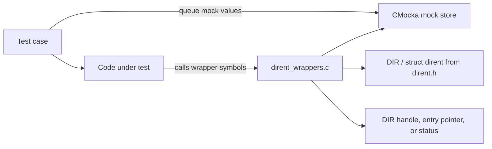
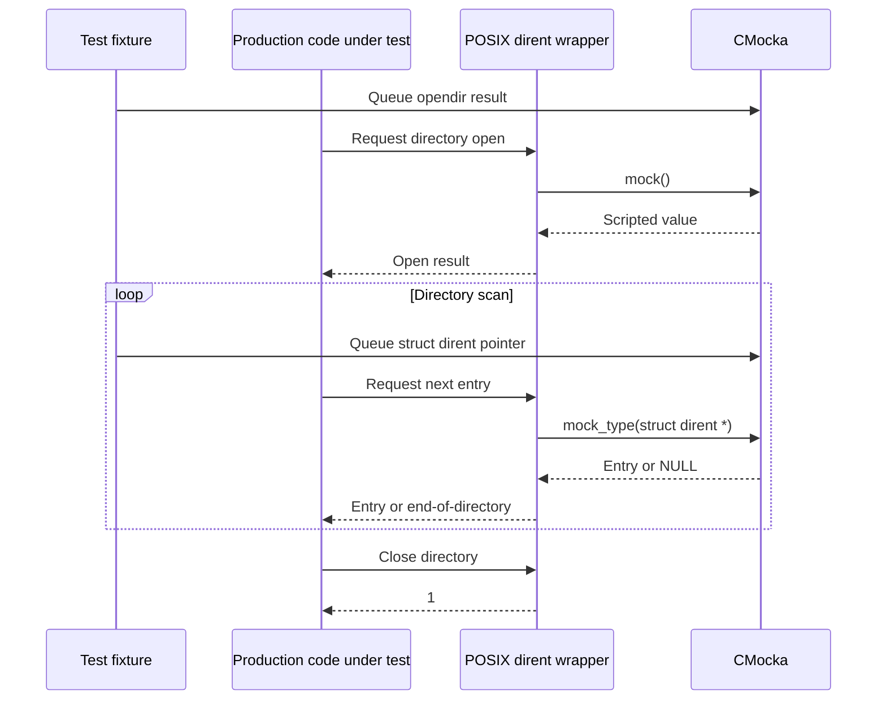
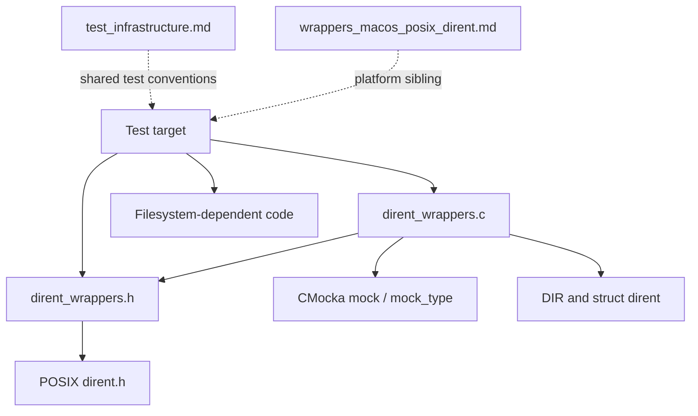
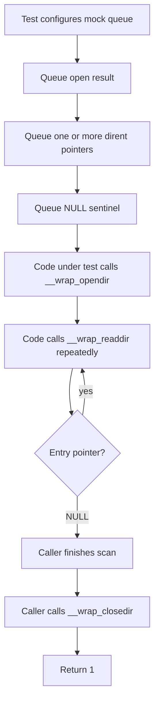
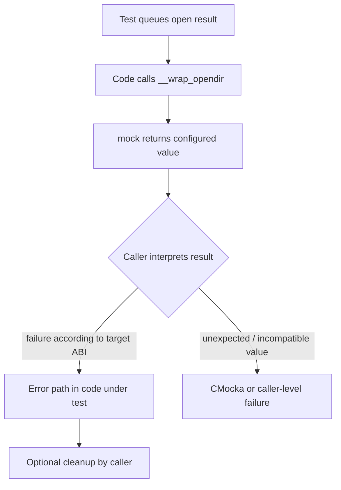

# `wrappers_posix_dirent`

## Introduction

`wrappers_posix_dirent` is Wazuh unit-test infrastructure for replacing POSIX directory operations with deterministic CMocka-controlled functions. It intercepts directory opening, directory-entry iteration, and directory closing so tests can exercise filesystem success and failure paths without reading the host filesystem.

The module contains no production logic, persistent state, or standalone runner. It is linked into test targets that need to control `opendir`, `readdir`, or `closedir`. The POSIX wrapper belongs to the broader test-wrapper layer; see [test_infrastructure.md](test_infrastructure.md) for general harness conventions and [wrappers_macos_posix_dirent.md](wrappers_macos_posix_dirent.md) for the platform-specific sibling.

## Scope and responsibilities

| Component | Location | Responsibility |
|---|---|---|
| Wrapper implementation | `src/unit_tests/wrappers/posix/dirent_wrappers.c` | Supplies CMocka-backed implementations of `closedir`, `opendir`, and `readdir`. |
| Wrapper interface | `src/unit_tests/wrappers/posix/dirent_wrappers.h` | Includes the native `<dirent.h>` declarations and exposes wrapper prototypes. |
| `dirent` types | `<dirent.h>` | Provides `DIR` and `struct dirent`; the module does not define replacement structures. |
| CMocka | `<cmocka.h>` | Provides `mock()` and `mock_type()` for scripted return values. |

The source includes `<stddef.h>`, `<stdarg.h>`, and `<setjmp.h>` as test-support headers. They do not add runtime behavior to the wrapper API.

## Architecture



Unlike a production directory abstraction, the wrapper does not enumerate or allocate directories. The test supplies every returned handle or entry through CMocka. This keeps the system under test on its normal control path while making external results repeatable.

## Public wrapper interface

The header declares the following functions:

```c
int __wrap_closedir(DIR *dirp);
int __wrap_opendir();
struct dirent *__wrap_readdir();
```

`__wrap_opendir` and `__wrap_readdir` intentionally have unspecified parameter lists in this test seam. The implementation does not inspect arguments; callers only receive the CMocka-scripted result. The return types preserve the values needed by code using the POSIX API: an integer close result, a directory handle, and a directory-entry pointer.

The header does not define preprocessor aliases such as `#define opendir __wrap_opendir`. Redirection is therefore supplied by the test build/link configuration or by the linker wrapping mechanism that resolves calls to the `__wrap_*` symbols.

## Component behavior

### `__wrap_opendir`

```c
int __wrap_opendir() {
    return mock();
}
```

The function consumes and returns a generic CMocka mock value. Although the native `opendir` contract returns `DIR *`, the implementation’s declared return type is `int`; test targets must therefore use the wrapper according to their existing build ABI and mock conventions. The wrapper itself performs no path validation, `errno` assignment, allocation, or native `opendir` call.

### `__wrap_readdir`

```c
struct dirent *__wrap_readdir() {
    return mock_type(struct dirent *);
}
```

The function consumes the next typed CMocka value. Tests normally queue one or more `struct dirent *` values followed by `NULL` to model directory traversal and end-of-directory. The wrapper does not inspect or copy the entry and does not manage its lifetime.

### `__wrap_closedir`

```c
int __wrap_closedir(__attribute__((unused)) DIR *dirp) {
    return 1;
}
```

The function always returns `1`, ignoring its directory handle. It does not consume a mock value, validate the handle, close an operating-system resource, or free test-owned memory. Fixtures remain responsible for any objects they allocate.

## Data flow



The important state is the CMocka return queue, not wrapper-owned state. Each `__wrap_readdir` call advances the queue by one typed entry. If the queue is exhausted or a test supplies an incompatible mock, failure is reported by CMocka rather than converted into a wrapper-specific error.

## Dependency relationships



The wrapper has no dependency on Wazuh daemons, databases, sockets, or configuration services. It is a leaf component of the unit-test wrapper hierarchy. Filesystem-heavy modules may use it alongside the POSIX `stat`, `unistd`, or `pwd` wrapper families; those are separate modules and should be documented independently.

## Typical process flows

### Successful directory traversal



### Open failure or malformed mock setup



The wrapper does not normalize a failed open, set `errno`, or synthesize an error. Tests that need a particular error code must model that at the higher-level seam used by the code under test.

## Test design guidance

- Queue `__wrap_opendir` before invoking code that opens a directory.
- Queue a `struct dirent *` for every expected `__wrap_readdir` call, including a final `NULL` when the caller expects end-of-directory.
- Use real or fixture-owned `struct dirent` objects when entry names or metadata are inspected; the wrapper returns pointers without copying them.
- Do not expect `__wrap_closedir` to consume a mock or release a fake `DIR *`; it always returns `1`.
- Keep mock queues scoped to each test because the wrapper itself provides no resettable state.
- Verify the caller’s handling of empty directories, missing entries, and cleanup separately; those behaviors belong to the system under test, not this wrapper.

## Maintainer notes

The unusual `int` return type and unspecified parameter lists for `__wrap_opendir`/`__wrap_readdir` are part of the current test seam and should be changed only with a coordinated review of linker wrapping, compiler diagnostics, and all consumers. If the interface is aligned with native POSIX signatures, update both the header and implementation and rerun affected unit-test targets.

This module should remain small: it is an injection point, not a directory emulator. New directory semantics, path validation, or platform behavior belong in the relevant production module or a dedicated platform wrapper.

## References

- [Test infrastructure](test_infrastructure.md)
- [macOS POSIX dirent wrapper](wrappers_macos_posix_dirent.md)
