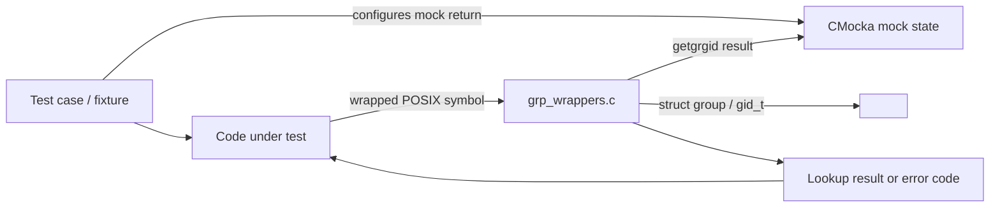
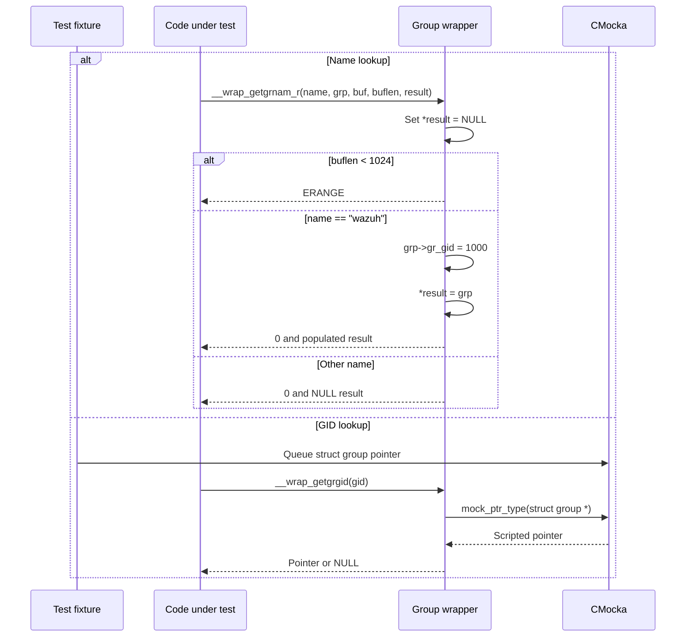
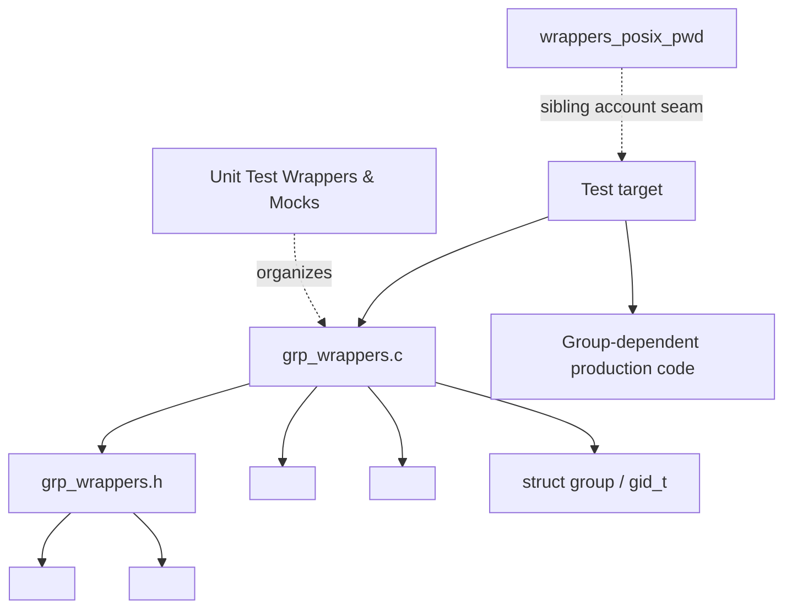
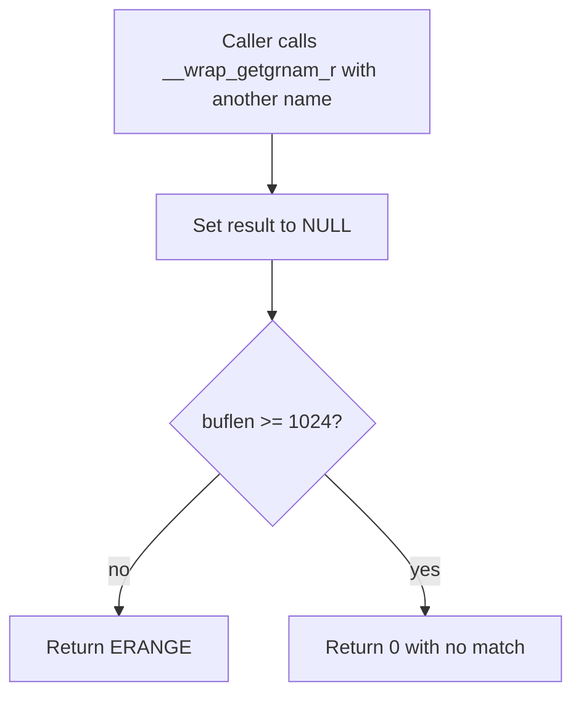

# `wrappers_posix_grp`

## Introduction

`wrappers_posix_grp` is Wazuh unit-test infrastructure for controlling POSIX group-account lookups. It replaces selected `<grp.h>` functions with deterministic CMocka-backed behavior so code that resolves Unix groups can be tested without consulting the host system’s `/etc/group`, NSS, LDAP, or another external identity provider.

The module is a test seam, not production functionality. It has no persistent state, daemon lifecycle, database, or standalone executable. Its broader build and linker conventions are shared with [test infrastructure](test_infrastructure.md) and the wrapper consumers in [Unit Tests - Shared Library](Unit_Tests_-_Shared_Library.md). Directory operations are covered by [wrappers_posix_dirent.md](wrappers_posix_dirent.md).

## Scope and responsibilities

| Component | Location | Responsibility |
|---|---|---|
| Group wrapper implementation | `src/unit_tests/wrappers/posix/grp_wrappers.c` | Implements wrapped `getgrgid` and `getgrnam_r` behavior. |
| Wrapper interface | `src/unit_tests/wrappers/posix/grp_wrappers.h` | Includes POSIX group types and declares the public test wrapper for `getgrnam_r`. |
| POSIX group model | `<grp.h>` | Supplies `struct group` and `gid_t`. |
| CMocka | `<cmocka.h>` | Supplies `mock_ptr_type()` for scripted `getgrgid` results. |

The source is guarded by `#ifndef WIN32`; on Windows, neither the declarations nor implementations are emitted. The wrapper therefore targets Unix-like test builds and is normally selected conditionally by the build system.

## Architecture



The wrapper separates production code from the operating system’s group database. `getgrnam_r` follows a small fixed model for the tests, while `getgrgid` delegates its return value to CMocka so callers can model arbitrary success, absence, or failure pointers.

## Public interface and implementation behavior

### `__wrap_getgrnam_r`

Signature:

```c
int __wrap_getgrnam_r(const char *name,
                      struct group *grp,
                      char *buf,
                      size_t buflen,
                      struct group **result);
```

The implementation behaves as follows:

1. It initializes `*result` to `NULL`.
2. If `buflen` is less than `1024`, it returns `ERANGE` immediately.
3. If `name` is exactly `"wazuh"`, it assigns `grp->gr_gid = 1000` and sets `*result = grp`.
4. For any other name, it leaves `*result == NULL` and returns `0`.

The `buf` pointer is accepted but not read or written. The wrapper also does not populate `gr_name`, `gr_passwd`, `gr_mem`, or other `struct group` members. Consumers that inspect those fields must initialize them in the test fixture or restrict assertions to the fields this seam provides.

The behavior models the most relevant branches for consumers: insufficient caller storage, the expected Wazuh group, and a valid lookup with no matching group. It does not call the platform `getgrnam_r`, set `errno`, or perform NSS resolution.

### `__wrap_getgrgid`

Implementation:

```c
struct group *__wrap_getgrgid(gid_t gid) {
    return mock_ptr_type(struct group*);
}
```

The `gid` argument is intentionally unused. Each invocation returns the next pointer configured in CMocka using the requested type. This lets a test provide a populated `struct group *`, `NULL`, or another controlled pointer without requiring a real group database.

The implementation is present only on non-Windows builds. Although the C file defines `__wrap_getgrgid`, `grp_wrappers.h` currently declares only `__wrap_getgrnam_r`; consumers that call the former rely on the implementation being linked as a wrapped symbol rather than on the header declaration. This asymmetry is a maintenance consideration and should be changed only with corresponding updates to all affected test targets.

### `group` type

The `group` component named by the module tree is the native `struct group` from `<grp.h>`. The wrapper does not define a replacement structure. Its fields and ownership rules therefore remain platform-library concerns; fixtures own any storage they assign to the wrapper.

## Data flow



The name-based path is deterministic and does not consume mock values. The GID-based path is driven by the CMocka queue, so the fixture must configure that queue before the system under test calls `getgrgid`.

## Dependency relationships



Direct dependencies are intentionally small:

- `<grp.h>` provides the POSIX data types.
- `<errno.h>` provides `ERANGE`.
- `<string.h>` supports the exact name comparison.
- CMocka provides the typed pointer mock used by `__wrap_getgrgid`.
- The linker/test build supplies symbol redirection to `__wrap_*`; the header does not define macro aliases.

There is no runtime dependency on Wazuh DB, sockets, cluster services, or configuration files. A production module may use this seam together with other wrappers, but those relationships belong to the consuming test target.

## Process flows

### Successful Wazuh-group lookup

```mermaid
flowchart TD
    A[Caller allocates struct group and result pointer] --> B[Calls __wrap_getgrnam_r("wazuh", ...)]
    B --> C{buflen >= 1024?}
    C -->|no| D[Return ERANGE; result remains NULL]
    C -->|yes| E[Set gr_gid to 1000]
    E --> F[Set result to grp]
    F --> G[Return 0]
```

### Unknown group lookup



### GID lookup controlled by CMocka

```mermaid
flowchart TD
    A[Test queues pointer or NULL] --> B[Caller invokes __wrap_getgrgid]
    B --> C[mock_ptr_type(struct group *)]
    C --> D[Return queued pointer]
    D --> E[Caller exercises found / not-found path]
```

## Test design guidance

- Use a buffer length below `1024` to exercise the wrapper’s `ERANGE` branch.
- Use the exact lowercase string `"wazuh"` to receive the synthetic group with GID `1000`; name matching is case-sensitive.
- For unknown names, assert both a return value of `0` and `*result == NULL` when the buffer is large enough.
- Initialize `struct group` fields in the fixture if the consumer reads anything beyond `gr_gid`.
- Queue a typed pointer with CMocka before invoking code that reaches `__wrap_getgrgid`; the wrapper ignores the requested GID.
- Keep fixture storage alive for the complete call chain because the wrapper returns pointers directly and performs no copying or allocation.
- Do not expect native NSS behavior, `errno` updates, buffer writes, or cleanup from this module.
- Combine this wrapper with the sibling POSIX password, stat, and unistd wrappers under `src/unit_tests/wrappers/posix/` when a test exercises those additional seams. Directory behavior is documented in [wrappers_posix_dirent.md](wrappers_posix_dirent.md).

## Maintainer notes

The fixed `"wazuh"`/`1000` mapping is test behavior, not a platform guarantee and must not be interpreted as the deployed Wazuh service account configuration. Changes to the threshold, synthetic GID, or recognized name can alter many consumer tests and should be reviewed as changes to the test contract.

The header/source mismatch for `__wrap_getgrgid` is worth tracking. If the function becomes part of the supported wrapper interface, declare it in the header with the same non-Windows guard. If it is intentionally private to linker wrapping, document that convention in the relevant build configuration and avoid introducing direct C callers that depend on an undeclared symbol.

## References

- [Test infrastructure](test_infrastructure.md)
- [POSIX directory wrappers](wrappers_posix_dirent.md)
- [macOS POSIX directory wrappers](wrappers_macos_posix_dirent.md)
- [Unit Tests - Shared Library](Unit_Tests_-_Shared_Library.md)
