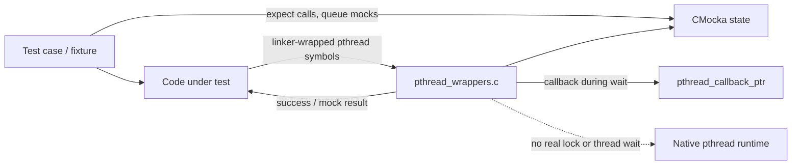
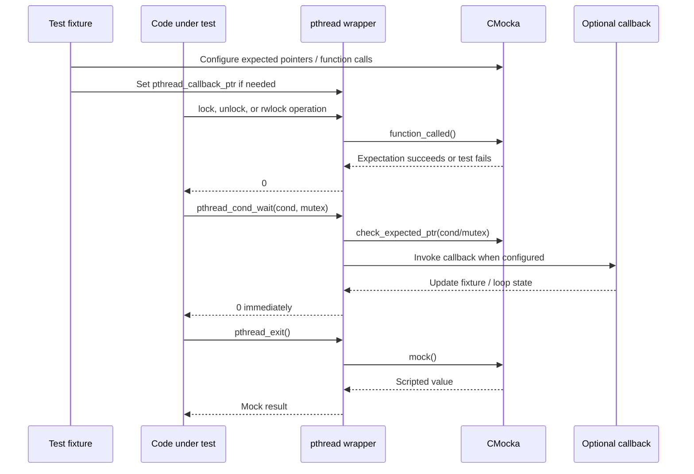
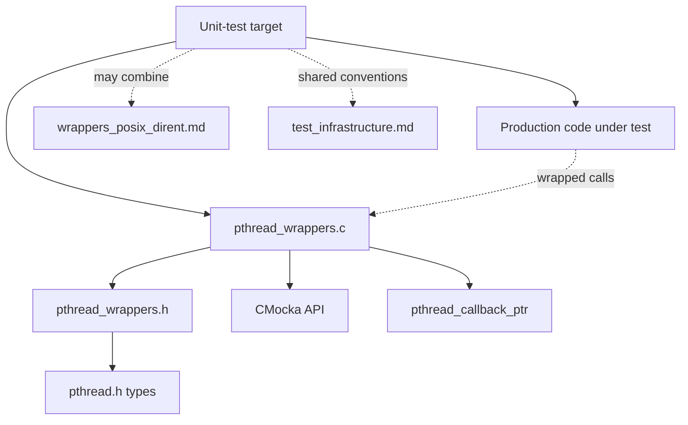
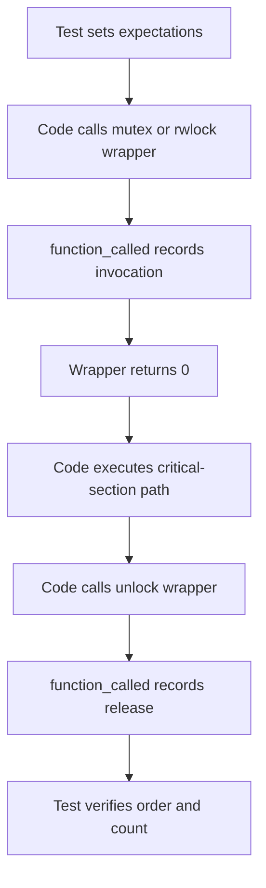
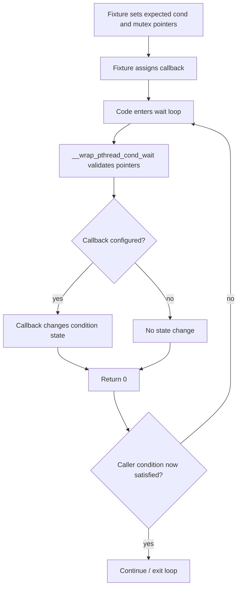

# `wrappers_posix_pthread`

## Introduction

`wrappers_posix_pthread` is Wazuh unit-test infrastructure that replaces selected POSIX pthread operations with CMocka-controlled shims. It lets tests observe synchronization calls, bypass actual locking, terminate mocked worker paths, and inject callbacks into condition-variable waits without creating real thread contention or blocking indefinitely.

The module is test-only and contains no production synchronization policy. It is used by unit-test targets across Wazuh components; the surrounding wrapper conventions are described in [test_infrastructure.md](test_infrastructure.md). Neighboring POSIX seams such as directory, process, time, and filesystem operations are separate modules, including [wrappers_posix_dirent.md](wrappers_posix_dirent.md).

## Scope and responsibilities

| Component | Location | Responsibility |
|---|---|---|
| Wrapper implementation | `src/unit_tests/wrappers/posix/pthread_wrappers.c` | Provides CMocka-aware replacements for mutex, read/write-lock, condition-variable, and thread-exit functions. |
| Wrapper interface | `src/unit_tests/wrappers/posix/pthread_wrappers.h` | Declares the pthread wrapper API and shared callback declaration. |
| Native types | `<pthread.h>` | Supplies `pthread_mutex_t`, `pthread_rwlock_t`, and `pthread_cond_t`. |
| Test controller | `<cmocka.h>` | Supplies `function_called`, `check_expected_ptr`, and `mock`. |

The implementation includes standard test-support headers (`stddef.h`, `stdarg.h`, and `setjmp.h`) but does not allocate synchronization objects or call the native pthread implementation.

## Architecture



The wrapper layer preserves the call shape needed by the system under test while deliberately removing operating-system scheduling effects. Lock operations are successful no-ops; condition waits return immediately; and only the exit seam returns a configurable CMocka result.

## Public interface and shared state

The wrapper family exposes these symbols:

```c
int __wrap_pthread_mutex_lock(pthread_mutex_t *mutex);
int __wrap_pthread_mutex_unlock(pthread_mutex_t *mutex);
int __wrap_pthread_rwlock_rdlock(pthread_rwlock_t *rwlock);
int __wrap_pthread_rwlock_wrlock(pthread_rwlock_t *rwlock);
int __wrap_pthread_rwlock_unlock(pthread_rwlock_t *rwlock);
int __wrap_pthread_exit();
int __wrap_pthread_cond_wait(pthread_cond_t *cond, pthread_mutex_t *mutex);
int __wrap_pthread_cond_signal(pthread_cond_t *cond);
```

The implementation also defines:

```c
void (*pthread_callback_ptr)(void) = NULL;
```

This global is a test hook. When non-`NULL`, `__wrap_pthread_cond_wait` invokes it once per wait call. Fixtures should reset it to `NULL` after use to prevent cross-test coupling.

## Component behavior

### Mutex wrappers

`__wrap_pthread_mutex_lock` and `__wrap_pthread_mutex_unlock` call `function_called()` and return `0`. The mutex pointer is explicitly unused. `function_called()` allows a test to assert invocation order and count, while the zero return models successful acquisition or release.

### Read/write-lock wrappers

`__wrap_pthread_rwlock_rdlock`, `__wrap_pthread_rwlock_wrlock`, and `__wrap_pthread_rwlock_unlock` have the same pattern: they record the call with `function_called()`, ignore the lock object, and return `0`. They do not enforce reader/writer exclusivity or detect recursive locking.

### Thread-exit wrapper

`__wrap_pthread_exit` returns `mock()`. This permits a test to control the value observed by code that is compiled against the local wrapper signature. It does not terminate the executing test thread and does not perform cleanup; callers must be written or mocked so that the test remains safe after the intercepted call.

### Condition-variable wait

`__wrap_pthread_cond_wait` validates both arguments with `check_expected_ptr(cond)` and `check_expected_ptr(mutex)`. It then invokes `pthread_callback_ptr`, when configured, and returns `0` immediately.

The callback exists specifically to advance test state and avoid infinite loops in code that normally waits for a condition. Because the callback runs synchronously inside the wrapper, it may mutate fixture state before the caller resumes.

### Condition-variable signal

`__wrap_pthread_cond_signal` validates the condition-variable pointer with `check_expected_ptr(cond)` and returns `0`. It does not wake a real waiter or maintain a signal count.

## Data flow and interaction



The primary data flow is expectation and callback state, not pthread object state. The pointers passed by production code are only compared against expected pointers; they are never dereferenced.

## Dependencies and module relationships



The module is a leaf in the test-wrapper graph. It has no dependency on Wazuh databases, daemons, sockets, or configuration files. A test may link several wrapper families together, but each family controls only its own external calls.

## Process flows

### Testing a locked critical section



### Breaking a wait loop deterministically



Without a callback, a caller that loops solely on an external condition can still loop forever because the wrapper does not emulate signaling. Tests should explicitly change the condition in the callback or mock a higher-level operation.

## Test design guidance

- Register `expect_function_call(__wrap_...)`-style expectations, as required by the local CMocka convention, before invoking code that uses a lock wrapper.
- Use `expect_value`/`check_expected_ptr`-compatible setup for the exact `pthread_cond_t *` and `pthread_mutex_t *` passed to `__wrap_pthread_cond_wait` and `__wrap_pthread_cond_signal`.
- Treat the `0` return from lock operations as successful acquisition/release, not evidence that locking semantics were tested.
- Set `pthread_callback_ptr` only for tests that need to advance a wait-loop condition; clear it during teardown.
- Configure a `mock()` return before exercising `__wrap_pthread_exit`.
- Do not rely on wrapper calls to provide memory barriers, scheduling, wakeups, cancellation, cleanup handlers, or deadlock detection.
- Keep expectations isolated per test because the wrappers themselves do not own reset logic or synchronization state.

## Limitations and maintainer notes

This module intentionally models only the narrow behavior needed by unit tests. It does not call the real pthread API, inspect object validity, set `errno`, or reproduce platform-specific scheduling. Consequently, integration tests and concurrency correctness tests must use real pthread primitives or a purpose-built stress harness.

The global callback is convenient but not thread-safe and is process-wide. Changes to its type or lifetime affect every test target that links this object. Any expansion of the wrapper surface should preserve the distinction between call-observation helpers (`function_called`), argument validation (`check_expected_ptr`), and return-value injection (`mock`).

## References

- [Test infrastructure](test_infrastructure.md)
- [POSIX directory wrappers](wrappers_posix_dirent.md)
