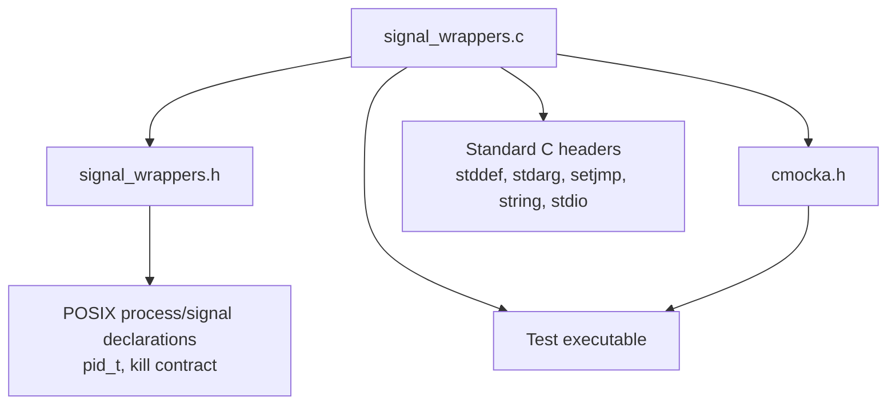
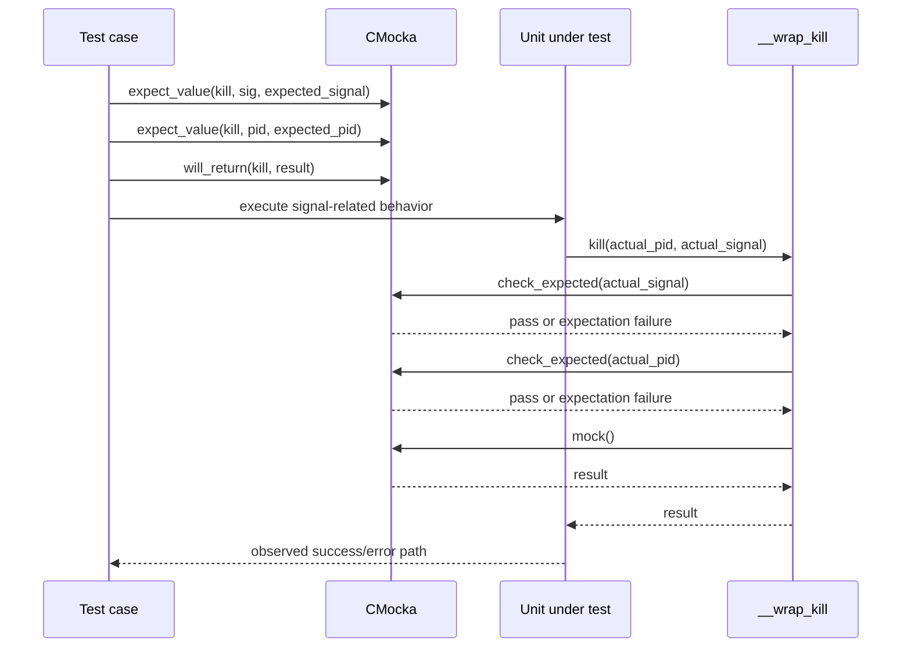
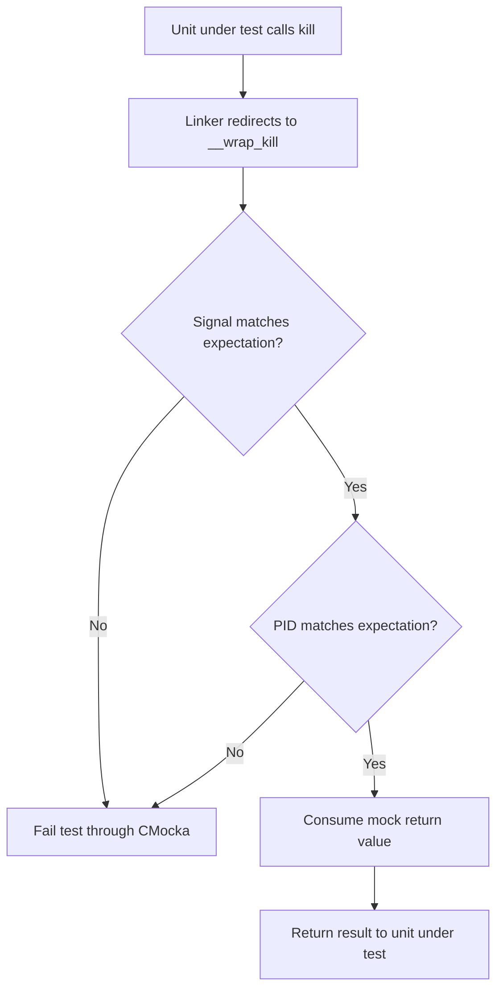
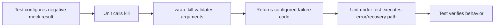
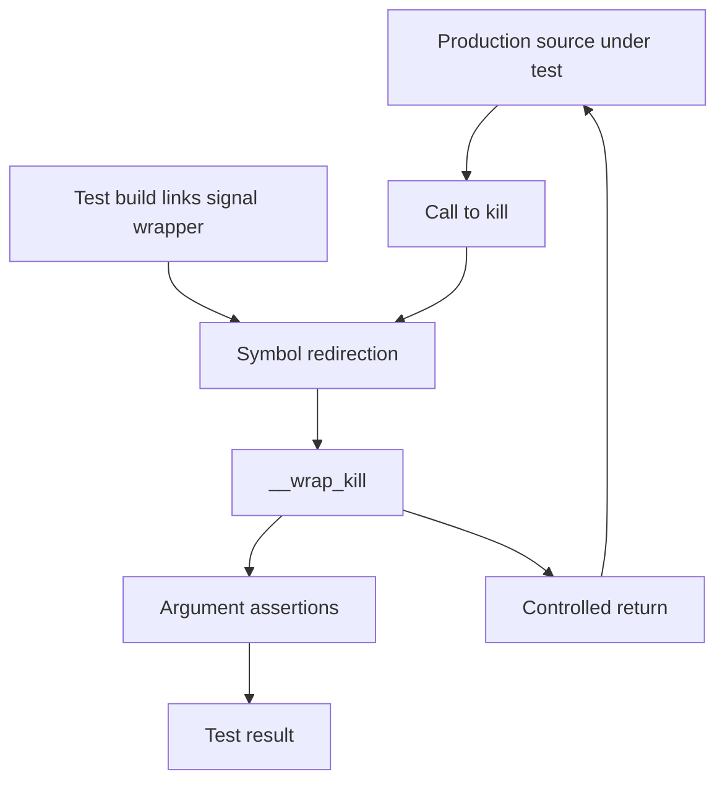

# `wrappers_posix_signal`

The `wrappers_posix_signal` module provides the CMocka/linker wrapper used to replace the POSIX `kill(2)` system call in Wazuh unit tests. It exposes one test double, `__wrap_kill`, which verifies the requested signal and process ID and then returns a value controlled by the test harness.

This module is test infrastructure; it is not part of Wazuh's production signal-handling path. It is used alongside the other POSIX and platform-specific wrappers listed in the [test infrastructure documentation](test_infrastructure.md).

## Module location and scope

| Item | Description |
| --- | --- |
| Source | `src/unit_tests/wrappers/posix/signal_wrappers.c` |
| Wrapped API | POSIX `kill(pid_t pid, int sig)` |
| Exported test symbol | `__wrap_kill(pid_t pid, int sig)` |
| Framework | CMocka expectations and mock return values |
| Production side effects | None: the real `kill` function is not called |

The implementation is intentionally small. Its value is in controlling an external side effect: tests can exercise code that sends signals without terminating or signalling a real process.

## Architecture

The wrapper sits between a unit under test and the test case. Linker wrapping redirects calls to `kill` to `__wrap_kill`; CMocka then supplies both argument assertions and the return value.

```mermaid
flowchart LR
    T[Test case]
    U[Unit under test]
    L[Linker wrapping: kill -> __wrap_kill]
    W[__wrap_kill]
    E[CMocka expectation store]
    M[CMocka mock return queue]
    R[Return value to unit under test]
    S[Real POSIX kill]

    T -->|expects pid and sig| E
    T -->|configures mock return| M
    U -->|calls kill(pid, sig)| L
    L --> W
    W -->|check_expected(pid)| E
    W -->|check_expected(sig)| E
    W -->|mock()| M
    M --> R
    R --> U
    W -. never invokes .-> S
```

### Dependencies

The source includes standard C headers plus CMocka. `signal_wrappers.h` is included by the implementation and is expected to provide the wrapper declaration and the POSIX `pid_t`/signal-related declarations required by the build.



Unlike wrappers for threads, directory operations, or descriptor readiness, this module has no internal state, helper object, or production-module dependency. Those neighboring test doubles should be referenced rather than duplicated; see [wrappers_posix_pthread](wrappers_posix_pthread.md), [wrappers_posix_dirent](wrappers_posix_dirent.md), and [wrappers_posix_select](wrappers_posix_select.md).

## Core component: `__wrap_kill`

```c
int __wrap_kill(pid_t pid, int sig) {
    check_expected(sig);
    check_expected(pid);
    return mock();
}
```

The function has three responsibilities, in order:

1. Validate `sig` against the expectation registered by the test.
2. Validate `pid` against the expectation registered by the test.
3. Return the next value configured through CMocka's `mock()` mechanism.

The argument checks are deliberately explicit rather than relying on the real operating system. A mismatch fails the test through CMocka, while the return value lets a test model success or failure from `kill` without changing process state.

### Behavioral contract

| Input/condition | Result |
| --- | --- |
| `sig` matches the configured expectation and `pid` matches | Returns the configured CMocka mock value. |
| `sig` does not match | CMocka reports an expectation failure; normal test execution is interrupted according to the framework. |
| `pid` does not match | CMocka reports an expectation failure. |
| No mock return value is configured | Behavior follows CMocka's `mock()` configuration for the active test; callers should configure it explicitly. |
| Real process signaling | Never performed by this wrapper. |

The check order is part of the implementation detail: the signal is checked before the process ID. Tests should treat both values as required expectations even though `kill` itself accepts them as ordinary scalar arguments.

## Invocation and data flow



The exact CMocka setup syntax can vary with the test build's wrapper conventions, but the semantic requirements remain the same: register expectations for both parameters and provide a mock return value.

## Process flows

### Successful wrapped call



### Failure-path simulation



There are two distinct failure categories: a configured negative return models an operating-system failure and should reach the unit under test; an argument mismatch is a test setup/behavior failure and should be reported by CMocka.

## Integration with the test system

The wrapper is normally linked into a unit-test executable using the GNU linker `--wrap` mechanism or an equivalent build rule. The call graph is therefore a test-time substitution, not a source-level replacement in Wazuh modules.



This design makes tests deterministic and safe. It also allows signal-related branches—such as shutdown, cancellation, child-process management, or error handling—to be tested without depending on scheduler timing or permissions for a real process.

## Maintenance guidance

- Keep the wrapper side-effect free. Do not call the real `kill` from `__wrap_kill`.
- Preserve validation of both `sig` and `pid`; omitting either check weakens test coverage.
- Preserve the `mock()` return path so callers can model both success and failure.
- If the wrapped signature changes, update the declaration in `signal_wrappers.h`, the implementation, and all linker/build declarations together.
- When adding tests, document the expected signal and PID at the test site and configure the return value explicitly.

## Related documentation

- [Test infrastructure](test_infrastructure.md) — overall wrapper organization and test-double conventions.
- [POSIX pthread wrappers](wrappers_posix_pthread.md) — synchronization-system-call mocking.
- [POSIX directory wrappers](wrappers_posix_dirent.md) — directory traversal and stream mocking.
- [POSIX select wrappers](wrappers_posix_select.md) — descriptor readiness and timeout mocking.
